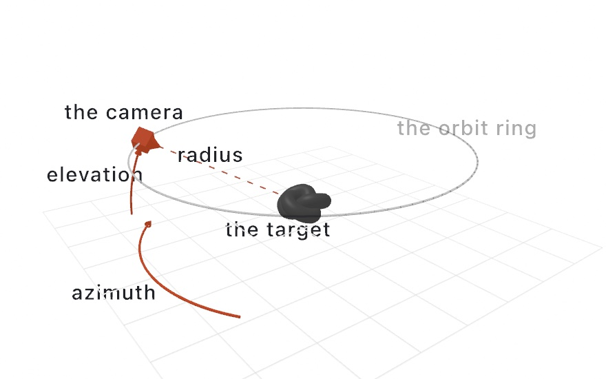
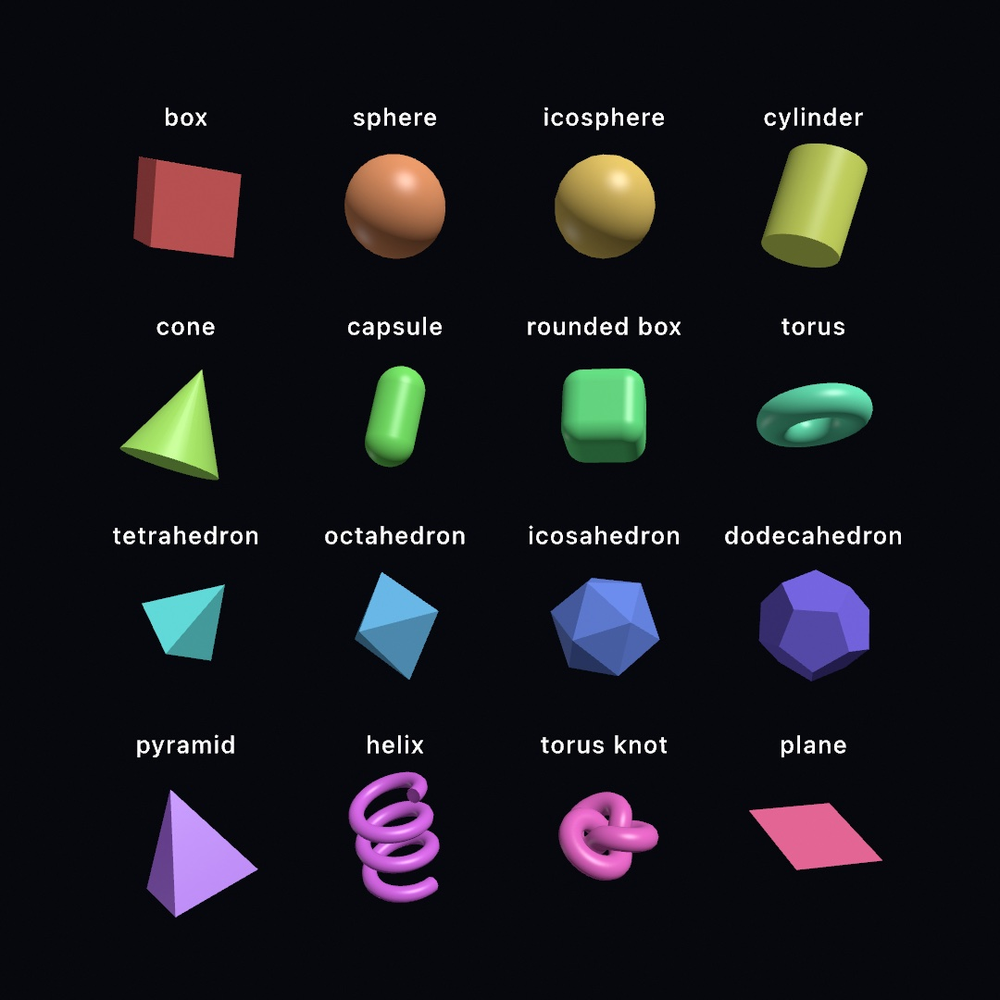
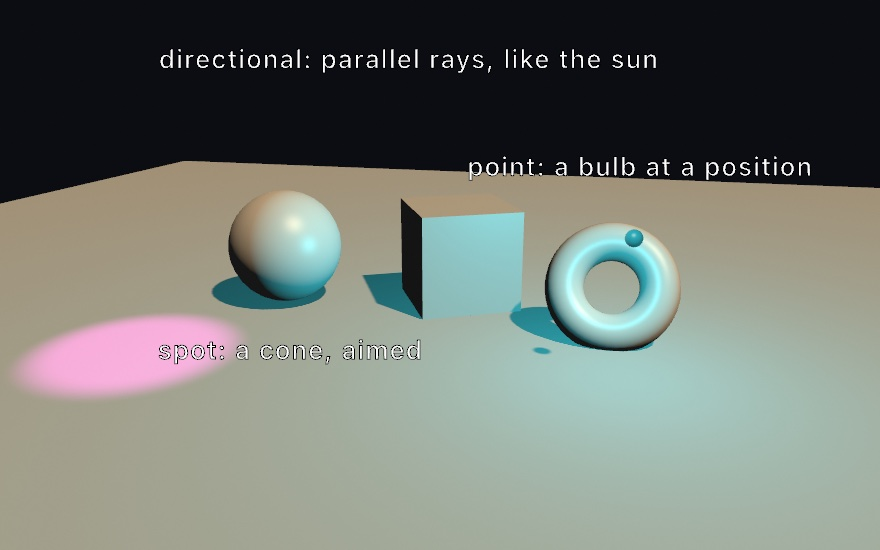
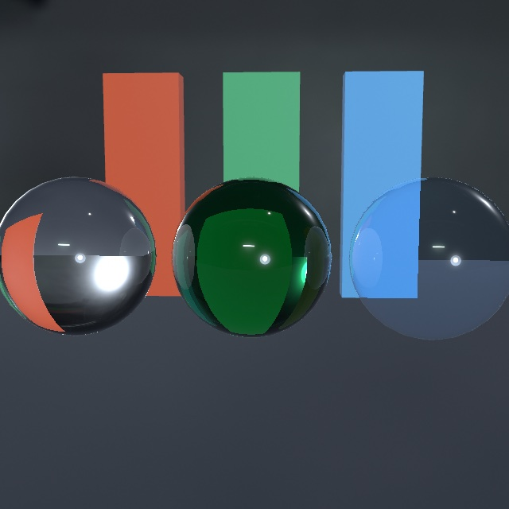
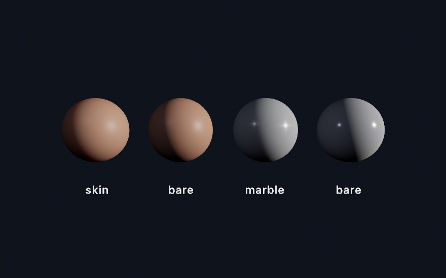
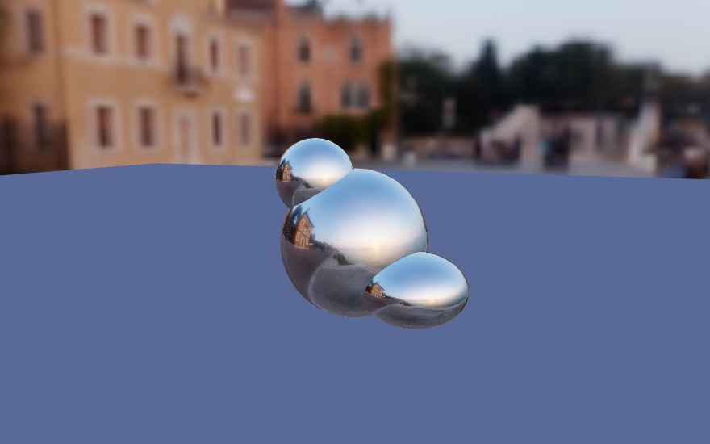
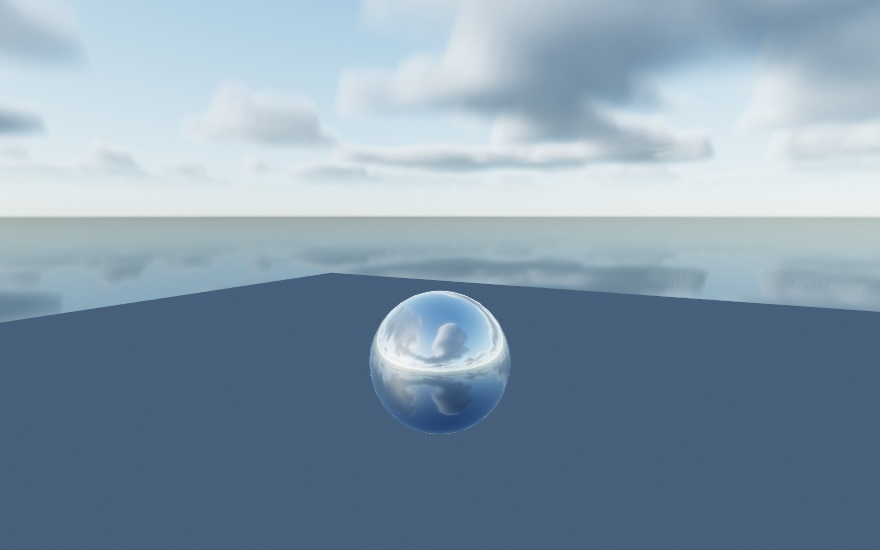
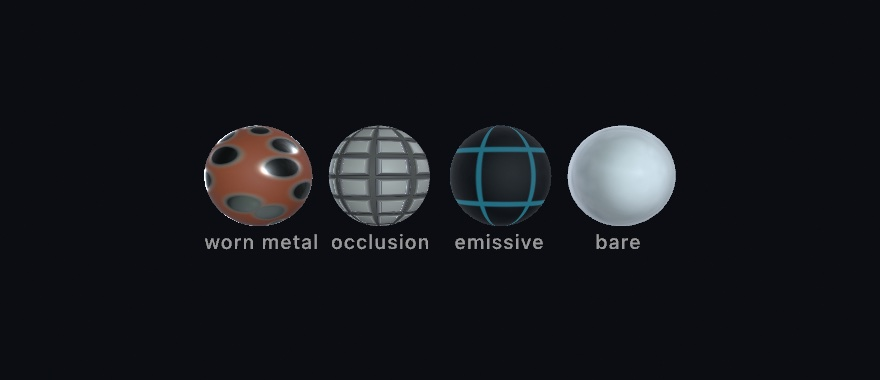

#### <sup>[Ollin](../../README.md) → [Documentation](../README.md) → [3D](./README.md) → `3D`</sup>

---

## 3D

2D is Ollin's default, and most sketches stay 2D. A sketch opts into 3D by setting a **camera**. Once a frame has one, the renderer adds a depth buffer and draws 3D geometry through the camera's view and projection. Set no camera and nothing changes, so the 2D path is untouched and costs nothing.

The 3D geometry comes in three kinds.

- **Point clouds**, from tens of thousands to millions of points. Each point is drawn as a camera-facing disc sized in world units. Perspective therefore shrinks the far points, and the depth test hides the ones behind.
- **Solid primitives**: box, sphere, cylinder, cone, torus, pyramid, helix, the regular polyhedra, a torus knot, a plane, and the parametric generators.
- **Meshes loaded from file**, covered under [Meshes from file](#load).

The last two are filled meshes drawn through the same camera and depth test. They are **lit** by a directional, point, and spot light model, with materials, environments, and shadows.

### Contents

- [A first 3D sketch](#first)
- [The camera](#camera) - `perspective`, `ortho`, `camera`, `Camera3D`
- [Point clouds](#clouds) - `PointCloud`, `drawPointCloud`
- [Solid primitives](#primitives) - `drawBox`/`drawSphere`/`drawCone`/`drawTorusKnot`/… and the `Mesh` type
- [Cutting solids into each other](#booleans) - `union`, `intersection`, `subtracting`, `symmetricDifference`
- [Type as a solid](#solid-type) - `drawText3D`, `Mesh.text`, `Mesh.textGlyphs`
- [Meshes from file](#load) - `loadMesh`, `Mesh(contentsOf:)`, `normalized(scale:)`
- [Lights & materials](#lights) - `directionalLight`/`pointLight`/`spotLight`/`ambientLight`, the `rectangleLight`/`diskLight`/`tubeLight` area lights, IES `profile:` + `cookie:` light shaping, `lightingPreset`, `specular`, `specularSharpness`
- [Materials](#materials) - `material(_:)`, `Material`, the named library (iridescent, velvet, jade, toon, gooch, …), the physically based tier, the [anisotropic brushed streak](#anisotropy) (`anisotropy`, `.brushedMetal`), [glass](#glass) (`Material.glass`, transmission + refraction), the [clearcoat + sheen](#clearcoat-sheen) layered lobes (`.carPaint`, `.lacquer`, `.satin`, `.felt`), the [thin film](#thin-film) (`thinFilm`, `.anodized`, `.oilOnWater`, `.nacre`, `.soapFilm`), and [real subsurface scattering](#subsurface-scattering) (`Material.scattering`, `.skin`, `.marble`)
- [Matcap materials](#matcap) - `matcap(_:)`, `Matcap`, the bundled looks + `Matcap.shaded(…)`
- [Environment lighting](#environment) - `environment(_:)`, `Environment`, the bundled HDRIs, the skybox, [clouds over the procedural sky](#sky-clouds), [a live camera environment](#live-environment) (`Environment.feed`)
- [Shadows](#shadows) - `castShadows`, `noShadows`, `shadowSoftness`, `shadowQuality`, `shadowSamples`, [more than one caster](#several-casters) (`castingShadow`), the [contact shadows](#contact-shadows) refinement (`contactShadows`)
- [Ray-traced reflections](#rt-reflections) - `rayTracedReflections`, `reflectionQuality`, `reflectionBounces`, `glossyReflections`
- [The scene through glass](#scene-through-glass) - `sceneThroughGlass`, `noSceneThroughGlass`
- [Global illumination](#global-illumination) - `globalIllumination`, `noGlobalIllumination`, `globalIlluminationQuality`
- [Temporal anti-aliasing](#temporal-antialiasing) - `temporalAntialiasing`, `noTemporalAntialiasing`, `withMotion`
- [Specular anti-aliasing](#specular-antialiasing) - `specularAntialiasing`, `noSpecularAntialiasing`
- [Motion blur](#motion-blur) - `motionBlur`, `noMotionBlur`
- [Temporal upscaling](#temporal-upscaling) - `temporalUpscaling`, `noTemporalUpscaling`
- [Frames between the drawn ones](#frame-interpolation) - `frameInterpolation`, `noFrameInterpolation`
- [Textured meshes](#textures) - `Mesh.textured(_:)`, `MeshMaterial`, UVs
- [Past the edges](#texture-wrap) - `TextureWrap`: `.clamp`, `.tile`, `.mirror`
- [When it lands on fewer pixels](#texture-filtering) - the mip chain, and what keeps a distant surface still
- [Normal maps](#normal-maps) - `Mesh.normalMapped(_:scale:)`, `generatingTangents()`, `MeshTangent`
- [Surface maps](#surface-maps) - `Mesh.surfaceMapped(...)`: metallic-roughness, occlusion, emissive
- [Height maps](#height-maps) - `Mesh.parallaxMapped(_:scale:)` (parallax occlusion), `Mesh.displaced(by:scale:)`
- [Triplanar projection](#triplanar) - `Mesh.triplanarTextured(_:normal:scale:)`: texture with no uvs
- [Detail maps](#detail-maps) - `Mesh.detailMapped(_:normal:scale:strength:)`: texture that survives a close look
- [Decals](#decals) - `Decal`, `drawDecal(_:at:...)`: pictures stamped onto the scene
- [Wireframe](#wireframe) - `wireframe(_:)`
- [Transforms](#transforms) - `translate`, `rotateX/Y/Z`, `rotate(_:axis:)`, `rotate(_:)` by a `Rotation3D`, `scale`
- [A live depth cloud from a webcam](#live)
- [World space](#space)
- [What's here, what's ahead](#ahead)
- [Notes](#notes)

<a id="first"></a>
### A first 3D sketch

```swift
import Ollin

@main
final class Cloud: Sketch {
    override func draw() {
        background(.black)

        // Setting a camera makes the frame 3D. `orbiting` swings it around a target.
        camera(.orbiting(target: .zero, radius: 5, azimuth: time * 0.3, elevation: 0.5))

        // Build a cloud of world-space points and draw it.
        var cloud = PointCloud()
        for i in 0..<6000 {
            let a = Double(i) * 0.1, r = Double(i) / 6000 * 2
            cloud.add(Vector3(cos(a) * r, sin(Double(i) * 0.03), sin(a) * r),
                      color: Color(hue: r / 2, saturation: 0.8, brightness: 0.9),
                      size: 0.04)
        }
        drawPointCloud(cloud)
    }
}
```

The camera is **per-frame state**, like the geometry. It resets each frame, so you set it in `draw()`, which is also where you animate an orbit. A 2D sketch never calls `camera`.

<a id="camera"></a>
### The camera

A `Camera3D` is an eye looking at a target, plus a projection that flattens space onto the canvas (perspective or orthographic). The bare calls set one for the frame:

```swift
// Perspective: nearer is bigger. `fieldOfView` is the vertical angle in radians.
perspective(eye: Vector3(0, 2, 6), target: .zero, fieldOfView: .pi / 3)

// The same angle named as a lens: what a 35 mm lens sees on a full-frame camera.
perspective(eye: Vector3(0, 2, 6), target: .zero, fieldOfView: .focalLength(35))

// Orthographic: no foreshortening. `height` is the world units framed top-to-bottom.
ortho(eye: Vector3(0, 2, 6), target: .zero, height: 8)

// Or build a Camera3D and pass it, useful to keep and tweak.
camera(.orbiting(target: .zero, radius: 6, azimuth: a, elevation: 0.4))
```

The default `fieldOfView` (`.pi / 3`, 60°) is a wide view. When a scene is framed like a photograph, name the lens instead. `.focalLength(_:)` is the vertical angle that focal length sees on a full-frame camera, a 36×24 mm sensor, which is the format lenses are named for. `.degrees(_:)` reads the angle in degrees. A shorter lens sees wider:

| Lens | Vertical angle | Reads as |
|---|---|---|
| `.focalLength(16)` | 73.7° | ultra wide; rooms and exaggerated depth |
| `.focalLength(24)` | 53.1° | wide; landscapes, near the default |
| `.focalLength(35)` | 37.8° | reportage; the everyday view |
| `.focalLength(50)` | 27.0° | normal; close to how the eye sees scale |
| `.focalLength(85)` | 16.1° | portrait; flattened depth |
| `.focalLength(135)` | 10.2° | telephoto; a compressed, distant look |

A smaller sensor sees less through the same lens. Pass its `sensorHeight` in millimeters, as in `.focalLength(23, sensorHeight: 15.6)` for an APS-C camera, and the angle follows.

`Camera3D` value-type factories:

- `Camera3D.perspective(eye:target:up:fieldOfView:near:far:)`
- `Camera3D.orthographic(eye:target:up:height:near:far:)`
- `Camera3D.orbiting(target:radius:azimuth:elevation:fieldOfView:near:far:)` places the eye on a sphere around the target. `azimuth` turns around the up axis, where 0 looks down +z, and `elevation` tilts above the horizontal, both in radians. It is the simplest way to spin a camera around a scene.
- `Camera3D.intrinsic(_:near:far:)` is a **metric** camera built from a depth frame's pinhole `CameraIntrinsics`, an off-axis frustum matching the lens. It sits at the origin looking down −z. It puts a point cloud, a depth feed, and any placed object in one space measured in meters. See [depth compositing](../3D/DepthCompositing.md#metric).

<picture>
  <source media="(prefers-color-scheme: dark)" srcset="../../Guide/Images/21-3DGently/Orbit-dark.jpg">
  
</picture>

`near`/`far` are the clip distances (geometry outside them is cut away), and `up` defaults to `.unitY`.

The matrices behind a camera are public. `viewMatrix` takes a world point into camera space, where the camera sits at the origin looking down −z. `projectionMatrix(aspect:)` takes camera space into Metal clip space. Both are column-major `simd_float4x4`. `viewProjectionMatrix(aspect:)` is their product, and `matrices(aspect:)` returns the pair as the shared `OllinCameraMatrices`. A compute kernel projects through the sketch's camera by packing them with `cameraParams()` (see the [compute reference](../Shaders/Compute.md#camera)). On the CPU, `project(_:)` is the same map to canvas points.

<a id="clouds"></a>
### Point clouds

A `PointCloud` is a list of points. Each has a world-space position, a color, and a splat diameter in **world units**, so perspective shrinks distant points. Build one up front for a fixed scan, or rebuild it every frame for a live feed. A cloud of about 50k points rebuilt per frame runs comfortably.

```swift
var cloud = PointCloud()
cloud.add(Vector3(x, y, z), color: .white, size: 0.05)   // one at a time
// …or in bulk:
let cloud2 = PointCloud(positions: pts, color: .cyan, size: 0.05)
let cloud3 = PointCloud(positions: pts, colors: cols, size: 0.05)   // per-point colors
drawPointCloud(cloud)
```

Splats composite in draw order and under the active [`blendMode`](../Drawing/Drawing.md#blendMode), so `blendMode(.add)` sums them as light, which gives the glowing-cloud look. Sub-pixel splats fade by area, the same coverage `drawCircle` uses, so a dense cloud of tiny points does not flicker.

<a id="primitives"></a>
### Solid primitives

The built-in shapes are filled meshes, drawn through the same camera with depth testing. They cover the closed solids: box, rounded box, sphere, icosphere, cylinder, cone, capsule, torus, the Platonic solids, pyramid, helix, torus knot, and plane. They also cover the parametric and profile generators: supershape, superellipsoid, Möbius, Klein, extrude, lathe, and tube. Each is centered at the model origin and sized in world units, so you place and orient it with the [3D transform stack](#transforms):

```swift
camera(.orbiting(target: .zero, radius: 8, azimuth: time * 0.2, elevation: 0.4))

withState {
    translate(-2, 0, 0)
    rotateY(time)
    drawBox(size: 1.5)              // a cube
}
drawSphere(radius: 1)              // at the origin
```



The closed solids, all on `Sketch`:

- `drawBox(size:)` / `drawBox(width:height:depth:)`, and `drawRoundedBox(size:radius:)` for filleted edges
- `drawSphere(radius:segments:rings:)` (a UV sphere) and `drawIcosphere(radius:subdivisions:)` (a geodesic sphere with evenly sized triangles and no pole pinching)
- `drawCylinder(radius:height:segments:caps:)`, `drawCone(radius:height:segments:)`, `drawCapsule(radius:height:)`
- `drawCapsule(from:to:radius:)` spans two 3D points end to end, with its round tips on the points. It is the solid way to draw a bone or a strut (see the [phone body](Phone.md#the-body))
- `drawTorus(radius:tube:segments:sides:)` and `drawTorusKnot(p:q:radius:tube:…)`
- `drawPyramid(width:depth:height:)`, `drawHelix(radius:tube:turns:height:…)`, `drawPlane(width:depth:)`
- `drawGround(size:at:thickness:color:material:)` draws the floor in one call. It is a thin square slab whose top surface sits at `y`, which is 0 by default, so bodies resting there stand on it. `color` and `material` apply to the slab alone. Leave them out and it takes the current state. It is a slab rather than a bare plane, so shadows and reflections show a real thickness
- the Platonic solids: `drawTetrahedron(radius:)`, `drawOctahedron(radius:)`, `drawIcosahedron(radius:)`, `drawDodecahedron(radius:)`

The parametric and profile generators, shown in the [`3D/ShapeFactory`](../../Examples/3D/Geometry/ShapeFactory/) example:

- `drawSupershape(radius:m:n1:n2:n3:…)` is the Gielis superformula. A few numbers sweep a wide range of organic, star, and flower forms, and driving them with `time` works well
- `drawSuperellipsoid(radius:e1:e2:…)` is a sphere that morphs toward a box (`e → 0`) or octahedron (`e → 2`)
- `drawMobius(radius:width:…)` and `drawKlein(scale:…)` are the one-sided surfaces
- `drawExtrude(_ outline: [Vector2], depth:)` / `drawExtrude(_ shape: Shape, depth:)` push a flat 2D shape into 3D, paired with the `Profile` helpers (`Profile.rectangle`/`.ellipse`/`.triangle`/`.polygon`/`.star`)
- `drawLathe(_ silhouette: [Vector2], segments:)` revolves a side profile into a vase or bowl
- `drawTube(_ path: [Vector3], radius:sides:closed:)` sweeps a solid tube down any 3D curve

**A solid takes the current `fill` as its surface color** and is shaded by the [light & material model](#lights) below. Lighting has an auto-lit default, so a solid looks 3D with no lights to set up. The `fill`'s **alpha** sets opacity, so `fill(Color(white: 1, alpha: 0.5))` makes a translucent solid. Gradient paint is not supported on the 3D path, so meshes take a solid color.

Each shape is a `Mesh` value type that holds positions, normals, and a triangle-index list. A generator builds it: `Mesh.box(…)`, `.sphere(…)`, `.supershape(…)`, `.extrude(…)`, and so on. **Build a mesh once and draw it every frame** with `drawMesh(_:)`. The `draw*` calls rebuild the mesh each frame. That is fine for a cube and wasteful for a swept knot or a dense supershape:

```swift
let ball = Mesh.sphere(radius: 1, segments: 48, rings: 32)   // build once
// …each frame:
withState { fill(Color(hex: 0xF5A623)); translate(x, y, z); drawMesh(ball) }
```

You can also pass your own arrays through `Mesh(positions:normals:indices:)` and `drawMesh`. Meshes need a camera, like point clouds, and they follow the 3D transform stack, not the 2D affine one.

A mesh can also carry **per-vertex colors**, held in `Mesh.colors` and matched to `positions` by index. They *multiply* the current `fill`, the same contract as a texture. With the default white fill the mesh shows its own colors untouched, and `fill` stays a whole-mesh tint. `colored(by:)` paints any mesh procedurally, through a closure over each vertex's position and normal. `colored(from:)` paints it from a point cloud, where each vertex takes its nearest sample's color. A reconstructed scan keeps its capture colors this way, as [Surface reconstruction](../Generators/SurfaceReconstruction.md#colors) describes. A **loaded model brings its own**. The glTF `COLOR_0` attribute and a PLY's per-vertex color both arrive as `colors`. So a vertex-painted export or a colored scan draws in its own colors against a white fill, with nothing else to set up. The same holds after [subdividing](../Generators/SubdivisionSurfaces.md#result) a painted cage. Lighting shades a vertex color exactly as it shades the fill, and a wireframe ignores them.

```swift
let globe = Mesh.sphere(radius: 1).colored { p, _ in
    p.y > 0 ? .white : Color(hex: 0x2B6CB0)
}
```

<a id="booleans"></a>
### Cutting solids into each other

Two solids combine four ways, the same four a filled [`Shape`](../Drawing/Geometry.md#shape-booleans) offers on the plane:

```swift
let block = Mesh.box(size: 1.25)
let ball = Mesh.sphere(radius: 0.85)

block.union(ball)                 // everything either one covers
block.intersection(ball)          // only what both cover: a rounded cube
block.subtracting(ball)           // the block with a round bite out of it
block.symmetricDifference(ball)   // everything but the overlap
```

What comes back is an ordinary `Mesh`. It draws like any other and takes a material and a shadow like any other. It can be [written out for a printer](../Output/Fabrication.md), [broken into pieces](../Generators/Fracture.md), or handed to the solver as a collider. That is the difference between these and the [`union { }` / `subtract { }` blocks](../Drawing/Combinators.md). Those merge distance fields on the GPU while the frame is drawn, and leave no geometry behind. Reach for the blocks to draw a melted, blended form every frame. Reach for these when you want the shape itself.

Cutting is how you get shapes nobody would model by hand. An intersection with a ball rounds every edge and corner of a block at once. A cylinder taken out of a slab is a bolt hole. A cylinder taken out of a slab thirty times is a grille.

**Both sides have to be closed solids.** A surface with a hole in it has no inside, so there is nothing to keep or throw away. The answer is then meaningless rather than merely wrong. [`printCheck()`](../Output/Fabrication.md) is the examination that says whether a mesh closes, and every built-in generator does. An open input gives an open result that still draws, so check rather than eyeball.

**A cutter has to be the right way out.** Mirroring a mesh leaves it wound inside out, whether by swapping two coordinates or by scaling one axis negatively. An inside-out cutter takes away everything it should have kept. Turn it instead, or check with `printCheck().isInsideOut`:

```swift
let shaft = Mesh.cylinder(radius: 0.2, height: 2)
block.subtracting(shaft.mapPositions { Vector3($0.y, -$0.x, $0.z) })   // a quarter turn
block.subtracting(shaft.mapPositions { Vector3($0.y, $0.x, $0.z) })    // a mirror: wrong
```

**Cut once.** This is CPU geometry rather than a draw call. Solids of a few thousand triangles take tenths of a second, and the cost climbs quickly past that. So cut in `setup()`, or when a parameter moves, and keep the mesh to draw. A ball tessellated at 48 by 24 costs several times what the same cut on a 24 by 12 ball does. Reach for the coarser solid where the cut allows it.

What rides along with the result: the first mesh's `material`, and per-vertex normals throughout. Texture coordinates and vertex colors survive when *both* meshes carry a full set, and are dropped otherwise. A partial set is ignored by the renderer anyway. Tangents are dropped, so call `generatingTangents()` afterward if a normal map reads from them.

One shape is honestly awkward. A symmetric difference of two overlapping solids touches itself along the curve where the two surfaces cross. The result closes, but it is not a manifold there, and a slicer will say so. That is the shape, not the cut.

See the [`3D/CutAndJoin`](../../Examples/3D/Geometry/CutAndJoin/) and [`3D/Carved`](../../Examples/3D/Geometry/Carved/) examples.

<a id="solid-type"></a>
### Type as a solid

A word is a shape, so you can push it into depth like any other shape. `drawText3D` sets `string` in the active [outline font](../Drawing/Text.md#outlinefont) and pushes it into a solid. The solid stands upright, centered on the model origin. It takes a `fill`, a material, and a shadow the way a box does:

```swift
drawText3D("Ollin", size: 2, depth: 0.4)
```

`size` is the type size in **world units**, the 3D counterpart of `textSize`. `textSize` stays in canvas points, so it does not apply here. `size` is the em, so a capital stands about `0.7 * size` tall. `depth` is the thickness, centered on `z = 0` like every other generator. Only the *font* comes from the text state. `textAlign`'s horizontal half lines up the rows of a multi-line string.

Two `Mesh` builders sit behind it. For anything that draws every frame, they are the calls to use:

- **`Mesh.text(_:font:size:depth:align:)`** builds the whole word as one mesh. Build it once and keep it, because every call flattens the glyphs, triangulates them, and raises their walls again. That takes about a millisecond for a five-letter word in a debug build, and less in a release one.
- **`Mesh.textGlyphs(_:font:size:depth:align:)`** returns the same word as one mesh per glyph, each still in its place. Each carries its own position, so `mesh.center` is where that letter sits, which is what a letter turning about itself needs. A space has no ink, so it contributes no mesh.

```swift
let letters = Mesh.textGlyphs("Ollin", size: 2, depth: 0.4)   // in setup()

for (i, glyph) in letters.enumerated() {                      // in draw()
    let pivot = glyph.center
    withState {
        translate(pivot)
        rotateX(sin(time * 1.4 + Double(i) * 0.7))
        translate(-pivot)
        drawMesh(glyph)
    }
}
```

The calls take care of two things that go wrong in a hand-rolled `Mesh.extrude(textToShapes(...))`. First, text is laid out in [canvas coordinates](../Concepts/Coordinates.md), where y grows *down*, and the 3D world counts y *up*. A plain extrusion therefore arrives upside down. Second, a glyph's curves are simplified against the size they are asked for. A letter one world unit tall then comes back as a lump or as nothing at all. The calls trace the outline large and scale it down instead.

A letter with a counter (`o`, `e`, `a`) keeps its hole, because the caps come from the same triangulator every [`Shape`](../Drawing/Geometry.md#shape) fill uses. Like any extrusion, the result carries no texture coordinates, so it takes a color and a material rather than an image. A pixel-grid or single-line font has no filled outline to push into depth, so `drawText3D` says so and draws nothing. See the [`3D/SolidType`](../../Examples/3D/Geometry/SolidType/) example.

<a id="load"></a>
### Meshes from file

Load a model from a file into a `Mesh` and draw it with `drawMesh`, the same depth-tested, lit path the built-in primitives use. Ollin reads four families:

- **`.obj`** (Wavefront): Ollin's own reader.
- **`.usdz` / `.usdc` / `.usda` / `.usd`**: Ollin's own USD reader, the same one behind [`loadScene`](Scenes.md). The parts are merged to one mesh, each placed by its node transforms.
- **`.gltf` / `.glb`**: Ollin's own reader. glTF 2.0 is what most 3D tools export.
- **`.stl` / `.ply`**: through Apple's Model I/O.

```swift
final class LoadedModel: Sketch {
    var model: Mesh?
    override func setup() {
        model = loadMesh("/path/to/duck.usdz")?.normalized(scale: 3)
    }
    override func draw() {
        camera(.orbiting(radius: 7, azimuth: time * 0.3))
        if let model {
            // Default white fill shows the model's own material; set a fill to tint
            // it (or to color a model that carries no material of its own).
            withState { rotateY(time); drawMesh(model) }
        }
    }
}
```

A loaded model arrives in its author's own coordinates, at whatever scale it was saved. A CAD export might span thousands of units, and a game asset fractions of one. Use **`normalized(scale:)`** to recenter it on the origin and scale it uniformly, so that its longest dimension spans `scale` world units. That gives a drop-in fit, the way the generators are already unit-sized. `bounds`, `center`, and `size` give you the raw extents if you would rather place it yourself. **`volume`** and **`centroid`** measure the solid itself rather than its box: how much space a closed mesh encloses, and the balance point of that space, which is where a rigid body for it belongs. **`mapPositions`** returns a copy with every vertex passed through a function, which is how a piece moves onto its own origin (see [breaking things](../Generators/Fracture.md)).

The loaders mirror the image and font ones. `loadMesh(path)` and `loadMesh(url)` sit on `Sketch`. `Mesh(contentsOf:)`, `Mesh(path:)`, and `Mesh(resource:extension:in:)` load a bundled model. As always, `in:` has no default, so pass `.module`. Each returns `nil` if the file cannot be read.

A loaded model also brings its own **base-color material**: a base color and an optional texture, mapped through the file's UVs. See [Textured meshes](#textures). Keep the default white `fill` and the material shows as authored. A colored `fill` still tints it. Each family reads its material its own way:

- A **glTF** reads `baseColorFactor`, `baseColorTexture`, and `TEXCOORD_0`.
- An **OBJ** reads its `.mtl`, meaning the `Kd` diffuse color and the `map_Kd` texture, plus `vt`.
- A **USD** reads its bound preview surface, either a diffuse color or a texture from the package, plus `primvars:st`.
- An **STL** or **PLY** reads its Model I/O material and texture coordinates.

The loaders also read what a texture does past its edges (its [`wrap`](#texture-wrap)), so a model authored with a tiling floor arrives tiling. Each format states it its own way. A glTF reads the texture's sampler. That format's own default is repeat, so a file that declares no sampler tiles. An OBJ tiles too. `.mtl` has one word on the subject, `map_Kd -clamp on`, and it turns tiling off. A USD reads the texture shader's `wrapS`. Where a file says nothing at all, the answer is clamp.

A model with **no** material falls back to shading in your `fill`, so you pick the color. A model that has one brings its base color along, and its [normal](#normal-maps) and [surface maps](#surface-maps) too, meaning metallic-roughness, occlusion, and emissive. `loadMesh` merges to one mesh, so a multi-material file wears its first material there. To keep every material, load the file as a scene instead with [`loadScene`](./Scenes.md). Its `drawScene` draws each material's slice with its own material.

A model you make yourself is your own work, so you are free to ship it. A 3D design tool like Spline exports glTF or USDZ directly. Downloaded sample models often carry non-permissive licenses, so check the license before bundling one. See the `3D/LoadedMesh` example. Drop a `model.usdz`, `.glb`, `.gltf`, or `.obj` beside it, or point `OLLIN_MESH` at one.

`loadMesh` merges on purpose. One file becomes one `Mesh`, which you place. To keep a file's *structure* instead, use [`loadScene`](./Scenes.md). That keeps the node tree with its names and transforms, plus the cameras and lights the scene was authored with.

<a id="lights"></a>
### Lights & materials

A solid is shaded by a Blinn-Phong material whose surface color is the current `fill`. With no lights set, **Ollin applies a default rig automatically**. So `fill(.red); drawSphere()` draws a shaded red ball rather than a flat circle, with no setup. Add your own lights to take over the scene:

```swift
camera(.orbiting(target: .zero, radius: 8, elevation: 0.3))

ambientLight(Color(white: 0.15))                                   // flat fill so shadows aren't black
directionalLight(.white, direction: Vector3(-0.5, -0.8, -0.4))    // the sun (parallel rays)
pointLight(Color(hue: 0.5, saturation: 0.8, brightness: 1), at: Vector3(3, 2, 2))   // a bulb at a position
spotLight(Color(hue: 0.85, saturation: 0.7, brightness: 1),
          at: Vector3(0, 5, 0), direction: Vector3(0, -1, 0),
          coneAngle: .pi / 5, penumbra: 0.5)                          // a cone aimed down

fill(.red)
specular(0.6)        // highlight strength (0 = matte, the default)
specularSharpness(64)        // higher = tighter, sharper highlight
drawSphere(radius: 1)
```

The three light kinds:

- **`directionalLight(color, direction:)`** casts parallel rays from a direction (the sun). `direction` is the way the light *travels*, so `Vector3(0, -1, 0)` shines straight down.
- **`pointLight(color, at:)`** is an omnidirectional source at a world position.
- **`spotLight(color, at:direction:coneAngle:penumbra:)`** is a point source narrowed to a cone. It is aimed along `direction` and spans the full `coneAngle`. `penumbra` sets the soft edge, from `0` hard to `1` very soft.



Each call takes an `intensity` too, `1` by default. `ambientLight(_:)` is a flat term added to every surface. Set it alongside the directional lights, and faces turned away from them are not pure black. An ambient *alone* gives a flat, unshaded fill of the surface color. `specular(_:)` and `specularSharpness(_:)` set the highlight. `material(_:)` sets a whole reusable finish at once (matte, glossy, iridescent, and so on), which [Materials](#materials) below covers. All are drawing state saved by `withState`, so different solids can be matte or glossy in the same frame.

Each light also takes two optional refinements. Pass them to `directionalLight`, `pointLight`, `spotLight`, or the `Light` factories. The **`specular:`** color tints a light's highlight separately from its diffuse color. The default `nil` uses the light's color. With it, a light can throw a crisp white highlight over a warm key, or a bright rim. The **`softness:`** value, running `0…1`, wraps the light a little past the terminator for a gentler shaded edge, like a softbox against a bare bulb. The default `0` is hard Lambert shading. The curated [lighting presets](#lights) use both.

The convenience calls:

- **`lights()`** installs the default rig explicitly, the same one used automatically. Call it to restore the default after using your own lights, or to make the intent visible.
- **`noLights()`** turns lighting off for the frame, so solids draw flat in their `fill` color, unlit. `ambientLight(.white)` is the other way to a flat, full-bright look.

#### Area lights

The three kinds above are *punctual*: each is an infinitesimal point of light. An **area light** is a glowing *surface*, the kind studio lighting uses. A surface has extent, so its highlight is a reflection of the shape itself. Shading transitions are gradual, and brightness falls off with distance. There are three shapes:

```swift
rectangleLight(Color(kelvin: 4200), at: Vector3(-3, 2, -2),      // a softbox panel
          direction: Vector3(0.6, -0.5, 0.6),               // the way it faces
          width: 3, height: 2, intensity: 6)
diskLight(.white, at: Vector3(3, 2, -1),                    // a round panel
          direction: Vector3(-0.6, -0.5, 0.4), radius: 1.2)
tubeLight(Color(hue: 0.87, saturation: 0.55, brightness: 1),   // a neon tube
          from: Vector3(-4, 0, 3), to: Vector3(4, 0, 3),
          radius: 0.06, intensity: 30)
```

- **`rectangleLight(color, at:direction:width:height:)`** is a flat rectangular panel, a softbox or a window. It is centered at `at` and faces along `direction` like a spot's axis, with an optional `up:` hint orienting its height axis.
- **`diskLight(color, at:direction:radius:)`** is a flat circular panel, a ring light's face or a recessed ceiling can.
- **`tubeLight(color, from:to:radius:)`** is a glowing cylinder between two points, a fluorescent or neon tube, emitting radially all around.

A few things work differently from the punctual kinds:

- **`color` × `intensity` is the surface's *radiance***, which is how bright the glowing surface itself is. A bigger panel therefore casts more light into the scene, and brightness falls off with distance on its own. A thin tube covers very little of the sky, so it needs a high intensity. A real neon is a very bright surface.
- **Panels light only the side they face.** Pass `isTwoSided: true` to a rect or disk to emit from both faces. A tube always emits all around.
- **`softness:` does not apply.** An area light's softness *is* its extent, so make the panel bigger for softer shading. `specular:` still tints the highlight of the stylized finishes.
- **Panels cast shadows from their real size.** Under [`castShadows()`](#shadows) a rect or disk panel casts like any other light. It is the last kind considered for the [primary caster](#several-casters). Its penumbra comes from the panel's extent, so a bigger softbox throws a softer shadow, sharp at contact and spreading with distance. A tube never casts, because it glows in every direction and there is no side to render a shadow from. The `3D/Lighting/AreaLights` example grows and shrinks a panel to show the link.

Under the physically based material the response follows the GGX model, so low roughness reflects the panel's shape and high roughness spreads it out. The stylized materials take area light too. Standard Blinn-Phong maps its `specularSharpness` onto an equivalent roughness. Toon quantizes the soft diffuse into its cel bands, and Gooch keys its tone ramp off the panel's direction. The lights themselves are invisible, like every `Light`. Draw a matching emissive prop where the source itself belongs in frame. The `3D/Lighting/AreaLights` example does that, and shows all three shapes over a glossy floor.

#### Light shaping: IES profiles and cookies

A plain point or spot light throws a featureless pool. A real fixture has a *shape* to its throw. A downlight, for example, casts a hot disc with a spill ring around it. A street lamp throws sideways "batwing" wings, so the pole's foot is not the bright spot. A wallwasher climbs a wall and leaves the room dark. Manufacturers measure that shape and publish it as an **IES file**, the LM-63 photometric format used across the lighting industry. A light can use one:

```swift
let downlight = IESProfile(resource: "downlight", in: .module)!   // parse once, in setup()

pointLight(.white, at: Vector3(0, 3, 0), profile: downlight)      // aims straight down
spotLight(.white, at: eye, direction: aim, profile: downlight)    // aims along the cone
```

- **`IESProfile`** parses a file from a `resource:in:`, a URL through `contentsOf:`, `Data`, or a `String`. It is plain data, so parse once and keep it. Its intensities are **normalized so the brightest direction is 1**. The light's `intensity` therefore still sets overall brightness, and the punctual no-distance-falloff model is unchanged. `profile.intensity(vertical:horizontal:)` samples it on the CPU, in radians with `0` along the beam, for drawing polar diagrams or driving geometry.
- **The profile's 0° aims along the light's axis.** A spot uses its `direction`. A point light takes an `axis:` parameter, straight down by default, which is the fixture's hanging direction. `roll:` spins an asymmetric profile around it. Directions outside the file's measured range are dark, as they are on the fixture, so a downlight file ending at 90° sends nothing upward. Tilt the axis at a wall to wash it, the way a real wallwasher aims.
- The parser reads **Type C photometry** across the LM-63 revisions, honoring the format's lateral-symmetry conventions. Type C is the architectural standard, used by almost every published file. Type A and B files use automotive and floodlight aiming conventions. They fail to parse with a clear message, as does any malformed file. Parsing never crashes.

A spot can also project an image through its cone, a **cookie**. The stage term is *gobo*, the metal stencil slid in front of a theater light:

```swift
let gobo = LightCookie(loadImage("blinds.png")!)!    // wrap once, in setup()
spotLight(.white, at: eye, direction: aim, coneAngle: 0.8,
          cookie: gobo, roll: time * 0.1)            // roll spins the projection
```

- **`LightCookie` wraps an `Image` once.** It resamples the pixels into its own fixed-size buffer at init, so build it in `setup()` and keep it. The image's edges land at the spot's **outer cone**, so a wider cone projects the same picture larger. Color multiplies the light: black blocks, white passes, and a color tints like a gel. Transparency composites over black. The projection reads un-mirrored as seen from the light looking along its beam, like a slide in a projector.
- **`roll:` turns profile and cookie together**, the way rotating a real fixture in its yoke does.
- A GPU-backed image, such as a video frame or a Syphon feed, has no CPU pixels and fails to wrap. Call `snapshot()` on it first. Cookies are spot-only, and profiles apply to point and spot lights. A directional light has no position to shape from, and area panels shade by their own geometry.

Shaped lights keep their pattern everywhere the scene shows it: on every material, in the raymarched SDF fields, and in ray-traced reflections. The `3D/Lighting/LightShaping` example shows all three authored profiles as pools of light, and sweeps a window gobo across the floor. Its `.ies` files sit beside the sketch as bundled resources.

#### Lighting presets

To light a scene without placing lights by hand, pass `lightingPreset(_:)` a ready-made rig:

```swift
lightingPreset(.goldenHour)     // one call relights the whole scene
```

Each preset in the curated set is an ambient plus a few lights, tuned with color temperatures (`Color(kelvin:)`):

- **`.standard`** is a soft neutral ambient, a key, and a dimmer fill. It is the same rig solids get automatically, so use it when you only want the scene to look 3D.
- **`.threePoint`** is the film key, fill, and rim rig. That is a daylight key from the front-left, a cooler dimmer fill opening the shadows, and a rim light raking from behind for separation.
- **`.goldenHour`** is a warm low sun with a cool sky bounce, and long, warm shadows.
- **`.noir`** is a single hard, near-white key with the shadows crushed nearly to black. It pairs well with `castShadows()`.
- **`.studio`** is bright, soft, even daylight from several directions, low in contrast, so surfaces read clean.
- **`.moonlight`** is cool, dim, blue night light over a deep-blue ambient.

**In every curated rig the key casts and the rest do not.** Under [`castShadows()`](#shadows) `.studio` gives you one shadow, not three. A fill exists to open the shadow side rather than to make one, and each caster costs its own pass over the scene. The rigs set `castsShadow: false` on their fill and rim lights to say so. A rig of your own decides for itself. A light you append to a copy of a built-in casts like any other.

A preset is **per-frame** like the individual light calls, and it replaces the auto-lit default, so call it in `draw()`. It is a plain value, so you extend the set by building your own or by changing a copy of a built-in:

```swift
var rig = LightingPreset.noir
rig.ambient = Color(white: 0.06)                       // lift the shadows a touch
rig.lights.append(.point(Color(kelvin: 8000), at: Vector3(2, 3, 1)))
lightingPreset(rig.intensified(by: 0.8))               // and dim the whole rig
```

`LightingPreset(ambient:lights:)` builds one from scratch, and `intensified(by:)` returns a copy with every light's intensity scaled. There is no registry, because a preset is a value you pass in.

Lighting is **per-frame**, like the camera. One setup shades every mesh drawn this frame, so you place your lights once at the top of `draw()`. Per-mesh lighting state is a future refinement.

<a id="materials"></a>
### Materials

`material(_:)` gives a 3D shape its surface finish, the way it catches light. Pick one from the library and draw:

```swift
fill(.red)
material(.soapBubble)   // a rainbow sheen that shifts as the sphere turns
drawSphere(radius: 1)
```

The shape's **color** is its `fill`, set separately, so one material works in any color:

```swift
material(.clay)                       // a matte, earthy finish...
fill(.red);  drawSphere(radius: 1)    // ...on a red sphere
fill(.blue); drawSphere(radius: 1)    // ...and a blue one
```

#### The library

| Group | Materials |
|---|---|
| Matte to glossy | `.matte` · `.clay` · `.rubber` · `.plastic` · `.ceramic` · `.glossy` · `.polished` |
| Iridescent (view-angle rainbow) | `.iridescent` · `.soapBubble` · `.oilSlick` · `.beetle` |
| Sparkle (mirror flakes that flash) | `.glitter` (fine dust) · `.sequin` (chunky paillettes) |
| Glowing | `.velvet` (lit edges) · `.jade` · `.wax` (light through the surface) |
| Stylized | `.toon` (cel bands) · `.gooch` (warm-to-cool) |


`material(_:)` is drawing state saved by `withState`, so each shape can have its own material in the same frame.

#### Customizing

A `Material` is a plain value, so copy a built-in and change one thing, or build one from scratch:

```swift
var m = Material.glossy
m.iridescence = 0.4     // the glossy finish, plus a faint pearlescent sheen
material(m)

material(Material(shading: .toon, toonBands: 3, specular: 0.5, specularSharpness: 64))
```

The pieces you can set:

- **shading** is `.standard` (smooth), `.toon` (cel bands), or `.gooch` (warm-to-cool).
- **specular** and **specularSharpness** set the highlight's strength and how tight it is.
- **rim** is a glow around the silhouette.
- **subsurface** is light glowing through thin parts. It is strongest with a light
  behind the shape, and a gentle always-on bleed keeps it readable under an
  ordinary front-lit rig.
- **iridescence** is a rainbow that shifts as the shape or camera moves. Turn up
  **iridescenceFlow** and the sheen becomes a *soap film*. The color then comes from a
  film-thickness field that drains downward: broad marbled patches on the body, fine
  stacked interference bands toward the bottom, and darkening where the film thins.
  The field swirls as you advance **iridescencePhase**. Drive it with `time`, so exports
  reproduce. `iridescenceScale` sets how many interference orders the film spans, and
  `iridescenceFlowSize` sets the marbling's feature size, where smaller means finer wisps.
  Compose it with [`.glass()`](#glass) for a real soap bubble, as in
  [`Examples/3D/Materials/ThinFilm`](../../Examples/3D/Materials/ThinFilm).
- **sparkle** is tiny mirror flakes that flash as the view, shape, or light moves
  (glitter, metallic car paint, sequins). `sparkleSize` scales the flakes. `1` is a
  fine dust, sized to the camera's framing so it works at any scene scale, and bigger
  values read as sequin paillettes. `sparkleSharpness` sets how rare and hard the flashes
  are, and `sparkleColor` tints them. Gold flakes over a dark red `fill` is car paint:

  ```swift
  var m = Material.glitter
  m.sparkleColor = Color(hue: 0.12, saturation: 0.75, brightness: 1.0)
  fill(Color(hue: 0.02, saturation: 0.8, brightness: 0.35))
  material(m)                // gold metal-flake over oxide red
  ```

To nudge just the highlight without rebuilding the material, call `specular(_:)` or `specularSharpness(_:)` after `material(_:)`:

```swift
material(.glossy)
specular(0.4)           // the glossy finish, with a softer highlight
```

#### Physically based (metal and roughness)

For an energy-conserving, physically based finish, set `shading: .physicallyBased` and give it two numbers. The **metallic** value runs from `0` for a dielectric like plastic or stone to `1` for a metal like gold or steel. The **roughness** value runs from `0` mirror-smooth to `1` fully matte. As with every material, the surface color is the `fill`. A metal's reflection is tinted by that color, while a dielectric keeps a neutral highlight.


```swift
fill(Color(hue: 0.11, saturation: 0.6, brightness: 0.95))
material(.metal(roughness: 0.2))       // a lightly-brushed gold
drawSphere(radius: 1)

fill(.blue)
material(.dielectric(roughness: 0.6))  // a soft, matte blue plastic
drawSphere(radius: 1)
```

The shortcuts and a few named looks:

| Helper / built-in | What it is |
|---|---|
| `.metal(roughness:)` | a metal of any roughness (its reflection tinted by `fill`) |
| `.dielectric(roughness:)` | a non-metal (plastic, ceramic, stone, paint) |
| `.brushedMetal` · `.polishedMetal` | a brushed (anisotropic) and a near-mirror metal |
| `.smoothPlastic` · `.roughPlastic` | a clean and a matte dielectric |

Lit by the scene's lights alone, a smooth metal is mostly dark with a few bright hotspots. That is physically what a mirror with nothing to reflect does. The surroundings fill those darks in once you set an [environment](#environment), which is image-based lighting.

<a id="anisotropy"></a>
#### Anisotropy (the brushed streak)

A brushed or lathed surface reflects light into a streak rather than a dot, because its micro-grooves stretch the highlight along one surface direction. The **anisotropy** value (`-1…1`) is that stretch on the physically based finish. `0` keeps the round highlight. Toward `1` the highlight streaks along the surface's `u` axis, and `-1` runs it the other way. The **anisotropyRotation** value (radians) spins the streak in the surface plane. The environment reflection follows the stretch too, so a brushed metal smears what it mirrors along the brushing.

```swift
fill(Color(white: 0.78))
material(Material(shading: .physicallyBased, metallic: 1,
                  roughness: 0.4, anisotropy: 0.8))
drawSphere(radius: 1)                  // the streaked highlight

material(.brushedMetal)                // the ready-made version
drawTorus(radius: 0.7, tube: 0.3)      // a machined ring
```

On a mesh with a normal or surface map the streak follows the mesh's own `u` axis (the tangent basis those maps already carry). Everywhere else, primitives included, it runs around a stable world frame. That reads as a turned, on-the-lathe finish on a sphere or cylinder, with the poles pinching the way a real lathed dome does. Two limits are worth knowing. The streak needs some `roughness` to show, because a perfect mirror has no lobe to stretch. An area-light panel keeps its round reflection, so the streak shows only from the punctual lights and the environment. See [`Examples/3D/Materials/BrushedMetal`](../../Examples/3D/Materials/BrushedMetal).

<a id="glass"></a>
#### Glass (transmission and refraction)

The **transmission** value makes a physically based dielectric see-through. Light passes through the surface instead of bouncing back, so the body shows whatever is behind it, tinted by the `fill` and frosted by `roughness`. The `.glass(...)` helper sets it up:

```swift
environment(.studio)                 // something to transmit
fill(.white)
material(.glass(thickness: 1.8))     // a solid clear body (a sphere of radius 0.9)
drawSphere(radius: 0.9)

material(.glass())                   // thickness 0: a thin wall (a pane, a bubble)
material(.glass(thickness: 1.8, dispersion: 0.3))   // a prism: the view fringes red and blue
material(.clearGlass)                // the same default, as a fixed named value
material(.frostedGlass)              // rough enough to blur what shows through
material(.gummy)                     // a glossy translucent body: gummy candy, jelly
```



The parameters, all on `Material`:

| Parameter | What it does |
|---|---|
| `transmission` | how much light passes through, `0` opaque … `1` clear glass |
| `ior` | how strongly the body bends the view (`1.33` water, `1.5` glass, `2.42` diamond) |
| `thickness` | `0` is a thin wall that tints without bending. Above `0` it is a solid body, in world units, where a sphere's diameter is the natural value. |
| `attenuationColor` / `attenuationDistance` | what white light becomes after that distance inside a solid, so thick glass deepens toward bottle green |
| `dispersion` | how differently each color bends, `0` (none, the default) to `1` (a full prism rainbow); real glass sits near `0.1`. A solid body fringes what shows through it red on one side and blue on the other, on every path the view takes (the environment, `sceneThroughGlass()`, the traced walk, the path-traced export). The same scale as [`caustics(dispersion:)`](Caustics.md#dispersion), so a body and the light it throws split alike. A thin wall shows none, since it lets every color through parallel. |

Four things to know:

- **Transmission needs an [environment](#environment)** to have something to transmit. Without one the material shades as a plain dielectric. On its own it refracts the environment, so a solid ball shows the world flipped, the crystal-ball look.
- **`rayTracedReflections()` upgrades the view through the glass to the actual scene** on a ray-tracing GPU. Objects behind a pane appear through it, a lens inverts the wall behind it, and a solid's absorption follows the real interior path. It is the same opt-in as the mirror upgrade, so one switch covers both.
- **[`sceneThroughGlass()`](#scene-through-glass) brings the scene into the glass on any GPU**, by reading the frame rather than tracing it. It carries the limits of a screen read. It is what makes a bottle standing in your scene look like glass on a Mac that cannot trace.
- **Transmission is not `fill` alpha.** A translucent fill fades the whole surface out of the frame. Transmission keeps the surface and its reflections, and lets the *light* through, bent and tinted. Glass keeps its alpha at 1.

Two limits remain. Glass still casts an opaque shadow. Glass seen *in a mirror* or through *other* glass reads as a shiny opaque ball, because a traced hit does not re-enter transmission. See [`Examples/3D/Materials/Glass`](../../Examples/3D/Materials/Glass).

For a **soap bubble**, compose thin glass with the iridescence finish's soap-film mode, `iridescenceFlow`, [above](#materials). The shell transmits, and a draining, swirling interference film marbles across it. See [`Examples/3D/Materials/ThinFilm`](../../Examples/3D/Materials/ThinFilm).

<a id="clearcoat-sheen"></a>
#### Clearcoat and sheen (layered finishes)

Two more lobes layer over the physically based base, each a real-world surface construction rather than a new material model.

**Clearcoat** is a thin polished lacquer over the base. Car paint (a metallic body under a glassy film), piano lacquer, and varnished wood are examples. The base keeps its own roughness while the coat carries a second, sharper reflection. The base dims slightly, by exactly the light the film reflects away:

```swift
fill(Color(hue: 0.99, saturation: 0.8, brightness: 0.7))
material(.carPaint(roughness: 0.45))   // a satin red metal under a polished coat
drawSphere(radius: 1)

fill(Color(white: 0.05))
material(.lacquer)                     // piano black: a matte body, a glassy film
```

`clearcoat` (`0…1`) sets the film's intensity and `clearcoatRoughness` its own polish, independent of the base `roughness`. Layer `sparkle` on top of `.carPaint` for the metallic-flake version.

**Sheen** is fabric fuzz. Stray fibers catch light at grazing angles, so the silhouette glows softly while the body stays matte. The body dims to keep the energy balanced. `sheen`, running `0…1`, sets the strength. `sheenRoughness` sets how tight the rim band is, and `sheenColor` sets its tint. A tint away from the `fill` gives the two-tone shot-fabric look:

```swift
fill(Color(hue: 0.62, saturation: 0.65, brightness: 0.45))
material(.felt)                        // a dry, fuzzy blue

var velvet = Material.felt             // a deep red rimmed in orange
velvet.sheenColor = Color(hue: 0.07, saturation: 0.9, brightness: 0.95)
fill(Color(hue: 0.99, saturation: 0.9, brightness: 0.3))
material(velvet)
```

The presets are `.carPaint(roughness:)` and `.lacquer` for the coat, and `.satin` and `.felt` for the sheen. Both lobes shade under plain lights, under area-light panels, and from an [environment](#environment). Under `rayTracedReflections()` the coat's reflection upgrades to the traced scene along with the base's. Both lobes travel *into* a mirror too. A lacquered body seen in a reflection keeps its film, and a felted one its fuzz. What a mirror leaves behind is the punctual half of each lobe. A traced hit carries no light highlights at all, so the coat's own hotspot and the sheen's stay with the direct view. See [`Examples/3D/Materials/CoatAndCloth`](../../Examples/3D/Materials/CoatAndCloth).

<a id="thin-film"></a>
#### Thin film (interference color)

A clear film lying on a surface makes its own color, and no pigment is involved. Light reflects off the top of the film and off the bottom. The second wave travels a little farther, so the two meet again out of step. Colors that come back in step add, colors that come back opposed cancel, and what is left is the color you see. This is where a soap bubble, anodized titanium, oil on a wet road, and the inside of a shell all get their color:

```swift
fill(Color(white: 0.75))
material(.anodized)                      // a hard oxide film over polished metal
drawSphere(radius: 1)

material(.oilOnWater)                    // a slick over a dark wet surface
material(.nacre)                         // mother-of-pearl
material(.soapFilm(thickness: 520))      // a clear wall you see through

var m = Material.metal(roughness: 0.2)   // or set it on any physically based finish
m.thinFilm = 1
m.thinFilmThickness = 380                // nanometers
material(m)
```

Three parameters, all on `Material`:

| Parameter | What it does |
|---|---|
| `thinFilm` | how much of the reflection comes off the film, `0` none … `1` all of it |
| `thinFilmThickness` | how thick the film is, **in nanometers**, which is what picks the color |
| `thinFilmIOR` | how far the light bends going in (`1.3` is the common soap or oxide film) |

The thickness is in nanometers because that is the scale light itself works at. The number therefore stays the same on a bubble and on a building. It is the only parameter in the whole material that is not in world units. Around `300` the film runs gold into violet, and `550` sits in the magenta and green band. Past about `1000` the bands crowd together and the color washes toward silver. A real bubble drains as it stands, so reducing the thickness over time is what makes one look real.

Two things follow from the physics, and they are the reason this reads as a film rather than as a tint:

- **The color changes as the surface turns.** A slanted path through the film is a longer one. One thickness therefore makes many colors across one curved body, and they move when the camera does. Nothing has to be authored for that.
- **The surface under the film is part of the answer**, because the film's lower face is where it meets that surface. The same film over a conductor and over a dielectric gives different colors. That is why `.anodized` (over metal) and `.oilOnWater` (over a dark dielectric) look nothing alike.

It layers with the rest: a film under a `clearcoat`, a film on a transmissive wall (that is `.soapFilm`), a film on a rough metal. It colors what the surface reflects from lights, from area-light panels, and from the [environment](#environment) alike. It survives into a [path-traced export](../Output/PathTraced.md) too. What it does not reach is a body seen *inside* a traced reflection, which shades from the traced surface's own finish. It is distinct from the stylized `iridescence` sheen [above](#the-library). That one is a rim rainbow you set by band count, and it works with any shading model. This one is measured in nanometers and computed from the interference itself. See [`Examples/3D/Materials/ThinFilm`](../../Examples/3D/Materials/ThinFilm).

<a id="subsurface-scattering"></a>
#### Subsurface scattering (skin, wax, marble)

Real subsurface scattering sends part of a surface's light *into* the body, where it spreads and re-emerges nearby. Shadow edges soften, thin lit regions glow into the dark side, and the diffusion carries the material's color with it. It is what separates skin, wax, and marble from painted plastic. It is also distinct from the stylized `subsurface` finish, which fakes a back-glow and can still layer on top:

```swift
fill(Color(red: 0.92, green: 0.72, blue: 0.62))
material(.skin(radius: 0.5))     // radius in world units
drawSphere(radius: 2)

fill(Color(white: 0.88))
material(.marble(radius: 0.4))   // near-neutral stone
```



Three parameters on any `Material` drive it.

- `scattering`, running `0…1`, is how much of the surface's light diffuses.
- `scatteringRadius` is how far light travels under the surface, **in world units**. It is the one scene-dependent number. A head-sized form wants roughly 1% of its width, and too large reads as wax.
- `scatteringColor` shapes how far each channel travels relative to that radius.

The default `(1, 0.37, 0.3)` lets red run farthest, the warm halo of skin. Near-equal channels read as neutral stone, and a green-dominant color makes a jade whose *diffusion itself* is green:

```swift
var jade = Material.dielectric(roughness: 0.3)
jade.scattering = 0.8
jade.scatteringRadius = 0.5
jade.scatteringColor = Color(red: 0.35, green: 1.0, blue: 0.5)
```

With [`castShadows()`](#shadows) on, the same material also **transmits**. Light striking the body's far side comes through wherever it is thin: an ear against the sun, a leaf, the wall of a wax candle. The caster's own depth map is the thickness gauge. The distance between where the light entered the body and the surface being shaded is how far it traveled inside. So it costs no new setup and no new parameters. What comes through follows from `scatteringRadius` and `scatteringColor`. A body about a radius thick passes mostly red under the default falloff, the blood-red of a backlit hand. Past a few radii nothing comes through. Only a [caster](#several-casters) transmits, because the light needs a depth map to say how thick the body is. Every caster in the frame has one. It works under a directional, spot, or point caster. An area panel does not transmit.

It works with any shading model, so a scattering toon is allowed, and it needs no other setup. Setting the material is the opt-in, like glass. Under the hood it is a screen-space diffusion: two small blur passes over the rendered frame, masked to the scattering surfaces. So it costs nothing when unused, and its result is deterministic, so exports reproduce byte for byte. The limits are these. It applies to solid and textured meshes on the main canvas. A mesh drawn into a render target and a raymarched SDF field keep their plain shading, and each says so once in the console. A matcap ignores materials entirely. Occlusion is respected, so a scattering surface hidden behind something does not blur what hides it. Highlights diffuse along with the body, and real wet skin does that a little too. That carries one practical limit. A radius far past the guidance above can print the blur's individual taps as a faint comb. That shows around a tight bright highlight on a polished surface. Keep the radius within the guidance and it never shows. See [`Examples/3D/Materials/Subsurface`](../../Examples/3D/Materials/Subsurface).

#### Notes

A material needs lights to show, and the auto-lit default counts. Under `noLights()` a surface draws flat in its `fill`. For true *metal*, with tinted, mirror-like reflections, use the physically based finish above. It reflects the [environment](#environment), and on a ray-tracing GPU the [scene itself](#ray-traced-reflections). For *glass*, see-through and refracting, see [the section above](#glass). See [`Examples/3D/Materials/Materials`](../../Examples/3D/Materials/Materials), [`Examples/3D/Materials/PhysicalMaterials`](../../Examples/3D/Materials/PhysicalMaterials), and [`Examples/3D/Materials/Glass`](../../Examples/3D/Materials/Glass). To try the whole library by hand, open the material explorer ([`Examples/3D/Materials/Explorer`](../../Examples/3D/Materials/Explorer)). It puts every built-in on a preset menu and every finish scalar on a parameter. The lighting, backdrop, and preview solid can be switched around it.

A tuned finish writes itself back as source. `material.swiftSource` is the Swift expression that rebuilds it, ready to paste wherever a `Material` goes. A curated preset prints as its short name (`.glossy`). Anything else prints as a `Material(...)` call, in the initializer's order, listing only the fields that differ from `Material()`'s defaults. Values print rounded to four decimals, so a parameter's float dust never reaches the source. In the explorer, press C to put the current parameters on the clipboard in exactly that form. There is no material file format, on purpose. Source is the artifact, and interchange happens through the standard model formats the loaders already read.

<a id="matcap"></a>
### Matcap materials

A **matcap**, short for "material capture", is a different way to finish a surface. It is a sphere photographed or baked under fixed lighting, sampled by the **view-space normal**. The whole look is painted into the image, the lighting included, so a matcap needs *no* scene lights and costs one texture lookup. `matcap(_:)` applies one to the meshes drawn after it:

```swift
matcap(.chrome)
drawSphere(radius: 200)
```

Use a built-in by name, load your own matcap PNG, or generate one:

```swift
matcap(.clay)                                   // a bundled built-in
matcap(loadImage("my-matcap.png"))              // any matcap image
matcap(Matcap.shaded(baseColor: .teal,          // rolled-your-own, no asset
                     metallic: true))
noMatcap()                                      // back to the lit material model
```

A matcap is a **separate axis** from `material(_:)`, so it bypasses the scene lights, `material(_:)`, and `castShadows()` entirely, because the lighting is in the texture. The surface is tinted by the current `fill`, so `fill(.white)` shows the matcap as captured and other fills recolor it. It is drawing state, saved by `withState`.

#### The built-in matcaps

The built-ins are real baked studio captures (CC0, derived from the Blender community's matcaps, see [`THIRD-PARTY-NOTICES.md`](../../THIRD-PARTY-NOTICES.md)), grouped by family:

- **Metals**: `.chrome`, `.bronze`, `.carpaint`, `.hardSurfaceGray`, `.hardSurfaceRed`
- **Clays / earths**: `.clay`, `.terracotta`, `.sage`, `.clayWarm`
- **Whites / ceramics**: `.pearl`, `.ceramic`, `.ceramicDark`
- **Translucent**: `.wax`, `.resin`
- **Neutral studio**: `.studio`, `.basicBright`, `.basicDark`, `.basicSide`
- **Toon / cel**: `.toon`, `.toonDark`
- **Diagnostic** (for inspecting geometry, not material looks): `.checkNormal`, `.checkGradient`, `.checkReflectionHorizontal`, `.checkReflectionVertical`, `.checkRimDark`, `.checkRimLight`

#### `Matcap.shaded(baseColor:metallic:roughness:)`

When you would rather not bundle an asset, `Matcap.shaded(...)` renders an analytic shaded sphere on the CPU for a quick custom or recolored matcap. `metallic` tints the highlight by the base color, as a metal does, instead of leaving it white as a dielectric does. `roughness` sets the highlight tightness, running `0` mirror-sharp to `1` broad and matte. It follows the same pattern as `Material` and `LightingPreset`: build one or use a built-in.

```swift
matcap(Matcap.shaded(baseColor: Color(hex: 0x4488FF)))          // a blue plastic
matcap(Matcap.shaded(baseColor: .gold, metallic: true, roughness: 0.1))
```

The look is keyed to the *view*, so a matcap shifts as a shape or the camera turns. Orbit a sphere wearing a matcap and the highlights slide, as in [`Examples/3D/Materials/Matcap`](../../Examples/3D/Materials/Matcap). Matcaps shade individual meshes only. The lit material model, cast shadows, and gradient paint do not apply to them.

<a id="environment"></a>
### Environment lighting

`environment(_:)` lights the scene with an HDRI environment, which is image-based lighting. A physically based surface then gathers its ambient and reflections from the surroundings. This is what makes a metal read as metal, since a smooth chrome ball reflects the environment instead of going dark.

```swift
environment(.studio)            // a soft photo-studio light
fill(.white)
material(.polishedMetal)
drawSphere(radius: 1)           // a chrome ball reflecting the studio
```

The environment lights the surface *and* shows behind it as a backdrop, so the reflections match what you see. With no other lights set, the environment alone lights the scene. It also adds to any `directionalLight`, `pointLight`, or `spotLight` you place. Raymarched SDF fields shade through the same model. A merged field and a mesh sharing a material therefore look identical under one environment (see [Combinators ▸ 3D fields](../Drawing/Combinators.md#fields-3d)).

#### The built-in environments

Ollin curates 20 CC0 HDRI environments. Eight ship **bundled at 1K**, so they are instant and offline. The other twelve **download on first use** from Poly Haven and cache afterward. Pick one as `Environment.<name>`:

| Group | Environments |
|---|---|
| Studios & interiors | `.studio` · `.photoStudio` · `.interior` · `.hall` · `.warehouse` |
| Outdoors & sky | `.courtyard` · `.city` · `.forest` · `.field` · `.day` · `.noon` |
| Golden hour & dusk | `.dawn` · `.sunrise` · `.goldenHour` · `.sunset` · `.dusk` |
| Cool & night | `.snow` · `.cityNight` · `.night` · `.starryNight` |

The eight bundled offline are `.studio`, `.city`, `.courtyard`, `.forest`, `.interior`, `.night`, `.sunrise`, and `.sunset`. The rest download the first time you use them. They span a wide brightness range, so each is auto-exposed to a consistent level, and `toneMap(.aces)` pairs with it for a filmic highlight rolloff. `Environment.bundledBuiltins` is the eight offline ones, and `Environment.allBuiltins` the full twenty, each with its name. See [`Examples/3D/Environments/EnvironmentGallery`](../../Examples/3D/Environments/EnvironmentGallery) for a gallery stepping through all twenty.



#### Higher resolution, and your own

The built-ins light from 1K, and the lighting never needs more than that. For a sharper *backdrop*, `highResolution(_:)` downloads a 2K, 4K, or 8K version on first use and caches it. The 1K shows in the meantime, then the larger one swaps in, and only the skybox gets sharper. You can also load or download any equirectangular HDRI, either `.exr` or `.hdr`:

```swift
environment(.sunset.highResolution(.fourK))                       // a 4K backdrop, downloaded once
environment(.hdri(path: "/path/to/sky.exr"))               // your own local file
environment(.hdri(downloadURL: "https://…/sky_4k.exr"))    // any HDRI on the web
```

Downloads and the decoded pixels cache at `~/Library/Caches/Ollin/Environments/`. The `OLLIN_ENVIRONMENT_CACHE` environment variable overrides that location. The download runs in the background, so the live window shows a placeholder until it lands. That placeholder is a built-in's bundled 1K, a `placeholder:` you name, or a procedural sky. An export waits instead, so the saved frame is always full resolution. The terminal prints the download's byte and percent progress and then a "decoding" note. A first-run fetch and the EXR decode after it are therefore not a silent pause. To reclaim the cache later, run `Scripts/clear-caches.sh`. By default it wipes the environment and compiled-model caches, honoring `OLLIN_ENVIRONMENT_CACHE`. `--environments` clears only the HDRIs, and `--all` also clears the fetched `Models/` weights and the `.build/` directory. See [`Examples/3D/Environments/RemoteEnvironment`](../../Examples/3D/Environments/RemoteEnvironment).

#### A procedural sky (no asset)

`environment(.sky(...))` synthesizes a physically based daylight sky at runtime, with nothing to load or download. It lights the scene like any other environment. It is the zero-asset option, and the sun can move:

```swift
environment(.sky(sunElevation: 0.4))                 // a clear midday sky
environment(.sky(turbidity: 6, sunElevation: 0.08))  // a hazy low sun (warm)
environment(.sky(sunElevation: e).rotated(azimuth))  // animate the sun across the sky
```

- **`sunElevation`**: the sun's height above the horizon in radians (`0` at the horizon, `π/2` straight overhead).
- **`turbidity`**: atmospheric haze, `1` (crisp) to `10` (thick), and a low sun reads warmer.
- **`groundAlbedo`**: how much light bounces up from the ground (`0…1`).

The sun's compass direction is fixed, and `rotated(_:)` swings it around the sky. Rotation is applied at shade time rather than re-baked, so **circling the sun costs nothing**. Only a change in elevation, turbidity, or albedo refreshes the lighting. The sky is light enough to re-bake that every frame, so an animated sun stays smooth. See [`Examples/3D/Environments/ProceduralSky`](../../Examples/3D/Environments/ProceduralSky).

<a id="sky-clouds"></a>
#### Clouds over the procedural sky

`clouds(_:)` bakes a raymarched volumetric cloudscape into the `.sky` environment. The clouds live in the environment itself. The sky behind the scene, the light on every surface, and the picture in every reflection therefore all show the same formations. Sliding toward overcast dims and diffuses the whole scene's light the way a real gray day does.



```swift
environment(.sky(sunElevation: 0.5).clouds(.scattered))            // a preset
environment(.sky(sunElevation: 0.5).clouds(coverage: 0.7,          // your own weather
                                           tallness: 0.8,
                                           phase: time * 0.02))    // the wind's clock
```

- **`coverage`** (`0…1`): how much of the sky the clouds cover, from a few fair-weather puffs to a gray lid. The presets name the classic states: `.fair`, `.scattered`, `.broken`, `.overcast`.
- **`density`**: the clouds' optical thickness (1 is the standard look).
- **`scale`**: how broad the weather systems run (larger is calmer, smaller is busier).
- **`tallness`** (`0…1`): from flat stratus sheets to building cumulus towers.
- **`phase`**: the wind's clock. Advance it and the weather drifts and evolves, deterministically, so the same phase always shows the same sky and an export reproduces exactly.

A still cloudscape bakes once and costs nothing per frame. Advancing `phase`, or any other parameter, re-bakes, which is the cost of a drifting sky. Clouds apply only to the procedural sky. An HDRI's clouds are already in its pixels, so a stray `clouds(_:)` on one is ignored with a note. The whole cloudscape is a pure function of the parameters, so it needs no seed and reproduces on any machine. See [`Examples/3D/Environments/Cloudscape`](../../Examples/3D/Environments/Cloudscape).

<a id="live-environment"></a>
#### A live camera environment

`environment(.feed(...))` lights the scene with a live picture instead of a stored one. Pass it any `VideoFeed` (the webcam, a playing video, a screen capture, or the phone's camera over the USB link). Its latest frame becomes the environment. A chrome sphere then reflects the room. A matte one picks up its color and brightness. **The room lights the scene, and it keeps lighting it as the room changes.**

```swift
let camera = Camera()          // start it in setup()

func draw() {
    drawFrame(camera)              // the room as the picture
    environment(.feed(camera))     // the room as the light
    material(.polishedMetal)
    drawSphere(radius: 1)
}
```

The frame covers the half of the surroundings the camera sees, and the unseen half is its mirror image. Every direction therefore carries plausible light, and the wrap has no seam. The lighting refreshes when a new frame arrives, and an unchanged frame costs nothing. A camera frame carries no highlights brighter than white, so the look is the soft kind, closer to an overcast day than a noon sun.

There are two differences from the stored environments. The feed never draws as the backdrop, because the wrap is made for lighting, not viewing, so show the frame yourself with `drawFrame`. The auto exposure that balances the HDRIs stays out of the way, because the camera already exposes itself. `intensity(_:)` and `rotated(_:)` work as on any environment. Until the first frame arrives, a neutral sky lights the scene. See [`Examples/3D/Environments/LiveEnvironment`](../../Examples/3D/Environments/LiveEnvironment).

#### Adjustments

```swift
environment(.sunset.intensity(1.5).rotated(time * 0.1))   // brighter, slowly spinning
environment(.studio.lightingOnly())                       // light the objects, keep your background()
environment(.day.backgroundBlurred(0.4))                     // a softer backdrop (auto by default)
```

`intensity` scales the lighting and the backdrop together. `rotated(_:)` spins the surroundings to move the key light and the reflections. `lightingOnly()` keeps the environment as light but draws your own `background(_:)` behind the objects. `backgroundBlurred(_:)` sets the backdrop's softness. The default adapts to resolution: a touch of soft focus at 1K and sharp at 4K. See [`Examples/3D/Environments/ImageBasedLighting`](../../Examples/3D/Environments/ImageBasedLighting).

<a id="shadows"></a>
### Shadows

Call **`castShadows()`** and solids drop shadows onto a floor and onto one another, which grounds them in their setting:

```swift
camera(.orbiting(target: .zero, radius: 12, elevation: 0.4))

directionalLight(.white, direction: Vector3(-0.5, -0.8, -0.4))   // the caster
castShadows()

drawPlane(width: 20, depth: 20)                  // the ground that catches them
withState { translate(0, 2, 0); drawSphere(radius: 1.5) }   // floats, casts a shadow below
```

Shadows are **opt-in**, so a sketch that does not call `castShadows()` costs nothing. They are **per-frame** like the lights and camera, so call it in `draw()`. It needs a camera and at least one caster. The auto-lit default's key is directional, so a default-lit scene works with no setup. With no camera or no caster it is a no-op. `noShadows()`, or `castShadows(false)`, turns it back off.

**Several lights cast at once.** A key light and a stage light both throw, and each shadow lands where its own light puts it. See [More than one caster](#several-casters) below for the order, the cap, and how a light opts out.

The shadow frustum **auto-fits** to the scene around the camera target, so there is nothing to size or aim. A directional caster uses an orthographic box, and a spot caster a perspective frustum fit to its cone. Both are shadow-mapped. A pass renders the scene from the light's point of view, and each lit surface is darkened where that light cannot reach it. The edges are **soft and contact-hardening** (see [Soft shadows](#soft-shadows) below), and the bias is tuned to keep self-shadowing artifacts off.


A **point** caster casts every way at once. On a ray-tracing GPU, which means Apple silicon, it is **ray-traced**. Each lit pixel traces a few visibility rays straight to the light, against a per-frame acceleration structure. The shadow is then exact, with no shadow-map bias, acne, or peter-panning. A small area-light disk softens the edge into a contact-hardening penumbra, sharp where an object meets the ground and softer with distance. On a GPU without render-stage ray tracing it falls back to an omnidirectional cube depth map, which is mid-point shadow mapping sampled by direction. Point shadows therefore work everywhere. The choice is automatic, and nothing in the sketch changes.

A **rect or disk** area caster shadows from its **real extent**. A bigger softbox throws a proportionally softer shadow, with no parameter to set. On a ray-tracing GPU each lit pixel traces visibility rays to points spread over the panel's actual surface. A wide strip even throws a lopsided penumbra along its long axis. Elsewhere the panel renders a spot-style map from its center, aimed at the scene like the directional box auto-fit. Its soft edge is sized from the same extent. A tube never casts, because it emits radially and there is no facing side to shadow from. The `3D/Lighting/AreaLights` example shows the size-to-softness link, because its softbox grows and shrinks.

<a id="several-casters"></a>
#### More than one caster

Every light in the frame casts, up to **four** of them, in the order you set them:

```swift
directionalLight(.white, direction: Vector3(-0.5, -0.9, -0.3))       // the key
spotLight(.white, at: Vector3(4, 5, 0), direction: Vector3(-0.6, -1, 0))   // the stage light
castShadows()
```

Each caster renders its own map, so the two shadows fall apart from each other the way they do in a room with two lamps. Nothing picks one light over the other.

**A light opts out with `castsShadow: false`**, an argument every light call and `Light` factory takes:

```swift
directionalLight(Color(white: 0.6), direction: Vector3(0.5, -1, 0.4), intensity: 0.3,
                 castsShadow: false)                                    // a fill, throws nothing
light(Light.point(.white, at: Vector3(-3, 2, 0)).castingShadow(false))  // the same, on a Light value
```

Use it on a bounce or fill light, which usually reads better with no shadow of its own. Every caster costs a pass over the scene from its own point of view, so the flag is also the cost control. The [`lightingPreset(_:)`](#lights) rigs already do this. In each of them the key casts, and the fill and rim do not.

The [path-traced export](../Output/PathTraced.md) reads the same flag. It needs no `castShadows()`, since it follows the light itself, so there every light throws until one says otherwise. A rig you tuned in the view therefore exports the shadows you framed.

**A point light casts from any slot**, beside a directional key or a spot:

```swift
directionalLight(.white, direction: Vector3(0, -1, 0))    // the key, straight down
pointLight(.white, at: Vector3(-3, 6, 0))                 // its own shadow, its own way
castShadows()
```

A point light casts every way at once, so it costs more than a flat map does. It needs a whole cube of depth, or a set of rays per lit pixel. The renderer picks the cheaper route for the GPU it is on, and several point lights each get their own.

**A mesh around a light blocks it.** Drawing a small marker at a point light's position is a common way to show where it sits. Once that light casts, the marker wraps it in its own shadow and the scene goes dark. That is the correct result for geometry surrounding a light, so either keep the marker clear of it or give that light `castsShadow: false`.

Two limits are worth knowing:

- **Four casters at most.** The lights set first win, and the rest still light the scene.
- **A tube never casts.** It emits radially, so there is no side to render a map from.

The `3D/Lighting/ManyCasters` example runs a key and a stage light together, with a fill kept out of the shadow work. Pressing any key swaps the stage light for two circling lamps, so each prop drops three shadows at once.

**The rest of the renderer follows every caster**, not one chosen light. The [volumetric shafts](Atmosphere.md) carve out of each beam. The [contact shadows](#contact-shadows) seat an object under each light. The [subsurface transmission](#subsurface-scattering) passes through a body from each one, and the bounce light of [global illumination](#global-illumination) is blocked for each. A [marched SDF field](../Drawing/Combinators.md) both throws toward every caster and receives what each one puts on it. All of that costs a march or a pass per caster, so the four-caster cap is also the cost control.

One caster is still the **primary**. It is the scene's first **directional** light, then the first **spot**, then the first **point**, then the first **rect or disk** [area panel](#area-lights). Only [caustics](Caustics.md) read it alone. A frame traces a fixed number of photons, so splitting them between lights makes each pattern noisier rather than richer.

<a id="soft-shadows"></a>
#### Soft shadows

Shadows are **contact-hardening** by default. They are sharp where an object meets a surface, and they soften as the shadow falls away. Real shadows behave the same way. **`shadowSoftness(_:)`** sets how soft, 0…1:

```swift
shadowSoftness(0.7)   // softer penumbrae
shadowSoftness(0)     // hard-edged, the classic look
```

`0` is a hard edge, the `0.5` default is a moderate contact-hardening softness, and `1` is very soft. One parameter softens **every caster kind**. The directional and spot casters use a variable-kernel filter on their shadow maps, called *Percentage-Closer Soft Shadows*. It searches for the occluder and widens the blur with the receiver's distance from it. The ray-traced point caster's area light softens in the same way. For a rect or disk area caster the parameter scales the panel's physical extent instead. There the `0.5` default is the panel's true size, `0` is hard, and `1` is twice as soft. It is persistent, like the other shadow settings, so set it once in `setup()` or `draw()`.

This is the **look** of the shadow's edge. How *smoothly* that edge is drawn is the quality setting below.

#### Soft-shadow quality

The number of samples that build the penumbra sets how smooth it is, so more samples give a smoother edge for proportionally more GPU. Two parameters control it:

```swift
shadowQuality(.detail)    // a hardware-relative tier (the everyday dial)
shadowSamples(16)         // an exact count (the precise escape)
```

**`shadowQuality(_:)`** takes a `RenderQuality` tier, either `.performance`, `.default`, or `.detail`. The tier **scales with the GPU**, like a game's quality presets. So `.default` is the frame-rate-safe choice on a software-ray-tracing GPU (M1 and M2), and a richer one on a hardware-RT GPU (M3 and up). `.detail` means "more detail *for this machine*", so a sketch gets better shadows on better hardware at no cost. Both are persistent, so set them once in `setup()` or `draw()`. `.default` is the default, so you only call them to change it.

**`shadowSamples(_:)`** sets an exact, hardware-independent count instead. Use it for fine control, for pushing past the presets, or for a render that should look identical on every machine.

Both apply to **every soft caster**, meaning the directional and spot map's filter taps and the ray-traced point caster's rays. The tiers scale with the GPU for the ray-traced path, because better hardware affords more rays. The directional and spot tap counts are fixed per tier, because they are cheap texture reads that look the same on any Mac. Exports and the headless image/snapshot path render at the `.detail` tier automatically, so saved frames get the smoothest penumbra. To find the count that holds 60fps on a given GPU, run `Scripts/benchmark-shadows.sh`.

<a id="contact-shadows"></a>
#### Contact shadows

A shadow map has finite resolution, and the bias that stops its acne pushes its shadow slightly away from the surfaces that cast it. Both errors show up in the same place, the thin band where an object meets a surface. So a box resting on a floor can read as hovering a hair above it, especially under a soft, wide penumbra. **`contactShadows()`** closes that seam:

```swift
castShadows()
shadowSoftness(0.8)     // a wide, soft look: the map alone leaves each base loose
contactShadows()        // the short screen-space march that seats it again
```

For each pixel the renderer marches a **short ray toward the casting light through the scene's own depth**. It darkens the pixel where nearby geometry blocks that ray. The result is the fine dark line along every base and crease, the detail a map cannot hold at any resolution. It is a refinement of `castShadows()`, which picks the caster. It works with **every caster kind** on **any Metal GPU**, and it is per-frame state like the lights. `noContactShadows()`, or `contactShadows(false)`, turns it back off.

```swift
contactShadows(length: 8)   // the ray's reach, in world units
```

`length` is how far the march looks, in world units. Leave it out and a short reach is derived from the scene scale, 2.5% of the camera's eye-to-target distance. The default therefore seats objects at any scene size. Longer rays darken deeper creases and cost nothing extra, because the step count is fixed. They do push the technique's limits harder.

The limit is the screen. **Only what the camera sees can occlude.** Geometry off-screen or hidden behind something else casts no contact shadow. A curved surface can pick up a little extra shading just inside its silhouette, because the march cannot tell a limb from a wall. The term dims only the casting light, so ambient and other lights are untouched. These are the technique's own limits, shared by every engine that ships it. The shadow map remains the source of truth for everything past the last few world units. Marched SDF fields and meshes drawn into render targets sit outside the march. The quality tier follows the frame automatically, so exports march at `.detail`.

What participates:

- **Solid and textured meshes** cast and receive shadows.
- **Wireframe meshes** do not, because their faces are see-through. **Point clouds** and 2D drawing are not shadow receivers.
- **Directional**, **spot**, and **point** casters, all with soft, contact-hardening edges (see [Soft shadows](#soft-shadows)).

> Shadows render on the live window and through the headless image/snapshot export. The accumulation surface (`noClear`) and the texture/Syphon hand-off paths draw 3D without shadows for now, the same scope as their existing depth limitation.

The example `3D/Shadows` stands a few turning solids on a floor under a swinging directional key light. `3D/SpotShadow` casts from a sweeping spot light, and `3D/PointShadow` from a central point light whose shadows radiate outward. `3D/Effects/ContactShadows` rests a still life on the floor under a deliberately wide soft shadow. It flips the contact march on and off, so the seam under each base is the whole difference.

<a id="ray-traced-reflections"></a>
<a id="rt-reflections"></a>
### Ray-traced reflections

A physically based metal reflects its *environment*, as above. Ray-traced reflections make it reflect the **actual scene around it**: the other meshes, the floor, even geometry off the edge of the screen. On a ray-tracing GPU, meaning Apple silicon, each reflective pixel traces a reflection ray into the scene and shades what it hits. The mirror image is therefore exact.

#### `rayTracedReflections(_ on: Bool = true)`

Turn it on for the frame. It is per-frame state, like the lights, so call it in `draw()`:

```swift
camera(.orbiting(target: .zero, radius: 8, azimuth: time * 0.1, elevation: 0.3))
environment(.studio)                // lights the metals, and is the reflection's fallback
material(.polishedMetal); fill(.white)
rayTracedReflections()
drawSphere(radius: 1)               // now mirrors the rest of the scene, not just the sky
```

It plugs into the physically based lighting. A metal's environment reflection becomes a reflection of the scene, falling back to the environment where a ray flies off into open sky. So it needs three things:

- a **physically based** material, such as `material(.physicallyBased)`, `.metal(roughness:)`, or `.polishedMetal`, because a metal is what reflects.
- an **`environment(_:)`**, which lights the metal and is the miss fallback. A ray that leaves the scene shows the surroundings.
- a **ray-tracing GPU**, meaning Apple silicon. On any other GPU it is a no-op and the environment reflection remains. A sketch therefore stays portable, and reflections get richer on capable hardware.

Every solid mesh in the frame is reflectable. Roughness still applies, so a smooth metal is a sharp mirror. A rougher one blends the reflection toward the soft environment, because a single ray cannot blur it. The [`glossyReflections()`](#glossy-reflections) call below spreads the ray instead, so a satin surface shows a blurred *room* rather than a blurred sky. The same holds for the surfaces *inside* a reflection. A matte floor seen in a mirror, or through a pane of glass, reads as matte there rather than turning into a second mirror.

What stands *in* the mirror keeps its own finish, too. A traced hit shades the way that surface shades head on. A cel-shaded prop keeps its hard bands there, a Gooch one its warm-to-cool ramp, and a velvet one its rim.

The [coat and sheen lobes](#clearcoat-sheen) travel too, so a lacquered or felted body keeps its layer in a reflection. What stays outside is every *light highlight*, because a traced hit carries none. That covers the standard finish's Blinn-Phong hotspot and the coat's and the sheen's own. An area light panel's stylized highlight and subsurface glow stay behind as well. Iridescence and sparkle stay outside too, because each needs a field of its own.

This is the artifact-free counterpart to the screen-space-reflections combine, [`.screenSpaceReflections`](../Drawing/Effects.md#combined). SSR reflects only what is already on screen, and it is the tool for a flat reflector *without* a ray-tracing GPU. Ray-traced reflections trace the real geometry. A curved object's reflection on a near-mirror floor is therefore a clean foreshortened ellipse rather than a smeared contact band. The [Combining 3D features](./Combining.md) page compares the two systems side by side and maps which geometry appears in each. The example `3D/RayTracedReflections` rings six spheres around a polished monolith over a near-mirror floor. Holding the space bar drops the reflections to compare, with the mouse free to orbit the scene.

The reflection layer anti-aliases itself by integration. An edge *inside* a mirror image, such as a pillar's reflection meeting the floor, is beyond what multisampling can reach. Live, each frame traces a slightly jittered ray per pixel and accumulates the result across frames. A still or slowly moving view then converges to a smooth reflection in a fraction of a second. An export or snapshot instead averages a fixed set of jittered rays within the one frame. Exported art is therefore anti-aliased with no warmup, and it reproduces exactly.

#### `reflectionQuality(_ quality: RenderQuality = .default)`

Trade reflection resolution for frame rate. The layer traces one ray per pixel of the drawable, and on a reflective scene that is most of what the frame costs. `.performance` halves the layer in each direction. The trace then does a quarter of the work, and the surfaces read the layer scaled back up. On an M2 the example above goes from 22.2 ms of GPU per frame to 14.0, which is 45 fps to 71.

The cost to the picture is reflected detail. One traced ray now serves four screen pixels that face different directions, so a curved mirror quantizes and fine detail inside a mirror image softens. The mirror's strength is not affected. Each surface reads the coarse layer through the reflection pass's own normals. A mirror therefore keeps its own reflection right up to its edge, rather than taking a share of what stands beside it.

`.default` and `.detail` keep the layer full size. It is a persistent setting, so set it once in `setup()` or `draw()`. An export resolves `.default` up to `.detail`. So exported art and snapshots keep the full-size layer, unless you ask for `.performance` outright.

#### `reflectionBounces(_ count: Int = 2)`

This sets how many surfaces one reflected ray may shade before it stops. The default of 2 covers a mirror and what that mirror sees. That is the surface the ray finds, plus *its* own reflection, which ends at the environment. A metal seen in a mirror therefore shows the scene around it. A mirror floor's reflection of a chrome sphere carries the room in miniature. One mirror needs no more than that. The pair is also what keeps a polished corner correct where a mirror floor meets a polished pillar.

Two mirrors facing each other need more. In life their tunnel of images has no end. At 2 it stops at the third image and shows the sky there. Every step you add shows one more image:

```swift
environment(.studio)
rayTracedReflections()
reflectionBounces(4)        // a corridor of mirrors keeps receding
```

Each step costs one more traced ray for every reflected pixel. Each surface dims the one behind it, so the tunnel fades quickly. A count of 3 or 4 is usually all you can see, and the count is clamped to the range 2 to 8. It is a persistent setting, so set it once in `setup()` or `draw()`. It runs wherever the traced shade runs, so a surface seen through traced glass gets the same depth as one seen in a mirror. The offline [path-traced export](../Output/PathTraced.md) keeps its own, longer chain through `PathTracing(maxDepth:)`, which starts at 8.

<a id="glossy-reflections"></a>
#### `glossyReflections(_ on: Bool = true)`

Trace a rough surface's reflection as a spread **lobe** rather than as one mirror ray.

A mirror sends every ray one way, so one ray describes it exactly. Brushed steel, a waxed table, or a satin floor sends each ray a slightly different way. What you see in one is the average of all of them. On its own the trace has one ray to spend, so it answers roughness by fading that ray into the blurred environment. A satin floor standing in a red room therefore reflects a gray sky. Turn this on and each ray leaves along a microfacet drawn from the surface's own roughness. Every pixel also borrows the rays its neighbors sent, which is what turns a handful of rays into a smooth reflection instead of glitter:

```swift
rayTracedReflections()
glossyReflections()
material(.metal(roughness: 0.3)); fill(.white)
drawBox(width: 30, height: 0.8, depth: 30)   // now shows a blurred room, not a blurred sky
```

Three things follow from how it works:

- **A mirror looks the same either way.** Its lobe is one direction wide. The drawn microfacet is then the surface normal, and the traced ray is the ray it always was. Nothing is arranged to make that happen, because it follows from the spread.
- **It reaches up to about three-quarters rough**, and hands back to the environment across the last stretch. Past that the lobe is wide enough that the blurred environment is the correct answer, and more rays gain nothing.
- **What a rough ray finds is blurred too.** A ray from a satin floor stands for a whole cone of rays. No surface it reaches can then hold an image sharper than that cone. Without that rule, a satin floor looking at a mirror ball reads the one pinpoint light in it and comes back covered in white speckle.

It costs one more full-screen pass. Live, each pixel spends one ray a frame and the accumulation does the rest, so a still view settles in a fraction of a second. An export spends four times the rays of a mirror frame within the one frame, deterministically, so exported art is clean with no warmup. It needs `rayTracedReflections()` and a ray-tracing GPU. It is a persistent setting, so set it once in `setup()` or `draw()`.

The example `3D/Effects/RayTracedReflections` carries a row of satin spheres from mirror to nearly matte. Holding G drops back to the mirror ray and drains the room out of them.

> **v1 limits.** Inside an off-screen render target reflections keep the single-ray form, since the anti-aliased path covers the canvas itself. They draw on the live window and through the headless image/snapshot export, the same scope as shadows. The lobe uses that same deferred path, so a render target and a raymarched SDF field keep the mirror ray and its fade.

<a id="scene-through-glass"></a>
### The scene through glass

A transmissive material shows its [environment](#environment) and nothing else. That is enough for a crystal ball against a sky, and wrong for almost everything else. A bottle standing in front of your scene comes out *empty*. The wall behind it, the floor, and the other objects all stop at its silhouette. On a ray-tracing GPU, [`rayTracedReflections()`](#rt-reflections) fixes that by tracing the view through the body against the real geometry. `sceneThroughGlass()` fixes it everywhere else by reading the frame instead.

#### `sceneThroughGlass(_ on: Bool = true)` / `noSceneThroughGlass()`

```swift
environment(.studio)                 // transmission always needs one
sceneThroughGlass()                  // and now the scene, too

material(.dielectric(roughness: 0.6))
fill(Color(hex: 0xe6533c))
translate(0, 1.5, -3)
drawBox(width: 1, height: 4, depth: 0.5)     // something to see through it

material(.glass(thickness: 1.8))
drawSphere(radius: 0.9)
```

The renderer draws the whole frame a second time with every transmissive surface taken out. What that pass leaves is the picture you would have made with the glass removed, together with how far away each of its pixels stands. Each piece of glass then reads it along its own refracted view ray. A thin wall leaves the ray parallel to the view, so a pane shows what stands behind it undistorted, tinted and frosted but in place. A solid body bends the ray on the way in, travels its `thickness`, and bends it again on the way out. It then marches that exiting ray across the picture, pixel by pixel, until it meets the scene. A glass ball is therefore a lens. What stands close behind it is gathered and magnified, and what stands past its focus is turned over, the way a real ball does. Sometimes the picture hides what the ray would reach, because the ray passes behind something the camera saw. There it reads the visible edge of that thing rather than guessing at what is behind it. `roughness` reads the layer through a coarser mip, so a frosted body softens the scene the same way it softens the sky. `attenuationColor` still deepens over the distance travelled inside.

It is per-frame state like the lights, so call it in `draw()`. It needs a camera, an `environment(_:)`, and something in the frame that transmits. Without any of those it does nothing at all, and a frame with no glass in it is untouched down to the pixel.

There are four limits to know:

- **Only what the camera drew can show through.** A lookup that lands off the edge of the frame has nothing to read. It therefore eases back into the refracted environment across a narrow border band, rather than smearing the edge pixel. A body at the very edge of a wide shot loses a little of what a traced ray would have found.
- **One piece of glass does not appear inside another.** The pre-pass leaves *every* transmissive surface out. That is what keeps a body from finding itself. The cost of that rule is that a pane behind a bottle is missing from the bottle.
- **What stands in front of the glass never shows inside it.** The march knows how far away each pixel of the picture is. When it lands on something nearer than the glass itself, it refuses the read. That covers an object between you and the body, and the body's own neighbor in front of it. It shows the refracted environment there instead, rather than printing that object inside the glass. Something *inside* the body, such as a figure in a snow globe, is behind the front surface and still shows.
- **The layer is the whole frame, not just what is behind.** The rule is that the picture has the glass taken out. A 2D caption or HUD drawn *after* the glass is therefore in it too, and a body standing under one can pick it up. Draw such chrome clear of the glass, or draw it into an off-screen [layer](../Drawing/Effects.md) and composite that afterwards.

`rayTracedReflections()` has none of those limits, so where it runs the renderer skips this pass entirely and the trace takes over. Asking for both is free. It is a good habit for a sketch that should look its best on a tracing GPU and still look right on any other.

The cost is the second pass, so a frame with glass in it draws its scene twice. A solid body adds a short march through the layer's depth for each pixel it covers. A solid body with `dispersion` marches once per color channel, and a thin wall adds nothing. It runs on the live window and through the headless image, snapshot, and video exports, the same scope as shadows.

The example `3D/Materials/SeeThrough` lines up a pane, a solid, a frosted solid, a tinted solid, and a dispersive solid. Behind them is a row of colored blocks. Holding the space bar turns it off and empties them out.

<a id="global-illumination"></a>
### Global illumination

Direct light is only part of what you see in a real picture. In a real room the sun patch on the floor lights the ceiling from below. A red wall tints the white table beside it, and the shadowed side of a statue is filled by light arriving second-hand. `globalIllumination()` turns that bounce on. Light leaves a surface, lands on another, and keeps going.

#### `globalIllumination(_ on: Bool = true, intensity: Double = 1)`

Per-frame state like the lights and camera, so call it in `draw()`, after both:

```swift
camera(.orbiting(target: Vector3(0, 2, 0), radius: 10))
spotLight(.white, at: Vector3(0, 4, 0), direction: Vector3(0, -1, 0), intensity: 3)
castShadows()
globalIllumination()      // the pool on the floor now lights the whole room
```

Under the hood the renderer keeps a grid of **light probes** over the scene and re-traces them every frame against the actual geometry. Every lit surface then adds the bounce light its surrounding probes saw. The probes are re-traced live, so moving lights and moving shapes keep bouncing correctly, and a probe that lands inside a wall walks itself out. Nothing is precomputed, so there is nothing to bake and nothing to invalidate.

A few things follow from how it works:

- **It composes with everything already here.** With an `environment(_:)`, the probes carry the sky into the scene *with occlusion*. An interior lit through a doorway reads right, where the plain environment ambient would light the back room as brightly as the porch. With `castShadows()` on, bounce light respects the same shadow the direct light does, so light cannot pass through a wall on the second hop. Without either it still works from the lights alone. It reaches the whole picture, too. A surface seen *inside* a [ray-traced mirror](#rt-reflections), or through traced glass, carries the same bounce as its direct view. A 3D scene drawn into a `withTarget` layer, the depth-of-field recipe, gathers the field like the canvas does.
- **It is diffuse bounce.** Matte and low-gloss surfaces pick it up. A mirror's sharp reflection is [ray-traced reflections](#rt-reflections), the specular counterpart, and the two run together.
- **`intensity` is the artistic control.** `1` is physical, higher adds more bounce for a look, and `0` contributes nothing.
- **It needs a ray-tracing GPU** (Apple silicon). Elsewhere it is a no-op and the direct picture remains, so a sketch stays portable.

Live, the probe field converges over a handful of frames and then updates smoothly. A sudden lighting change fades in over a few frames, like your eyes adjusting. An export or snapshot instead converges the field fully within each frame, deterministically, so exported art reproduces exactly and a video cannot flicker.

**Vast scenes get a near field automatically.** The probe grid covers the whole scene from a fixed budget. On a terrain the probes therefore land tens of units apart, and the bounce near the camera would smear. When the fitted grid turns that coarse relative to how close the camera is working, the renderer adds finer probe volumes anchored on the camera. There are up to three of them, each halving the spacing of the last. Every lit point reads the finest volume that covers it, blending smoothly where one hands off to the next. As the camera travels, those volumes glide along with it plane by plane, keeping their interior converged. Walking or flying across a large world therefore keeps room-scale bounce around the camera, with no setting to turn on. Room-scale scenes never trigger this and render exactly as before.

#### `globalIlluminationQuality(_ quality: RenderQuality = .default)`

This is the bounce's quality control, the GI counterpart of `shadowQuality`. It sets how many rays each probe traces per update. `.performance` favors frame rate with a grainier, slower-converging bounce. `.detail` traces more for a smoother one. `.default` is the balanced choice for the GPU. It is lifted to `.detail` automatically on `--export` and headless, where it also deepens the in-frame convergence. It is a persistent setting, so set it once in `setup()` or `draw()`. The probe grid itself stays the same size on every tier. The tiers therefore only change how finely the same field is sampled, never where its probes sit.

The example `3D/Lighting/GlobalIllumination` is a Cornell-style room whose only light is one swinging spot pool. The space bar toggles the bounce, which is the clearest way to see what it adds. The quality tier is a live segmented `@Param` in the inspector. `RenderQuality` conforms to `ParamOption`, so any of the quality settings can be a parameter (see [Parameters](../Helpers/Parameters.md)).

> **v1 limits.** Bounce is gathered by solid meshes and raymarched SDF fields. GPU point clouds and particles do not gather, because they barely have surfaces to gather with. The probe grid adapts its shape to the scene, a fixed budget of 512 probes spread per axis by the fitted volume's proportions. A flat tabletop or terrain therefore spends its probes horizontally, instead of stacking unused vertical rows. The camera-anchored volumes above take over the near field once a scene outgrows that budget. Far-from-camera regions of a vast scene still read the coarse scene-wide grid.

<a id="temporal-antialiasing"></a>
### Temporal anti-aliasing

Every 3D frame already multisamples, 8× where the GPU supports it. But MSAA samples each pixel at the *same* fixed positions every frame. A thin bright rod or a high-contrast silhouette at a shallow angle still quantizes into steps, and those steps crawl as the camera drifts. `temporalAntialiasing()` refines past that. The renderer nudges the camera's projection by a sub-pixel offset that changes every frame, and folds the resolved frames into a running average. Over a handful of frames each pixel has effectively been sampled at dozens of positions, and the edge settles into a clean gradient.

#### `temporalAntialiasing(_ on: Bool = true)`

Per-frame state like the lights and camera, so call it in `draw()`, after the camera:

```swift
camera(.orbiting(target: .zero, radius: 8, azimuth: time * 0.05, elevation: 0.3))
directionalLight(.white, direction: Vector3(-0.4, -1, -0.5))
temporalAntialiasing()   // edges refine past MSAA as frames accumulate
```

A few things follow from how it works:

- **It also calms the effects that shimmer.** The screen-space and traced systems, meaning ambient occlusion, reflections, and global illumination, integrate noisy estimates. Their residual live shimmer is exactly what a temporal average absorbs, so they steady under it.
- **It follows the camera.** History is re-projected by the camera's motion using the scene's own depth, so orbiting and dollying keep the accumulated detail. An object that *itself* moves fast refreshes its history instead, a safeguard against ghost trails, so it briefly reads like plain MSAA until it settles. Wrap it in `withMotion`, below, to keep its refinement mid-flight.
- **2D stays crisp.** The jitter applies to the 3D projection only. 2D drawing is already analytically anti-aliased and is not nudged. Without an active 3D camera the call is a no-op, with a note.
- **It works on any Metal GPU.** No ray tracing involved.

Exports and snapshots stay deterministic. A headless frame renders the scene several times at the same fixed offsets and averages them within the frame. A single export is then anti-aliased with no warmup, a video cannot flicker, and two exports of one frame are byte-identical. `.performance`, `.default`, and `.detail` render 4, 8, and 16 passes, and the automatic quality lifts exports to `.detail`.

The example `3D/Effects/TemporalAA` is a wire trellis of thin tilted rods under a slow camera sway, with the toggle on a live `@Param`. Flipping it mid-motion is the clearest way to see both the edge refinement and the crawling stop.

#### `withMotion(_ body:)` / `withMotion(_ name: String, _ body:)`

Camera motion is followed automatically. A mesh that moves in *world* space, though, leaves no record of where it was last frame. Its history therefore falls back to the conservative blend above. That covers a spun `rotate`, a physics body posed by `withBody`, and an animated `drawScene`. Wrapping its drawing in `withMotion` tells the renderer the block's meshes move together as one thing. Ollin remembers each draw's placement from frame to frame and hands temporal AA its exact screen motion. The mover's edges therefore keep their accumulated refinement while it moves:

```swift
temporalAntialiasing()
withMotion {
    rotate(time * 0.4, axis: .unitY)
    drawBox(width: 2, height: 0.05, depth: 0.05)   // a thin spinning rod
}
```

The block's identity is its call site. Two blocks on one line, as in a loop, are told apart by the order they run in. If the code path that draws a mover changes between frames, give it a name instead. `withMotion("rotor") { … }` keeps one history wherever it is drawn from. It is purely additive. With temporal AA off, for a still mesh, or on a mover's first frame, nothing changes at all. Wireframes, point clouds, and raymarched fields keep the default handling. A skinned figure is followed by its overall motion, not its per-vertex deformation.

> **v1 limits.** It applies to the main canvas. A `withTarget` layer and the accumulation surface, `noClear()`, keep their plain MSAA. Text or 2D overlays drawn *over* a moving 3D scene can soften a touch while the camera moves, because their pixels follow the scene's re-projection. They are untouched when the camera is still. `withMotion` covers meshes, and [motion blur](#motion-blur) and [temporal upscaling](#temporal-upscaling) read the same declarations.

<a id="specular-antialiasing"></a>
### Specular anti-aliasing

Temporal anti-aliasing fixes an edge that lands between samples. This fixes a *highlight* that lands between them. Where a surface curves tightly, or a normal map turns quickly, one pixel covers a whole range of surface normals. A polished finish reflects a light into a highlight narrower than that range. The single shading sample in that pixel then either lands on the highlight or misses it. A bed of small shiny things, a distant metal roof, or a bumpy map crawls with sparkle as it turns. Multisampling does not help, because MSAA takes many samples of the *shape* and only one of the shading.

`specularAntialiasing()` widens the roughness each pixel shades with, by how far its own normal turns across it. The missed speck becomes a slightly broader highlight that holds still.

#### `specularAntialiasing(_ on: Bool = true, strength: Double = 1)`

Per-frame state like the lights and camera, so call it in `draw()`:

```swift
camera(.orbiting(target: .zero, radius: 9, azimuth: time * 0.05, elevation: 0.34))
directionalLight(.white, direction: Vector3(0.35, -0.5, 0.79))
material(.metal(roughness: 0.1))
specularAntialiasing()      // highlights on fine detail stop crawling
```

What follows from how it works:

- **It costs almost nothing.** Two screen-space derivatives per pixel, no extra pass, and no history. It runs on any Metal GPU, and a frame that never calls it is untouched to the byte.
- **It finds the detail by itself.** A flat wall has one normal across every pixel of it and comes back exactly as it was. A ball a few pixels wide is widened a lot. Nothing is widened by more than a fixed cap. That cap is what stops a silhouette, where one group of pixels straddles two surfaces, from turning matte.
- **It reaches the whole surface.** The direct lights, the area lights, and the environment reflection all read the widened roughness. A rough pixel therefore also gathers the environment through a blurrier level of it.
- **It applies to the physically based finishes**, meaning `Material.metal`, `.dielectric`, `.glass`, the map-driven surfaces, and the clearcoat over them. The stylized shading models keep their own highlight, and a raymarched field keeps its own shading, since its normal is marched rather than interpolated.

`strength` scales the widening. A value of 1 is the published pixel filter. A value of 2 is the conservative form of it, where more of the crawl goes, and more of the finish with it. Below 1 keeps more of the original sharpness. The measured figure comes from five frames a quarter of a degree apart. A converged render of those frames crawls 0.039, the plain render 0.148, and the filtered one 0.112. A third of the artifact goes at strength 1, and more at 2.

> **It gives steadiness, not accuracy.** A widened highlight spreads further than the surface really scatters, so a dense field of tiny highlights comes out brighter than the same frame rendered at many samples per pixel. Measured on the example's own frame: the plain render sits 11% under a sixteen-sample reference, the filtered one 17% over it. The plain render is darker because it misses most of its specks, and neither is the reference. Judge it in motion, which is what it is for.

> **What it will not fix.** A highlight already so bright that it clips to white is flat. Widening it spreads that flat area instead of calming it, so the picture reads brighter and softer rather than steadier. The estimate also comes from the pixels of one quad. Detail far below a pixel, meaning a whole ripple pattern inside one of them, is guessed rather than measured. Both are what the `strength` parameter is for. Turn it down until the finish is the one you asked for.

The example `3D/Effects/SpecularAntialias` is a bed of small polished balls under one hard light, with the toggle and the strength on live parameters. The plate behind them is flat, so it never changes. That is the comparison in the same frame.

<a id="motion-blur"></a>
### Motion blur

A real camera's shutter stays open for a slice of each frame, so anything moving smears along its path. A rendered frame is an instantaneous exposure, which is why fast motion reads as a strobe. `motionBlur()` puts the smear back. Each pixel streaks along its own screen motion, with a moving object blurring *past* its silhouette. A sharp background stays sharp behind it, and a blurred foreground lets the background it uncovers show through.

#### `motionBlur(shutter: Double = 0.5)`

Per-frame state like the lights and camera, so call it in `draw()`, after the camera:

```swift
camera(.orbiting(target: .zero, radius: 8, azimuth: time * 0.3, elevation: 0.3))
motionBlur()                 // the film-standard 180-degree shutter
withMotion {
    rotate(time * 2.5, axis: .unitY)
    translate(2.5, 1, 0)
    drawSphere(radius: 0.4)  // streaks along its orbit
}
```

`shutter` is the fraction of a frame interval the virtual shutter stays open. The 0.5 default is the film-standard 180-degree shutter, a streak half the frame-to-frame travel. Smaller values are crisper and more staccato, and 1 smears a full frame of travel. Values past 1 overdrive the streak further than any real shutter could, which is a look of its own. `noMotionBlur()` turns it back off.

Motion comes from two places, and they compose:

- **The camera's own movement** is read from the depth buffer with no declaration at all. Pan or orbit past a still scene, and the whole frame streaks by exactly how far each surface slid across the screen.
- **An object moving in world space** declares itself with the same [`withMotion { }`](#temporal-antialiasing) blocks temporal AA uses, so one wrapper serves both systems. An undeclared mover still gets the camera's blur, just not its own.

A few things follow from how it works:

- **Streak length is capped** at a resolution-relative radius, about 1/36 of the canvas height, which is the published tile size. An arbitrarily fast object therefore streaks a bounded distance rather than across the frame.
- **The backdrop holds still by design.** Neither 2D drawing, the clear color, nor the environment skybox ever smears. Captions and overlays therefore stay crisp under any camera move.
- **First frame excepted.** Motion is read between consecutive frames, so the very first frame has nothing to blur and renders unblurred.
- **It works on any Metal GPU**, and it composes with `temporalAntialiasing()`. The blur reads the stabilized frame, and bloom or a grade reads the streaks.

Exports carry the blur deterministically. Exported frame k reads the motion between frames k-1 and k through the same headless drive that already runs every prior frame. A video export therefore streaks exactly like the live window, and two exports of one frame are byte-identical. Point clouds and GPU particles take the camera's blur but not their own per-particle motion. A `withTarget` layer and the accumulation surface stay unblurred, the same limit temporal AA has.

The example `3D/Effects/MotionBlur` orbits three spheres at very different speeds through a still colonnade under a drifting camera. The toggle and the shutter are live `@Param` parameters.

<a id="temporal-upscaling"></a>
### Temporal upscaling

A frame's heaviest costs scale with how many pixels are rendered. That covers ray-traced reflections, raymarched fields, screen-space effects, and plain fragment work. `temporalUpscaling()` renders fewer of them. The live window draws the whole frame at a fraction of the canvas size. Apple's MetalFX temporal scaler then reconstructs the full-size image from the sub-pixel-jittered history. It is the same accumulate-across-frames idea as [temporal anti-aliasing](#temporal-antialiasing), put toward resolution. Per-pixel cost falls by the square of the fraction, and edges come out temporally anti-aliased as well.

#### `temporalUpscaling(_ quality: RenderQuality = .default)`

Per-frame state like the lights and camera, so call it in `draw()`, after the camera:

```swift
camera(.orbiting(target: .zero, radius: 8, azimuth: time * 0.05, elevation: 0.3))
rayTracedReflections()
temporalUpscaling()   // render at two-thirds size, reconstruct the full canvas
```

The tier picks the render fraction, clamped to what the GPU supports. `.performance` renders at half size per side, a quarter of the pixels. `.default` renders at two-thirds, and `.detail` at three-quarters. `noTemporalUpscaling()` turns it back off.

A few things follow from how it works:

- **It replaces temporal AA while it runs.** The scaler *is* the jittered accumulation, so there is no need to call both. If you do, the upscaler wins and edges are still temporally refined.
- **Movers use the same declarations.** A `withMotion { }` block hands the scaler an object's exact screen motion, so a world-space mover reconstructs cleanly mid-flight. Camera motion is followed automatically from depth.
- **The whole canvas is affected.** Unlike temporal AA's jitter, the reduced render size applies to everything on the main canvas. So 2D drawn over a 3D scene is reconstructed too. Fine text over a 3D frame is a reason to prefer `.detail` or temporal AA alone.
- **It needs a supporting GPU** (Apple silicon). Elsewhere the call renders normally at full resolution, with a one-time note.

Exports, snapshots, and frame grabs never upscale. The headless path renders at full resolution with the deterministic temporal-AA supersample. What you keep is therefore always full quality and byte-stable, and the live window is the fast preview of it. The GPU benchmark measures the full-resolution cost for the same reason. A `withTarget` layer and the accumulation surface keep their plain MSAA, the same limit temporal AA has.

The example `3D/Effects/Upscaling` is a mirror floor tracing a ring of columns under cast shadows, with the toggle and the tier on live `@Param` parameters. Watch the FPS readout while flipping them. Measured on an M2 at a 1080-class drawable, that scene runs about twice as fast at `.performance` as at full resolution.

<a id="frame-interpolation"></a>
### Frames between the drawn ones

[Temporal upscaling](#temporal-upscaling) spends less per frame. `frameInterpolation()` draws fewer frames instead. The live window runs `draw()` on every other refresh. On the refresh between, it shows a frame that Apple's MetalFX interpolator builds from the two drawn on either side of it. The interpolator is guided by the depth buffer and the same per-pixel motion the upscaler reads. A scene that can hold 30 frames a second moves at the display's 60.

#### `frameInterpolation()`

Per-frame state like the lights and camera, so call it in `draw()`, after the camera:

```swift
camera(.orbiting(target: .zero, radius: 8, azimuth: time * 0.05, elevation: 0.3))
rayTracedReflections()
frameInterpolation()   // draw on every other refresh, show a made frame between
```

`noFrameInterpolation()` turns it back off. The sketch's clock still runs on real time, so the motion keeps its speed and only its sampling halves. `time` steps twice as far per `draw()`. `frameCount` counts drawn frames, which is also what the FPS readout counts. Expect that number to halve while the picture on screen does not.

Two costs come with it, and both are worth knowing before you use it:

- **A drawn frame waits one refresh.** The made frame belongs *between* the last two, so it has to be shown first. Everything therefore arrives about one refresh (16 ms at 60 Hz) later than it would otherwise. A sketch driven by the mouse or a controller can feel that delay.
- **A made frame is a guess.** When the interpolator cannot follow the motion, it repeats the drawn frame rather than smearing it. Very fast marks therefore stutter instead of tearing. The first frame after it starts is repeated for the same reason, because there is nothing yet to interpolate from.

The rest of the limits:

- **Movers use the same declarations.** A `withMotion { }` block hands the interpolator an object's exact screen motion, just as for temporal AA and the upscaler. Camera motion is followed from depth.
- **It composes with the other two.** With `temporalUpscaling()` on, the frame it interpolates is the reconstructed one. The motion field is then shared rather than filled twice. With `temporalAntialiasing()` on, it interpolates the resolved frame.
- **It needs a camera with a field of view** (perspective, or the pinhole calibration a depth feed brings). An orthographic scene renders every frame instead, with a one-time note, as does a GPU without interpolation support.
- **It stays off where a refresh cannot be spared.** A take that records or plays wants every frame the sketch drew. It is also off on a still sketch after `noLoop()`, and across a wall of several displays, which all want the same frame.

Exports, snapshots, and frame grabs never interpolate. What you keep is the frames the sketch actually drew, so nothing a viewer sees in a file was guessed.

The example `3D/Effects/FrameInterpolation` is a ring of orbiting blocks, a fast sweeping arm, and a pendulum. The toggle and a speed parameter are live `@Param` controls. Turn the speed up to find where a made frame stops keeping up.

<a id="textures"></a>
### Textured meshes

A mesh can wear an image on its surface, mapped through per-vertex texture coordinates (UVs) and lit like any solid.

#### `Mesh.textured(_:baseColor:)`

Returns a copy of the mesh wearing `image` as its surface, optionally tinted by `baseColor` (default white). It is a value transform, like `normalized(scale:)`:

```swift
let grid = loadImage("/path/to/texture.png")!
let globe = Mesh.sphere(radius: 200).textured(grid)
drawMesh(globe)
```

The texture maps through the mesh's **`uvs`**, and the built-in `.sphere` and `.plane` generators emit them. The other generators fill in over time. A mesh with no UVs has nothing to map against, so it draws as a flat `baseColor × fill` surface instead. The texture is ignored until the mesh carries UVs.

The surface is the texture **tinted** by `baseColor × fill`, so a white `fill` and white `baseColor` show the image as-is while either one colors it. The textured surface is shaded by the lights exactly like a solid one, under the auto-lit default or your own rig.

For full control, set the material directly. `MeshMaterial` is a value type, a `baseColor` plus an optional `texture`:

```swift
var floor = Mesh.plane(width: 800, depth: 800)
floor.material = MeshMaterial(baseColor: Color(white: 0.7), texture: grid)
```

UV space puts (0,0) at the texture's top-left, matching image coordinates: u runs right, v runs down, and (1,1) is the bottom-right corner.

Any `Image` will do, a live one included. The [camera's](../Vision/Vision.md#camera) frame is an `Image`, so `globe.textured(camera.frame)` wears the webcam. Set it every frame. Each capture is a fresh image, and a fresh image uploads once, the first time it draws. The same feed can also [light the scene](#live-environment). See [`Examples/3D/Materials/LiveSurface`](../../Examples/3D/Materials/LiveSurface).

<picture>
  <source media="(prefers-color-scheme: dark)" srcset="../../Guide/Images/17-YourFirstShader/UVSpace-dark.jpg">
  
</picture>

A textured `Image` can come from anywhere a normal one does, a loaded file, a frame you authored pixel by pixel, or a live feed. The example `3D/TexturedMesh` builds a UV grid in code and wraps it around a sphere and a floor.

<a id="texture-wrap"></a>
#### Past the edges: `wrap`

A uv of 2.5 asks for a point two and a half tiles across an image one tile wide. The **`TextureWrap`** value answers that question. Pass it to `textured(_:baseColor:wrap:)` or set it on the material:

```swift
var floor = Mesh.plane(width: 800, depth: 800)
floor.uvs = floor.uvs.map { $0 * 8 }                    // eight tiles across
drawMesh(floor.textured(planks, wrap: .tile))
```

- **`.clamp`** holds the edge pixel. It is the default. It is the right choice for a picture mapped once onto a shape, such as a globe or a portrait on a plane. The picture never repeats, and its border smears out past it.
- **`.tile`** repeats the image. It is what a floor, a wall, or a strip of fabric wants.
- **`.mirror`** repeats it flipped every other tile, so neighbors always meet on the same pixels. It is useful when the image was never made to tile.

Three things to know:

- **One answer covers the material's whole map set.** A surface that repeats its color also repeats its normal, roughness, occlusion, emissive, and height maps.
- **Inside the square the three agree exactly.** They differ only past the edge, and within the half texel where the filter reaches across. So turning tiling on cannot disturb a mesh whose uvs stay in range.
- **The [triplanar projection](#triplanar) and the [detail pair](#detail-maps) repeat regardless**, because they have no uv tile of their own to stay inside.

The [path-traced export](../Output/PathTraced.md) reads the same modes, so a tiled floor is still tiled in the render.

<a id="texture-filtering"></a>
#### When it lands on fewer pixels

A texture reads correctly only while one texel covers about one screen pixel. A floor running to the horizon, or a picture drawn small, asks a single screen pixel to stand for many texels. Read one of them and the surface breaks into noise. The noise changes completely when the camera creeps forward, which is the crawl on a tiled floor in a game that got this wrong.

Every decoded picture arrives with a **mip chain**: the same picture again at half size, and half of that, down to one texel. The sampler reads the level whose texels match what the pixel covers, mixing the two nearest levels.

Four things to know:

- **Each level averages in linear light**, the light the renderer blends in. Black beside white comes out 188, not 128, so a picture holds its tone as it gets smaller instead of going dark.
- **Only what is being made smaller changes.** Drawn at its own size or larger, a texture reads exactly as it did, byte for byte. There is no level above the first.
- **A surface seen at a glancing angle keeps its rows apart.** One pixel there covers a long thin strip of the picture. Picking a single level for the long side of that strip softens the reading both ways. A floor is instead read *along* the strip, sixteen times, averaging only what the pixel really covers. The far band of a tiled floor holds its checker where it used to flatten into the checker's average tone. This is the reading a picture lying on a **surface** gets. A picture drawn flat on the canvas, and every step of an [effect chain](../Drawing/Effects.md), is read the plain way. Those cover one texel per pixel, so there is no strip to walk.
- **Pixels the sketch writes keep one level.** An image edited through `image[x, y]` uploads again on the frame it changes. Averaging the levels there would cost about 0.7 ms a frame at canvas size, to smooth a reading a full-size picture never makes. A live feed, such as a camera frame or an effects layer, is the same. Load the picture from a file, or pass it as `Image(cgImage:)`, and it carries the chain.

The [path-traced export](../Output/PathTraced.md) reads the same levels, picking one from the spread of the ray that hit the surface.

> A *loaded model's own* materials and textures are read by the loaders too, so a `.gltf`, `.usdz`, or `.obj` arrives looking the way its author made it. See [Meshes from file](#load). `textured(_:)` is how you give *any* mesh an image yourself. A loaded file brings its opaque base-color texture, its normal map, and its metallic-roughness, occlusion, and emissive maps.

<a id="normal-maps"></a>
### Normal maps

A normal map gives per-pixel surface relief without per-pixel geometry. A **tangent-space normal map** stores a surface direction in each texel, and at shading time the lighting normal bends by it. A smooth sphere catches light like hammered metal or woven cloth while its silhouette stays a perfect circle. The relief costs a texture sample, not a million triangles.

#### `Mesh.normalMapped(_:scale:)`

Returns a copy of the mesh wearing `image` as its normal map. `scale` is the relief strength. The default of 1 is as authored. Smaller values flatten the relief, and larger ones exaggerate it. A value of 0 turns the map off entirely, so the mesh draws exactly as if no map were attached. It composes with `textured(_:)` in either order:

```swift
let rock = Mesh.sphere(radius: 200)
    .textured(rockColor)
    .normalMapped(rockBumps)
drawMesh(rock)
```

A normal map needs two things beside it, and `normalMapped` arranges both:

- **UVs**, like any texture, so the built-in `.sphere` / `.plane` (or a loaded model) are the natural carriers.
- A per-vertex **tangent basis**, held in `Mesh.tangents`. That is the direction the texture's `u` axis runs across the surface, plus a handedness. The map's red, green, and blue channels are a direction expressed in exactly that frame. The frame therefore has to exist before the map means anything. `normalMapped` generates it with MikkTSpace, the tangent standard the glTF spec names and the one normal-map bakers target. That is what makes a map baked in another tool light the same way here. A mesh rebuild that drops the tangents, such as `subdivided` or hand-edited arrays, gets them back with `generatingTangents()`.

The map is sampled as **data, not color**, so there is no sRGB decode. The encoding is the standard one, `rgb = (n + 1) / 2` with **green up**, the OpenGL-style glTF convention. A DirectX-style green-down map lights upside down. The fix is to invert the map's green channel. Bent normals feed every shading model, light kind, and the image-based-lighting ambient. The geometry's own normals keep driving the ray and shadow offsets, because a map is surface *detail*, not surface *position*.

Loaded **glTF** and **USD** models bring their normal maps along. The glTF `normalTexture`, with its `scale`, and a USD preview surface's connected `normal` input both land on the material. Authored glTF `TANGENT` attributes are honored. A model that authors a map without tangents gets the MikkTSpace generation the spec prescribes. Skinned models pose their tangents with their joints, so relief stays put on a bent limb.

A map is easy to *author* as well as load. Start from a height function and take its slopes. The `3D/Materials/NormalMaps` example builds hammered, woven, and engraved looks this way, in code, with a `relief` parameter on the map strength:

```swift
// height -> normal map: central differences, green-up encoding
let dx = (h(u + d, v) - h(u - d, v)) / (2 * d)
let dy = (h(u, v + d) - h(u, v - d)) / (2 * d)
let n = Vector3(-dx, dy, 1).normalized          // x right, y up the image
// encode ((n + 1) / 2) into the map's rgb bytes
```

A normal map without matching UVs or tangents degrades predictably. The mesh draws with its geometric normals and says so once on the console.

<a id="surface-maps"></a>
### Surface maps (metallic-roughness, occlusion, emissive)

Where a normal map changes how light *lands*, the rest of the surface-map set changes what the surface *is* from texel to texel.

- A **metallic-roughness map** varies the physically based finish per pixel. A sphere can then be bare polished metal in one place and dull paint in another.
- An **occlusion map** settles baked shadow into crevices the geometry does not have.
- An **emissive map** makes parts of the surface give off light of their own.

All three map through the mesh's `uvs`, like a texture.



#### `Mesh.surfaceMapped(metallicRoughness:occlusion:occlusionStrength:emissive:emissiveColor:)`

Returns a copy wearing whichever maps you pass, leaving the others as they were, so it composes with `textured(_:)` and `normalMapped(_:scale:)` in any order:

```swift
let panel = Mesh.sphere(radius: 200)
    .textured(paint)
    .surfaceMapped(metallicRoughness: wear,          // roughness g, metallic b
                   occlusion: cavity,                // its r channel
                   emissive: seams)                  // an sRGB color map
drawMesh(panel)
```

- **Metallic-roughness** uses the standard packing, with roughness on the green channel and metallic on the blue. Occlusion conventionally shares the red of the same "ORM" image, so point `occlusion` at the same `Image` and one file serves all three. The map is data, sampled raw. The sampled channels **multiply** the finish you draw under. So `material(.physicallyBased(metallic: 1, roughness: 1))` shows a map as authored, and lower finish values scale it down for effect. Only the physically based shading model reads the pair. The other models ignore it, as they ignore the finish's own metallic and roughness.
- **Occlusion** dims only the *indirect* light, meaning the flat ambient, the environment's image-based lighting, and the probe-field bounce. A light shining directly on the surface is untouched. That is the standard convention, because a baked map cannot know where today's lights stand. `occlusionStrength` fades the map's effect, from 1 as authored down to 0 for off.
- **Emissive** is color, sampled sRGB, multiplied by `emissiveColor`. Pass a color to tint or dim the map, because an emissive map alone emits at full strength. Or pass `emissiveColor` with no map for a constant glow. Emission adds after shading, before the atmosphere, so fog veils a glowing surface the way it veils everything else. It works under every shading model, and with no lights at all. A dark scene with only emissive surfaces reads as its own light sources drawn. They illuminate neighbors only under [global illumination](#global-illumination).

Loaded models bring the whole set along. A **glTF** model reads `metallicRoughnessTexture` with its `metallicFactor`/`roughnessFactor`, `occlusionTexture` with its `strength`, and `emissiveTexture` × `emissiveColor`. A **USD** model reads a preview surface's connected `metallic`, `roughness`, `occlusion`, `emissiveColor`, and `normal` inputs, whatever channels they tap. An ORM texture in the standard layout is used as-is, and separately authored grayscale maps are repacked into it at load. The spatial exporter ([`saveScene`](../Output/Spatial.md), `--export-usdz`) writes the same maps back, so a mapped model round-trips.

The `3D/Materials/SurfaceMaps` example authors all three map kinds from functions, beside a bare control sphere. They are worn paint over metal, a coffered grid, and glowing seams on a dark shell. The grid's one height field makes both the relief and its occlusion.

<a id="height-maps"></a>
### Height maps (parallax and displacement)

A **height map** is a picture of relief. The red channel is height, where **white is the surface itself, and darker carves in below it**. Ollin reads one image two ways, and the difference between them is the point:

- **Parallax occlusion**, through `parallaxMapped`, fakes the relief in shading. At every pixel the renderer marches the eye ray down through the height field and shifts the spot every other map is read at. Crevices then sink, slide with the view, and hide their far walls the way real carving would, while not one vertex moves.
- **Displacement**, through `displaced(by:scale:)`, makes the relief true of the geometry. Vertices really move, so the *silhouette* changes with the relief, and so do the cast shadow and a reflection.

#### `Mesh.parallaxMapped(_:scale:)`

Returns a copy wearing `image` as its height map, read as parallax occlusion. `scale` is the relief depth as a fraction of the texture tile. The default `0.05` recesses the darkest point 5% of the tile below the surface. A value of 0 turns the map off entirely, so the mesh draws exactly as if no map were attached. It composes with `textured(_:)`, `normalMapped(_:scale:)`, and `surfaceMapped(...)` in any order. The shifted lookup feeds all of them, so a base texture, a normal map, and an occlusion map all move together with the relief:

```swift
let wall = Mesh.plane(width: 400, depth: 400)
    .textured(brickColor)
    .normalMapped(brickBumps)
    .parallaxMapped(brickHeight, scale: 0.04)
drawMesh(wall)
```

Like a normal map, parallax uses the mesh's `uvs` plus a MikkTSpace tangent basis. `parallaxMapped` generates the basis if the mesh does not carry one. Attached without either, it degrades predictably, so the mesh draws flat and says so once. The map is data, sampled raw.

**The limits are these.** Parallax shifts *shading only*. The silhouette stays the flat geometry's, so a parallax-mapped sphere is a perfect circle at any depth. The depth buffer, cast shadows, and reflections keep the unshifted surface. Very grazing views stretch the relief rather than showing a true horizon, which is the technique's known limit. When the outline itself should change, use displacement:

#### `Mesh.displaced(by:scale:)`

Returns a copy with the same height image made true of the vertices. Each vertex moves along its surface normal by the height sampled at its uv. `scale`, in the mesh's own units, is the depth of the deepest point. White stays exactly at the authored surface, the parallax datum, so the two readings of one map agree about where the relief lives.

```swift
let carved = Mesh.plane(width: 400, depth: 400, segments: 128)
    .displaced(by: reliefImage, scale: 40)
```

Displacement is real geometry work, so it belongs in setup. Displace once and keep the mesh. Under the hood it welds vertices by position. The generators emit flat-shaded triangles, and coincident vertices must move together or the surface tears at uv seams. It then recomputes smooth normals for the new shape, and regenerates the tangent basis if the mesh carried one. Its resolution is the *mesh's*, so a plane with more `segments` carves finer detail from the same image.

**In files.** Neither glTF nor its ratified extensions carry a height-map slot, so the map is Ollin-authored API there. USD does carry one. The spatial exporter writes the height map to the preview surface's `displacement` input, scaled and biased so white sits at the authored surface. The USD reader brings a displacement-connected texture back as `heightTexture` and `heightScale`, so a height-mapped scene round-trips.

The `3D/Materials/Parallax` example draws one crater height map three ways: parallax-mapped, displaced, and a bare color-mapped control, with the parallax depth as a live parameter. Watch the outlines.

<a id="triplanar"></a>
### Triplanar projection (texture with no uvs)

Every map above uses the mesh's `uvs`, and plenty of meshes have none. A marched isosurface or metaball skin, a grown or reconstructed shell, and a subdivision result all lack them. **Triplanar projection** textures those anyway. The picture is projected flat along each of the three world axes. The surface then blends the three reads by how squarely it faces each axis. Every part of any shape is then covered, with no unwrap and no visible seam.

#### `Mesh.triplanarTextured(_:normal:scale:normalScale:baseColor:)`

Returns a copy wearing `image` through the projection. `scale` is the size of one texture tile **in world units**, so a mesh 400 units across with `scale: 100` shows about four tiles. An optional `normal` map uses the same projection. Its relief is combined per projection plane and blended the same way, and `normalScale` sets its strength. No uvs and no tangent basis are needed or generated:

```swift
var blob = Metaballs()
blob.add(at: .zero, radius: 120)
blob.add(at: Vector3(90, 40, 0), radius: 80)
drawMesh(blob.mesh(resolution: 56)
    .triplanarTextured(rock, normal: rockBumps, scale: 90))
```

`baseColor` tints like `textured(_:)`'s. The projected surface composes with `material(_:)` like any textured mesh, taking a `.dielectric` or `.metal` finish at constant metallic and roughness. `scale: 0` turns the projection off. On a mesh that *does* carry uvs, `triplanarTextured` still projects, because it is an explicit request.

**The anchor is the world.** The projection is fixed to the *world*, not the mesh. Two abutting meshes continue each other's pattern seamlessly. That is the classic terrain-and-rocks use, and what the example's box cairn shows. A mesh animated through the transform stack, though, slides through the standing pattern rather than carrying it along. So give a *moving* body uvs and `textured(_:)` instead. A surface that morphs in place, such as the example's metaball blob, works well. The form moves through the pattern, and the pattern holds still.

**The picture has to tile.** The projection repeats it across the whole surface. So a map whose left edge and right edge disagree draws a line wherever it wraps. Author the map from [`tilingNoise` / `tilingFbm`](../Generators/Noise.md#tiling), which close on themselves in both directions, and not from plain `fbm(u * n, v * n)`. A mismatched *normal* map is the one that shows. The two sides of the join light differently, so the line reads as a crease in the stone.

**Distance matters here too.** The projected read takes the [smaller copies](#texture-filtering) too, and the same readings along the footprint. A terrain wearing a projected picture is the case that needs them most, because it runs away from the camera by definition.

**What projects in this version** is the base texture and the normal map. The rest of the surface-map set stays uv-mapped, meaning metallic-roughness, occlusion, emissive, and height. A triplanar mesh carrying one draws without it and says so once. Parallax cannot compose with the projection at all, because its march walks one uv space and a triplanar surface has three.

**In files.** Neither glTF nor USD has a triplanar slot. It is a rendering technique, not a material property, so the projection is Ollin-authored API only. The spatial exporter (`saveScene`, `--export-usdz`) notes that the projected maps stayed behind. It writes the surface in its plain color.

The `3D/Materials/Triplanar` example wears one authored vein texture on a morphing metaball skin and a cairn of separate boxes. The tile size and relief are live parameters.

<a id="detail-maps"></a>
### Detail maps (texture that survives a close look)

A base texture is sized for the whole object. A camera that gets close therefore runs out of texels, and the surface dissolves into blur. A pair of **detail maps** fixes that. It tiles a second, much finer texture pair across the base one, adding grain the base never carried.

#### `Mesh.detailMapped(_:normal:scale:strength:)`

Returns a copy wearing a detail `color` map, a detail `normal` map, or both. `scale` is how many times the pair tiles across one base uv tile, 8 by default. `strength` fades it, 1 as authored and 0 off:

```swift
drawMesh(Mesh.sphere(radius: 200)
    .textured(rock)
    .normalMapped(rockBumps)
    .detailMapped(grain, normal: grainBumps, scale: 12))
```

The **color map** multiplies the base color and is sampled as raw data, with **128 gray the neutral**. Darker values darken, lighter ones lighten, and a flat 128 image changes nothing. Author it as a speckle or grain swinging around mid gray so the overall tone holds. The **normal map** is *reoriented onto* the base relief rather than replacing it, so fine bumps follow the large forms. That base relief is the surface the base `normalTexture` describes. The normal half needs the mesh's tangent basis, which `detailMapped` generates when a normal detail is given, while the color half needs only `uvs`. Both sample through a repeating sampler, so any `scale` tiles cleanly.

`strength: 0`, or `scale: 0`, is the off switch, and the frame is byte-identical to one with no detail maps at all. The pair stays uv-mapped, so a triplanar mesh skips it with a one-time note. The maps read their [smaller copies](#texture-filtering) like every other map. A pair tiled dozens of times over needs that most. A high tile count then settles into its own average in the distance rather than breaking up.

**In files.** Neither glTF nor USD has a detail-map slot, so the pair is Ollin-authored API only. The spatial exporter notes that it stayed behind and writes the base maps as usual.

The `3D/Materials/Detail` example sways close past two spheres wearing the same base maps, where only one carries the detail pair. The tile count and strength are live parameters.

<a id="decals"></a>
### Decals (pictures stamped onto the scene)

A **decal** is a picture projected onto whatever mesh surfaces sit inside an oriented box. A sticker, a poster, a paint mark, and a scorch are examples. It composites over the surface's base color *before* lighting, so it shades as paint on the surface and takes the surface's own finish.

#### `Decal` and `drawDecal(_:at:direction:width:height:depth:roll:opacity:)`

Wrap an image once (in `setup()`), then place it each frame:

```swift
let sticker = Decal(loadImage("label.png")!)!

override func draw() {
    // ... camera, lights, meshes ...
    drawDecal(sticker, at: Vector3(0, 120, 0), width: 140)              // stamps down onto the floor
    drawDecal(poster, at: wall, direction: Vector3(0, 0, -1), width: 300)
}
```

The box is centered at `position`, `width × height` across and `depth` deep along `direction`, which is straight down by default. `height` defaults to the picture's own proportions, and `depth` to the smaller of the two sides. `roll` spins the picture about the projection axis, and `opacity` fades the whole stamp. Placement is per-frame state like a light. Move `position` and the stamp slides across the scene, crossing from one mesh onto the next.

The image's transparency is honored, so a round sticker stamps round. Later decals composite over earlier ones in call order. A surface turned edge-on to the projection fades the stamp out instead of smearing it down the side. One frame holds up to 8 decals. Extras are skipped, and a note is printed. Repeated placements of one `Decal` share a texture layer. `Decal` resamples the image's pixels once at wrap time, so build it in `setup()` and keep it. A GPU-backed image needs `snapshot()` first.

Every solid, textured, or mapped mesh receives decals, on the main canvas and inside render targets alike. Wireframe and matcap surfaces, point clouds, GPU particles, and raymarched fields do not. A decaled surface seen *in* a ray-traced reflection shows its undecaled base, the same reflection limit the surface maps already have. A frame that places no decal renders byte-identically to one before the feature existed.

**In files.** A decal is a way of drawing, not a material property, so the spatial exporter notes that placed decals stayed behind.

The `3D/Materials/Decals` example slides a roundel across a floor and up over crates. It also stamps a striped tag sideways onto a crate face, and composites a half-transparent ring over the moving stamp.

<a id="wireframe"></a>
### Wireframe

Draw a mesh as its triangle edges (the mesh "net") instead of filled surfaces.

#### `wireframe(_:)`

This is drawing state, like `fill` and `stroke`, so turn it on and every mesh drawn after it renders as edges, with the faces see-through. It works on any mesh, a built-in primitive or a loaded model.

```swift
wireframe()                      // edges from here on
strokeWeight(1.5)
stroke(Color(hex: 0x53D1FF))     // edge color
drawMesh(.icosphere(radius: 1.5, subdivisions: 2))
wireframe(false)                 // back to solid
```

The edges take the current **`stroke`** color (or the `fill` if there is no stroke) and **`strokeWeight`** for the line thickness. The faces are see-through, so the back edges show through the front. That is the classic look for a structure study, or a face or scan mesh. It is `withState`-scoped, so you can wireframe one shape and fill the next.

A wireframe does not light, because there is no surface to shade. It composes with the camera, depth, and transform stack like any mesh. A wireframe sphere therefore occludes a solid one along its lines, and the reverse holds too.

<a id="transforms"></a>
### Transforms

In a 3D frame, `translate`, `rotateX/Y/Z`, and `scale` move geometry around *inside* the camera. They are the spatial siblings of the 2D transforms. They build a 4×4 **model matrix**, and `withState { }` saves and restores it, so you can place a body and come back:

```swift
camera(.orbiting(target: .zero, radius: 6, azimuth: time * 0.2, elevation: 0.4))

withState {
    translate(2, 0, 0)        // step along +x
    rotateY(time)             // spin about the world y-axis
    scale(Vector3(0.5, 0.5, 0.5))
    drawPointCloud(blob)      // drawn at (2,0,0), spun and half-size
}
// back to the original frame here, the withState restored it
```

The full set, all on `Sketch` (and the `Drawer`):

- `translate(_ offset: Vector3)` / `translate(_ x:_ y:_ z:)` moves in world units.
- `rotateX(_:)`, `rotateY(_:)`, `rotateZ(_:)` rotate about a world axis (radians, right-handed, so counter-clockwise looking from the positive axis toward the origin).
- `rotate(_ radians:axis:)` rotates about an arbitrary axis.
- `rotate(_ rotation: Rotation3D)` rotates by a whole turn: a body's `rotation`, or one composed from several (see [`Rotation3D`](../Drawing/Geometry.md#rotation3d)).
- `scale(_ x:_ y:_ z:)` / `scale(_ factors: Vector3)` scales per axis. Uniform scale is `scale(Vector3(s, s, s))`.
- `transform(_ matrix: simd_float4x4)` composes a transform that arrives whole rather than as separate steps. A streamed body anchor or a joint pose from the [phone](Phone.md#the-body) is one. It composes exactly like the calls above, and `withState` restores it the same way.

They **compose by post-multiplication** like the 2D stack, so `translate` then `rotateY` then draw places a point at `T · R · p`. Nesting `withState` is how an orbit follows another orbit, so a moon inherits its planet's position and adds its own circle. The [`3D/Transforms`](../../Examples/3D/Geometry/Transforms/) example is exactly that. It has a sun, planets orbiting it, and a moon orbiting each planet. Every body is the same blob placed by a different stack of transforms.

Two things worth knowing:

- **Splat sizes are world units, so `scale` grows a body's dots too.** The transform shrinks the splats along with the body. A body drawn at a small scale therefore needs larger base `size` points to stay visible.
- **The 3D transforms do not touch 2D drawing.** Shapes, images, and text keep using the 2D transform, `translate(x, y)` and `rotate(angle)`. Both stacks stay live in a 3D frame. You can `withBillboard` a 2D label onto a 3D point in the same `draw()`. The 3D `translate(x, y, z)` takes three arguments and the 2D `translate(x, y)` two, so they are distinct calls. The compiler picks by arity, and by `Vector3` against `Vector2`.

<a id="live"></a>
### A live depth cloud from a webcam

The Mac has no depth camera, but a neural depth model estimates one from a plain webcam. A live 3D point cloud of whatever is in front of the camera is therefore a `ModelTracker` plus this point-cloud path. The [`3D/DepthCloud`](../../Examples/3D/Depth/DepthCloud/) example samples the depth map over a grid and lifts each cell into 3D by its depth. It colors each point from the camera image and orbits the result. It is the camera-only counterpart to the tethered-iPhone LiDAR clouds in [`3D/Depth/Record3DCloud`](../../Examples/3D/Depth/Record3DCloud/) (its live stream) and [`3D/Phone/PhoneDepthCloud`](../../Examples/3D/Phone/PhoneDepthCloud/), which read real depth off the phone. It needs the depth model, so run `Scripts/fetch-models.sh` once.

<a id="space"></a>
### World space

3D world space is **right-handed with y up**. x runs right, y up, and the camera looks down its local −z. Distances are in world units, whatever your geometry uses, such as meters for a depth cloud. The 2D canvas uses a different convention. It has a top-left origin, y running *down*, and points. Geometry in 3D lives in its own world space and reaches the screen through the camera. So a point cloud follows the camera and the **3D** transform stack (see [Transforms](#transforms)). It never follows the *2D* affine, `translate(x, y)` and `rotate(angle)`, which keeps placing 2D shapes, images, and text.

`Vector3` carries 3D positions, giving `Vector2`'s arithmetic with a `z`, plus `cross` (returning a vector), `unitZ`, and `xy` to drop back to the canvas plane. See [Geometry](../Drawing/Geometry.md).

<a id="ahead"></a>
### What's here, what's ahead

Here now:

- A perspective and orthographic camera, a depth buffer, and the 4×4 [transform stack](#transforms).
- Instanced point-cloud splats, and the [solid primitives](#primitives) over a depth-tested mesh path.
- [Meshes loaded from file](#load) in `.obj`, `.usdz`, `.stl`, `.ply`, `.gltf`, and `.glb`, each with its own base-color material and texture. Whole [scenes](./Scenes.md) load with their node hierarchy, cameras, and lights.
- The [light & material model](#lights) has directional, point, and spot lights over a Blinn-Phong material, auto-lit by default. It also has the [area lights](#area-lights) and [IES light shaping](#light-shaping-ies-profiles-and-cookies).
- [Lighting presets](#lights), which are one-call rigs like `.goldenHour` and `.noir`.
- The [material library](#materials) behind `material(_:)`. It holds the stylized finishes (iridescent, sparkle-flake, velvet, jade, toon, gooch), the physically based metallic-roughness tier, [glass](#glass), the [clearcoat and sheen](#clearcoat-sheen) lobes, and [subsurface scattering](#subsurface-scattering). It extends like the presets do.
- [Matcap materials](#matcap) through `matcap(_:)`, a whole look in one view-normal-sampled sphere texture, with 26 bundled CC0 looks plus a generator.
- [Environment lighting](#environment) from a bundled, downloaded, or procedural sky, and [cast shadows](#shadows) from every light kind.
- The map set on a mesh: [textures](#textures), [normal maps](#normal-maps), [surface maps](#surface-maps), [height maps](#height-maps), [triplanar projection](#triplanar), [detail maps](#detail-maps), [decals](#decals), and a [wireframe](#wireframe) mode.
- The realism tier: [ray-traced reflections](#rt-reflections), [global illumination](#global-illumination), [temporal anti-aliasing](#temporal-antialiasing), [specular anti-aliasing](#specular-antialiasing), [motion blur](#motion-blur), and [temporal upscaling](#temporal-upscaling).

That covers point clouds, including a live webcam depth cloud, and lit, filled, textured, shadow-casting 3D shapes.

Ahead is cloth that collides with itself, so a folded sheet stops passing through its own layers. See the [roadmap](../../ROADMAP.md#3d-mode). 2D stays the default throughout.

<a id="notes"></a>
### Notes

- **2D is untouched.** With no camera, a frame allocates no depth buffer and renders exactly as before, so the 3D path is entirely opt-in.
- **Depth testing** hides points behind nearer ones. The test is less-equal and depth-writing. Overlays in 2D drawn in the same frame, such as a caption or a HUD, composite over the 3D scene in draw order. They do not touch depth. They can opt into a depth with [`depth(at:)`](../3D/DepthCompositing.md), which lets a 2D mark sit inside the scene and be occluded by it.
- **Defocus a 3D scene by its own depth.** Draw the scene into a render target and it captures depth, exposed as `target.depth`. That is a gray depth layer you can feed straight to the [`.defocus`](../Drawing/Effects.md#depth) depth-of-field combine, or filter and draw to inspect. Set the camera's `near` and `far` to bracket the scene so the focal plane sweeps it. See [`Effects.md`](../Drawing/Effects.md#depth) and the `3D/SceneDefocus` example.
- **Not yet in 3D.** The accumulation surface (`noClear`) renders 3D without depth sorting for now. So does the live texture hand-off, meaning Syphon and the virtual camera. Keep 3D sketches on the live window and the raster and PNG export paths, which are depth-correct.
