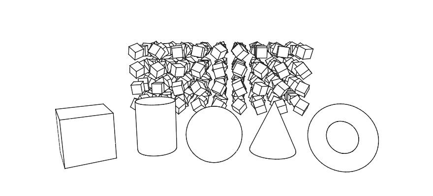

#### <sup>[Ollin](../../README.md) → [Documentation](../README.md) → [3D](./README.md) → `Hidden-line solids`</sup>

---

## Hidden-line solids

A solid drawn the way a draughtsman draws one: the faces in one color, and in ink only the lines that describe the form. Those are the creases, the boundary, and the silhouette. A crease is where two faces meet at an angle, a boundary is where a surface ends, and the silhouette is where it turns away. A box gives its twelve edges and none of the diagonals its faces are built from, and a sphere gives its outline. The faces hide what is behind them, so a near solid hides the edges of a far one.



```swift
let copies = (0 ..< 100).map { MeshInstance(position: Vector3(Double($0 % 10), 0, Double($0 / 10)), scale: 0.3) }
background(.white)
fill(.white)                       // the faces: the paper's color
stroke(.black)
strokeWeight(1)                    // one point on screen, near or far
featureEdges()
drawBox(size: 1)
drawMesh(.box(size: 0.3), instances: copies)   // every copy's edges in one more draw
```

### Which edges are drawn

**`featureEdges(creaseAngle:)`** turns the mode on for the meshes drawn after it, and **`noFeatureEdges()`** turns it off. The faces draw as they always do, in the current `fill` and the current lighting and material. Over them, the mesh's edges draw in the current `stroke` at `strokeWeight`. Three kinds of edge are drawn:

- **A crease**, where the two faces on either side meet at more than `creaseAngle`, in radians. The default is π/6, 30 degrees. A box's edges meet at 90 degrees and are all creases. A sphere's facets meet at about 11 degrees, and none of them is.
- **A boundary**, where a surface ends: the rim of an open cup, the edge of a plane.
- **The silhouette**, where the surface turns away from the eye. It is worked out for every copy from where that copy is seen, so a sphere drawn a thousand times shows a thousand outlines.

A `creaseAngle` of 0 makes every edge a crease, the diagonals included, which is a wireframe whose hidden lines are taken out. A larger angle keeps only the sharper folds. Corners the mesh holds once per face, as a box does for its hard edges, are joined first, so they never read as a boundary.

The state is saved and restored by `withState`. `noStroke()` leaves the edges out, and `wireframe()` wins over the mode. A gradient stroke draws the edges in the color at the middle of its ramp, with a note. `strokeDash`, `strokeBrush`, and `strokeProfile` shape a flat stroke, so the edges draw whole at one weight while they are on, with a note.

### In front of and behind

The faces write depth before their edges are drawn, and each edge takes the depth test.

- **A solid in front hides an edge** exactly where it covers it.
- **A face never hides its own edges.** An edge's depth is pulled a little toward the eye, as a [line in 3D](Lines.md#in-front-of-and-behind) is.
- **A silhouette sits just outside the solid's outline**, so the faces seen nearly edge on at a curved surface's rim cannot cover it.
- **A crease that turns away**, one whose two faces both face away on a closed mesh, is left out. The mesh's own front hides it anyway, and leaving it out keeps it from showing where the depth pull reaches past a thin solid's front.

The pull has the line's cost. Two solids can nearly touch, within about a hundredth of their distance from the eye. There, the edge of the one drawn first can show through the face of the one drawn after. Copies drawn in one `drawMesh(_:instances:)` call are free of this, since all of their faces are drawn before any of their edges. Meshes drawn one call at a time are drawn in call order.

### A weight on screen or in the world

The weight follows [`strokeWeight(_:in:)`](Lines.md#a-weight-on-screen-or-in-the-world). In `.screen` units, the default, it is canvas points, so a 1-point weight is a hairline on every copy whatever its size or distance. In `.world` units it is the scene's own units, scaled by each copy's scale, and it thins with distance like a wire.

### Many copies

Under **`drawMesh(_:instances:)`** the edges of every copy are one more GPU draw beside the solids, placed by the same matrices. The CPU does no work per copy. The form whose placements a compute kernel writes, `drawMesh(_:instances:count:)`, takes them the same way. A mesh's edges are found once and kept while the mesh goes on being drawn. So a mesh drawn every frame is searched for its edges once. A mesh changed since it was last drawn is searched again.

A [mesh field](Instancing.md#a-field-that-culls-itself) draws its faces without their edges, with a note, because its GPU cull has no edges to cull yet. Draw the copies with `drawMesh(_:instances:)` when they need their edges.

### Where the edges go

- **Exports.** A still, a video, and the temporal anti-aliasing and motion-blur passes draw the edges in every pass, the way the window does. Depth of field reads their depth like any solid's. A path-traced export draws them over its picture, depth-tested against the traced scene.
- **A vector export** (SVG, and the plot formats built on it) leaves solids out, and their edges with them. [Line drawing](LineDrawing.md) writes a scene down as the same kind of line work, as paths a plotter can follow.
- **Not carried:** the edges are lines, not geometry, so they cast no shadow and a traced reflection does not show them. A spatial export (USD) carries the solids and leaves the edges out. A web page export stops at 3D drawing and names it, and the sketch exports as video instead.

### What it costs

The CPU cost is next to nothing once a mesh's edges are known. The GPU draws six vertices for each edge of each copy and shades the pixels the lines cover. On an M2 at 1080 by 1080, the `HiddenLines` example draws 10,648 boxes in 4.2 milliseconds of GPU time for the solids alone. With 1-point edges that becomes 8.3 milliseconds, and with 2-point edges 11.5. The CPU time stays at about 5.4 milliseconds a frame either way, and that is spent placing the boxes. Drawn as a `drawLine` per edge instead, the same edges cost about 200 milliseconds of CPU time a frame.

---

See also [Lines in 3D](Lines.md) for a line between points in space, and [3D](3D.md#wireframe) for a mesh drawn as all of its triangle edges. `outline(width:color:)` draws an ink line around a solid's silhouette alone, and [Instancing](Instancing.md) covers drawing many copies. The [`HiddenLines`](../../Examples/3D/Geometry/HiddenLines/Sketch.swift) example turns ten thousand boxes in a block of air with their edges inked.
