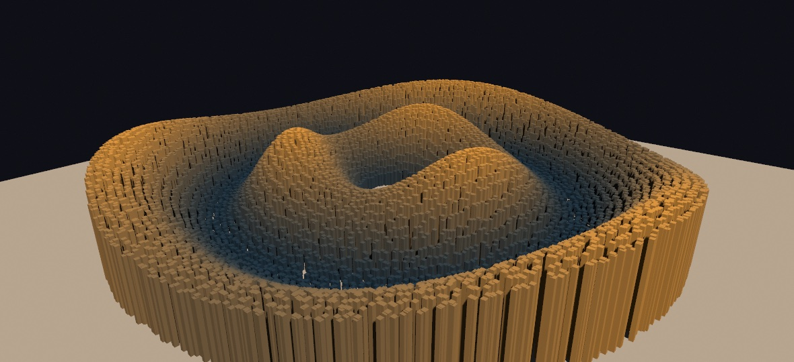

#### <sup>[Ollin](../../README.md) → [Documentation](../README.md) → [3D](./README.md) → `Instanced meshes`</sup>

---

## Instanced meshes

Drawing one mesh is cheap. Drawing the *same* mesh a thousand times with a loop of `drawMesh` calls is not. Every call expands the mesh's triangles on the CPU again, every frame, once per copy. Instancing removes that loop. `drawMesh(_:instances:)` uploads the mesh once and gives the GPU a list of placements, and the GPU puts every copy in place. So a field of thousands of copies costs one draw call and one small array.



```swift
override func draw() {
    background(.black)
    camera(Camera3D(eye: Vector3(0, 6, 14), target: .zero))
    directionalLight(.white, direction: Vector3(-0.5, -0.85, -0.35))
    castShadows()

    let rock = Mesh.box(width: 0.4, height: 0.4, depth: 0.4)
    var copies: [MeshInstance] = []
    for i in 0 ..< 5_000 {
        let a = Double(i) / 5_000 * .tau * 8
        copies.append(MeshInstance(position: Vector3(cos(a) * Double(i) * 0.002, 0.2, sin(a) * Double(i) * 0.002),
                                   rotation: Vector3(0, a, 0),
                                   scale: 0.5 + noise(Double(i) * 0.1)))
    }
    drawMesh(rock, instances: copies)
}
```

Copies shade exactly like solid meshes. They take the current `fill`, the `material(_:)` finish (physically based finishes included), the scene's lights, image-based lighting, global illumination, and fog. They cast into the shadow maps and receive them. Rebuilding the instance list every frame is normal and cheap, and that is how a field moves.

As a reference point, take a 12,400-pillar field, lit and shadowed, at 1080² in a release build on an M2. The per-copy `drawMesh` loop costs about 12.0 ms of CPU per frame only to record the draws. The instanced call records the same field in about 0.23 ms, which is 53 times less. The GPU time is the same either way, because the copies still rasterize and shade. That is the point. Instancing removes the CPU loop, not the picture. `Scripts/benchmark.sh instancing` reproduces the measurement on your machine.

### Contents

- [MeshInstance](#meshinstance) - one copy's placement
- [Instances from a compute kernel](#compute) - GPU-resident placements
- [A field that culls itself](#meshfield) - `MeshField`, a retained world that the GPU culls copy by copy
- [What applies to a copy](#applies)
- [Notes](#notes)

<a id="meshinstance"></a>
### MeshInstance

A `MeshInstance` holds one copy's placement: where the copy sits, how it turns, how it scales, and an optional tint.

```swift
MeshInstance(position: Vector3(2, 0, -1),          // world units (applied first)
             rotation: Vector3(0, .pi / 4, 0),     // Euler radians: x, then y, then z
             scale: Vector3(1, 3, 1),              // per axis (applied last); or one Double
             color: Color(hue: 0.6, saturation: 0.5, brightness: 1))
```

The transform works like the calls it replaces. The copy is placed as if you had written `translate(position)`, then `rotateX`, `rotateY`, and `rotateZ` in that order, then `scale`. Every parameter has a neutral default, so `MeshInstance(position: p)` is a plain unrotated copy. The `color` multiplies the surface color, which is the current `fill` times the mesh material's base color. A `nil` color leaves the surface color unchanged.

The whole field still follows the 3D transform stack. A `translate` or `rotate` before the draw moves every copy together, and each instance's own transform composes on top of that.

<a id="compute"></a>
### Instances from a compute kernel

When a simulation owns the placements, keep them on the GPU. A kernel writes a `ComputeBuffer<OllinMeshInstance>` each frame, and the copies draw from it, so the positions never pass through the CPU. GPU particles and point clouds work the same way.

```swift
let placements = ComputeBuffer<OllinMeshInstance>(count: 100_000)

override func draw() {
    camera(Camera3D(eye: Vector3(0, 8, 20), target: .zero))
    compute(swirl, over: placements)             // a kernel moves the copies
    drawMesh(rock, instances: placements)        // count defaults to the buffer's
}
```

`OllinMeshInstance` is the raw GPU struct. It holds a `model` matrix (local to world) and a `color` multiplier. Import `COllinShaders` to name it in a sketch that writes a kernel. The matrices are in absolute world space, and the transform stack is not composed on top of them, because the kernel owns the placement. The shader derives the normal transform from the matrix itself. So a kernel fills only those two fields, and a non-uniform scale still lights correctly.

<a id="meshfield"></a>
### A field that culls itself

`drawMesh(_:instances:)` records its placement list again every frame, which is what lets a field wave. A *world* is different, because most of it never changes and the camera cannot see most of it. For that, a **`MeshField`** goes further. You place copies of any number of meshes into it once, then draw it with one call for as long as you like. Each frame, a compute pass tests every copy against the camera and writes the surviving draws itself. So copies behind the camera or beyond the far plane cost almost nothing, and the CPU never touches a copy again.


```swift
let field = MeshField()

override func setup() {
    field.place(stone, at: stoneSpots)      // [MeshInstance], like drawMesh
    field.place(pine, at: pineSpots)
    field.place(boulder, at: boulderSpots)
}

override func draw() {
    camera(Camera3D(eye: eye, target: ahead, far: 110))
    drawMeshField(field)                    // one call for the whole world
}
```

A field is retained, like a `Batch`. Build it in `setup()` and hold it. Its surface colors bake when a mesh is placed. Each one is the mesh material's base color times its per-vertex colors, tinted per copy by `MeshInstance.color`. The draw-time `fill` does not tint a field. The transform stack still moves the whole field as a unit, and the current `material(_:)` finish shades it. Its copies cast into the shadow maps *unculled*, so a tree behind the camera still casts its shadow into view. Draw a field once per frame. A second draw in the same frame is skipped with a note.

Culling is on by default. It must never change the picture, only the work, because a culled copy was outside the view by definition. `field.isCullingEnabled = false` draws every copy regardless, which is the direct way to see the difference (the `MeshField` example wires it to a parameter). This is how the culling works. A GPU pass tests each copy's bounding sphere against the view frustum. It then compacts the survivors per mesh and writes one indirect draw per mesh kind. So the CPU issues one draw per *kind of thing*, never one per copy. The shadow pass gets the same test against the light's own frustum. So a caster behind the camera still shadows the view, and everything outside the shadow map is skipped.

As a reference point, take the example's plain of 240,000 copies, lit, shadowed, and fogged at 1080² on an M2. It costs 18.5 ms of GPU per frame with culling on and 50.8 ms with it off, so culling makes the frame 2.7 times cheaper. The CPU cost of recording the one `drawMeshField` call rounds to zero. `Scripts/benchmark.sh field` reproduces the measurement on your machine.

<a id="applies"></a>
### What applies to a copy

Everything the solid lit path does applies to a copy. That means `fill` and per-vertex mesh colors, every `material(_:)` finish including the physically based ones, lights and `lightingPreset`, and received shadows. It also means image-based lighting and the procedural sky, global illumination, fog and aerial perspective, clipping, blend modes, and `depth(at:)` compositing. Instanced copies also cast into the directional and spot shadow map and into the point-light shadow cube.

Copies also reach the ray-traced passes, whichever of the three forms placed them. They show in a ray-traced reflection. They cast a ray-traced point or area shadow, and they bounce light in global illumination. They are in the [path-traced export](../Output/PathTraced.md) too. In that export they shadow, mirror, and bleed color like the meshes they copy, with the finish of their own draw. Each copy carries its own placement and its own `color` there. A copy costs a matrix rather than a triangle list, so a field of copies is cheap to trace.

A list hands its placements straight to the traced scene. The other two forms never hand a placement to the CPU at all. The compute-buffer form keeps its matrices in a buffer a kernel writes, and a field holds more copies than the CPU can read each frame. For both, the CPU reserves the slots, because it knows the count, and a kernel fills them from the same placements the draw reads.

Traced copies are not free in the way drawn copies are, because the traced scene is rebuilt every frame. Each copy in it costs roughly two microseconds of GPU time on an M2, whatever placed it. A few thousand copies is comfortable. A few hundred thousand would use the whole frame there, which is why a field carries a budget:

```swift
field.tracedCopyBudget = 20_000     // the default
```

A field over its budget stays out of the traced passes and says so once, naming both numbers. Its copies still draw, still receive reflections, and still cast into the shadow maps. The reflections are the one place they do not appear. The same holds in the path-traced export, where an over-budget field rasterizes over the traced layer rather than disappearing from it. Raise the budget for an offline render, where seconds per frame are fine. Set it to `0` to keep a field out of the traced passes whatever its size. Camera culling does not affect the budget. A reflection sees what the camera cannot, so the budget counts every copy the field holds.

The following do not apply to a copy yet, by design. Each one arrives with a later slice of the GPU-driven tier:

- **Textures and surface maps.** A textured mesh draws untextured, though its base color still tints. Wireframe and matcap fall back to the solid look, with a one-time note.
- **A glowing copy is not a light in the path-traced export.** It glows, and its light does reach the scene. But the tracer never aims at it. The tracer's [light table](../Output/PathTraced.md) weighs each glowing triangle by its area in the world. A copy's triangles are not placed in the world. So expect more grain than a plain emissive mesh gives.
- **The screen-space pre-passes.** Contact shadows, ambient-occlusion normals, and subsurface scattering skip the copies.
- **Motion vectors.** Copies are not `withMotion` movers, so temporal anti-aliasing covers them through its depth reprojection instead.

<a id="notes"></a>
### Notes

- A copy field is one batch and never merges with its neighbors. So its draw order against other geometry is exactly call order, and the depth buffer sorts the 3D.
- `makeBatch { }` refuses an instanced draw, as it refuses a plain mesh, because a retained copy would silently lose its shadows. Draw the field where the batch is drawn.
- Spatial export records the `[MeshInstance]` form as one mesh per placement, exactly like a loop of `drawMesh` calls. The GPU-buffer form cannot be exported, because the placements live on the GPU, and it says so once.
- SVG export skips meshes entirely, instanced or not, because a shaded solid has no vector outline.
- A `MeshField` exports spatially like a loop of `drawMesh` calls, because its placements stay on the CPU for exactly this purpose. The list above, of what does not apply to a copy yet, applies to fields too.
- The [`InstancedMesh`](../../Examples/Rendering/InstancedMesh/Sketch.swift) example draws 12,000 pillars on a wave, with a parameter that switches between the instanced path and a per-copy `drawMesh` loop. The cost difference shows live in the inspector.
- The [`MeshField`](../../Examples/Rendering/MeshField/Sketch.swift) example scatters 240,000 solids across a foggy plain and flies through them, with a parameter that turns the culling off. The picture stays the same, but the frame rate does not.
