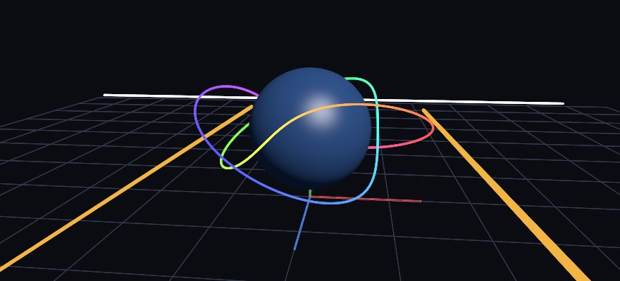

#### <sup>[Ollin](../../README.md) → [Documentation](../README.md) → [3D](./README.md) → `Lines in 3D`</sup>

---

## Lines in 3D

A line between two points in space, or a run of them, drawn through the camera. It is the 2D stroke laid on the picture the camera makes of those points: the same weight, joins, caps, and soft edge. Every point of it keeps its depth, so a solid in front of the line hides it and the line hides what lies behind it. That is what a trajectory, a field line, a wireframe of your own, or a pair of axes needs: something thinner than any mesh you would build for it.



```swift
camera(Camera3D(eye: Vector3(3, 2, 5), target: .zero))
stroke(.white)
strokeWeight(2)
drawLine(Vector3(-1, 0, 0), Vector3(1, 1, -1))
drawPolyline(knot, colors: hues, closed: true)    // a color for every point
drawAxes()                                         // x red, y green, z blue
```

### Drawing a line in space

- **`drawLine(_:_:)`** takes two `Vector3` points, and **`drawLine(_:_:_:_:_:_:)`** takes the same two as six numbers, `x1, y1, z1, x2, y2, z2`.
- **`drawPolyline(_:closed:)`** runs through a list of points and joins every corner. `closed` joins the last point back to the first.
- **`drawPolyline(_:colors:closed:)`** takes a color for each point in place of the stroke color, and blends between them along each segment. The count has to match the points. A list that does not is set aside with a note, and the line takes the stroke color.

The line takes the drawing state a 2D stroke takes: `stroke`, `strokeWeight`, `strokeCap`, `strokeJoin`, and `blendMode`. A gradient stroke paints each point by where it lands on the canvas, or by its distance along the line for an `.alongPath` gradient. The 3D `translate`, `rotateX`/`rotateY`/`rotateZ`, and `scale` move the line like any other 3D drawing, and a line needs a camera set earlier in the frame, as `drawMesh` does. Without one it draws nothing, with a note that says why.

Two 2D settings stay 2D. `strokeDash`, `strokeBrush`, and `strokeProfile` shape a flat stroke, and a line with 3D points draws whole at one weight while they are on, with a note.

### In front of and behind

Each point projects through the camera, and the stroke expander lays the line on the canvas around those points. Every vertex it makes keeps the depth of the point it was laid around. The line then takes the depth test like a solid does.

- **A solid in front hides the line** exactly where it covers it.
- **The line hides what lies behind it**, whichever of the two you draw first. Its solid middle writes depth.
- **Its soft edge writes no depth.** Something drawn later behind the line still shows beside it, rather than leaving a dark rim of background where the edge was. The edge itself is then drawn over, so a line drawn after the solids around it keeps the softest edge. Draw the lines last when you can.
- **Translucent ink** writes depth through its middle like opaque ink, so a translucent line hides what is drawn after it and behind it. That is the same rule a translucent solid follows: draw translucent things last.

A line lying on a surface, a grid on a floor, or a line along a mesh's edge, shares the surface's depth only along its own middle. Across its width the surface tilts away while the line holds one depth. So the line's depth is pulled a little toward the camera, more toward its edges than in its middle, the way the surface's own depth departs from the line's. A line up to three points wide stays whole on a floor seen at about 7 degrees or more. The pull has a cost. A line within a few percent of its distance behind a surface shows through it, so a line leaving a solid comes out a little before its true exit point, the two edges just ahead of the middle.

What lies behind the camera is cut away where the line crosses the plane the camera stands on. A line running past the camera draws the part in front of it. A closed loop the camera stands inside opens there and draws as the one piece in front.

### A weight on screen or in the world

**`strokeWeight(_:in:)`** names the units of the weight a line with 3D points takes.

- **`.screen`**, the default, reads it in canvas points, the unit a 2D stroke uses. A line two points wide is two points wide near the camera and far from it, the way a pen line on a drawing of the scene would be.
- **`.world`** reads it in the scene's own units. A line a tenth of a unit wide thins as it recedes and thickens as it comes closer, like a thread would. A 3D `scale` widens it with everything else.

```swift
strokeWeight(3)                  // three canvas points, at every distance
strokeWeight(0.05, in: .world)   // a twentieth of a unit, thinner with distance
```

The unit is stated with the weight every time, so a plain `strokeWeight(2)` later in the sketch is back in canvas points. A weight in world units never carries over into a line that wanted points. A 2D stroke reads the weight in the drawing's own units whichever unit is named. `StrokeUnits` is the type, and it works as a menu `@Param`.

### Axes and a grid

Two helpers are built from the same lines, and both take the current state.

- **`drawAxes(length:)`** draws the three axes from the model origin, `length` along each: x in red, y in green, z in blue. Under a 3D `translate` or `rotate` it shows where that transform has put things.
- **`drawGrid(size:divisions:)`** draws a square grid on the ground, the plane y = 0, centered on the model origin. It is `size` across and cut into `divisions` cells along each side. Rotate or translate it in 3D to stand it up as a wall.

Both are part of the picture and export with it. The live window's own `cameraAxis(_:)` and `groundGrid(_:)` are host chrome for finding your bearings, shown only in the window.

### Where a line goes

- **Exports.** A still, a video, and the temporal anti-aliasing and motion-blur passes draw the line the way the window does. Each pass projects it through its own camera, so a spatial video's two eyes each see it from their own side.
- **A vector export** (SVG, and the plot formats built on it) carries the line as the 2D polyline the camera made of it. A file has no depth, so nothing hides it there, and it has one weight, so a line in world units takes the mean of its projected widths. For line work of solids with the hidden parts taken out, use [Line drawing](LineDrawing.md).
- **Not carried:** a `makeBatch { }` recording leaves the line out, because a recording has no camera to project it through; draw it where the batch is drawn. A spatial export (USD) leaves it out, with a note, since the file holds surfaces. A web page export names the call and stops, and the sketch exports as video instead. A line casts no shadow, and it is not part of the ray-traced scene, so a traced reflection does not show it.

### What it costs

A line in 3D costs what a 2D stroke through the same points costs. The projection adds next to nothing, and the expansion runs on the CPU every frame, so the work grows with the number of points drawn. On an M2 in an optimized build with round joins, that comes to about half a microsecond a point. A frame of 5,200 points takes 3 milliseconds and one of 19,000 takes 11, the same as 2D strokes through the projected points. A few thousand points a frame is cheap. For hundreds of thousands, a point cloud or a mesh made once in `setup()` costs less.

---

See also [3D](3D.md#wireframe) for a mesh drawn as its triangle edges, and `drawTube` for a line with a body. [Drawing](../Drawing/Drawing.md#strokeJoin) covers the joins and caps a line takes, and [Depth compositing](DepthCompositing.md) places flat 2D drawing at a depth in the scene. The [`FieldLines`](../../Examples/3D/Geometry/FieldLines/Sketch.swift) example draws a planet's magnetic field as lines with a color for every point, with the grid and the axes.
