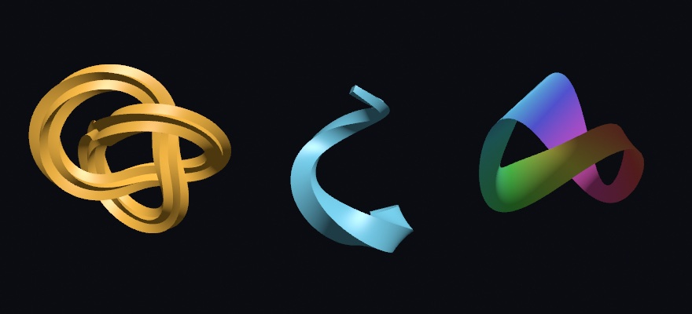

#### <sup>[Ollin](../../README.md) → [Documentation](../README.md) → [3D](./README.md) → `Sweeps and strips`</sup>

---

## Sweeps and strips

A sweep carries a flat shape along a path through space. It is how a molding runs round a picture frame, or a rope follows its coil. A strip is the ribbon between two lines in space. Both rest on two smaller pieces: a path whose frames never twist, and an even pace along a curve given as a function.



```swift
let anchors = [Vector3(1, 0, 0), Vector3(0, 0.5, 1), Vector3(-1, 0, 0), Vector3(0, -0.5, -1)]
let knot = Curve3D(curveThrough: anchors, closed: true)
drawSweep(Profile.star(points: 5, outerRadius: 0.17, innerRadius: 0.08), along: knot,
          twist: { $0 * .tau })                      // one whole turn round the loop
```

### A path through space

`Curve3D` is an ordered run of 3D points, open or closed, joined by straight segments.

- `Curve3D(points, closed:)` keeps the points you give it.
- `Curve3D(curveThrough:closed:segments:)` threads a smooth Catmull-Rom curve through a few anchors. It is the same curve `Contour(curveThrough:)` draws in the plane. It takes about `segments` straight steps between two anchors, more across a long gap and fewer across a short one, and it passes through every anchor.

The path walks the way a contour does. `length` is the distance along the segments, the closing one included on a closed path. `point(at:)` takes a fraction of that length. An open path clamps the fraction to `0...1`, and a closed one wraps it, the same way a closed `Contour` does. So `knot.point(at: time * 0.1)` runs round the loop for good.

Every point also has a **frame**: the `tangent` the path runs along, plus a `normal` and a `binormal` square to it. They stand the way x, y, and z do, with the tangent as z. `frames` holds one per point, and `frame(at:)` gives the frame at any fraction, turning steadily from one point's frame to the next. A frame has two helpers:

- `rotation` is the turn that takes the x, y, and z axes onto normal, binormal, and tangent. Pass it to `rotate(_:)` after `translate(frame.position)`, and whatever you draw next faces along the path.
- `point(_:)` places a 2D point in the frame's plane: x along the normal, y along the binormal.

```swift
// A carriage riding the loop, always facing the way it goes.
let f = knot.frame(at: time * 0.08)
withState {
    translate(f.position)
    rotate(f.rotation)
    drawBox(width: 0.3, height: 0.12, depth: 0.5)    // its depth runs along the path
}
```

**The frames do not twist.** The obvious frame to carry is the curve's own (Frenet) frame, which points where the path bends. It spins about the path wherever the path leaves a plane. It also flips over where the bend changes side. These frames are *rotation-minimizing* instead. Each is carried to the next point by two reflections, the double reflection method (Wang, Jüttler, Zheng, and Liu, 2008). The first reflects across the plane halfway between the two points. The second brings the reflected tangent onto the next tangent. Together they turn the frame exactly as far as the path bends, and never about the path itself. The method is fourth order, so halving the spacing of the points cuts its error sixteenfold. On a helix at 64 points a turn, the frames are within two millionths of a radian of the exact answer.

The first frame stands upright. Its binormal leans toward world up (`+y`), or its normal toward `+x` when the path starts straight up or down. A path heading along `+z` therefore has normal `+x` and binormal `+y`, the axes an extrusion lays its shape out in.

A closed path has one more thing to settle. Carried once round a loop that is not flat, the frames come back turned, by as much as the curve's total torsion. That leftover turn is spread back out evenly along the walked length. The last frame then leads smoothly into the first, and the loop has no seam.

### Sweeping a shape

`Mesh.sweep(_:along:scale:twist:capped:)` lays a 2D `Shape` across the path at every point and joins the copies into a surface. The `[Vector2]` overload takes a closed outline, so the `Profile` helpers drop in, and `drawSweep` is the bare call.

The shape's origin rides on the path. Its x goes along each frame's normal and its y along the binormal. A path running straight along `+z` therefore gives exactly what `Mesh.extrude(_:depth:)` gives.

```swift
let rise = Curve3D(curveThrough: [Vector3(-0.6, -1.1, 0), Vector3(0.5, -0.5, 0.3),
                                  Vector3(-0.2, 0.3, -0.2), Vector3(0.3, 1.1, 0.1)])
let horn = Mesh.sweep(Profile.rectangle(width: 0.55, height: 0.55), along: rise,
                      scale: { 1 - 0.85 * $0 },       // taper to near a point
                      twist: { $0 * .pi })           // half a turn on the way up
```

- **`scale` and `twist`** are read at every point with the fraction of the way along by walked length, `0...1`. `scale` multiplies the shape's size there. `twist` turns it by that many radians about the path, counterclockwise as the path comes toward you. Left out, the shape keeps its size and never turns.
- **Every closed contour becomes a wall**, holes included. The walls face out of the solid whichever way each outline was drawn, read from the shape's own fill rule. An open contour becomes a sheet.
- **Corners keep their edges.** Where an outline turns more than 30°, the wall keeps a hard edge down the whole sweep; a gentler turn is shaded smooth. A square stays square, a hexagon stays faceted, and a circle of a dozen points or more reads round.
- **`capped`** (the default) closes the two ends of an open path with the shape's fill, so the sweep is a closed solid you can cut or print.
- **The mesh carries uvs.** `u` runs round each contour by walked length and `v` along the path. A cap maps the shape's bounds.

On a **closed path** the last copy joins the first. So `scale` should come back to where it started, and `twist` to its start plus a whole number of turns. Otherwise the join shows.

A shape wider than the path's tightest bend folds over itself on the inside of that bend, as a real rope would kink. Keep the shape smaller than the bend, or give the path more room.

`Mesh.tube(along:)` is the circle's case of the same idea, and its rings ride the same frames.

### A strip between two lines

`Mesh.strip(between:and:colors:closed:)` is a ribbon between two lines in space: rung `i` joins `first[i]` to `second[i]`, and each rung joins the next with two triangles. It is the surface a moving segment sweeps, a loft between two rails, the band a pair of hands traces through the air. `drawStrip` is the bare call.

- **`colors`**, one per rung, paints both ends of each rung. They are the mesh's vertex colors, so they multiply the `fill`. Any other count is ignored.
- **The uvs** run `u` from 0 at the first rung to 1 at the last, counted by rung rather than by distance, and `v` from 0 on the first line to 1 on the second. Rungs spaced evenly lay a texture evenly.
- **The normals come from the strip itself.** At each end of a rung, the direction its line runs is crossed with the rung, so a ribbon that twists shades with its twist. The front is the side from which the first line runs left to right beneath the second.
- **`closed`** joins the last rung back to the first.
- **Lines of different counts** still make a strip. The line with more points sets the rungs, and each rung meets the other line at the same fraction of its walked length. A line of one point makes a fan.

### An even pace

A curve written as a function of a parameter, a Lissajous figure or a knot, rarely moves at one speed. As the parameter runs evenly, the curve rushes through some stretches and crawls through others. `Pace` measures the curve once and answers the other way round: which parameter lies a given fraction of the way along.

```swift
func lissajous(_ t: Double) -> Vector2 { Vector2(sin(3 * t), sin(4 * t)) * 300 }
let pace = Pace(byLengthOf: lissajous, period: .tau)

let dot = lissajous(pace.parameter(at: time * 0.05))  // one speed all the way round
```

- **`Pace(byLengthOf:period:)`** paces a closed curve, 2D or 3D, that repeats every `period`. **`Pace(byLengthOf:over:)`** paces the parameter values in a range instead.
- **`parameter(at:)`** is the parameter a fraction of the way along, and **`fraction(at:)`** is the inverse. **`total`** is the whole length, `range` the parameter values it was measured over, and `isPeriodic` whether it wraps.
- **A periodic pace keeps counting.** A fraction past 1 runs into the next lap, and the parameter goes on growing: `parameter(at: f + 1)` is `parameter(at: f) + period`. A loop driven by a clock therefore never jumps. A pace over a range clamps to it.
- **`Pace(byAreaBetween:and:period:)`** (and its `over:` form) paces the strip between two curves by its area instead. A fraction of the period maps to the parameter by which that fraction of the strip has been swept. The area is the strip's own, a ruled surface worked out exactly across each rung, so it stays right where the ribbon twists edge-on.

```swift
// Rungs that each cover the same area of the ribbon, however the curves bend.
func lower(_ t: Double) -> Vector3 { Vector3(cos(t), 0, sin(t)) * (2 + cos(2 * t)) }
func upper(_ t: Double) -> Vector3 { lower(t) * 0.8 + Vector3(0, 0.6, 0) }
let pace = Pace(byAreaBetween: lower, and: upper, period: .tau)
let ts = (0..<180).map { pace.parameter(at: Double($0) / 180) }
drawStrip(between: ts.map(lower), and: ts.map(upper),
          colors: ts.map { Color(hue: $0 / .tau, saturation: 0.6, brightness: 1) }, closed: true)
```

Nothing is sampled for you to keep. The curve is read once, when the pace is made. Its speed is taken at `resolution` places (1,024 by default) and five more inside each stretch, then integrated by Gauss-Legendre quadrature. Each answer is solved from that measure by Newton's method. On a smooth curve, a fraction lands within about a billionth of the whole length of where it belongs. A table would only get it to within its own spacing. The speed comes from differencing, so the function is evaluated a hair either side of each place it is read. A pace over a range never reads past its ends. A curve that stands still paces its parameter evenly.

### What it costs

A sweep is one ring of the shape's points for each point of the path. A 200-point path and a 40-point shape make 8,000 vertices. Building a `Curve3D` computes its frames once, and `frame(at:)` then finds its place by binary search. A pace reads its curve about twenty-five thousand times when it is made. An area pace reads each of its two curves about thirty thousand times. In an optimized build that takes about half a millisecond, or a little over one for an area pace. Each `parameter(at:)` after it takes about a tenth of a microsecond. It is still work to do once rather than every frame. Make paths, sweeps, and paces in `setup()`, or again when the numbers that shape them change. Then draw the meshes every frame.

---

See also [3D](3D.md#solid-primitives) for `drawTube`, extrusion, and the other solids, and [Geometry](../Drawing/Geometry.md) for `Shape`, `Contour`, and the `Profile` helpers. The [`SweptKnot`](../../Examples/3D/Geometry/SweptKnot/Sketch.swift) example puts a sweep, a riding frame, and a paced ribbon together.
