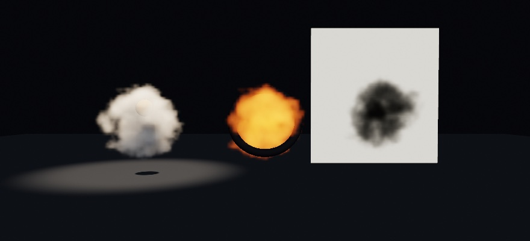

#### <sup>[Ollin](../../README.md) → [Documentation](../README.md) → [3D](./README.md) → `Volumes`</sup>

---

## Volumes

A cloud, a column of smoke, a glowing gas, a drop of ink spreading in water: things with no surface, only a thickness that light passes through. A `Volume` is a box of density samples. `drawVolume` draws it in a 3D scene as a medium that blocks light, scatters the scene's lights toward the eye, and can glow by itself. Solids sit inside it: the medium in front of a solid veils it, and the solid hides the medium behind it.



```swift
let smoke = Volume(width: 48, height: 48, depth: 48) { u, v, w in
    let fromCenter = Vector3(u, v, w).distance(to: Vector3(0.5, 0.5, 0.5))
    return max(0, fbm(u * 4, v * 4, w * 4) - 2 * fromCenter)
}
spotLight(.white, at: Vector3(0, 6, 0), direction: Vector3(0, -1, 0))
drawVolume(smoke, size: 4, medium: .smoke)
```

### The grid

A `Volume` holds `width` by `height` by `depth` samples on a lattice that runs corner to corner across a box. `x` runs along the box's width, `y` up its height, and `z` through its depth toward the viewer. Between samples the value is read trilinearly, and outside the box it is zero. A value of 1 is the medium at its full thickness, and a value below 0 reads as 0.

- **`Volume(width:height:depth:_:)`** calls a function once per sample with `u`, `v`, `w` in `0…1`, corner to corner. This is the usual way to build one, from the sketch's own `fbm`, a distance, or both.
- **`Volume(width:height:depth:values:)`** takes the samples in a list, `x` fastest, then `y`, then `z`. A scan or a simulation's output arrives this way.
- **`Volume(width:height:depth:repeating:)`** is one value everywhere, a uniform block.
- **`Volume.noise(width:height:depth:frequency:octaves:seed:)`** fills a grid with fractal noise across every core. Each sample is the `fbm` a sketch seeded with `noiseSeed(seed)` reads, so it gives what the function form gives over that `fbm`, only faster. The form with `loop:` and `radius:` reads [noise that loops](../Generators/Noise.md#looping-noise-loop), so a grid refilled each frame comes back to where it started.

`subscript(x, y, z)` reads and writes one sample, and `value(u:v:w:)` reads between samples the way the march does. A volume is a value: copies share their samples until one is written. A grid reaches the GPU once, so a volume built in `setup()` costs nothing to draw again.

### What it is made of

**`drawVolume(_:size:medium:)`** draws the grid filling a cube `size` units on each side, centered at the model origin, and **`drawVolume(_:width:height:depth:medium:)`** fills a box. Both follow `translate`, `rotate`, and `scale` like any solid. The `Medium` says what the box holds:

- **`density`** is how thickly the medium blocks light where the grid reads 1, per world unit, the unit `fog(_:density:)` takes. Light crossing `d` units keeps `exp(-density * d)` of itself, which is Beer's law. At density 0 the medium blocks nothing.
- **`color`** is what the medium does with the light it blocks: each channel, in linear light, is the share it scatters back out. White scatters everything, like a cloud. Black scatters nothing, like soot or ink, and only darkens.
- **`glow`** and **`glowIntensity`** are light the medium gives off itself, per world unit where the grid reads 1. A glow with no density adds over what is behind it, like a hot thin gas. With density, the deep glow is dimmed by the medium in front of it, so a thick glowing ball reads brightest at its center and settles at its glow divided by its density.
- **`anisotropy`**, from -0.95 to 0.95, is which way the medium scatters: 0 evenly, toward 1 mostly onward (a cloud with a light behind it shines at its edges), toward -1 mostly back. It is the same dial `volumetricLight` takes.

`Medium(density:color:glow:glowIntensity:anisotropy:)` builds one from these dials, and each is a property to change on a copy. The presets are `.smoke`, `.cloud`, `.fire`, `.ink`, and `.nebula`, and a `@Param var medium: Medium = .smoke` puts them on the inspector's menu. Every dial scales with the grid, so where it reads 0.5 the medium is half as thick and glows half as bright.

### In front of and behind

Volumes draw after the frame's solids, over the finished picture. Each pixel's ray through the box ends at the first solid it meets. So a solid inside a volume is veiled by the medium in front of it and hides the medium behind it. Call order does not matter: a volume drawn before a solid in `draw()` still ends at it. Several volumes are drawn farthest first, by the distance to each box's center. So two volumes that pass through each other are ordered as wholes. A volume drawn into a [layer](../Concepts/Layers.md) does the same over that layer's own solids. The same holds for 2D: a caption drawn after a volume in `draw()` lies under the cloud. Draw anything meant to sit on top in `withOverlay { }`.

### Light and shadow

The medium scatters the scene's directional, point, and spot lights, with a spot's cone, its light profile, and its cookie. It also scatters the flat ambient and, under an `environment`, the environment's light from every side. The light reaching a point inside the medium has crossed the medium on its way there. So a cloud shades itself, lit on the side facing the light and dark on the far side. This self-shadow covers the first four lights in the frame, and further lights scatter without it. A solid between a directional or spot light and the medium throws its shadow into the medium, through the light's shadow map.

Some light is not followed:

- **Light the medium bounces to itself** is left out, so a thick white cloud lit from the front reads about half as bright as a white matte surface under the same light, and its shadowed side is dark rather than glowing.
- **A panel or tube light** scatters nothing in the medium. A point light's shadow, which has no flat map, does not fall into it.
- **The medium casts no shadow** on the solids around it, and a reflection or a refraction through glass does not show it.
- **Fog** veils the solids behind a volume, and the volume itself shows unfogged.

### Where volumes go

- **Exports.** A still, a video, and the temporal anti-aliasing passes draw volumes. Under temporal anti-aliasing each pass starts its march at a different offset, so their average smooths the march's fine grain.
- **Depth of field and motion blur** read the depth and motion of the solid behind a volume, so a volume in focus in front of a far wall blurs with the wall.
- **Not carried:** a vector export (SVG) leaves volumes out, and a spatial export (USD) skips them. A web page export stops at `drawVolume` and names it, and the sketch exports as video instead.

### What it costs

A grid reaches the GPU once, as half floats, so redrawing a volume costs only its march. Filling one costs what its function costs, once per sample. On an M2 in a release build, a 64-sample cube of `Volume.noise` takes 4.9 milliseconds. The same noise through the function form, on one core, takes 24.5. The looping form reads a larger noise lattice and costs about eight times as much: 5.8 milliseconds at 32 samples a side, 18 at 48, and 40 at 64. So a grid refilled every frame holds 60 frames a second at about 32 a side. Reading a grid built once, as the example does to scroll its noise, costs 3.8 milliseconds at 64 a side.

The march costs GPU time for each pixel the box covers, at two steps for every sample spacing it crosses. Each step takes a shadow tap and a transmittance read for each lit light. Each light's transmittance grid is worked out in a compute pass, and worked out again only when the volume, its placement, or the light changes. The `Volumes` example refills a 36 by 48 by 36 grid every frame, and the grid covers about a sixth of a 1080 by 1080 frame. Its march takes about 2.7 milliseconds of GPU time on an M2, with one spot light and its shadow. Framed closer, covering about a quarter of the frame, it takes about 5.

---

See also [Atmosphere](Atmosphere.md) for fog that fills the whole scene and the light shafts in it, and the `Environment.clouds` sky for a cloudscape overhead. The [`Volumes`](../../Examples/3D/Effects/Volumes/Sketch.swift) example draws a column of smoke rising from repeating noise, with a ball hanging in it.
