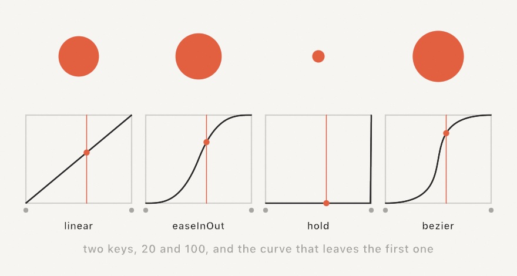

#### <sup>[Ollin](../../README.md) → [Documentation](../README.md) → [Core](./README.md) → `Automation`</sup>

---

## Keyframed parameters

A [`@Param`](../Helpers/Parameters.md) gives a sketch a knob to turn. An `Automation` turns it for you: a value placed at one moment, another placed later, and a curve carrying the first into the second. It is the difference between tuning a piece and directing one.

Because the tracks read the sketch clock, and the exports drive that clock at a fixed step, a directed run renders exactly as it plays.

<picture>
  <source media="(prefers-color-scheme: dark)" srcset="../../Guide/Images/03-MotionAndTime/TimelineCurve-dark.jpg">
  
</picture>

### Contents

- [Writing tracks in code](#writing-tracks-in-code)
- [Curves](#curves)
- [What blends, and what steps](#what-blends-and-what-steps)
- [How a pass plays](#how-a-pass-plays)
- [Reading a track back](#reading-a-track-back)
- [A track that is a rule](#a-track-that-is-a-rule)
- [The file](#the-file)
- [How it sits beside the rest](#how-it-sits-beside-the-rest)

---

### Writing tracks in code

Call `automate(_:_:)` in `setup()`, once per knob. The closure places the keys in the knob's own type:

```swift
final class Breathing: Sketch {
    @Param(20...400) var radius = 120.0
    @Param var tint = Color.coral

    override func setup() {
        automate($radius) { track in
            track.key(at: 0, 40)
            track.key(at: 2, 320, curve: .easeInOut)
            track.key(at: 4, 40)
        }
        automate($tint) { track in
            track.key(at: 0, .coral, curve: .linear)
            track.key(at: 4, Color(hex: 0x2E6BE6), curve: .linear)
        }
        automation?.loops = true
    }

    override func draw() {
        background(.white)
        fill(tint)
        drawCircle(center: center, radius: radius)   // both knobs are on their curves
    }
}
```

The `$radius` form hands over the parameter itself, which is how the track learns the property name. Keys may be written in any order; a track sorts them. Calling `automate` again for the same knob replaces that knob's track.

Every frame, before the sketch draws, each track sets its knob to the value its curve holds at the sketch clock.

### Curves

A key carries the curve that *leaves* it, so the last key's curve is never read.

| Curve | What it does |
|---|---|
| `.hold` | stay at this value until the next key, then jump |
| `.linear` | a straight line |
| `.easeIn` | start slowly, arrive fast |
| `.easeOut` | start fast, arrive slowly |
| `.easeInOut` | slow at both ends, fast through the middle (the default) |
| `.bezier(x1:y1:x2:y2:)` | a cubic Bezier through two handle points |



The Bezier is the editable one: the handles bend the clock as well as the value, which is how a curve drawn by hand behaves. The handles' `x` stays inside `0...1` so the curve reads left to right; `y` may travel outside it, which overshoots and comes back.

```swift
track.key(at: 0, 40, curve: .bezier(x1: 0.85, y1: 0, x2: 0.15, y2: 1))   // a hard snap
```

`track.hold(at:_:)` is the short way to write a key that holds.

### What blends, and what steps

Numbers, colors, points, rectangles, insets, and ranges have values in between two settings, so they travel along the curve. Colors take the even path a fade wants (the same one [`Color.mix`](../Drawing/Color.md) takes).

A switch, a menu choice, and a piece of text have nothing in between. They *step* instead, holding the setting they left until the next key takes over. Two keys of different kinds hold as well, which is what a knob that changed type leaves behind.

Outside a track's own span, the track is a constant: the first key's value before it, the last key's value after it.

### How a pass plays

The automation reads the clock as `start + time * speed`:

```swift
automation?.speed = 2                       // twice as fast
automation?.loops = true                    // wrap at the duration
automation?.length = 8                      // hold past the last key, then wrap
automation?.speed = -1                      // and run it backwards,
automation?.start = automation?.duration ?? 0   // starting from the end
```

`duration` is the last key of the longest track, unless `length` says otherwise. With `loops` off, a pass simply holds its last key when it runs out.

### Reading a track back

An automation is plain data, so a sketch can read its own curves and draw them:

```swift
if case .number(let value)? = automation?.track(named: "radius")?.value(at: 1.5) {
    // what the radius knob will hold one and a half seconds in
}
```

`value(of:at:)` does the same from a sketch time rather than a position, applying `speed`, `start`, and the loop. The [Automation example](../../Examples/Motion/Automation/Sketch.swift) plots each of its own tracks under the stage this way.

### A track that is a rule

Keys say where a knob *is* at a few moments. A [`Formula`](../Helpers/Formula.md) says what it *is* at every moment, read from text rather than from Swift source:

```swift
drive($radius, "190 + sin(time * tau / 6) * 80")
```

It is the same track, so `loops`, `speed`, `start`, and `length` shape it the same way, and it travels in the same file, written down as the text itself:

```json
{ "name": "radius", "formula": "190 + sin(time * tau / 6) * 80" }
```

A formula reads `time` as the position in the automation, plus `frame`, the canvas, the pointer, and the sketch's other number and switch knobs by name. The whole vocabulary, and the two rules worth knowing before you type one, are on the [`Formula`](../Helpers/Formula.md) page.

A knob that holds more than one number takes one rule for each part, and a part with no rule is left alone:

```swift
drive($eye, x: "frame.x + frame.width / 2", y: "height / 2")
```

```json
{ "name": "eye", "parts": { "x": "frame.x + frame.width / 2", "y": "height / 2" } }
```

`Automation.parts(of:)` names the parts a stored value carries. `Automation.applying(_:to:)` puts worked-out numbers back into one, which is how a track of parts becomes a whole value again. See [a knob of more than one number](../Helpers/Formula.md#a-knob-of-more-than-one-number).

### The file

An `Automation` is codable, so it reads and writes as JSON:

```swift
try automation?.write(to: url)
sketch.automation = try Automation.load(from: url)
```

`--automation <file>` attaches one to a standalone run or to any export:

```sh
swift run Example-Motion-Automation --automation slow.json --export-video out.mp4 --seconds 12
```

A file arrives before `setup()`, so a sketch that also writes a track for the same knob wins. A file written for a *newer* format than this Ollin reads is refused rather than guessed at; an older one still reads, because each layout so far has only added to the one before it.

The flag is read by standalone runs and by every export path. In the live-reload host, write the tracks in `setup()` instead: they survive each swap because the sketch carries them.

### How it sits beside the rest

- **Smoothing.** An automated knob is set, not eased into, so a `@Param` carrying `smoothing:` does not glide twice. The curve is the glide.
- **The inspector.** A knob under a track goes back on its curve at the next frame, so dragging its slider reads as a nudge rather than a change. Take the track off (`automation = nil`) to tune by hand.
- **Takes.** A run recorded with [`--record-take`](Replay.md) writes down the values the curves held, so the take replays the performance with or without the automation attached.
- **Exports.** Every export flag drives the clock at a fixed step, so an automated piece renders frame for frame. `--export-video --seconds` decides how many passes are in the file.

---

### See also

- [`Parameters`](../Helpers/Parameters.md) - the `@Param` knobs themselves, and the controls that edit them by hand
- [`Replay`](Replay.md) - a run written down as it happened, the sibling format keyed the same way
- [`Export`](../Output/Export.md) - the flags an automated run renders through, `--automation` among them
- [`Formula`](../Helpers/Formula.md) - the other way to fill a track: a rule worked out every frame, read from text
- [`Animation`](../Helpers/Animation.md) - `Timeline`, the in-code sibling that sequences one value rather than a sketch's knobs
