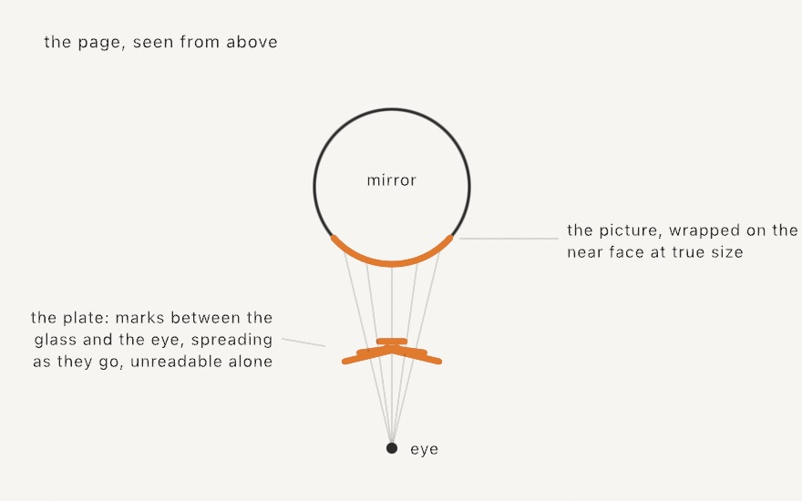

#### <sup>[Ollin](../../README.md) → [Documentation](../README.md) → [Drawing](./README.md) → `Anamorphosis`</sup>

---

## Anamorphosis: a drawing only a mirror can read

Draw a picture. Spread it across the page so that it says nothing at all. Stand a mirrored cylinder in the middle of it, put your eye in one particular place, and the smear gathers itself back into the picture, standing upright on the glass.

Nothing is undone in software. The plate on the page is a real drawing, and the reflection does the reading. Painters were doing this in the 1600s, before anybody could compute it, by ruling the construction out by hand.

`Anamorphosis` is that construction. It takes ordinary geometry, `Vector2`, `Contour`, and `Shape`, and hands back the geometry to draw, ready for filling, stroking, the [shape booleans](./Geometry.md#shape-booleans), hatching, and [SVG export](../Output/Export.md) if you want to plot the plate and stand a real mirror on it.




### Contents

- [The setup](#setup)
- [Mapping a picture](#mapping)
- [What fits](#fits)
- [Reading a plate back](#back)
- [Standing a real mirror on it](#real)
- [What it costs](#cost)

<a name="setup"></a>

#### The setup

Four things decide a plate, and every one of them is a measurement you could take with a ruler.

```swift
Anamorphosis(center: Vector2,       // where the mirror stands on the page
             radius: Double,        // the mirror's radius
             eye: Vector3,          // where the viewer's eye is, z measured up from the page
             picture: Rectangle,    // the box the picture is drawn in
             lift: Double = 0,      // how far up the mirror the picture's lower edge sits
             facing: Double? = nil) // which way the picture is wrapped, nil to aim it at the eye
```

```swift
let mirror = Anamorphosis(
    center: Vector2(540, 480), radius: 130,
    eye: Vector3(540, 910, 250),
    picture: Rectangle(center: Vector2(540, 480), width: 280, height: 70),
    lift: 40
)
```

`eye` is a `Vector3` because the height matters as much as the distance. `x` and `y` are the spot the viewer stands on, in the page's own coordinates. `z` is how high the eye is above the page.

The picture is carried at **true size**. A picture 280 wide wraps 280 of arc around the mirror, and one 70 tall stands 70 tall on it. Nothing is squeezed before the reflection gets to it. `lift` raises the whole band up the glass. With no lift the picture is planted on the page. Its lower edge then does not move at all, and those marks land exactly on the mirror's own circle. Raising it clears the plate away from the glass and stretches it farther out, which is what most finished plates look like.

`footprint` is the circle the mirror stands on. Draw it as a guide while you work.

<a name="mapping"></a>

#### Mapping a picture

```swift
let plate = mirror.plate(of: emblem)          // Shape   -> Shape
let runs  = mirror.plate(of: outline)         // Contour -> [Contour]
let mark  = mirror.plate(of: Vector2(500, 460))   // Vector2 -> Vector2?
```

The map bends straight lines, so a contour is walked at an even `spacing` first (3 by default, in page units) and the bend is carried by the extra points. Ask for a smaller spacing when a plate is going to be printed large.

```swift
let plate = mirror.plate(of: emblem, spacing: 1)
```

A single point comes back optional, because not every point of the page can be reached. A contour comes back as an array, one entry per stretch that survives, and a closed contour that survives whole stays closed. A `Shape` is a region rather than a line, so a contour that only partly survives is **dropped** rather than opened, and a shape with nothing left comes back with no contours at all.

Text is the demonstration everybody wants, and it is ordinary geometry here:

```swift
textSize(130)
let word = textToShapes("OLLIN", at: Vector2(0, 0))
let plate = word.map { mirror.plate(of: $0, spacing: 1.5) }
for shape in plate { drawShape(shape) }
```

<a name="fits"></a>

#### What fits

The eye can only see part of the mirror, and it is less than half of it. Two tangent lines run from the eye to the cylinder, and everything past them is turned away.

```swift
mirror.visibleHalfAngle   // half the arc in view, in radians
mirror.widestPicture      // the widest picture this setup can carry, in page units
mirror.fits               // whether this picture is inside both limits
```

An eye at an infinite distance sees a quarter turn each way. Standing closer takes some of that away. Know it at the sketch's start rather than at the end: pull the viewer in and the arc narrows, so the same word must be written smaller, or the plate must swing wider to say it.

The height has a limit too, and it is a harder one. A mark leaves the glass on a bounce that falls as steeply as the ray arrived. So a point of the picture level with the eye never comes down at all, and a point just under it lands a very long way off. Keeping the top of the picture under about a third of the eye's height keeps the plate a size you can print. `fits` refuses anything at or above the eye outright.

<a name="back"></a>

#### Reading a plate back

```swift
mirror.picturePoint(of: mark)                    // a mark on the page -> the picture
mirror.mirrorPoint(of: picturePoint)             // where a picture point sits on the glass
mirror.mirrorPoint(of: mark, asSeenBy: eye)      // where a mark is seen from, for any eye
```

`picturePoint(of:)` undoes `plate(of:)`. There is no formula for it. Finding where a ray from the eye bounces to a given spot is the circle problem al-Haytham posed a thousand years ago. It has no answer in ordinary algebra, so the bounce is searched for along the arc the eye can see, then sharpened. It is exact to about a millionth of a page unit, and slow enough to belong in `setup()` rather than in a per-frame loop.

`mirrorPoint(of:asSeenBy:)` takes a *different* eye, which is what you want for showing the piece off. Follow every point of the finished plate up to the glass, then project the glass as that viewer sees it. You have drawn what the mirror shows, worked out from the plate rather than from the picture that made it.

<a name="real"></a>

#### Standing a real mirror on it

The measurements are ordinary ones, so the plate prints.

- Print at a known scale, and use page units that mean something: treat one unit as one millimeter and the numbers are the mirror's real radius and the real height of your eye above the table.
- Mirrored acrylic tube and steel tube both work. Measure the **outside** radius, since that is the surface doing the reflecting.
- Stand the tube on the `footprint` circle. Draw the circle, print the plate, and take the circle off the artwork afterward, or print it in a color you can cut away.
- The viewing spot is one spot. A plate cut for an eye 250 above the page reads from 250 above the page. It stays legible for a while as you move, and then it does not.

<a name="cost"></a>

#### What it costs

The forward map is a handful of arithmetic per point, so mapping a whole picture is cheap and can run every frame. The map back searches, so it costs about a thousand times more per point. Work a plate out once, keep it, and redraw the geometry you kept.

Everything here is a pure function of the setup, so the same numbers always produce the same plate.

### See also

- [`Geometry`](./Geometry.md) - `Vector2`, `Rectangle`, `Contour`, `Shape`, and the shape booleans the plate can be cut with
- [`Text`](./Text.md) - `textToShapes`, which turns a word into the shapes to map
- [`Export`](../Output/Export.md) - SVG out, for plotting a plate to stand a real mirror on
- [`Installation`](../Output/Installation.md) - the other way a picture is pre-distorted, for a projector aimed at a surface from an angle
- Example: [Patterns/Anamorphosis](../../Examples/Patterns/Anamorphosis/Sketch.swift)
