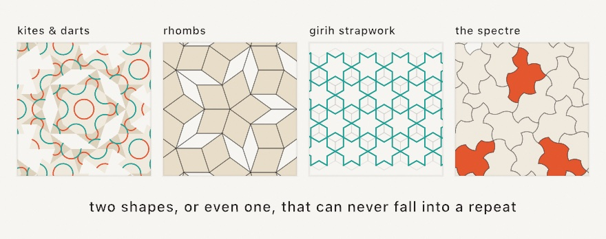

#### <sup>[Ollin](../../README.md) → [Documentation](../README.md) → [Drawing](./README.md) → `Aperiodic tilings`</sup>

---

## Aperiodic tilings

Four families of tilings that refuse to repeat, or that turn a handful of local rules into one connected pattern.

- **Penrose tilings**, kites and darts, thick and thin rhombs.
- **Wang tiles**, edge-matching squares, where aperiodicity was first discovered.
- **Girih star patterns**, the polygons-in-contact strapwork of Islamic geometric art.
- **The spectre**, the einstein, a single tile that can only ever tile aperiodically.

They are all geometry, not draw calls. Each hands back typed tiles or contours that feed the same drawing, boolean, hatching, and SVG paths as everything else. So all four are plotter-ready line work too.



```
  penroseTiling          wangTiling          girihPattern         spectreTiling

   ◇ ◆ ◇◆◇                ◤◩◣▦◧               ✶─✦─✶                ⟡⟡⟡⟡
  ◆ ◇ ◆ ◇ ◆               ▦◪◥◫◤               │ ✧ │               ⟡⟡⟡⟡⟡
   ◇◆ ✶ ◆◇                ◧◫◭▦◩               ✦─✶─✦                ⟡⟡⟡⟡
  never repeats        edges must match     rays meet as stars   one tile, no repeats
```

Penrose and spectre generation is rng-free, so the same call always lays the same patch. Girih is a pure function of its polygons. Wang rides the seeded `random`, so a [`seed`](../Generators/Random.md#seed) reproduces the quilt. The periodic siblings live on the [tiling & layout](./Tiling.md) page, and every polygon here composes with [`girihPattern`](#girihPattern), which decorates *any* edge-to-edge tiling.

### Contents

- [penroseTiling / Penrose](#penroseTiling)
- [wangTiling / WangTile / WangTiling](#wangTiling)
- [girihPattern / Girih](#girihPattern)
- [spectreTiling / Spectre](#spectreTiling)

<a name="penroseTiling"></a>

#### penroseTiling / Penrose

```swift
penroseTiling(_ variant: Penrose.Variant = .rhombs,
              in bounds: Rectangle? = nil,
              tileEdge: Double = 48,
              center: Vector2? = nil) -> [Penrose.Tile]
```

The tiles of a Penrose tiling covering `bounds`, which defaults to the whole canvas. Two variants: `.kitesAndDarts` is P2, and `.rhombs` is P3, a thick 72° rhomb and a thin 36° one. Tiles are generated by substitution. A wheel of first-generation tiles at `center` is deflated until edges are at most `tileEdge`. The result is merged into whole tiles and clipped to the bounds. `center` is where the five-fold "sun" lives, and defaults to the bounds center.

Each `Penrose.Tile` carries:

| Member | Meaning |
| --- | --- |
| `kind` | `.kite` / `.dart` or `.thick` / `.thin`, the per-kind color hook. |
| `points: [Vector2]` | The four corners; the first is the symmetry-axis head (the kite's nose, the dart's reflex corner, a rhomb's apex). |
| `shape` / `contour` | Fillable `Shape` / closed `Contour`. |
| `arcs: [Contour]` | The two matching-rule arcs, ends meeting across every edge. |

```swift
for tile in penroseTiling(.rhombs, tileEdge: 36) {
    fill(tile.kind == .thick ? .indigo : .navy)
    drawShape(tile.shape)
}
```

The `arcs` are the classic decoration. Two circular arcs per tile have ends that hit each edge at its golden section, the same point from both sides. So the whole tiling reads as a weave of continuous curves. Stroke only the arcs for the line-work look:

```swift
noFill(); strokeWeight(3)
for tile in penroseTiling(.kitesAndDarts, tileEdge: 60) {
    stroke(tile.kind == .kite ? .coral : .teal)
    for arc in tile.arcs { drawPolyline(arc.points, closed: false) }
}
```

Deterministic. No randomness is involved, so the same bounds and edge always lay the same tiles. A `tileEdge` far below what the two-million-half-tile cap can reach is clamped.

<a name="wangTiling"></a>

#### wangTiling / WangTile / WangTiling

```swift
wangTiling(_ tiles: [WangTile], columns: Int, rows: Int,
           attempts: Int = 20) -> WangTiling?
drawWangTiling(_ tiling: WangTiling, colors: [Color], in bounds: Rectangle? = nil)
```

Wang tiles are squares with a color on each edge, placed unrotated under one rule. Touching edges must carry the same color. The colors in `WangTile(top:right:bottom:left:weight:)` are plain integers. This is where aperiodicity was first found. In creative coding the same idea runs the other way, as the classic texture-generation trick. A seeded scanline fill turns independent random picks into one connected, maze-like pattern.

`wangTiling` fills a `columns × rows` grid in scanline order, driven by the seeded `random`. Each cell is chosen among the tiles that match its west and north neighbors, weighted by `weight`. `WangTiling.completeSet(colors: n)` builds the full `n⁴`-tile set, which can never dead-end. Hand-built sets that can are retried `attempts` times, and `nil` means none succeeded.

The result carries `tiles`, `columns`/`rows`, row-major `indices`, and `tile(column:row:)`. `drawWangTiling` renders each cell as four edge-colored triangles meeting at the center (the classic picture), with `colors` indexed by edge color id:

```swift
seed(7)
if let quilt = wangTiling(WangTiling.completeSet(colors: 2), columns: 15, rows: 15) {
    drawWangTiling(quilt, colors: [.navy, .orange])
}
```

For roads, dungeons, or texture patches, read `tile(column:row:)` and draw your own cell content per edge color. The guarantee that neighbors agree is what makes the pieces connect.

<a name="girihPattern"></a>

#### girihPattern / Girih

```swift
girihPattern(over polygons: [[Vector2]], angle: Double = 54) -> [Contour]
girihPattern(in polygon: [Vector2], angle: Double = 54) -> [Contour]
drawGirih(over polygons: [[Vector2]], angle: Double = 54)
```

Islamic star patterns by the polygons-in-contact method, Hankin's technique in Kaplan's formulation. Lay any edge-to-edge tiling of polygons, then sprout a pair of rays from each edge midpoint at the contact `angle`, in degrees. Grow every ray until it meets another, and matched pairs become the strapwork strands. Remove the tiling and the crossings that remain *are* the star pattern, joining seamlessly across tiles because both sides launch from the same midpoints.

It works over any polygons: `Grid` squares, `HexGrid` cells, Penrose tiles, or the five classic girih tiles. The contact angle is the one big dial. The same tiling reads spiky, star-like, or woven as it changes:

```swift
let cells = hexGrid(columns: 9, rows: 8).cells.map(\.corners)
stroke(.white); strokeWeight(3); noFill()
drawGirih(over: cells, angle: 60)
```

`Girih.Tile` is the medieval decagonal system's tile set. All five share an edge length, so any two compose edge to edge. They are `.decagon`, `.pentagon`, the elongated `.hexagon`, `.bowtie`, and `.rhombus`. Each offers unit `points`, a scaled/placed `points(edge:at:rotation:)`, and the composing form `points(onEdge:_:)`. That last one lays the tile's first edge exactly along a segment. Walk an existing tile's edge backward and the new tile lands snug against it, on the other side:

```swift
let decagon = Girih.Tile.decagon.points(edge: 56, at: uv(0.5, 0.5))
var patch = [decagon]
for i in decagon.indices {
    let p = decagon[i], q = decagon[(i + 1) % decagon.count]
    patch.append(Girih.Tile.pentagon.points(onEdge: q, p))   // a flower
}
drawGirih(over: patch, angle: 54)   // 54° is the classic girih angle
```

Pure geometry with no randomness. Strands come back as open `Contour`s, ready to stroke, hatch, thicken through the [shape booleans](./Geometry.md), or export.

<a name="spectreTiling"></a>

#### spectreTiling / Spectre

```swift
spectreTiling(in bounds: Rectangle? = nil,
              tileEdge: Double = 26,
              curve: Double = 0) -> [Spectre.Tile]
```

The spectre is the einstein: one shape that tiles the plane and can never repeat. `curve: 0` gives Tile(1,1), the 14-sided polygon with unit edges on the 30° grid. Any nonzero `curve` bends every edge into the same alternating bump. That removes the tile's mirror symmetry and makes the tile *strictly chiral*, so it then tiles only without reflections. Useful values run up to about 1, with 0.5 close to the published look. Patches grow by the discovery paper's substitution system until they cover `bounds`, with edges close to `tileEdge`.

Every tile in a patch is congruent and same-handed. Each `Spectre.Tile` carries:

| Member | Meaning |
| --- | --- |
| `points` | The outline (14 corners straight, more when curved). |
| `metatile` | Which of the nine substitution types it descends from, the natural coloring key. |
| `isOdd` | The rare mystic partners, rotated 30° from every other tile. |
| `shape` / `contour` | Fillable `Shape` / closed `Contour`. |

```swift
for tile in spectreTiling(tileEdge: 26, curve: 0.5) {
    fill(tile.isOdd ? .tomato : .ivory)
    drawShape(tile.shape)
}
```

Deterministic. The same call always lays the same patch.

---

Also see [tiling & layout](./Tiling.md) for the periodic families (hex and triangle grids, subdivision, mazes), [Truchet tiles](./Truchet.md) for the seeded-orientation cousin, and [Wave Function Collapse](../Generators/WaveFunctionCollapse.md) for constraint solving beyond the scanline.
