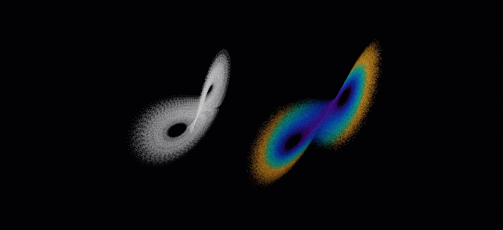

#### <sup>[Ollin](../../README.md) → [Documentation](../README.md) → [Drawing](./README.md) → `Strange attractors`</sup>

---

## Strange attractors & chaotic maps

A strange attractor is the shape a chaotic system settles onto. It is a bounded path that never repeats. You see that thin, layered form in the Lorenz butterfly and in the fine threads of a Clifford map. Ollin gives you two kinds of attractor, continuous and discrete, and both return plain points that you draw however you like. A third type, `AttractorFlow`, runs the continuous systems on the GPU.

- **`StrangeAttractor`** is a *continuous* system: a velocity field integrated over time with fourth-order Runge-Kutta. Its orbit is a `[Vector3]`, so it draws through the [point-cloud](../3D/3D.md) path and the camera. The built-in systems include Lorenz, Rössler, and Aizawa.
- **`ChaoticMap`** is a *discrete* iterated map. Its orbit is a `[Vector2]` that you plot as a scatter of points, and it looks best accumulated additively into a density field. The built-in maps are Clifford, Peter de Jong, Hénon, Gumowski-Mira, Ikeda, and hopalong.
- **`AttractorFlow`** runs the same continuous systems on the GPU, with a million particles moving through the field at once. The shape then appears as moving material rather than a still curve.

The one-dimensional members of the family live in [`IteratedMap`](../Generators/Bifurcation.md). That page covers the logistic map and its relatives, with their bifurcation diagrams, cobwebs, and Lyapunov exponents.

Each orbit is a pure function of its starting point and parameters, so a run always reproduces. You pick a system from the built-in factories, or you supply your own rule.

### Contents

- [Quick start](#quick-start)
- [StrangeAttractor (continuous)](#strange)
- [ChaoticMap (discrete)](#map)
- [Drawing sugar](#sugar)
- [Your own system](#custom)
- [A million at once: AttractorFlow](#flow)
- [The systems in a shader of your own](#shaderlib)

<a name="quick-start"></a>

### Quick start

This sketch integrates a Lorenz attractor once and lets the camera orbit it:

```swift
var cloud = PointCloud()

override func setup() {
    let path = StrangeAttractor.lorenz().orbit(count: 150_000, settle: 2000)
    cloud = PointCloud(positions: path, color: .white, size: 0.012)
}

override func draw() {
    background(.black)
    cameraShowcase(target: .zero, radius: 24)   // drag to orbit, scroll to zoom
    drawPointCloud(cloud)
}
```

This sketch accumulates a 2D Clifford map into a glowing density field:

```swift
override func setup() { noClear(); noStroke() }   // pile onto a persistent canvas

let map = ChaoticMap.clifford()
var p = Vector2(0.1, 0.1)

override func draw() {
    if frameCount == 1 { background(.black) }
    blendMode(.add)
    fill(Color(red: 0.4, green: 0.7, blue: 1, alpha: 0.05))
    var points = [Vector2]()
    for _ in 0..<80_000 {                 // continue the one long orbit
        p = map.next(p)
        points.append(Vector2(width / 2 + p.x * 240, height / 2 + p.y * 240))
    }
    drawPoints(points)
}
```

<a name="strange"></a>

### StrangeAttractor (continuous)

A continuous system is defined by its **velocity field**. Given a point in phase space, the field returns the instantaneous rate of change `(dx, dy, dz)/dt`. `orbit(count:settle:)` integrates that field from `start` with fixed-step fourth-order Runge-Kutta. It drops `settle` warmup steps first, so the path has reached the attractor before you collect points.

```swift
let path = StrangeAttractor.lorenz().orbit(count: 100_000, settle: 1000)
```

| Member | Meaning |
| --- | --- |
| `orbit(count:settle:) -> [Vector3]` | The trajectory: `count` points after `settle` warmup steps. |
| `derivative: (Vector3) -> Vector3` | The velocity field. Sample it to get the orbit speed, for example to color by `derivative(p).length`. |
| `start: Vector3` | The initial condition. |
| `step: Double` | The integration time step. |

Each built-in system uses its published equations with its classic parameters, and you can override any parameter:

| Factory | Shape |
| --- | --- |
| `.lorenz(sigma:rho:beta:)` | The original two-lobed butterfly. |
| `.rossler(a:b:c:)` | A single folded band. |
| `.aizawa(a:b:c:d:e:f:)` | A spiralling sphere-and-spindle. |
| `.thomas(b:)` | A looping, axis-symmetric lattice walk. |
| `.halvorsen(a:)` | Three intertwined scrolls. |
| `.dadras(a:b:c:d:e:)` | A four-winged twist. |
| `.chen(alpha:beta:delta:)` | A tightly wound double scroll. |
| `.fourWing(a:b:c:)` | Four lobes meeting at the center. |

The orbits are in their own units (Lorenz spans roughly ±25), so center and scale them for the camera. The [`3D/StrangeAttractor`](../../Examples/3D/Geometry/StrangeAttractor) example shows how.

<a name="map"></a>

### ChaoticMap (discrete)

A discrete map is defined by its **iteration rule**, which gives the next point from the current one. `orbit(count:settle:)` iterates that rule from `start`. The output stays bounded (the trigonometric maps stay within roughly ±2 on each axis), so translate and scale it onto the canvas.

```swift
let points = ChaoticMap.clifford(a: -1.4, b: 1.6, c: 1, d: 0.7).orbit(count: 200_000)
```

| Member | Meaning |
| --- | --- |
| `orbit(count:settle:) -> [Vector2]` | The orbit: `count` points after `settle` warmup steps. |
| `next: (Vector2) -> Vector2` | The iteration rule. Call it to continue one long orbit across frames. |
| `start: Vector2` | The starting point. |

| Factory | Form |
| --- | --- |
| `.clifford(a:b:c:d:)` | `sin(a·y) + c·cos(a·x)`, `sin(b·x) + d·cos(b·y)`. |
| `.deJong(a:b:c:d:)` | `sin(a·y) - cos(b·x)`, `sin(c·x) - cos(d·y)`. |
| `.henon(a:b:)` | `1 - a·x² + y`, `b·x`. |
| `.gumowskiMira(mu:a:b:)` | `y + a·(1 - b·y²)·y + G(x)`, `G(x') - x`, with `G(x) = mu·x + 2(1-mu)·x²/(1+x²)²`. |
| `.ikeda(u:)` | A spin by `t = 0.4 - 6/(1 + x² + y²)`: `1 + u·(x·cos t - y·sin t)`, `u·(x·sin t + y·cos t)`. |
| `.hopalong(a:b:c:)` | `y - sgn(x)·√\|b·x - c\|`, `a - x`. |

The constants change these maps completely, so adjust them to explore. The maps look best accumulated additively (`blendMode(.add)` over [`noClear()`](Accumulation.md)), because repeated visits to a pixel then brighten into filaments. Each map has its own character. Gumowski-Mira moves through a near-conservative field of islands and forms a shape with many petals. `mu` picks which petal shape you get, and the *starting point* picks which structure the orbit moves through. The long transient is the picture, so plot it with no `settle`. For a denser picture, layer several orbits from different seeded starting points. Ikeda folds everything into one swirl, which stays within roughly `[-0.4, 1.7] × [-2.2, 0.9]` at the default `u = 0.9`. Hopalong moves around nested rings that keep widening as the orbit runs. Its reach grows slowly with `count`, to roughly ±4 after a million steps at the defaults.


<a name="sugar"></a>

### Drawing sugar

For the common cases there are one-call draw verbs. They use the current `fill`:

```swift
drawAttractor(.lorenz())            // a point cloud through the camera (needs a `camera`)
drawAttractor(.clifford())          // a 2D scatter at the current `pointSize`
```

`drawAttractor(_ attractor: StrangeAttractor, count:settle:size:)` builds and draws a `PointCloud` in one color. If you want per-point color, by speed or by position, build the cloud yourself from `attractor.orbit(...)`. `drawAttractor(_ map: ChaoticMap, count:settle:)` plots the orbit in the map's own coordinate space, so use `translate` and `scale` to place it on the canvas.

<a name="custom"></a>

### Your own system

Both types take a closure, so you can supply any first-order system or iterated map:

```swift
// A custom continuous system.
let spin = StrangeAttractor(start: Vector3(1, 0, 0), step: 0.01) { p in
    Vector3(-p.y, p.x, 0)            // dx/dt = (-y, x, 0): a circle
}

// A custom map.
let mine = ChaoticMap(start: .zero) { p in
    Vector2(sin(2.1 * p.y) - p.x * 0.3, cos(1.7 * p.x))
}
```


<a name="flow"></a>

### A million at once: `AttractorFlow`

`StrangeAttractor` integrates **one** orbit and returns the points. `AttractorFlow` runs the same field on the GPU for a million particles at once. Each particle follows its own trajectory, and the flow steps all of them every frame. You see the attractor as a volume of particles rather than as a single curve. It is dense where the orbit moves slowly, thin where the orbit moves fast, and you can see it flowing along itself.



```swift
var flow: AttractorFlow!

override func setup() {
    flow = makeAttractorFlow(count: 1_000_000, .lorenz())
}

override func draw() {
    background(.black)
    blendMode(.add)                    // let the particles pile into a density plot
    toneMap(.aces)
    cameraShowcase(target: flow.center, radius: flow.extent * 3.4)
    updateAttractorFlow(flow)
    drawParticles(flow)                // camera-facing splats, like a point cloud
}
```

A flow is 3D and draws through the camera, so `drawParticles` does nothing without one. Measured on an M2 at 1080², a million particles step and draw at 55 fps, with 0.2 ms of CPU per frame.

**It sizes and paces itself.** The flow integrates one CPU orbit of the same system when it is built. It measures everything else from that orbit. The systems differ widely in scale, because Aizawa's whole shape is a unit and a half across while Lorenz spans fifty. Both are framed, lit, and moving at a sensible speed from the first frame, and your sketch needs no per-system numbers:

| Property | What it is |
| --- | --- |
| `center: Vector3` | The middle of the attractor. Point a camera here. |
| `extent: Double` | How far it reaches. A camera radius of about `extent * 3` frames it. |

Both are percentiles of the orbit rather than its extremes. Several of these systems take rare long excursions, so a maximum keeps growing the longer you watch. For example, the four-wing's reach measures 2.0 over 120,000 points and 3.5 over 400,000. A percentile settles to a stable value instead.

| Parameter | Meaning |
| --- | --- |
| `system: AttractorSystem` | Which field. You can set it live: the flow measures the new system and the particles flow into the new shape. |
| `speed: Double` | Pace, as a multiple of the measured one. At 1, a particle crosses the attractor about once a second. |
| `size: Double?` | Splat diameter in world units. `nil` derives one from `extent`. |
| `colors: [Color]` | The speed ramp, up to eight stops. |
| `opacity: Double` | How much light one particle contributes. It is low, so density reads as tone. |
| `maxSubsteps: Int` | The most Runge-Kutta steps one frame may take. |

**Color is speed, brightness is density.** A particle's color comes from how fast it is moving. That is what shows the structure, because you see the fast outer sweeps against the slow, crowded core. The default stops shift hue and hold their brightness roughly level on purpose, because in additive drawing the *brightness* already means density. A ramp that also ran from dark to light would put two different facts on one channel. A slow crowded region would then look like a fast empty one.

**Particles start on the attractor.** They are sampled from a settled orbit and then moved a tiny distance off it. That small offset matters. Without it, every particle would sit exactly on the orbit and follow the same trajectory forever. The picture could then only be that one curve with dots sliding along it. Because the particles start a tiny distance off the orbit, chaos separates them into a million trajectories within a few laps. If they started in a box instead, you would watch them fall onto the shape first. How long that takes depends on the system's own contraction rate. It is a fraction of a second for Lorenz, and a minute of watching nothing for Aizawa.

**The step never outruns the system.** Each frame advances the system's own time by an amount set by `speed`. That time is split into fourth-order Runge-Kutta steps. The flow takes as many steps as it needs, so that no step is larger than the published step for that system. If you ask for more pace than `maxSubsteps` allows, the flow runs slower than asked rather than taking a coarser step. It does that because a coarser step would no longer integrate the same system faithfully. A particle can also leave the neighborhood of the attractor altogether, and extreme constants can cause that. Such a particle is dropped back into the middle rather than flying off, so a stray can never streak the frame.

**Reproducibility** works as it does everywhere on this GPU path. A flow repeats on one machine, but it is not promised to be frame-exact across GPUs, and there is no pixel snapshot of one. Every system also has an `.attractor` property, which is the CPU `StrangeAttractor` with the same constants. Use it for a still plot or a measurement beside the moving one.

See the [`Simulation/Attractor`](../../Examples/Simulation/Attractor) example.

<a name="shaderlib"></a>

### The systems in a shader of your own

The velocity fields and the Runge-Kutta step are part of the [shader library](../Shaders/ShaderLibrary.md), which is spliced into every compute kernel and user shader. So a sketch can run a chaotic system in a kernel of its own:

```swift
lazy var motes = Particles(count: 500_000, step: """
    float3 p = float3(position, seedA);
    for (int i = 0; i < 3; ++i) {
        OLLIN_RK4_STEP(p, 0.006, ollin_lorenz(_p, 10.0, 28.0, 8.0 / 3.0));
    }
    position = p.xy; seedA = p.z;
""")
```

`OLLIN_RK4_STEP(state, h, derivative)` advances a `float3` by one step. `derivative` is an expression written in terms of the sample point `_p`, which is how a system's constants reach it. Metal has no function pointers here, so this is a macro. Along with the eight velocity fields, the library has the six maps: `ollin_clifford`, `ollin_de_jong`, `ollin_henon`, `ollin_gumowski_mira`, `ollin_ikeda`, and `ollin_hopalong`. A map returns the next point directly and needs no integration.

---

See also [`Chaotic maps & bifurcation`](../Generators/Bifurcation.md) for the one-dimensional members of this family (`IteratedMap`: the logistic route to chaos, bifurcation diagrams, cobwebs, Lyapunov exponents). The [`3D`](../3D/3D.md) page covers the `PointCloud` and the camera that the continuous orbits draw through. The [`Accumulation`](Accumulation.md) and [`HDR`](HDR.md) pages cover the additive density build-up the 2D maps want. The [`Compute`](../Shaders/Compute.md) page covers the GPU particle path that `AttractorFlow` runs on. The [`Voronoi`](Voronoi.md) and [`Grid`](Geometry.md) pages cover the other geometry helpers.
