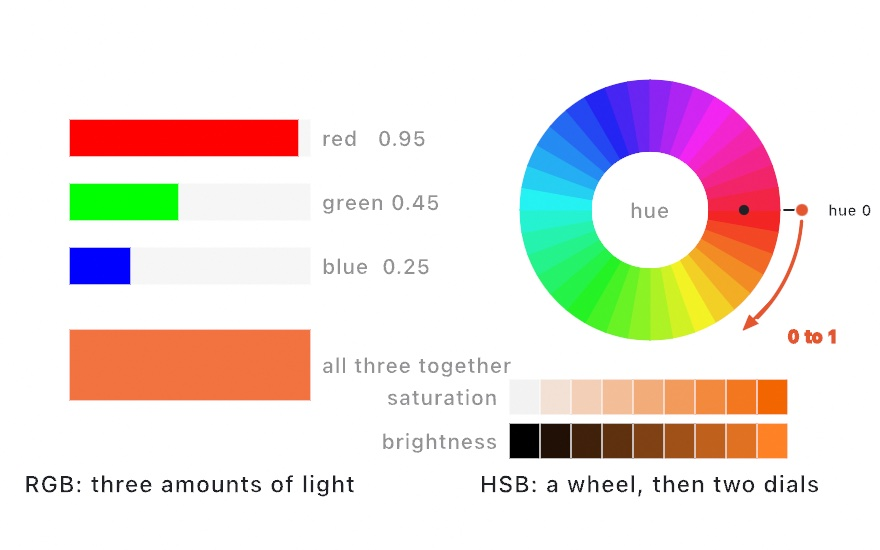
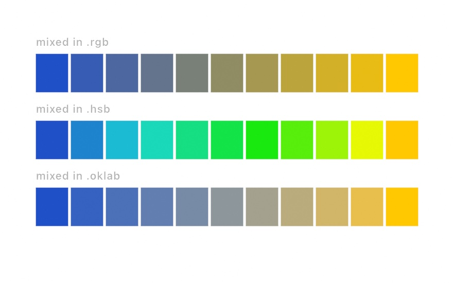
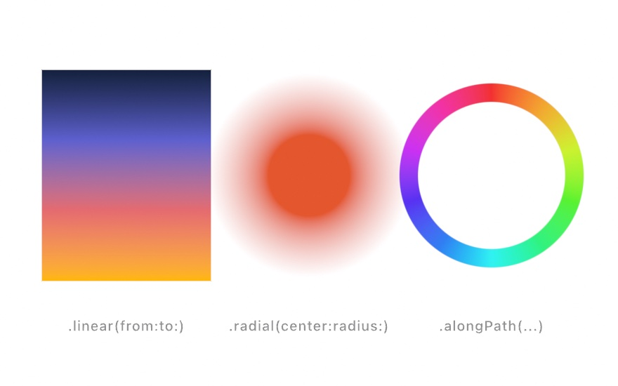
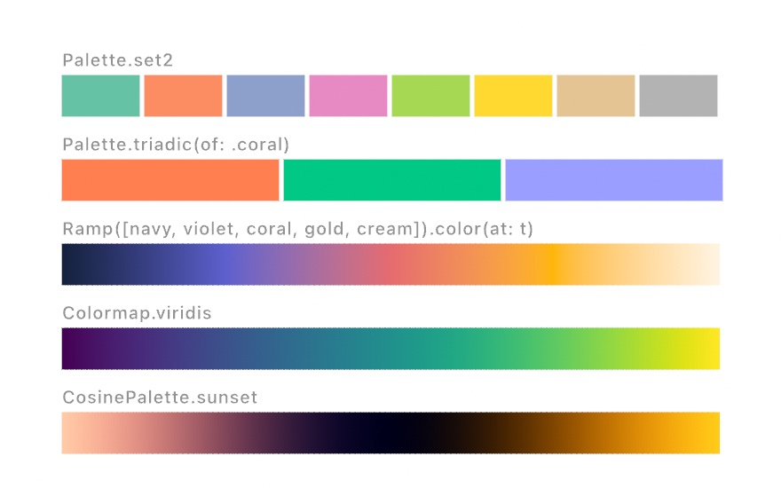
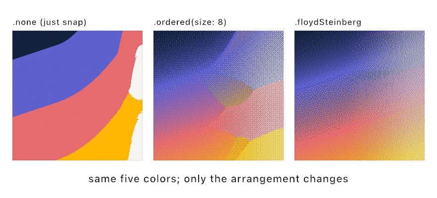

#### <sup>[Ollin](../../README.md) → [Documentation](../README.md) → [Drawing](./README.md) → `Color`</sup>

---

## Color

`Color` is an RGBA color with `Double` components in `0...1`. Most of the types below map a single number to a `Color` through the same `color(at:)` call. `Ramp`, `CosinePalette`, and `Colormap` do it smoothly, and the discrete `Palette` does it in steps. That is the usual way to drive color from a value or from time.

### Contents

- [Color](#color)
- [OKLab, OKLCH, OKHSL](#oklab)
- [Mixing](#mixing)
- [Ramp](#ramp)
- [Gradient paint](#gradient)
- [Palette](#palette)
- [Loading palettes from a file](#palette-files)
- [Extracting a palette from an image](#palette-extraction)
- [Dithering an image to a palette](#dithering)
- [CosinePalette](#cosinepalette)
- [Colormap](#colormap)

<a name="color"></a>

### `Color`

```swift
Color(red: Double, green: Double, blue: Double, alpha: Double = 1)
Color(white: Double, alpha: Double = 1)
Color(hex: UInt32, alpha: Double = 1)     // 24-bit RGB: Color(hex: 0xFF0066)
Color(hex: String)                        // "#RGB" "#RGBA" "#RRGGBB" "#RRGGBBAA" → Color?
Color(hue: Double, saturation: Double, brightness: Double, alpha: Double = 1)
Color(kelvin: Double, alpha: Double = 1)  // blackbody color temperature
```

Named constants come in two tiers. The first tier is the essentials: `.white`, `.black`, `.gray`, `.clear`, and the additive primaries `.red`, `.green`, and `.blue`, so `green` is the pure `(0, 1, 0)`. The second tier is a fuller set around them, so that common colors read by name. The names and their exact sRGB values come from the [CSS Color Module Level 4](https://www.w3.org/TR/css-color-4/#named-colors) list:

`.yellow` `.cyan` `.magenta` `.orange` `.purple` `.pink` `.brown` · `.crimson` `.tomato` `.coral` `.salmon` `.gold` · `.darkGreen` `.forestGreen` `.seaGreen` `.olive` `.teal` `.turquoise` · `.navy` `.royalBlue` `.steelBlue` `.skyBlue` `.indigo` · `.violet` `.orchid` `.plum` `.lavender` `.maroon` · `.tan` `.khaki` `.beige` `.ivory` `.silver` `.lightGray` `.darkGray` `.slateGray`

CSS defines `green` as the darker `#008000`. Ollin keeps `green` as the pure primary, so use `.darkGreen` or `.forestGreen` when you want the deeper tone.

```swift
background(.white)
fill(.coral)
fill(Color(red: 0.2, green: 0.5, blue: 0.9))
stroke(Color(white: 0.1))
```

**Hex** comes in two forms. The integer form is for literals in code. It is compile-checked, there is nothing to parse, and it is never optional. An integer carries no digit count, because `0xFFF` and `0x000FFF` are the same value. So the integer form is always six digits of RGB, and alpha is its own parameter:

```swift
background(Color(hex: 0x14171C))
fill(Color(hex: 0xFF0066, alpha: 0.5))
```

The string form takes the full grammar: `"#RGB"`, `"#RGBA"`, `"#RRGGBB"`, and `"#RRGGBBAA"`. The `#` is optional, and case is ignored. The result is an optional, so a string from a file or from the network fails cleanly instead of trapping:

```swift
let brand = Color(hex: "#ff0066")!        // a literal you know is well-formed
if let c = Color(hex: userString) { fill(c) }
```

**Hue, saturation, brightness** are each in `0...1`. Hue wraps, so 1.2 reads as 0.2. That means you can drive hue from `time` or any other unbounded value without keeping it in range yourself. Saturation and brightness clamp. The `HSBWheel` example draws the classic wheel with this initializer:

```swift
fill(Color(hue: time * 0.1, saturation: 0.8, brightness: 1))   // cycle the rainbow
```

You can read the same three values back from any color through its `hue`, `saturation`, and `brightness` properties. So you can vary a color you already hold instead of rebuilding it from numbers. The `Mixing` example labels the midpoint of every band that way:

```swift
let shifted = Color(hue: fract(base.hue + 0.1), saturation: base.saturation,
                    brightness: base.brightness)
```

<picture>
  <source media="(prefers-color-scheme: dark)" srcset="../../Guide/Images/02-Color/HueWheels-dark.jpg">
  
</picture>

**Color temperature** describes light the way a photographer does. `Color(kelvin:)` takes a blackbody temperature. The result is warm and orange at the low end, cool and blue at the high end, and neutral white around 6600. It is an ordinary sRGB `Color`, so it works in `fill`, `background`, or as a `Light`'s color. The 3D [lighting presets](../3D/3D.md#lights) use it, so a lighting rig is written with the actual temperatures of its lights. `kelvin` clamps to `1000...40000`.

```swift
directionalLight(Color(kelvin: 5600), direction: Vector3(-0.5, -0.8, -0.4))  // daylight key
fill(Color(kelvin: 3200))                                                    // warm tungsten
```

**Two component helpers** finish the type. `withAlpha(_:)` returns the same color at a different opacity and leaves the original unchanged. That is the everyday fade. `luminance` is the color's perceived brightness in `0...1`. It is the Rec. 709 weighted sum of the linearized components, so green counts most and blue least, which matches how the eye weighs them. That makes it the value to read for image-driven work. Sample a pixel with the [`Image`](Images.md#pixels) subscript, then size or choose marks by `pixel.luminance`.

```swift
fill(ink.withAlpha(0.3))                  // a translucent version of a held color
let size = cell * image[x, y].luminance   // marks scaled by perceived brightness
```

<a name="oklab"></a>

### OKLab, OKLCH, OKHSL

These are three views of one perceptual model. Each is a small value type that converts to and from `Color`, and alpha stays on the `Color`:

```swift
OKLab(l:a:b:)     OKLab(_ color: Color)     Color(_ lab: OKLab, alpha: Double = 1)
OKLCH(l:c:h:)     OKLCH(_ color: Color)     Color(_ lch: OKLCH, alpha: Double = 1)
OKHSL(h:s:l:)     OKHSL(_ color: Color)     Color(_ hsl: OKHSL, alpha: Double = 1)
```

- **`OKLab`** is the workhorse of the three, and the space for color *math*. `l` is perceived lightness in `0...1`, `a` runs from green to red, and `b` runs from blue to yellow. Mixing through it comes out visually even.
- **`OKLCH`** is OKLab in polar form (lightness, chroma, hue). It is the space for adjusting hue and chroma, because turning `h` leaves lightness and colorfulness alone. The maximum displayable chroma depends on hue and lightness, so a raised `c` can ask for a color the screen cannot show. Converting to `Color` maps such a color back by reducing chroma at constant lightness and hue. The color keeps its hue and lightness, and it is as vivid as sRGB allows.
- **`OKHSL`** fits the same model into the sRGB gamut. `s` and `l` run `0...1`, and every combination is displayable. It is the space for *generated* color, for example a random hue at the same perceived lightness.

Hue is a turn in `0...1` everywhere it appears, like the HSB initializer, and it wraps the same way.

```swift
// Twelve hues that genuinely read as the same lightness:
for i in 0..<12 {
    fill(Color(OKHSL(h: Double(i) / 12, s: 0.9, l: 0.65)))
    drawCircle(60 + Double(i) * 80, height / 2, 30)
}

var lch = OKLCH(brand)
lch.h += 0.5                 // the complementary hue, same lightness and chroma
let complement = Color(lch)
```

<a name="mixing"></a>

### Mixing

```swift
Color.mix(_ a: Color, _ b: Color, Double, in: ColorSpace = .oklab) -> Color
someColor.mixed(with: other, _ t: Double, in: ColorSpace = .oklab) -> Color
```

Both calls interpolate between two colors in a chosen space. The spaces are `.rgb`, `.hsb`, `.oklab`, `.oklch`, `.okhsl`, and `.paint`. `.oklab` is the default, and it is perceptually even. `.oklch` keeps each color's own hue while the mix moves through chroma. `t` clamps to `0...1`, and alpha interpolates linearly. In the polar spaces, hue takes the shortest way around the wheel. An achromatic endpoint (gray, black, or white) adopts the other color's hue, so a fade to white does not pass through unrelated hues. `.paint` is different from the others, because it models real pigment. The two colors mix as scattering pigments, so yellow and blue meet in green, and mixes darken the way paint does. The [Spectral color](Spectrum.md) page describes it in full, including the `Spectrum` type behind it.

<picture>
  <source media="(prefers-color-scheme: dark)" srcset="../../Guide/Images/02-Color/MixingSpaces-dark.jpg">
  
</picture>

```swift
let warm = Color(hex: 0xFF5500)
let cool = Color(hex: 0x0066FF)
fill(Color.mix(warm, cool, sin(time) * 0.5 + 0.5))
fill(ink.mixed(with: .white, 0.3))        // the instance form, reading as a fade
```

The `Mixing` example draws the same two colors mixed in all six spaces, band by band. The OKLab family and the gamut mapping are credited under [Influences & attribution](../../ATTRIBUTION.md#color).

<a name="ramp"></a>

### `Ramp`

A `Ramp` is a gradient built from a list of colors, and you sample it with `color(at:)`. The colors are spread evenly, or placed with explicit stops. Interpolation runs through a chosen `ColorSpace`, OKLab by default, which blends evenly. `t` clamps to the ends. Two stops at the same position make a hard edge.

```swift
let heat = Ramp([.black, .red, Color(hex: 0xFFCC00), .white])
fill(heat.color(at: energy))

let sky = Ramp(stops: [(0, Color(hex: 0x0B1A40)),
                       (0.8, Color(hex: 0x3C6DD0)),
                       (1, Color(hex: 0xFFD9A0))], in: .oklch)
```

The stops are `Ramp.Stop` values with a `position` and a `color`. `Ramp(stops: [Ramp.Stop])` takes them directly, so you can build a ramp from stops you edit or generate. `reversed` runs a ramp the other way, with every stop at `1 - position`. For example, `heat.reversed` cools from white to black, the way a colormap's `_r` variant does.

<a name="gradient"></a>

### Gradient paint

A `Ramp` becomes paint through `Gradient`. `fill(_:)` and `stroke(_:)` take a gradient anywhere they take a color, on every shape. A gradient is a `Ramp` laid over the canvas by one of three geometries:

```swift
fill(.linear(from: Vector2(0, 0), to: Vector2(0, height), sky))   // start → end
fill(.radial(center: sun, radius: 260, [.white, .clear]))         // center → radius
stroke(.alongPath(heat))                                          // along the stroke
```

<picture>
  <source media="(prefers-color-scheme: dark)" srcset="../../Guide/Images/02-Color/GradientPaint-dark.jpg">
  
</picture>

Each factory takes a `Ramp` or a plain `[Color]` list. A list is spread evenly and mixed in OKLab by default, and you pass `in:` for another space. Coordinates are in drawing space, so a gradient follows the transform stack together with the shapes it paints. One gradient laid across many shapes shades them as one. `t` clamps at the ends. Alpha is part of the ramp, so a radial gradient that fades to `.clear` makes a soft-edged glow.

`.alongPath` follows the shape it paints. On `drawLine`, `drawBezier`, `drawPolyline`, and stroked `drawShape` contours, the ramp runs from start to end by arc length, and each contour runs its own `0...1`. On a region shape, including its fill, the ramp sweeps once around the shape's center. The sweep starts at 12 o'clock and turns clockwise, so a ring outline becomes a color wheel. A cyclic ramp, one whose end colors match, hides the seam where the sweep wraps.

`Paint` carries either kind as one value, for a variable that holds a color or a gradient:

```swift
let paint: Paint = beat > 0 ? .gradient(.radial(center: c, radius: r, heat)) : .color(.white)
fill(paint)
```

The analytic SDF shapes (circles, rects, stars, lines, …) evaluate a gradient per pixel, so the result is exact at any size. The tessellated shapes (`drawPolygon`, `drawShape`, elliptical arcs, and outline text) shade across their vertices instead. Gradient strokes subdivide automatically, so the ramp follows the path. A fill is sampled only at its outline points, so a radial gradient centered *inside* a large polygon does not show its bullseye there. Where that matters, use an SDF shape. Vector export maps linear and radial gradients to native SVG gradients. An along-path stroke exports as short solid runs, and an along-path fill falls back to the color at the ramp's midpoint.

<a name="palette"></a>

### `Palette`

A `Palette` is a discrete set of colors carried as one value. `palette[i]` wraps in both directions, so any counter cycles through it. `color(at:)` divides `0...1` into equal bands, so a noise value picks a swatch. `ramp(in:)` turns the set into a smooth interpolating `Ramp`.

<picture>
  <source media="(prefers-color-scheme: dark)" srcset="../../Guide/Images/02-Color/PaletteShelf-dark.jpg">
  
</picture>

```swift
let p = Palette(.red, Color(hex: 0x1B9E77), .white)
fill(p[frameCount / 30])                   // step through, wrapping
fill(p.color(at: noise(x * 0.01)))         // band-quantized
fill(p.ramp(in: .oklch).color(at: t))      // smooth
```

**Harmonies** build a palette from one base color. They are computed in OKLCH, so the companion colors keep the base's lightness and chroma:

```swift
Palette.complementary(of: base)                         // base + opposite
Palette.splitComplementary(of: base, spread: 1.0 / 12)  // base + the pair flanking its opposite
Palette.triadic(of: base)                               // thirds of the wheel
Palette.analogous(of: base, count: 3, spread: 1.0 / 12) // neighbours centered on base
```

**Built-in sets.** The eight ColorBrewer qualitative palettes ship as data. They are `.set1`, `.set2`, `.set3`, `.paired`, `.pastel1`, `.pastel2`, `.dark2`, and `.accent`. They are credited under [Influences & attribution](../../ATTRIBUTION.md#color).

The `Harmonies` example follows a drifting base color through all four builders. `Swatchbook` lays out the built-in sets.

<a name="palette-files"></a>

### Loading palettes from a file

Palettes you collect elsewhere load with one call. `loadPalettes` returns every palette in a file, in file order, and `loadPalette` returns the first one. A file that holds a single palette reads as a one-element array. So `loadPalettes` is the form to use when you do not know which kind of file you have.

```swift
let sets = loadPalettes("1000.json")     // many
let one  = loadPalette("sunset.hex")     // the first, or nil

// From the sketch's own bundle. `in:` has no default: a default would
// resolve to Ollin's bundle rather than yours.
let bundled = loadPalettes(resource: "palettes", withExtension: "csv", in: .module)
```

Five layouts are supported, and `.auto` picks between them by looking at the bytes:

| Format | Shape | Reads as |
|---|---|---|
| hex per line | `#69d2e7` on each line | one palette |
| CSV | `#69d2e7,#a7dbd8,#e0e4cc` per line | one palette per line |
| TSV | the same, tab separated | one palette per line |
| JSON | `[["#69d2e7", …], …]`, or a flat `["#69d2e7", …]`, or `[{"colors": […]}, …]` | many, or one |
| ASE | Adobe Swatch Exchange | one palette per swatch group |

The text formats share one parser, because they differ only in what separates the colors on a line. That has two consequences. First, a file whose every line holds exactly one color is read as a single palette, not as a stack of one-color palettes. That is what makes hex-per-line work with no format argument. Second, a line that yields no colors is skipped, so a CSV header row or a line of prose drops out on its own.

A hex token is still read when extra punctuation surrounds it. That covers surrounding quotes from a CSV cell, an `0x` prefix, and the `#RGB` / `#RGBA` / `#RRGGBB` / `#RRGGBBAA` digit forms that `Color(hex:)` accepts.

Name a `PaletteFormat` when the automatic guess is wrong:

```swift
loadPalettes("swatches.txt", format: .hexLines)   // one palette, even with commas on a line
loadPalettes("grid.csv", format: .csv)
```

**ASE** files map each swatch group onto a palette, in document order. Colors outside any group collect into a palette of their own. RGB, Gray, CMYK, and LAB swatches all decode. CMYK goes through the plain conversion. LAB goes through CIELAB on the D50 white point, which is the white point these files are written against. A truncated or malformed file yields an empty array instead of trapping, as every loader on this page does.

**Where to find palettes.** Ollin ships the loader, and it bundles only palette data whose license permits it, which means the ColorBrewer sets above. The bitmap-font loader works the same way: it ships beside one permissively licensed default rather than a library of fonts. A good source of ready-made palettes is [nice-color-palettes](https://github.com/Experience-Monks/nice-color-palettes). Its `100.json` and `1000.json` files have exactly the JSON array-of-arrays shape in the table above. So you can `curl` one into your sketch folder, and `loadPalettes` reads it as is. Note that its palettes are scraped from COLOURlovers, whose default license is CC BY-NC-SA. That is why Ollin does not redistribute them. The MIT license on that repository covers its code, not the palette data. Fetching the file for your own work is your decision to make, but bundling it into an MIT framework is not.

That set is worth knowing for a second reason. So many people have used it that its first palette (`#69d2e7`, `#a7dbd8`, `#e0e4cc`, `#f38630`, `#fa6900`) appears in a large amount of generative art. If you want your work to have its own look, extract a palette from an image you chose, or curate your own.

The `PaletteFile` example loads a CSV of six palettes and a hex-per-line file, side by side.

<a name="palette-extraction"></a>

### Extracting a palette from an image

The colors in a picture are usually a better palette than a list someone else curated.

```swift
let photo = loadImage("beach.jpg")!
let p = Palette(extractedFrom: photo, count: 5)
fill(p[0])                                     // the color the photo is mostly made of
```

The colors come back **most-used first**, so `p[0]` is the color you would name if asked what color the picture is. Clustering runs in OKLab rather than sRGB, because distance in sRGB does not match distance as the eye sees it. Clusters formed in sRGB split greens that nobody can tell apart, and they merge blues that everybody can tell apart.

Extraction is **fully deterministic**. The same image, `count`, and `seed` always give the same palette. So an extracted palette is safe to snapshot and to carry in an export's recipe. When a result looks wrong, pass a different `seed` to move the clustering out of a local minimum:

```swift
Palette(extractedFrom: photo, count: 6, seed: 3)
extractPalette(from: photo, count: 6)          // the same thing, as a bare call
```

Three behaviors are worth knowing. Transparent pixels are ignored. An image with fewer distinct colors than `count` yields only the colors it has, and it does not invent filler. A texture-backed image, such as a video frame or a Syphon feed, has no readable pixels, so it yields an empty palette. Call `snapshot()` on the feed first.

Extraction is work for `setup()`, not for every frame. A large image is sampled on an even grid instead of being read whole, so the cost is bounded. Clustering still runs Lloyd's algorithm over the samples. So extract in `setup()` and keep the result.

The `PaletteFromImage` example paints an image from five known colors and then recovers them from the pixels alone.

<a name="dithering"></a>

### Dithering an image to a palette

Extraction pulls the colors out of a picture. Dithering rebuilds the picture from those colors.

```swift
let photo = loadImage("beach.jpg")!
let p = Palette(extractedFrom: photo, count: 6)
let poster = photo.dithered(.floydSteinberg, to: p)

drawImage(poster, in: bounds)
```

Snapping each pixel to its nearest palette color, and nothing more, gives flat bands where the picture was smooth. Dithering trades those bands for texture. For each tone it scatters the two palette colors on either side of that tone. At normal viewing distance the eye blurs them together and reads the tone that was there before. The result uses fewer colors and shows the same picture.

<picture>
  <source media="(prefers-color-scheme: dark)" srcset="../../Guide/Images/02-Color/Dithering-dark.jpg">
  
</picture>

The methods come in two families.

**Threshold maps** decide each pixel by its position alone, using a repeating tile. Each pixel dithers between the two palette colors whose mix best reproduces it. Ollin considers every pair and scores it perceptually, and it prefers quiet, low-contrast pairs. So a gray field near a saturated palette color mixes the colors that average to gray, instead of tinting toward the saturated neighbor.

- `.ordered(size:)` uses a Bayer matrix that is `size` cells across, where `size` is a power of two in `2...16`. It produces the visible crosshatch of retro graphics. A larger size is finer and shows less pattern.
- `.blueNoise` uses a 64×64 tile with no structure in it, which gives an even grain with no visible pattern. The tile is generated on first use, and it repeats without a seam.

**Error diffusion** quantizes a pixel and pushes the leftover error onto the neighbors it has not reached yet, so each error is corrected nearby. It cannot run on the GPU, because each pixel depends on the one before it. It gives the organic, scattered look.

| Method | Character |
|---|---|
| `.floydSteinberg` | The classic. Four taps, sharp and detailed. |
| `.jarvisJudiceNinke` | Twelve taps over three rows. Smoother, and it softens fine detail. |
| `.stucki` | The Jarvis layout with retuned weights. Cleaner and slightly sharper. |
| `.atkinson` | Passes on only three quarters of the error, so highlights and shadows blow out to clean white and black. |
| `.burkes` | Stucki without its bottom row. Fast, and close to Stucki in look. |
| `.sierra`, `.twoRowSierra`, `.sierraLite` | Three rows, two rows, and the cheapest diffusion that is still useful. |

`.none` skips the dithering and snaps each pixel to the nearest color. Use it to show what dithering does.

A second form posterizes instead. It quantizes each channel to evenly spaced steps rather than to a palette:

```swift
photo.dithered(.atkinson, levels: 2)           // 8 colors: black, white, the primaries
photo.dithered(.ordered(size: 8), levels: 4)   // 64
```

There are two parameters, and each one is ignored by the family it does not apply to. `amount` (`0...1`) scales the grain of the threshold maps. At `1` they hold the image's tone exactly, and at `0` they band like `.none`. `serpentine` (on by default) reverses every other row of an error-diffusion scan. That breaks up the directional streaks that a straight left-to-right pass leaves behind.

Dithering is per-pixel CPU work, like extraction, so do it in `setup()` and keep the result. Alpha passes through unchanged. A fully transparent pixel passes no error to its neighbors, so the invisible background of a cutout never bleeds into the subject's edge. A texture-backed image has no readable pixels and comes back unchanged, so call `snapshot()` on it first. That covers a video frame, a Syphon feed, and an effects layer. Dithering is fully deterministic. The same image, method, and palette always give the same pixels, so a dithered result is safe to snapshot and to export.

For a cheap real-time dither over a whole layer, rather than an exact quantization of an image, use the `.dither` and `.ditherDuo` [filters](Effects.md) instead. They run on the GPU, and they approximate the result rather than quantizing exactly.

The `Dithering` example reduces one painted gradient to four extracted colors six ways, side by side.

<a name="cosinepalette"></a>

### `CosinePalette`

A `CosinePalette` is a cyclic color gradient from Inigo Quilez's cosine formula, where each channel is `a + b · cos(2π · (c · t + d))`. You build one from four `(r, g, b)` coefficient triples (center, amplitude, frequency, phase), then sample it.

```swift
let p = CosinePalette(a: (0.5, 0.5, 0.5), b: (0.5, 0.5, 0.5),
                      c: (1.0, 1.0, 1.0), d: (0.0, 0.10, 0.20))
let c = p.color(at: t)        // t cycles; 0 and 1 meet for the defaults
```

Seven presets are built in. They are Quilez's example palettes, each named for how it looks:

`.rainbow`, `.dusk`, `.blush`, `.meadow`, `.sunset`, `.neon`, `.melon`.

```swift
fill(CosinePalette.sunset.color(at: time * 0.1))   // drift through the ramp over time
```

The `Palettes` example sweeps all seven. The formula is credited under [Influences & attribution](../../ATTRIBUTION.md#color).

<a name="colormap"></a>

### `Colormap`

A `Colormap` is a smooth, perceptually even ramp that maps a value in `0...1` to a color. Colormaps are the standard choice for turning a number into readable color, whether the number is a height, a density, or a field value. `color(at:)` linearly interpolates the 256-entry table and clamps `t`.

```swift
let t = noise(x * 0.01, y * 0.01)            // 0...1
fill(Colormap.magma.color(at: t))
fill(Colormap.viridis.color(cycling: time / 8))   // wrap instead of clamping
```

`color(cycling:)` treats the map as a cycle. `t` wraps by whole laps instead of clamping, so a growing value, such as an angle or the clock, runs through the map forever. A [`Palette`](#palette)'s `color(at:)` already wraps this way. Most colormaps end nowhere near where they begin, so each lap still shows a seam at the wrap. For a seamless ring, use [`CosinePalette`](#cosinepalette).

There are eight cases: `viridis`, `magma`, `inferno`, `plasma`, `cividis`, `turbo`, `rocket`, and `mako`. The `Colormaps` example shows all eight. The data origins (matplotlib, Google, seaborn) are credited under [Influences & attribution](../../ATTRIBUTION.md#color).
