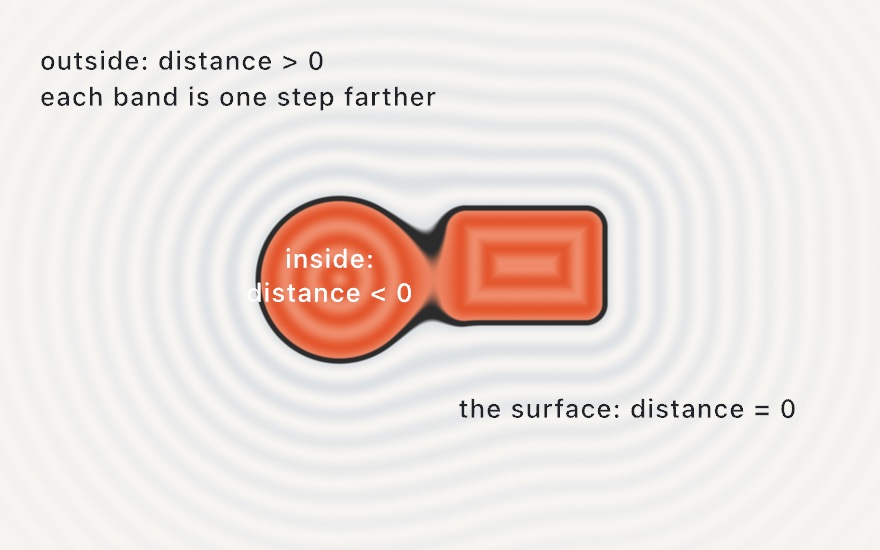
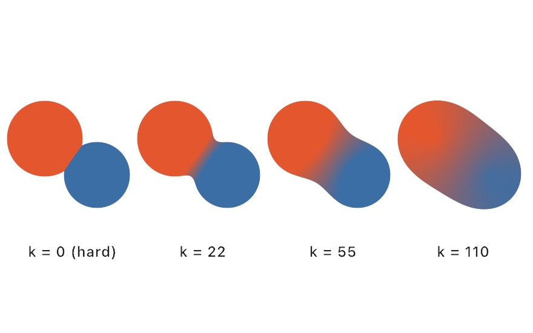
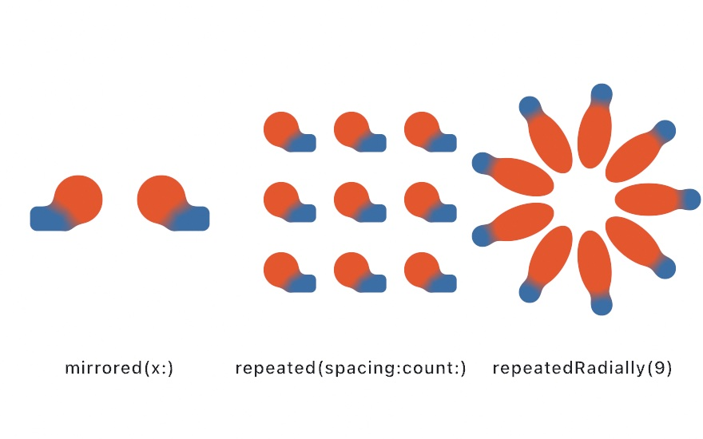
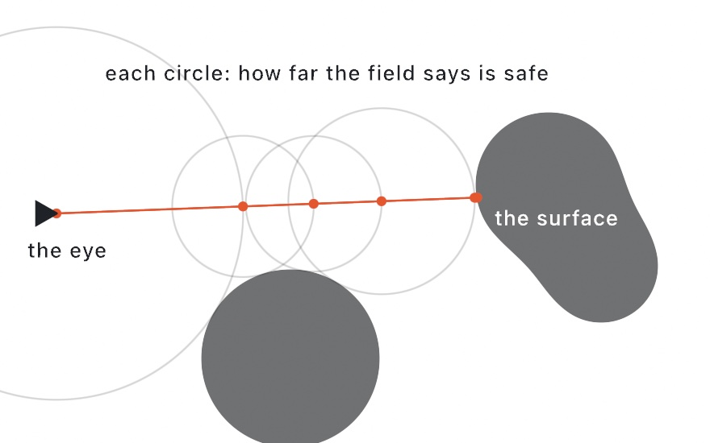
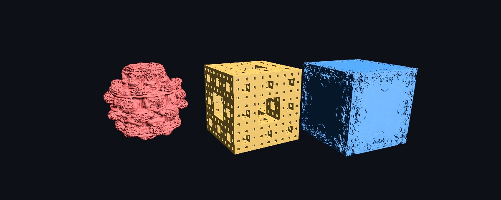

#### <sup>[Ollin](../../README.md) → [Documentation](../README.md) → [Drawing](./README.md) → `SDF combinators`</sup>

---

## SDF combinators

Compose signed-distance *fields* so shapes **merge** instead of just stacking. A smooth
union melts two shapes into one blob (their colors blending across the seam), subtraction
carves one out of another, intersection keeps only the overlap, and morph blends between
two shapes. Domain operators tile or mirror the whole field. The result fills as a single
region, and a stroke traces the *merged* outline.

This is the geometry counterpart of the image-space [layered effects](../Drawing/Effects.md): there
you composite finished *layers*; here you combine the *distance fields* before they are
ever drawn, so the shapes fuse rather than overlap.

You build a field with the `SDF` value type and draw it with `drawSDF`. The value type is
the core; the [scoped block form](#scoped-blocks) is sugar over it. A solid `fill` colors the
leaves individually (melting at smooth seams); a linear or radial `fill`/`stroke` paints the
*whole* merged region/outline as one continuous surface instead (see [Gradient paint](#gradient-paint)).

<picture>
  <source media="(prefers-color-scheme: dark)" srcset="../../Guide/Images/26-SculptingWithFields/FieldMap-dark.jpg">
  
</picture>

### Contents

- [Quick start](#quick-start)
- [Building a field](#building)
- [Combining](#combining)
- [Modifiers: round and onion](#modifiers)
- [Placing and coloring](#placing)
- [Domain operators](#domain)
- [Scoped blocks](#scoped-blocks)
- [3D fields](#fields-3d)
- [Fractal leaves](#fractals)
- [Notes and limits](#notes)

<a name="quick-start"></a>

### Quick start

Two shapes melting together, the melt amount breathing:

```swift
override func draw() {
    background(.black)
    noStroke()
    let k = 20 + (sin(time) * 0.5 + 0.5) * 80   // how much they melt

    let blob = SDF.circle(radius: 150).colored(.init(hex: 0xff5470))
        .smoothUnion(
            SDF.rect(width: 260, height: 150, cornerRadius: 30)
                .colored(.init(hex: 0x3a86ff))
                .at(120, 0),
            k: k)
        .at(width * 0.5, height * 0.5)

    drawSDF(blob)
}
```

`SDF.circle(...)` and friends are field *values*; `.colored`, `.at`, and `.smoothUnion`
return new fields; `drawSDF` rasterizes the whole composition in one pass.

<a name="building"></a>

### Building a field

The leaf constructors are the common centered region shapes. Each is centered on the field
origin (move it with [`.at`](#placing)).

| Constructor | Shape |
| --- | --- |
| `SDF.circle(radius:)` | a circle |
| `SDF.ellipse(rx:ry:)` | an axis-aligned ellipse |
| `SDF.rect(width:height:cornerRadius:)` | a rectangle, optionally rounded |
| `SDF.square(_:cornerRadius:)` | a square |
| `SDF.ngon(radius:sides:)` | a regular polygon, one vertex up |
| `SDF.star(outerRadius:innerRadius:points:)` | a star |
| `SDF.rhombus(width:height:cornerRadius:)` | a diamond |
| `SDF.ring(innerRadius:outerRadius:)` | a filled ring |
| `SDF.triangle(radius:)` | an equilateral triangle, point up |

The [scoped block form](#scoped-blocks) reaches *every* fillable shape Ollin can draw
(`drawNgon`, `drawHeart`, `drawTrapezoid`, and the rest), so use a block when you want a
shape the value type does not name directly.

<a name="combining"></a>

### Combining

Each combinator takes another field and returns the combined one, so they chain. The smooth
variants take a smoothing radius `k` (in canvas points) that sets how wide the blend is, and
they **blend the two operands' colors** across that blend so a melt reads as one object.

<picture>
  <source media="(prefers-color-scheme: dark)" srcset="../../Guide/Images/26-SculptingWithFields/MeltStrip-dark.jpg">
  
</picture>

```swift
let a = SDF.circle(radius: 100).colored(.red)
let b = SDF.circle(radius: 100).colored(.blue).at(120, 0)

a.union(b)              // hard union: the area covered by either
a.smoothUnion(b, k: 40) // melt them together (colors blend at the seam)
a.subtract(b)           // a with b carved out
a.smoothSubtract(b, k: 40)
a.intersect(b)          // only where both overlap (a lens)
a.smoothIntersect(b, k: 40)
a.morph(b, amount: 0.5) // blend the shape itself between a and b (0 = a, 1 = b)
```

`subtract` and `smoothSubtract` keep the first field's color (it is the body that remains).
`morph` is a *field* blend, not a crossfade: at `amount: 0.5` the boundary is genuinely
halfway between the two shapes.

<picture>
  <source media="(prefers-color-scheme: dark)" srcset="../../Guide/Images/26-SculptingWithFields/Verbs-dark.jpg">
  
</picture>

Beside the smooth (melted) family sits the **joint** family, which shapes the seam like
machined work instead of melting it: `chamfer*` cuts a crisp 45° bevel of the given size
along the seam, `stairs*` carves it into a staircase of `steps` steps. Each comes in the
same three flavors, and colors stay a crisp pick of the nearer side (no blend), which is
what makes the joint read as two parts fitted together.

```swift
a.chamferUnion(b, radius: 20)             // joined with a 45° bevel along the seam
a.chamferSubtract(b, radius: 20)          // b carved out, the cut's rim beveled
a.chamferIntersect(b, radius: 20)         // the overlap, its edge beveled
a.stairsUnion(b, radius: 24, steps: 4)    // joined through a 4-step staircase
a.stairsSubtract(b, radius: 24, steps: 4) // the cut's rim stepped
a.stairsIntersect(b, radius: 24, steps: 4)
```

The joint family keeps going, with the same three flavors where a boolean makes sense:
`columns*` joins, cuts, or intersects through a row of `count` circular ribs (a fluted,
reeded seam), and four **detailing** ops shape one body along another's outline rather
than combining them: `engrave` scores a v-notch of the given `depth`, `groove` cuts a
flat-bottomed channel (`depth` deep, reaching `width` to each side of the other's
outline), `tongue` raises the mating ridge (the carpentry joint), and `pipe` keeps only
a round bead running along the two outlines' crossing (not a boolean; both bodies
vanish).

```swift
a.columnsUnion(b, radius: 30, count: 4)     // joined through a row of 4 ribs
a.columnsSubtract(b, radius: 30, count: 4)  // the cut's rim fluted
a.columnsIntersect(b, radius: 30, count: 4)
a.engrave(b, depth: 10)                     // a v-notch scored along b's outline
a.groove(b, depth: 12, width: 10)           // a flat channel cut along it
a.tongue(b, height: 12, width: 10)          // the ridge that mates into that groove
a.pipe(b, radius: 16)                       // only the bead along the crossing remains
```

One working note: the joint ops shape the seam exactly where the two surfaces cross
frankly (near a right angle). Where surfaces graze or run near-parallel within the joint
radius, the pattern can echo faintly past the seam; keep the radius smaller than the gap
between any parallel faces. (`Examples/Shapes/CombinatorsJoinery` and
`Examples/Shapes/CombinatorsDetailing` are contact sheets of the whole family.)

<a name="modifiers"></a>

### Modifiers: round and onion

```swift
field.rounded(12)   // grow the field outward by 12 with rounded corners
field.onion(8)      // hollow it into an 8-wide shell straddling its outline
```

`onion` turns any field into a band, the same trick `drawRing` uses, so you can hollow out a
melted blob or a morphed star.

<a name="placing"></a>

### Placing and coloring

```swift
field.at(540, 540)   // move the field's origin to a point
field.at(somePoint)        // ... given a Vector2
field.rotated(.pi / 6)     // rotate about the origin
field.scaled(1.5)          // uniformly scale about the origin
field.colored(.orange)     // paint the unpainted leaves this color
```

Order matters, because every transform applies to whatever it wraps. `circle.at(p).scaled(2)`
scales the moved circle (so it also moves twice as far from the origin); `circle.scaled(2).at(p)`
scales in place, then moves. `colored` fills only leaves that have no color yet, so set a
leaf's own color before combining for a two-color melt, and use `colored` on the whole field
as a fallback. A leaf with no color, and no enclosing `colored`, takes the current `fill`.

<a name="gradient-paint"></a>

**Gradient paint.** Solid leaf colors are one way; the other is a single gradient over the
*whole* merged region. Set a linear or radial `fill` (the same `Gradient` any 2D shape uses) and
the ramp paints the field by position, flowing unbroken across a smooth-union seam, where the
leaves' own colors would instead meet and melt:

```swift
fill(.linear(from: Vector2(-160, -140), to: Vector2(200, 160), warmRamp))
drawSDF(SDF.circle(radius: 120).smoothUnion(SDF.rect(width: 210, height: 120).at(135, 0), k: 60))
```

A gradient `stroke` traces the merged outline the same way. The gradient is sampled in the
field's own coordinates (so it turns with `rotated`/`at`), and a gradient fill bypasses the
per-leaf `.colored` colors. **Along-path** gradients aren't supported on a merged field (there's
no single path to run along); that paint falls back to no gradient. See
`Examples/Shapes/CombinatorsGradient`. (The 3D fields paint a gradient too, but in screen space;
see [3D fields](#fields-3d).)

**Per-axis sizing.** `scaled(_:)` scales uniformly. For per-axis sizing there are two tools, and
the difference matters:

```swift
field.stretched(x: 80)         // elongate along x by inserting straight space (circle -> stadium)
field.scaled(x: 1.5, y: 0.6)   // non-uniform scale (circle -> ellipse)
```

`stretched` (an elongation: it splits the shape and inserts straight space, so a circle becomes a
stadium and a sphere a capsule) **stays an exact distance field**, so smooth blends, rounding, and
onion shells keep their even width. `scaled(x:y:)` is a true non-uniform scale, but a non-uniform
scale isn't a valid distance field, so it's a conservative *bound*: the outline is right, yet the
smoothing distorts under strong anisotropy (fine up to ~2-3×). **Prefer `stretched` for per-axis
sizing**; reach for `scaled(x:y:)` only when you actually want the squashed-ellipse look. Both have
3D forms (`stretched(x:y:z:)`, `scaled(x:y:z:)`).

<a name="domain"></a>

### Domain operators

Domain operators transform the *space* the field lives in, so one shape becomes many.

```swift
field.mirrored(x: true)                       // reflect across the y axis (kaleidoscope)
field.mirrored(x: true, y: true)              // reflect across both axes
field.repeated(spacing: Vector2(160, 0), count: 3)   // tile: 3 copies each side, on a 160 grid
field.at(120, 0).repeatedRadially(count: 8)   // fold a wedge into a ring of 8 (a mandala)
```

`repeated`'s `count` is the number of copies to each side of the origin on each axis; a
`spacing` component of `0` leaves that axis untiled. `repeatedRadially`'s `count` is the
number of copies evenly spaced around the origin; offset the wedge from the origin first
(`.at`) so the copies fan out around it. Because a domain operator wraps a whole field, you
can tile a melted cluster, mirror a carved shape, or ring a wedge into a mandala.

<picture>
  <source media="(prefers-color-scheme: dark)" srcset="../../Guide/Images/26-SculptingWithFields/DomainFold-dark.jpg">
  
</picture>

<a name="scoped-blocks"></a>

### Scoped blocks

The block form is sugar over the value type: bare draw calls inside a block are captured and
merged under the block's operator, then drawn (with the current `fill`/`stroke`) when the
block closes. It reads like ordinary immediate-mode drawing, and reaches every fillable shape.

```swift
fill(.orange)
smoothUnion(k: 18) {
    drawCircle(0, 0, 120)
    drawRect(90, 0, 200, 80)
    drawNgon(-90, 0, 60, sides: 6)
}
```

The blocks mirror the combinators and domain operators: `union { }`, `smoothUnion(k:) { }`,
`subtract { }`, `smoothSubtract(k:) { }`, `intersect { }`, `smoothIntersect(k:) { }`, the
joint family (`chamferUnion(radius:) { }`, `chamferSubtract(radius:) { }`,
`chamferIntersect(radius:) { }`, `stairsUnion(radius:steps:) { }`,
`stairsSubtract(radius:steps:) { }`, `stairsIntersect(radius:steps:) { }`,
`columnsUnion(radius:count:) { }`, `columnsSubtract(radius:count:) { }`,
`columnsIntersect(radius:count:) { }`),
`mirrored(x:y:) { }`, `repeated(spacing:count:) { }`, `repeatedRadially(count:) { }`. Like
`morph`, the detailing ops (`engrave` / `groove` / `tongue` / `pipe`) are value-type-only:
they read as "detail this body along that surface", so the two operands aren't
interchangeable the way a block's captured children are. The blocks nest, so a domain
block can wrap a combine block:

```swift
fill(.indigo)
repeated(spacing: Vector2(150, 0), count: 2) {
    smoothUnion(k: 12) {
        drawRect(-30, -30, 60, 60, cornerRadius: 14)
        drawCircle(34, 0, 22)
    }
}
```

Each captured call's own `fill` becomes that leaf's color, so colors melt at a smooth seam
exactly as with `.colored`. Set up position with the [transform stack](../Drawing/Drawing.md)
(`translate`/`rotate`) around the block; non-region draws inside a block (lines, text,
images) are ignored.

**The sculpt block.** Where the blocks above fix one operator for everything inside,
`sculpt { }` makes the operator and melt amount *mutable state*, so a form reads top to
bottom like working clay: shapes `add()` on (the opening mode) or `carve()` away, melting
over the current `blend(_:)` radius (0, the opening value, is a hard seam). The first
shape is the base; each later one folds under the state active when it was drawn, and a
nested block (a `mirrored { }` pair, a sub-assembly) lands as one piece under the state
at its close. Flipping one verb turns a bump into a dent, which is what makes this the
natural block for [live coding](../Tools/LiveCoding.md):

```swift
sculpt {
    blend(0.3)                 // melt amount for what follows
    fill(.init(hex: 0xd96f4e))
    drawSphere(radius: 1.0)                                        // the body
    withState { translate(0, 0.95, 0)
                drawTorus(radius: 0.5, tube: 0.16) }               // a lip melts on
    carve()                    // now shapes cut away
    withState { translate(0, 1.1, 0); drawSphere(radius: 0.52) }   // the hollow
    add(); blend(0.05)         // back to adding, nearly hard
    withState { translate(0, 0.35, 1.05); rotateX(.pi / 2)
                drawTorus(radius: 0.34, tube: 0.09) }              // a crisp handle
}
```

The verbs only apply inside a `sculpt { }` block (elsewhere they log once and do
nothing), and each block keeps its own state, so nested sculpts don't leak into each
other. `Examples/3D/Raymarching/RaymarchedClay` throws a small vessel this way; the
same block sculpts 2D region shapes.

<a name="fields-3d"></a>

### 3D fields

The same idea lifts into space: `SDF3D` builds a 3D field and `drawSDF3D` sphere-traces it as
one merged surface inside an active [3D camera](../3D/3D.md), lit by the scene's lights and
depth-composited with the rasterized meshes (each occludes the other where they meet). It is
the 3D sibling of `SDF` / `drawSDF`, with the same combine, modifier, and transform vocabulary.

<picture>
  <source media="(prefers-color-scheme: dark)" srcset="../../Guide/Images/26-SculptingWithFields/MarchRay-dark.jpg">
  
</picture>

```swift
override func draw() {
    camera(.orbiting(target: .zero, radius: 5.5, azimuth: time * 0.35,
                     elevation: 0.4, fieldOfView: .pi / 4))
    directionalLight(.white, direction: Vector3(-0.6, 0.7, 0.5))
    material(.jade)

    let blob = SDF3D.sphere(radius: 1).colored(.init(hex: 0x39d0ff))
        .smoothUnion(SDF3D.sphere(radius: 0.8)
            .at(cos(time) * 1.2, 0, sin(time) * 1.2)
            .colored(.init(hex: 0xff4f97)), k: 0.6)
        .smoothSubtract(SDF3D.sphere(radius: 0.7).at(0, 1, 0), k: 0.2)

    drawSDF3D(blob)
}
```

The leaf constructors are the common centered solids:

| Constructor | Solid |
| --- | --- |
| `SDF3D.sphere(radius:)` | a sphere |
| `SDF3D.box(width:height:depth:)` / `SDF3D.box(size:)` | a box / cube |
| `SDF3D.roundBox(width:height:depth:radius:)` / `SDF3D.roundBox(size:radius:)` | a box / cube with filleted edges |
| `SDF3D.torus(radius:tube:)` | a torus, lying in the xz-plane |
| `SDF3D.capsule(radius:height:)` | a capsule along the y-axis |
| `SDF3D.cylinder(radius:height:)` | a cylinder along the y-axis |
| `SDF3D.cone(radius:height:)` / `SDF3D.cone(bottomRadius:topRadius:height:)` | a cone / frustum along the y-axis |
| `SDF3D.octahedron(radius:)` | an octahedron |
| `SDF3D.ellipsoid(rx:ry:rz:)` | an ellipsoid |
| `SDF3D.line(from:to:radius:)` | a capsule stroke between two free points (the armature primitive) |
| `SDF3D.hexPrism(radius:height:)` | a hexagonal prism along the y-axis (`radius` to the flat sides) |
| `SDF3D.pyramid(base:height:)` | a square pyramid |
| `SDF3D.cappedTorus(radius:tube:angle:)` | an open torus arc in the xz-plane (a horseshoe; `angle` to each side of +z) |
| `SDF3D.link(height:radius:tube:)` | a chain link along the y-axis (a torus stretched straight in the middle) |
| `SDF3D.plane(normal:offset:)` | an infinite plane (default a horizontal floor; `offset` is its height) |

`line` is the sculptor's stroke: unlike the centered solids it takes two arbitrary endpoints,
so a few chained lines sketch limbs, branches, or scaffolding for the smooth unions to flesh
out. `link` stacks into chains with alternating `rotatedY(.pi / 2)`
(see `Examples/3D/Raymarching/RaymarchedJoinery`).

`plane` is the one **unbounded** leaf: it has no finite extent, so its field marches to the
camera's far plane rather than a bounding box (a ray that sees only open sky steps quickly out
to the horizon). It's value-type-only: the scoped block form can't capture it, since a plane
has no mesh primitive. Merge it with the scene's shapes as one field and call `castShadows()`,
and the shapes drop soft self-shadows onto it: a true infinite floor (see
`Examples/3D/Raymarching/RaymarchedPlane`).

<a name="fractals"></a>

#### Fractal leaves

Three classic fractals are leaves too. None has a distance anyone can write down. Each one
*estimates* it by iterating the fractal's own map from the query point and reading how fast
the orbit escapes, and the same sphere tracer draws the result:

| Constructor | Solid |
| --- | --- |
| `SDF3D.mandelbulb(power:iterations:radius:)` | the Mandelbulb: the triplex power-`power` map (8 is the classic, seven lobes around its equator), fitted inside `radius` |
| `SDF3D.mengerSponge(iterations:size:)` | the Menger sponge: a cube `size` on a side with the middle third of every face bored through, `iterations` times over |
| `SDF3D.mandelbox(scale:iterations:size:)` | the Mandelbox: a box fold, a sphere fold, and a scale, iterated; `scale` is its own parameter (-1.5 is the classic), and the set is fitted into a cube `size` on a side |

<picture>
  
</picture>

```swift
// The breathing bulb: a fractional power is a different picture, so sweep it.
drawSDF3D(SDF3D.mandelbulb(power: 8 + 4 * sin(time * 0.3), iterations: 8, radius: 1.2))
```

Three things to know. `iterations` is detail against cost: every march step runs the loop,
so raise it for a close-up and lower it for a busy scene (the sponge's holes drop below a
pixel around level 5 at an ordinary framing). A fractional `power` is a different bulb, and
sweeping it slowly is the classic breathing animation. And the finest detail a picture shows
is set by the march itself, not by the fractal, so to see deeper, make the leaf bigger and
raise `iterations` rather than moving the camera closer. Each leaf carries its own bound
(the Mandelbox is clipped to its cube, so it stays finite whatever its scale), and the
estimates lean on the tracer's step fudge the way a smooth union does. They are
value-type-only: no mesh primitive stands in for them in the scoped block form. The example
is `Examples/3D/Raymarching/RaymarchedFractals`, a menu over the three with each one's own
dial.

The combinators (`.union` / `.smoothUnion(_:k:)` / `.subtract` / `.smoothSubtract(_:k:)` /
`.intersect` / `.smoothIntersect(_:k:)` / `.morph(_:amount:)`, plus the [joint
family](#combining): the chamfer, stairs, and columns trios plus the
`engrave` / `groove` / `tongue` / `pipe` detailing ops), the modifiers
(`.rounded` / `.onion`), the domain operators (`.mirrored(x:y:z:)`,
`.repeated(spacing:count:)`, and `.repeatedRadially(count:around:)`), and `.colored` all
behave exactly as in 2D, the smooth ops blending the leaf colors across the seam and the
joint ops keeping a crisp machined pick per side. Positioning is in three dimensions:
`.at(x:y:z:)` / `.at(_ p: Vector3)`, `.rotated(_:axis:)` (plus `.rotatedX` / `.rotatedY` /
`.rotatedZ`), and `.scaled(_:)` (uniform). The domain operators rewrite the query point as
point-space scopes, so the whole mirrored / tiled / radially repeated field is still one
sphere-traced surface (no per-copy draw cost), and method-chain order stays exact:
`a.at(p).repeated(…)` tiles the moved field, `a.repeated(…).at(p)` shifts the tiling.
`repeated` is finite (`count` copies to each side), so the field stays bounded;
`repeatedRadially` folds a wedge into a ring of `count` copies around `axis` (default the
y-axis), so offset the wedge off the axis first (`.at(r, 0)`) for the copies to fan out.

Three dimensions also add the **sculpting distortions**, each a point-space scope like the
domain operators (the whole distorted form stays one traced surface):

```swift
SDF3D.box(width: 0.8, height: 2.4, depth: 0.8)
    .twisted(1.2)      // the cross-section screws around y: radians per unit of height
SDF3D.box(width: 2.4, height: 0.5, depth: 0.7)
    .bent(0.6)         // the form curls about z: radians per unit along x
SDF3D.sphere(radius: 1)
    .displaced(amplitude: 0.1, frequency: 6)   // sine-product surface ripples
SDF3D.sphere(radius: 1)
    .roughened(amplitude: 0.15, frequency: 3)  // signed value-noise relief (the rock look)
```

Twist runs around the y-axis and bend about z (rotate the field first for another axis).
All four are distance *bounds* rather than exact fields, and the march automatically
compensates (a rescale sized to the distortion's strength), so strong settings trade some
tracing speed for a surface that never breaks up. `Examples/3D/Raymarching/RaymarchedDistort`
shows all four.

The **scoped block form** works in 3D too, and it's the same `smoothUnion(k:) { }` (and the
other combine blocks) as 2D. Inside a block with a camera set, the bare mesh primitives
(`drawSphere` / `drawBox` / `drawCapsule` / `drawCone` / `drawTorus` / `drawCylinder` /
`drawRoundedBox` / `drawOctahedron`) are captured and merged as raymarched fields rather than
rasterized as separate solids. The transform stack works inside the block, and each call's own
`fill` becomes that lobe's color:

```swift
material(.jade)
smoothUnion(k: 0.35) {
    fill(.init(hex: 0x3ad6c5))
    withState { translate(0, -0.6, 0); drawSphere(radius: 0.95) }   // body
    withState { translate(0, 0.7, 0);  drawSphere(radius: 0.62) }   // head
    fill(.init(hex: 0xff5d73))
    withState { translate(0, 1.5, 0); drawCone(radius: 0.45, height: 0.7) }  // hat
}
```

The block form's domain blocks work in 3D too (`mirrored(x:y:z:) { … }`,
`repeated(spacing:count:) { … }`, the `Vector3` spacing for 3D tiling), wrapping a combine
block to mirror or tile a whole built cell. A primitive that has no analytic field
(`drawIcosphere`, `drawTorusKnot`, a custom `Mesh`, …) inside a block is ignored with a
one-time note.

**Self-shadowing and cast shadows.** With [`castShadows()`](../3D/3D.md), a merged field drops soft
shadows onto itself: a penumbra march toward the casting light, contact-hardening (sharper
where shapes meet, softer as the shadow falls away). It's the same opt-in as mesh shadows, so a
field without `castShadows()` shades unshadowed (and stays byte-identical). A field also **casts
onto rasterized meshes** under every light: a directional or spot caster has the field render into
the 2D shadow map the meshes sample (a mesh floor catches a floating field's shadow), and a point
or ray-traced caster (which has no such map) has the lit mesh fragments march the field inline
toward the light instead (see `Examples/3D/Raymarching/RaymarchedCastShadow`, whose key swaps the
caster kind). A field also **receives a mesh's shadow** in return, under every
light type: it samples whichever shadow the caster wrote (the 2D map for a directional or spot light,
the omnidirectional cube or the traced mesh structure for a point light), so a floating mesh drops
its shadow onto the field just as onto another mesh (see `Examples/3D/Raymarching/RaymarchedReceiveShadow`,
whose key swaps the caster kind).

**Materials and environment light.** A field shades through the same material and lighting
model as the meshes: the active [`material(_:)`](../3D/3D.md#materials) applies per
`drawSDF3D` call (a jade melt takes its sheen and subsurface glow, a `.metal(roughness:)`
field is a true metal), and under an [`environment(_:)`](../3D/3D.md#environment-lighting)
the field gathers the same image-based ambient a mesh does (a physically based field
reflects the HDRI, the other materials take its diffuse irradiance), so a field and a mesh
sharing a material read identically in one scene (see `Examples/3D/Raymarching/RaymarchedEnvironment`).

The merged surface's **silhouette is anti-aliased** analytically (a sphere-traced fullscreen
pass gets no MSAA at its hit/miss edge): the march measures how closely a ray that misses the
surface grazed it, relative to the pixel's own footprint, and the edge fades by that coverage.
It's automatic, so any field's outline stays smooth without supersampling.

**Gradient paint.** A solid `fill` colors the leaves individually (melting at smooth seams); a
gradient `fill` paints the *whole* merged surface instead, sampled by each hit's projected
screen position. It's the same canvas-space `Gradient` every 2D shape uses
(`fill(.linear(from:to:_:))` / `.radial(center:radius:_:)`), so it stays fixed to the frame as
the field turns beneath it (see `Examples/3D/Raymarching/RaymarchedGradient`). A per-leaf `.colored` is
bypassed while a gradient fill is active.

The 3D path is opt-in like the rest of [3D mode](../3D/3D.md), so a 2D sketch never pays for it.
Coloring is solid per leaf or a screen-space gradient (above), and scaling is uniform only.

**Frame rate: `raymarchQuality(_:)`.** A field is a fullscreen sphere-tracer, so its cost is
bound to pixel count: the more of the window it covers, the more it costs. The
`raymarchQuality` dial trades resolution for frame rate on the **live preview**:

```swift
raymarchQuality(.performance)   // quarter-resolution: the heaviest fields
raymarchQuality(.default)       // half-resolution (the default, keeps a busy field smooth)
raymarchQuality(.detail)        // full resolution
```

`.default` (a half-resolution budget) is already in effect with no code, so most fields stay
smooth out of the box; reach for `.performance` only on the heaviest scenes (an infinite plane,
dense self-shadows). The budget is **coverage-adaptive**: it applies in full when the field
fills the window, and a field covering less of the screen (a dollied-out camera, a small form
in a big scene) is traced denser, up to full resolution, for the same marched-pixel cost. So
zooming out keeps the surface crisp instead of dissolving it into upsampled blur, and the dial
only ever softens a field while it's large on screen (where the softness is hardest to see). A
depth-preserving upsample composites the field back to full size, and meshes still occlude it
correctly. With the automatic `.default`, `--export` and headless renders sphere-trace at full
resolution (see [Export ▸ Render quality](../Output/Export.md#render-quality)), so exported art is never
downscaled. For an exact budget instead of the tiers, `raymarchResolution(_:)` takes a
custom fraction: `raymarchResolution(0.75)` traces at 75% at full coverage (the tiers are
1.0 / 0.5 / 0.25). For an exact, machine-independent *march budget* use `raymarchSteps(_:)`
(always full resolution). `Scripts/benchmark.sh raymarch` measures the per-GPU cost.

<a name="notes"></a>

### Notes and limits

- **Solid or linear/radial gradient.** A field fills with solid leaf colors, or a single linear/
  radial gradient over the whole merged region/outline (above). Along-path gradients have no
  single path on a merged field, so they aren't supported there.
- **Closed regions only.** Combinators merge fillable shapes. Open marks (lines, open arcs,
  Bézier strokes) have no interior to merge, so they are not combinator leaves.
- **Per-axis sizing** is `stretched` (exact) or `scaled(x:y[:z])` (a bound), as above; plain
  `scaled(_:)` is uniform.
- **2D and 3D.** `SDF` / `drawSDF` are the 2D fields here; `SDF3D` / `drawSDF3D` sphere-trace
  the same kind of field in space (see [3D fields](#fields-3d)). The 3D form is opt-in and
  shares the same per-axis tools, and its gradient paint is screen-space rather than field-space.
- A composition is bounded (a generous node and nesting budget); a field past it is skipped
  with a console note rather than mis-drawn.

---

See also [`Drawing`](../Drawing/Drawing.md) for the immediate-mode shapes and the transform stack,
[`Geometry`](../Drawing/Geometry.md) for the vector `Shape` booleans (which combine *filled outlines*,
the polygonal counterpart to these field operators), [`Color`](../Drawing/Color.md) for the color
types the leaves carry, and [`3D`](../3D/3D.md) for the camera and lights the 3D fields draw
through. The examples are `Examples/Shapes/Combinators` (2D),
`Examples/Shapes/CombinatorsGradient` (2D gradient fill + stroke on a merged field),
`Examples/Shapes/CombinatorsStretch` (2D per-axis stretch + non-uniform scale),
`Examples/3D/Raymarching/RaymarchedSDF`
(merged metaball, depth-composited with a mesh), `Examples/3D/Raymarching/RaymarchedShapes` (the 3D
primitive catalog), `Examples/3D/Raymarching/RaymarchedSculpt` (the scoped block form),
`Examples/3D/Raymarching/RaymarchedDomain` (the mirror and repeat domain operators),
`Examples/3D/Raymarching/RaymarchedRadial` (the radial/polar repeat operator),
`Examples/3D/Raymarching/RaymarchedFractals` (the fractal leaves: a Mandelbulb, a Menger sponge, and a Mandelbox),
`Examples/3D/Raymarching/RaymarchedPlane` (the infinite plane grounding shapes with self-shadows),
`Examples/3D/Raymarching/RaymarchedShadow` (self-shadowing under `castShadows()`),
`Examples/3D/Raymarching/RaymarchedCastShadow` (a field casting its shadow onto a rasterized mesh, under a directional or point caster),
`Examples/3D/Raymarching/RaymarchedReceiveShadow` (a field receiving a mesh's shadow, under a directional or point caster),
`Examples/3D/Raymarching/RaymarchedStretch` (per-axis stretch and non-uniform scale),
`Examples/3D/Raymarching/RaymarchedGradient` (a screen-space gradient painting the merged surface), and
`Examples/3D/Raymarching/RaymarchedEnvironment` (fields lit by an environment beside mesh parity spheres).
