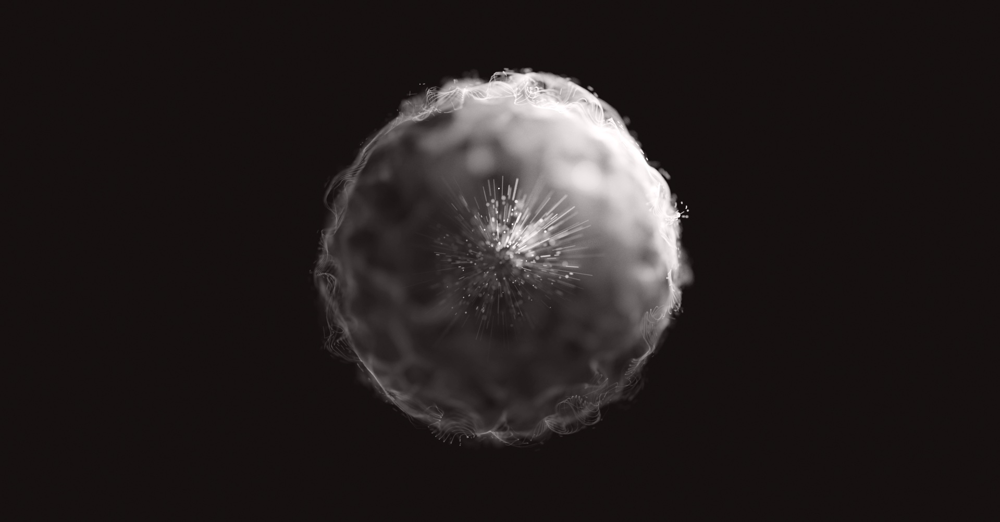

#### <sup>[Ollin](../../README.md) → [Documentation](../README.md) → [Drawing](./README.md) → `Depth of field from light`</sup>

---

## Depth of field from light

A blurred photograph is not a sharp picture with a blur on top. It is countless rays of light that each landed somewhere slightly different, because they passed through the lens out of focus. Ollin can render that literally. Draw a scene as millions of faint points. Push every point to a random spot in a ball that grows with its distance from the plane of focus. Add them all up as light. Lines on the focal plane stay crisp, the rest dissolves into bokeh, and there is no blur filter anywhere. The blur emerges from where the light fell.

`LineSpray` is that technique as one call. Underneath it are four smaller features you can use on their own. The `.light` particle style, the `Accumulator`, the `Bokeh` lens value, and the `develop` filter that prints the result.



### Contents

- [LineSpray](#linespray) - lines of light through a lens, converging over frames
- [Bokeh](#bokeh) - the lens
- [Accumulator](#accumulator) - the running mean underneath
- [The light particle style](#light) - a radiometric deposit for additive sums
- [develop](#develop) - printing accumulated light
- [Building your own](#own) - the same pipeline from the compute primitives
- [Notes](#notes)

<a id="linespray"></a>
### LineSpray

Give it an array of `SprayLine`s once, in `setup()`, and draw it every frame with a camera set:

```swift
var spray: LineSpray!

override func setup() {
    var lines: [SprayLine] = []
    for i in 0 ..< 400 {
        let a = Vector3(random(-5, 5), random(-5, 5), random(-5, 5))
        let b = a + Vector3(random(-1, 1), random(-1, 1), random(-1, 1))
        lines.append(SprayLine(from: a, to: b, color: .white, intensity: 0.5))
    }
    spray = makeLineSpray(lines, sampling: .byLength(pointsPerPass: 50_000), passesPerFrame: 5)
    spray.bokeh = Bokeh(focalDistance: 20, strength: 0.08, minSize: 0.02)
}

override func draw() {
    background(.black)
    camera(.orbiting(target: .zero, radius: 20, azimuth: 0.4, elevation: 0.3, fieldOfView: .pi / 8))
    drawLineSpray(spray)
    drawImage(spray.developed(exposure: 400, ground: Color(hex: 0x151010)).image, 0, 0)
}
```

Each frame, `drawLineSpray` scatters `passesPerFrame` passes of points along the lines on the GPU and adds them into a running mean. Every point is a fresh spot on its line, pushed to a fresh spot in the bokeh ball around it and projected through the sketch's `Camera3D`. The mean converges as passes pile up, so the longer the sketch runs the smoother the bokeh gets. Moving the camera, the lens, the lines, or the point size restarts the average on its own, since the samples drawn before no longer describe the picture. `spray.passes` says how far it has converged.

A `SprayLine` is a segment with a tone at each end, an intensity, and a weight:

```swift
SprayLine(from: a, to: b, color: .orange, endColor: .white, intensity: 2, weight: 1)
```

- `color` and `endColor` are sRGB tones, linearized before they become light; `intensity` (and `endIntensity`) is the light emitted per pass, in linear units, so a line can shine well past white.
- A line's light per pass is its color times its intensity however many points draw it: every point carries its share. That is what keeps the exposure honest under either sampling.
- `sampling` picks how a pass shares its points out. `.byLength(pointsPerPass:)` gives every line points in proportion to its length (times `weight`), at least one, so a long line is drawn as densely as a short one. `.perLine(n)` gives every line the same count.
- `pointSize` is the diameter each sample's light spreads over, in canvas points. The total light is the same at any size, so it softens the grain without changing the exposure. The default of 1 is a one-pixel point, and the cheapest to draw.
- `spray.image` is the running mean as an `Image`, linear light, if you would rather print it yourself; `spray.setLines(_:)` swaps the scene and restarts.

The example `Rendering/LineSpray` is a whole scene through it, with the camera, the lens, and the print as parameters.

<a id="bokeh"></a>
### Bokeh

The lens, as a value:

```swift
Bokeh(focalDistance: 49, strength: 0.095, minSize: 0.015, power: 1, attenuation: 0)
```

- `focalDistance` is the distance from the camera to the plane of focus, along the view axis, in world units.
- `strength` is the ball's radius per unit of defocus: the aperture, in effect. Every sample scatters inside a ball of radius `strength × defocus^power`, where `defocus` is its distance from the focal plane. 0 is a pinhole.
- `minSize` is the smallest ball, so a line exactly in focus still has a body rather than a hairline.
- `power` is the exponent the defocus takes first. 1 grows the blur in proportion to distance; 1.5 keeps the region near focus crisper and lets far things dissolve faster.
- `attenuation` fades light away from the focal plane: each sample is multiplied by `exp(-attenuation × defocus)`.

<a id="accumulator"></a>
### Accumulator

A layer that keeps the running **mean** of everything drawn into it, frame after frame. It is what makes a picture built from faint samples converge rather than brighten without end, and it is documented with the rest of [accumulation](./Accumulation.md#accumulator). `LineSpray` owns one (`spray.accumulator`); the [DepthOfField](../../Examples/Rendering/DepthOfField/Sketch.swift) example drives one directly.

<a id="light"></a>
### The light particle style

`drawParticles(_:style: .light)` draws a particle buffer as light rather than ink:

```swift
withAccumulator(light, passes: 4) {
    blendMode(.add)
    drawParticles(samples, style: .light)
}
```

- Coverage is the plain area ramp, so a particle deposits `color × alpha × area` wherever it lands: exactly linear in its size, and the same whether it falls on a pixel's center or its corner. The default `.marks` style remaps coverage to perceptual alpha, which is right for ink over a light ground and wrong for a sum of light, where it lifts a dot on a corner to more than twice the light of one on a center.
- `color` is taken as linear radiance, not an sRGB tone. Author a tone in the kernel through `srgbToLinear` if you want one.
- A particle at or under one pixel takes a cheap path: its quad is a single texel, so a million one-pixel points cost a million fragments rather than twenty-five million. The deposit is continuous across the one-pixel boundary, so a size animated through it never steps in brightness.
- To deposit a point's whole light into its pixel, put the radiance in `color` and set `alpha = 4 / (π × size²)`; the disc's area then cancels and the pixel receives the radiance itself.

<a id="develop"></a>
### develop

`Filter.develop(exposure:ground:)` prints a layer of accumulated light as a picture. The layer's linear values are scaled by `exposure` and rolled off through the Reinhard curve `x / (1 + x)`, so nothing clips. Then `ground` is added after the curve as a display color the curve never touches: the paper the light is printed on. The result is written as the display value itself rather than re-encoded, which is what gives a sandpainting its deep midtones. `Accumulator.developed(exposure:ground:)` and `LineSpray.developed(exposure:ground:)` are this filter over the mean.

```swift
drawImage(light.developed(exposure: 30, ground: Color(hex: 0x151010)).image, 0, 0)
```

<a id="own"></a>
### Building your own

`LineSpray` samples lines. The same pipeline runs from the compute primitives over any geometry a kernel can evaluate: a curve, a surface, a point cloud. Per frame:

1. Pack the camera with `cameraParams()` and append the lens after it. Dispatch a kernel with `compute(_:buffers:count:params:)` binding your scene buffer and a particle buffer. In the kernel, take a point into camera space with the packed `view`, scatter it with `ballSample(seed) × radius`, and project it with `ollin_project_eye(p.camera, eye, u.resolution)`.
2. Draw the particles with `drawParticles(buffer, style: .light)` inside `withAccumulator(acc, passes:)` under `blendMode(.add)`.
3. Print with `acc.developed(exposure:ground:)`.

The `Rendering/DepthOfField` example is exactly that, over nine closed curves, with each sample drawn as three particles scattered to slightly different radii so the bokeh grows chromatic fringes. The [compute reference](../Shaders/Compute.md#camera) has the kernel side.

<a id="notes"></a>
### Notes

- **A camera is required.** `drawLineSpray` projects through the active `Camera3D` and does nothing without one. The focal distance is measured along the view axis, so `focalDistance` equals the camera's `radius` when the target is what should be sharp.
- **Every pass counts.** The mean divides by the passes recorded, so a frame that draws several passes' worth of samples should say so (`passesPerFrame`, or `withAccumulator(_:passes:)`), or the picture reads too bright by that factor.
- **Exposure is a print setting.** It scales the mean after it converged, so turning it does not restart the average. The lens and the camera do.
- **Not on the web page.** An accumulator keeps state the recorded page cannot, so `--export-web` names it and stops; export the sketch as video instead.
- **Attribution.** The technique is Anders Hoff's ([inconvergent](https://inconvergent.net/2019/depth-of-field/)); [Blurry](https://github.com/Domenicobrz/Blurry) by Domenico Bruzzese is the reference implementation, read for approach and written independently. See `ATTRIBUTION.md`.

---

#### <sup>[Accumulation](./Accumulation.md) · [HDR & tone-mapping](./HDR.md) · [Compute & GPU particles](../Shaders/Compute.md) · [3D](../3D/3D.md)</sup>
