#### <sup>[Ollin](../../README.md) → [Documentation](../README.md) → [Drawing](./README.md) → `Drawing`</sup>

---

## Drawing

One of p5's strengths is that you can learn its whole drawing surface in an afternoon. Ollin keeps its surface small and the names familiar. Call these bare inside `draw()`, and they forward to the `Drawer`.

The point and rectangle types these calls take (`Vector2`, `Rectangle`) are documented in [Geometry](../Drawing/Geometry.md), and `Color` is in [Color](../Drawing/Color.md).

### Contents

- **Background and style:** [background](#background), [fill / noFill](#fill), [stroke / noStroke](#stroke), [strokeWeight](#strokeWeight), [strokeAlign](#strokeAlign), [strokeJoin](#strokeJoin), [strokeCap](#strokeCap), [strokeProfile](#strokeProfile), [hollow / solid](#hollow), [pointSize](#pointSize), [pointMarker](#pointMarker), [blendMode](#blendMode)
- **Basic shapes:** [drawPoint](#point), [drawLine](#line), [drawArrow](#arrow), [drawCircle](#circle), [drawEllipse](#ellipse), [drawRect](#rect), [drawOrientedBox](#orientedbox), [drawTriangle](#triangle), [drawArc](#arc), [drawBezier](#bezier)
- **More shapes:** [drawNgon](#ngon) (+ `drawPentagon`/`drawHexagon`/`drawHeptagon`/`drawOctagon`), [drawStar](#star), [drawRhombus](#rhombus), [drawVesica](#vesica), [drawOrientedVesica](#orientedvesica), [drawMoon](#moon), [drawCross](#cross), [drawRing](#ring), [drawTrapezoid](#trapezoid), [drawParallelogram](#parallelogram), [drawEgg](#egg), [drawHeart](#heart), [drawCutDisk](#cutdisk), [drawUnevenCapsule](#unevencapsule)
- **Novelty shapes:** [drawHorseshoe](#horseshoe), [drawParabola](#parabola), [drawRoundedX](#roundedx), [drawBlobbyCross](#blobbycross), [drawTunnel](#tunnel), [drawStairs](#stairs), [drawCoolS](#cools)
- **Paths & custom shapes:** [drawPolyline](#polyline), [drawPolygon](#polygon), [drawShape](#shape), [drawCurve](#curve)
- **Batches:** [drawCircles](#batches), [drawPoints](#batches), [drawRects](#batches)
- **Transforms and state:** [translate](#translate), [rotate](#rotate), [scale](#scale), [symmetry / noSymmetry](#symmetry), [withClip](#clip), [withViewBox](#viewbox), [viewControl](#viewcontrol), [withState](#isolated), [pushState / popState](#push)

### Background and style

<a name="background"></a>

#### background

```swift
background(_ color: Color)
```

Clear the frame to `color`. The renderer clears every frame, so call this first in `draw()`.

```swift
background(.white)
```

<a name="fill"></a>

#### fill / noFill

```swift
fill(_ color: Color)
fill(_ gradient: Gradient)
fill(_ paint: Paint)
noFill()
```

Set the fill for filled shapes, either a flat color or a gradient, or turn fill off.

```swift
fill(.red)
drawCircle(width / 2, height / 2, 80)   // solid red disc
fill(.radial(center: Vector2(width / 2, height / 2), radius: 80, [.white, .red]))
drawCircle(width / 2, height / 2, 80)   // shaded disc
noFill()                                // following shapes are outline-only
```

Gradients (linear, radial, or along-path) are covered in [Color → Gradient paint](../Drawing/Color.md#gradient).

<a name="stroke"></a>

#### stroke / noStroke

```swift
stroke(_ color: Color)
stroke(_ gradient: Gradient)
stroke(_ paint: Paint)
noStroke()
```

Set the outline paint, either a flat color or a gradient, or turn the outline off. An `.alongPath` gradient runs start → end along lines, curves, and stroked paths (see [Color → Gradient paint](../Drawing/Color.md#gradient)).

```swift
stroke(.black)
drawRect(40, 40, 120, 80)
stroke(.alongPath([.red, .blue]))
drawLine(Vector2(40, 160), Vector2(160, 160))   // red fading to blue
noStroke()                              // following shapes have no outline
```

<a name="strokeWeight"></a>

#### strokeWeight

```swift
strokeWeight(_ weight: Double)
```

Outline thickness in points.

```swift
stroke(.black)
strokeWeight(3)
drawCircle(width / 2, height / 2, 120)
```

<a name="strokeAlign"></a>

#### strokeAlign

```swift
strokeAlign(_ align: StrokeAlign)   // .center (default), .inside, .outside
```

Where the stroke sits relative to a shape's outline. The default `.center` straddles the edge, half the weight inside and half outside, which is what p5 and Processing do. `.inside` keeps the whole stroke within the shape, so its footprint doesn't change as the weight grows, which is handy for tiled grids where an outward border would overlap its neighbors. `.outside` puts the stroke entirely beyond the edge. This is state, like `strokeWeight`, so it holds until changed.

<picture>
  <source media="(prefers-color-scheme: dark)" srcset="../Images/StrokeAnatomy-dark.jpg">
  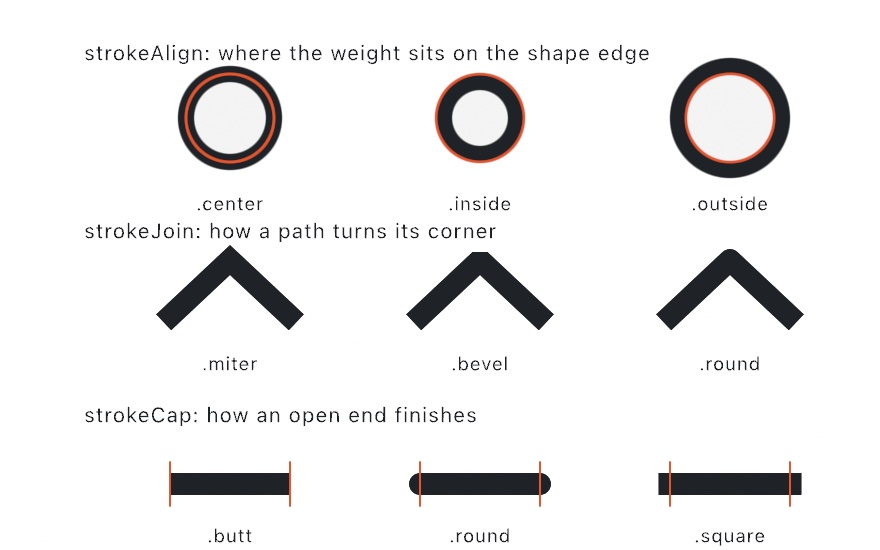
</picture>

```swift
fill(.gray); stroke(.black); strokeWeight(20)
strokeAlign(.inside)
drawCircle(width / 2, height / 2, 120)   // outline grows inward; radius-120 footprint kept
```

It applies to the analytic shapes (circles, ellipses, rectangles, the polygon and star family, and the rest of the SDF catalog), where the inset or outset is a geometrically exact offset of the outline. Shapes with no inside and outside keep a centered stroke, which covers lines, point markers, the open `drawArc`, and the tessellated `drawPolyline` / `drawPolygon` / `drawShape`. With `hollow`, the band already has two edges to stroke, so alignment doesn't apply there.

<a name="strokeJoin"></a>

#### strokeJoin

```swift
strokeJoin(_ join: StrokeJoin)   // .miter (default), .bevel, .round
```

How a stroked path turns its corners. `.miter` extends the two outer edges until they meet at a sharp point, which is what keeps a chevron or a star's tips crisp, and it falls back to a flat bevel when a corner is acute enough that the point would shoot out into a long spike. `.bevel` always cuts the corner off with a straight edge, and `.round` fills it with an arc for a smooth bend. This is state, like `strokeWeight`, so it holds until changed.

```swift
stroke(.black); strokeWeight(20); strokeJoin(.round)
drawPolyline([Vector2(120, 360), Vector2(540, 120), Vector2(960, 360)])   // a rounded peak
```

It applies to the stroked paths with interior corners: `drawPolyline`, the `drawPolygon` outline, `drawShape` contours, and the flattened `drawBezier`. The analytic SDF shapes draw their own outlines, and `drawLine` is a single segment, so those have no joins to style.

<a name="strokeCap"></a>

#### strokeCap

```swift
strokeCap(_ cap: StrokeCap)   // .butt (default), .round, .square
```

How the open ends of a stroked path are finished. `.butt` ends the stroke flat at the endpoint, so its footprint stops exactly where the path does. `.round` adds a half-disk over each end (a rounded tip), and `.square` adds a flat extension half the stroke weight past the endpoint, so both `.round` and `.square` reach beyond the path's end by half the weight. This is state, like `strokeWeight`, so it holds until changed.

```swift
stroke(.black); strokeWeight(24); strokeCap(.round)
drawPolyline([Vector2(300, 540), Vector2(780, 540)])   // rounded tips past each end
```

It applies to the open stroked paths: `drawLine`, `drawBezier`, `drawPolyline`, and any open `drawShape` contour. Closed outlines (the `drawPolygon` outline, a closed contour) have no ends to cap.

<a name="strokeProfile"></a>

#### strokeProfile / noStrokeProfile

```swift
strokeProfile(_ profile: StrokeProfile)         // .uniform (default), .taper, .ramp, .nib, .values
strokeProfile { t in ... }                      // width by hand, over the path fraction
noStrokeProfile()
```

How the stroke width varies as the path travels, which is the difference between a drawn line and a made mark. A profile is a *multiplier*, not a width: `strokeWeight` still says how fat the mark gets, and the profile says what fraction of that it uses at each point. This is state, like `strokeWeight`, so it holds until changed, and `withState { }` saves and restores it.

The named profiles cover the common marks:

| Profile | The mark |
| --- | --- |
| `.uniform` | One width the whole way. The default. |
| `.taper(start:end:)` | Thin at the ends, full in the middle: a brush pressed down and lifted. `start` and `end` are the multipliers *at* the two ends, both `0` by default, so `.taper(start: 1)` keeps a blunt start and lifts off at the end. |
| `.ramp(from:to:)` | A straight wedge from one width to another. |
| `.nib(angle:thinness:)` | A flat calligraphy pen held at `angle`: the mark is fattest where the path runs across the nib and a hairline where it runs along it. `thinness` is how much width the thinnest direction keeps. |
| `.values([...])` | Evenly spaced multipliers along the path, interpolated between: a width curve by hand, or one recorded from an input. |

<picture>
  <source media="(prefers-color-scheme: dark)" srcset="../../Guide/Images/15-ShapesAsMaterial/MarkWidth-dark.jpg">
  
</picture>

```swift
strokeWeight(12)
strokeProfile(.taper())
drawBezier(Vector2(120, 700), Vector2(540, 120), Vector2(960, 700))   // thin, fat, thin
```

It applies wherever a path is expanded into a stroke: `drawLine`, `drawBezier`, `drawPolyline`, `drawCurve`, and the outlines of `drawShape` and `drawPolygon`. The analytic shapes (`drawCircle`, `drawRect`, `drawStar`, and the rest of the SDF catalog) carry a single width by construction, so they keep drawing at `strokeWeight` and say so once on the console.

Two things to know:

- **Width is read at every point of the path**, from `0` at the start to `1` at the end, measured along the path's own length. A path with only a handful of points changes width in visible steps, so sample a curve densely enough for the profile to have somewhere to go. Long segments are split automatically, but the profile can only follow the points it is given.
- **A closure profile runs where the stroke is expanded**, not on the sketch, so it can't reach `time` or a `@Param` directly. Copy what it needs into a local first (`let clock = time`) and capture that. The named profiles take their animation as an argument, so `.nib(angle: time)` needs nothing special.

A profiled stroke stays vector on the way out: `--export-svg` and `--export-pdf` write the region the mark covers as a filled outline rather than a stroked path with one width, so a plotted or printed mark matches the screen. See [Export](../Output/Export.md).

A profile shapes a stroke by *where you are* along a finished path. For a mark being drawn right now, where there is no finished path to take a fraction of, see [Marks](Marks.md): a `StrokeMark` measures how fast the pointer is traveling and how hard it is pressed, and drives width and opacity from that. The two multiply, so a dynamic mark can still take a profiled lift-off.

<a name="hollow"></a>

#### hollow / solid

```swift
hollow(_ width: Double)
solid()
```

Draw region shapes (circle, rect, star, triangle, heart, …) as a constant-width band hugging their outline instead of a solid interior, which is what `drawRing` is to a circle, applied to every shape. The `fill` color paints the band, and an active `stroke` borders *both* of its edges, so you can frame a hollow shape in a second color (something a stroke alone can't do, since that would be the only band). `width` is the band thickness, centered on the edge. This is state, like `fill` and `stroke`, and `solid()` returns to filled shapes. Points, lines, and `drawRing` (already a band) ignore it.

<picture>
  <source media="(prefers-color-scheme: dark)" srcset="../Images/HollowBand-dark.jpg">
  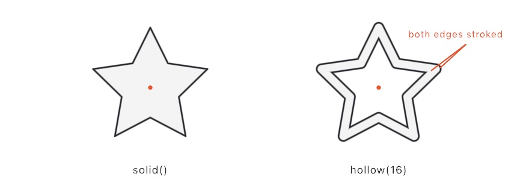
</picture>

```swift
hollow(16)
fill(.cyan)
stroke(.black)
strokeWeight(2)
drawStar(width / 2, height / 2, 140, 70, points: 5)   // cyan ring-star, black edges
solid()                                                // back to solid fills
```

<a name="pointSize"></a>

#### pointSize

```swift
pointSize(_ size: Double)
```

Diameter of a [`drawPoint`](#point) dot, in points. This is state, like `strokeWeight`, so set it once and it holds, with a per-call override on `drawPoint`.

```swift
pointSize(4)
drawPoint(width / 2, height / 2)
```

<a name="pointMarker"></a>

#### pointMarker

```swift
pointMarker(_ marker: PointMarker)
```

The glyph [`drawPoint`](#point) stamps: `.circle` (the default), `.square`, `.diamond`, `.cross` (a plus, `+`), or `.x` (a diagonal cross, `✕`). This is state, like `pointSize`, so set it once and it holds. Every marker is sized by its on-screen diameter, so the footprint stays the same when you switch glyphs, and all take the current `fill` color (they ignore stroke).

```swift
pointMarker(.cross)
pointSize(10)
for p in cloud { drawPoint(at: p) }          // a scatter of plus signs
```

<a name="blendMode"></a>

#### blendMode

```swift
blendMode(_ mode: BlendMode)   // .normal (default), .add, .subtract, .multiply, .screen, .lightest, .darkest
```

How following shapes combine with what's already on the canvas. The default, `.normal`, lays each shape over the previous ones (a translucent shape shows what's beneath). The other modes *combine* the new color with the destination. The headline is `.add`, which **sums colors as light**, so overlapping marks brighten toward white instead of the topmost one winning. That additive accumulation is what light-field and particle sketches want, and it is what the "sandpainting" depth of field in [`Rendering/DepthOfField`](../../Examples/Rendering/DepthOfField/Sketch.swift) is built from.

```swift
blendMode(.add)                          // overlaps brighten, best on a dark background
noStroke()
for p in particles {
    fill(Color(hue: p.hue, saturation: 0.7, brightness: 1, alpha: 0.1))
    drawCircle(p.x, p.y, p.r)            // a thousand faint dots pile into a glow
}
```

The modes: `.add` (sum as light, lightens), `.screen` (also lightens, softer), `.multiply` (stacked ink, darkens), `.subtract` (darkens by removing light), `.lightest` / `.darkest` (keep the lighter or darker of the two, channel by channel). It applies to every primitive, including the SDF shapes, the tessellated paths, images, and text. Like other style, it's saved and restored by [`withState { }`](#isolated), so you can scope an additive field and leave the rest of the frame normal.

One known limit: under `.darkest`, the analytic shapes (`drawCircle`, `drawRect`, and the rest of the SDF catalog) darken their whole covering rectangle, not just the shape, because the GPU's min blend can't ignore a quad's empty pixels. Until that's fixed, draw `.darkest` shapes on the triangle path (`drawPolygon` with a many-sided outline) or through a layer mask.

Because the canvas blends in linear light (the gamma-correct pipeline), `.add` sums physically, so two half-bright lights make a full-bright one. Set against a dark background it reads as glowing accumulation. See `Examples/Rendering/Blending`.

### Basic shapes

<picture>
  <source media="(prefers-color-scheme: dark)" srcset="../../Guide/Images/01-HelloOllin/FirstShapes-dark.jpg">
  
</picture>

<a name="point"></a>

#### drawPoint

```swift
drawPoint(_ x: Double, _ y: Double)
drawPoint(_ x: Double, _ y: Double, _ size: Double)
drawPoint(_ p: Vector2)
drawPoint(_ p: Vector2, size: Double)
```

A filled marker in the current `fill` color (it ignores stroke, so `noFill()` draws nothing). The glyph is the current [`pointMarker`](#pointMarker), a round dot by default. `size` is the on-screen *diameter*, and without it the current [`pointSize`](#pointSize) is used. Each point is a single SDF instance, so a field of thousands stays cheap.

<picture>
  <source media="(prefers-color-scheme: dark)" srcset="../Images/DrawPoint-dark.jpg">
  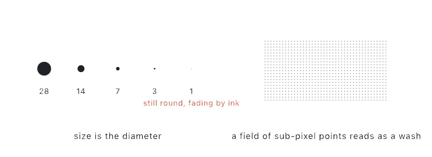
</picture>

```swift
fill(.black)
pointSize(3)
for p in cloud { drawPoint(at: p) }          // a scatter of dots
drawPoint(width / 2, height / 2, 12)     // one bigger dot
```

> [!TIP]
> **Sizes go all the way down.** Round points, circles, lines, and shape *outlines* stay smooth at sub-pixel sizes. A dot, a line, or a [`strokeWeight`](#strokeWeight) thinner than a pixel fades by *ink* instead of popping in, snapping to a 1px floor, or flickering as it moves. A field of tiny points, a hairline `drawLine`, or a barely visible rectangle outline reads as a soft, even wash rather than hard speckle, so draw at whatever size and stroke weight the piece wants, down to a fraction of a pixel.

<a name="line"></a>

#### drawLine

```swift
drawLine(_ x1: Double, _ y1: Double, _ x2: Double, _ y2: Double)
drawLine(_ a: Vector2, _ b: Vector2)
```

A stroked line segment between two points. It honors [`strokeCap`](#strokeCap) (butt by default) and takes solid, translucent, or gradient stroke paint. Rendered through the high-quality stroke path (edge-expanded triangles plus a ~1px anti-aliasing fringe), so it stays crisp and even at any angle and resolution, down to sub-pixel widths.

<picture>
  <source media="(prefers-color-scheme: dark)" srcset="../Images/DrawLine-dark.jpg">
  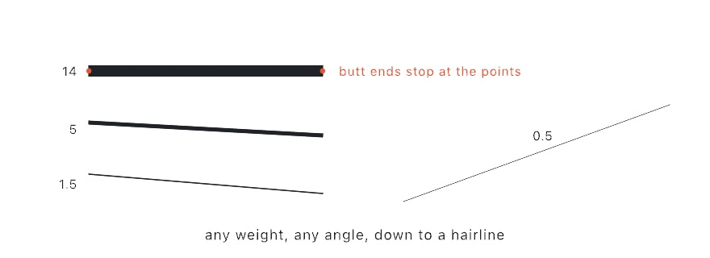
</picture>

```swift
stroke(.black)
drawLine(0, 0, width, height)           // corner to corner
```

<a name="arrow"></a>

#### drawArrow

```swift
drawArrow(from: Vector2, to: Vector2, headLength: Double? = nil, headWidth: Double? = nil)
drawArrow(_ x1: Double, _ y1: Double, _ x2: Double, _ y2: Double,
          headLength: Double? = nil, headWidth: Double? = nil)
```

An arrow: a stroked shaft ending in a solid triangular head whose tip is exactly `to`. The whole mark, head included, takes the current [`stroke`](#stroke), so one `stroke(...)` colors it. [`strokeWeight`](#strokeWeight) thickens the shaft, and head measurements left to themselves scale with it. A diagram's pointer, a vector field's glyph, a force made visible.

<picture>
  <source media="(prefers-color-scheme: dark)" srcset="../Images/DrawArrow-dark.jpg">
  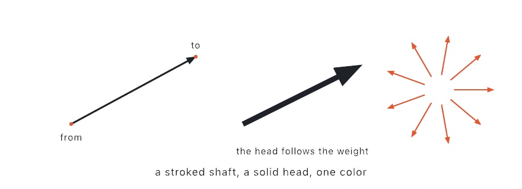
</picture>

```swift
stroke(.crimson)
strokeWeight(3)
drawArrow(from: center, to: mouse)
drawArrow(from: p, to: p + force, headLength: 12)
```

The shaft stops at the head's base, so translucent arrows lay one even coat of ink.

<a name="circle"></a>

#### drawCircle

```swift
drawCircle(_ x: Double, _ y: Double, _ radius: Double)
drawCircle(center: Vector2, radius: Double)
drawCircle(_ circle: Circle)
```

A circle, by scalar center (positional `x, y, radius`), a `Vector2` `center:`, or a [`Circle`](../Drawing/Geometry.md#circle) value.

<picture>
  <source media="(prefers-color-scheme: dark)" srcset="../Images/DrawCircle-dark.jpg">
  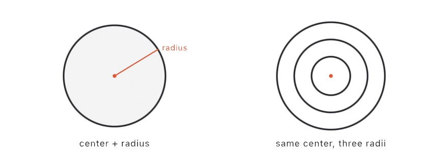
</picture>

```swift
drawCircle(width / 2, height / 2, 120)
drawCircle(center: Vector2(200, 200), radius: 60)
drawCircle(Circle(x: 200, y: 200, radius: 60))
```

To draw a whole array at once, see [batches](#batches).

<a name="ellipse"></a>

#### drawEllipse

```swift
drawEllipse(_ x: Double, _ y: Double, _ radiusX: Double, _ radiusY: Double)
drawEllipse(center: Vector2, radiusX: Double, radiusY: Double)
```

An ellipse, by scalar center (positional `x, y, rx, ry`) or a `Vector2` `center:`. As with `drawCircle`, the size is given as *radii* (`rx`, `ry`), not diameters, so equal radii draw a circle.

<picture>
  <source media="(prefers-color-scheme: dark)" srcset="../Images/DrawEllipse-dark.jpg">
  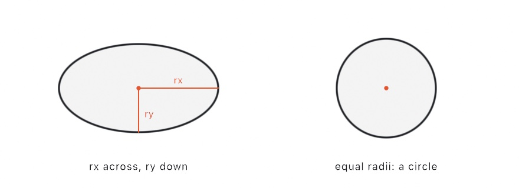
</picture>

```swift
drawEllipse(width / 2, height / 2, 160, 90)
drawEllipse(center: Vector2(200, 200), radiusX: 60, radiusY: 90)
```

<a name="rect"></a>

#### drawRect

```swift
drawRect(_ x: Double, _ y: Double, _ width: Double, _ height: Double, cornerRadius: Double = 0)
drawRect(corner: Vector2, width: Double, height: Double, cornerRadius: Double = 0)
drawRect(center: Vector2, width: Double, height: Double, cornerRadius: Double = 0)
drawRect(_ rectangle: Rectangle, cornerRadius: Double = 0)
```

A rectangle, anchored by its top-left corner or its center (the center form matches p5's `rectMode(CENTER)`), or from a `Rectangle` value. `cornerRadius` rounds the corners, clamped to half the shorter side, and the default `0` is a sharp rectangle.

<picture>
  <source media="(prefers-color-scheme: dark)" srcset="../Images/DrawRect-dark.jpg">
  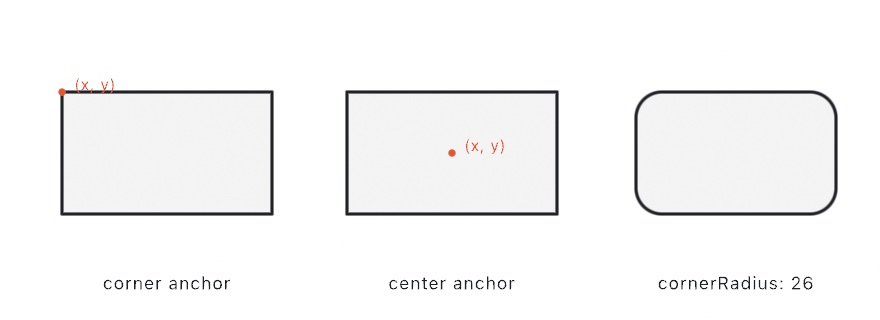
</picture>

```swift
drawRect(40, 40, 120, 80)                                   // top-left corner
drawRect(center: Vector2(width / 2, height / 2), width: 200, height: 120)
drawRect(40, 40, 120, 80, cornerRadius: 16)                 // rounded corners
```

<a name="orientedbox"></a>

#### drawOrientedBox

```swift
drawOrientedBox(_ a: Vector2, _ b: Vector2, thickness: Double)
drawOrientedBox(_ x1: Double, _ y1: Double, _ x2: Double, _ y2: Double, thickness: Double)
```

A rectangle placed by its two centerline endpoints `a` and `b` with the given `thickness` across it, so it draws a thick bar between two points with square (not round) ends. Where `drawRect` is axis-aligned and you'd rotate it about its own center, this is positioned by *both* of its ends, so connecting a pair of moving points (a linkage, a truss, an edge between nodes) is one call with no trigonometry. It's a filled region, taking `fill`, an outline `stroke`, `strokeAlign`, and `hollow`, where `drawLine` is a stroke with no interior. A zero-length bar (`a == b`) or a non-positive thickness draws nothing.

<picture>
  <source media="(prefers-color-scheme: dark)" srcset="../Images/DrawOrientedBox-dark.jpg">
  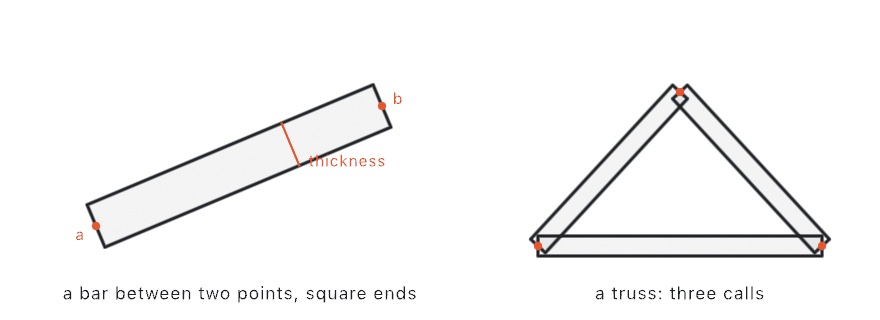
</picture>

```swift
fill(.black)
drawOrientedBox(Vector2(100, 100), Vector2(400, 260), thickness: 40)   // bar between two points
drawOrientedBox(100, 100, 400, 260, thickness: 40)                     // same, scalar form
```

<a name="triangle"></a>

#### drawTriangle

```swift
drawTriangle(_ x: Double, _ y: Double, _ radius: Double)
drawTriangle(center: Vector2, radius: Double)
drawTriangle(_ x: Double, _ y: Double, _ base: Double, _ height: Double)
drawTriangle(apex: Vector2, base: Double, height: Double)
drawTriangle(_ a: Vector2, _ b: Vector2, _ c: Vector2)
drawTriangle(_ x1: Double, _ y1: Double, _ x2: Double, _ y2: Double, _ x3: Double, _ y3: Double)
```

A triangle, in three forms. The three-argument form is an **equilateral** triangle *centered* at `(x, y)`, point-up, with circumradius `radius` (the center-to-vertex distance, like `drawCircle`'s radius), so rotating it spins it about that center. The four-argument form is an **isosceles** triangle whose *apex* (tip) is at `(x, y)`, opening toward +y (downward) by `height` with the given `base` width, so rotating it sweeps it about the apex. The **three-point** form places the corners directly, so any triangle is one call (the corners may be in any winding order, and a zero-area triangle draws nothing). All three are analytic SDF shapes, crisp at any size and effectively free per triangle, and they honor `strokeAlign` and `hollow`. Aim them with the transform stack.

<picture>
  <source media="(prefers-color-scheme: dark)" srcset="../Images/DrawTriangle-dark.jpg">
  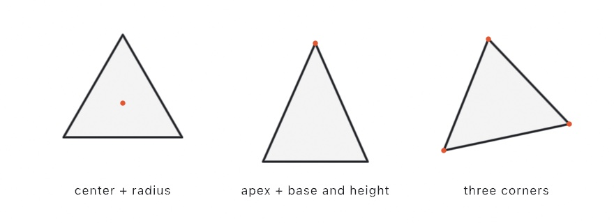
</picture>

```swift
drawTriangle(width / 2, height / 2, 120)              // equilateral, centered, point-up
drawTriangle(width / 2, 100, 160, 240)               // isosceles, tip at (w/2, 100)
drawTriangle(Vector2(80, 360), Vector2(300, 280), Vector2(180, 120))  // any three corners
withState { translate(300, 300); rotate(time); drawTriangle(0, 0, 80, 200) }  // wedge spinning on its tip
```

<a name="arc"></a>

#### drawArc

```swift
drawArc(_ x: Double, _ y: Double, _ radiusX: Double, _ radiusY: Double, start: Double, stop: Double, mode: ArcMode = .open)
drawArc(center: Vector2, radiusX: Double, radiusY: Double, start: Double, stop: Double, mode: ArcMode = .open)
```

An elliptical arc sweeping from `start` to `stop` (radians, measured from the positive x-axis and increasing clockwise). `mode` decides how the ends close, which sets both the stroked outline and the filled region:

- `.open` strokes the curve only, and a fill paints the segment cut off by the (un-stroked) chord.
- `.chord` closes with a straight chord between the endpoints, so the stroke traces it and the fill is that segment.
- `.pie` closes through the center like a pie slice, so the stroke traces both radii and the fill is the wedge.

The outline is stroked like any other path, so [`strokeJoin`](#strokejoin) shapes its corners and [`strokeCap`](#strokecap) finishes an open arc's two ends.

<picture>
  <source media="(prefers-color-scheme: dark)" srcset="../Images/DrawArc-dark.jpg">
  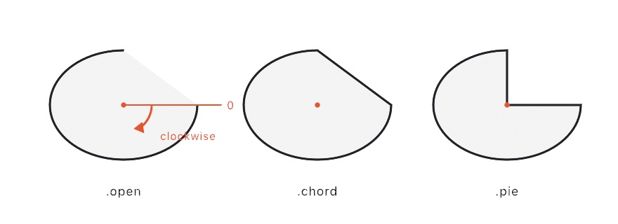
</picture>

```swift
drawArc(width / 2, height / 2, 160, 90, start: 0, stop: .pi)              // open half-arc
drawArc(width / 2, height / 2, 120, 120, start: 0, stop: .pi / 2, mode: .pie)
```

<a name="bezier"></a>

#### drawBezier

```swift
drawBezier(_ start: Vector2, _ control: Vector2, _ end: Vector2)
drawBezier(_ x1: Double, _ y1: Double, _ cx: Double, _ cy: Double, _ x2: Double, _ y2: Double)
```

A **quadratic** Bézier curve, stroked from `start` to `end` and bending toward the single control point `control`. It takes the current `stroke` paint (solid, translucent, or gradient) and `strokeWeight` (a curve has no interior, so there's no fill), and honors [`strokeCap`](#strokeCap) on its ends (butt by default). The curve flattens to a polyline and renders through the high-quality stroke path (edge-expanded triangles plus a ~1px anti-aliasing fringe), so it stays crisp and even at any angle and resolution, down to sub-pixel widths.

<picture>
  <source media="(prefers-color-scheme: dark)" srcset="../Images/DrawBezier-dark.jpg">
  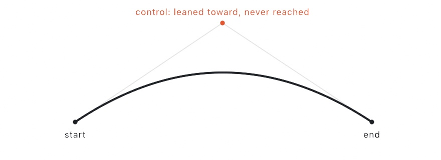
</picture>

For a **cubic** curve (two control points) or a chain of joined curves, sample the curve into a `Shape` contour and use `drawShape`, which takes any number of points and can be filled.

```swift
stroke(.black); strokeWeight(4)
drawBezier(Vector2(100, 400), Vector2(width / 2, 80), Vector2(width - 100, 400))
```

### More shapes

<a name="ngon"></a>

#### drawNgon

```swift
drawNgon(_ x: Double, _ y: Double, _ radius: Double, sides: Int)
drawNgon(center: Vector2, radius: Double, sides: Int)
```

A regular polygon centered at `(x, y)` with `sides` equal-length edges (3 or more) and circumradius `radius` (the center-to-vertex distance, like `drawCircle`'s radius), one vertex pointing up. It's an analytic SDF shape, crisp at any size and effectively free per shape, and you rotate it about its center with the transform stack. For an arbitrary, non-regular polygon, use `drawPolygon`.

<picture>
  <source media="(prefers-color-scheme: dark)" srcset="../Images/DrawNgon-dark.jpg">
  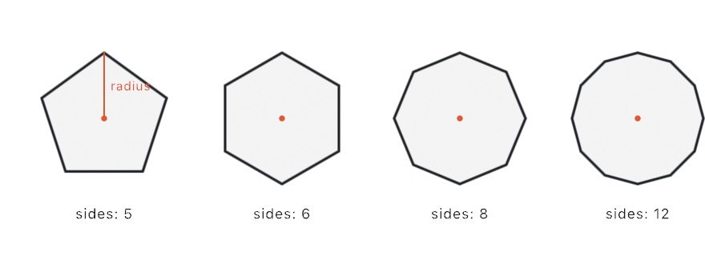
</picture>

```swift
drawNgon(width / 2, height / 2, 120, sides: 6)            // a hexagon
withState { translate(300, 300); rotate(time); drawNgon(0, 0, 90, sides: 5) }  // a spinning pentagon
```

The polygons people name often have convenience helpers (`drawPentagon`, `drawHexagon`, `drawHeptagon`, `drawOctagon`), each just `drawNgon` with its side count fixed, the way `drawCircle` reads better than an equal-radii `drawEllipse`. They take the same `(x, y, radius)` and `(center:, radius:)` forms. For any other side count, reach for `drawNgon`.

```swift
drawHexagon(width / 2, height / 2, 120)                   // same as drawNgon(…, sides: 6)
drawOctagon(center: middle, radius: 90)
```

<a name="star"></a>

#### drawStar

```swift
drawStar(_ x: Double, _ y: Double, _ outerRadius: Double, _ innerRadius: Double, points: Int)
drawStar(center: Vector2, outerRadius: Double, innerRadius: Double, points: Int)
```

A star centered at `(x, y)` with `points` tips (3 or more), alternating between `outerRadius` (the tips) and `innerRadius` (the valleys), one tip pointing up. `innerRadius` runs `0...outerRadius`, and smaller is spikier. At the apothem the points flatten into a regular polygon's edges, which is exactly how `drawNgon` is built. It's an analytic SDF shape, crisp at any size and effectively free, and you rotate it about its center with the transform stack.

<picture>
  <source media="(prefers-color-scheme: dark)" srcset="../Images/DrawStar-dark.jpg">
  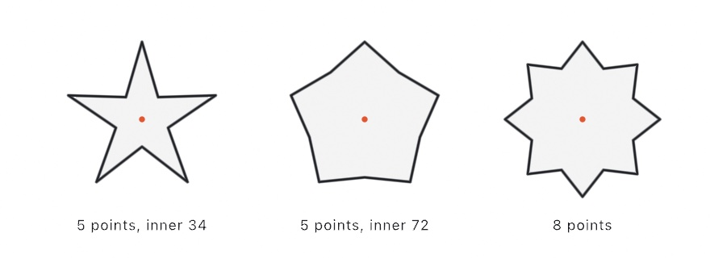
</picture>

```swift
drawStar(width / 2, height / 2, 160, 70, points: 5)       // a classic five-point star
drawStar(width / 2, height / 2, 120, 96, points: 8)       // a gentler eight-point burst
```

<a name="rhombus"></a>

#### drawRhombus

```swift
drawRhombus(_ x: Double, _ y: Double, _ width: Double, _ height: Double, cornerRadius: Double = 0)
drawRhombus(center: Vector2, width: Double, height: Double, cornerRadius: Double = 0)
```

A rhombus (diamond) centered at `(x, y)`, `width` by `height` (the full diagonals), with a vertex at each end of those diagonals. `cornerRadius` rounds the corners while keeping the footprint, so push it up and the diamond rounds toward a circle. It's an analytic SDF shape, crisp at any size, and you rotate it about its center with the transform stack.

<picture>
  <source media="(prefers-color-scheme: dark)" srcset="../Images/DrawRhombus-dark.jpg">
  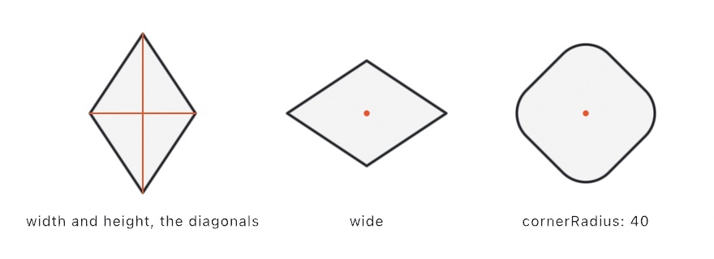
</picture>

```swift
drawRhombus(width / 2, height / 2, 160, 220)                 // a tall diamond
drawRhombus(width / 2, height / 2, 180, 180, cornerRadius: 40)  // soft, near-circular
```

<a name="vesica"></a>

#### drawVesica

```swift
drawVesica(_ x: Double, _ y: Double, _ width: Double, _ height: Double, cornerRadius: Double = 0)
drawVesica(center: Vector2, width: Double, height: Double, cornerRadius: Double = 0)
```

A vesica, meaning a pointed lens formed by the overlap of two circles, centered at `(x, y)` and `width` by `height`. The two tips lie along the longer axis, so a tall lens points up and down while a wide one points left and right. `cornerRadius` rounds the tips (and slightly enlarges the lens, like `drawMoon`), easing it toward an ellipse. It's an analytic SDF shape, so rotate it with the transform stack for in-between angles.

<picture>
  <source media="(prefers-color-scheme: dark)" srcset="../Images/DrawVesica-dark.jpg">
  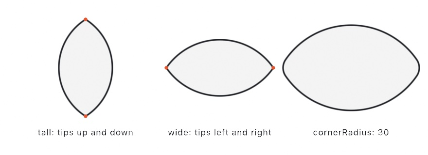
</picture>

```swift
drawVesica(width / 2, height / 2, 120, 240)                 // a vertical lens (points up/down)
drawVesica(width / 2, height / 2, 240, 120, cornerRadius: 30)  // wide, with softened tips
```

<a name="orientedvesica"></a>

#### drawOrientedVesica

```swift
drawOrientedVesica(_ a: Vector2, _ b: Vector2, width: Double)
drawOrientedVesica(_ x1: Double, _ y1: Double, _ x2: Double, _ y2: Double, width: Double)
```

A vesica placed by its two tip points `a` and `b`, bulging to `width` across the middle. It's the oriented analog of `drawVesica`, the way [`drawOrientedBox`](#orientedbox) is to `drawRect`. Because both tips are placed rather than a center plus a rotation, spanning a moving pair of points takes one call with no trigonometry. It's a filled region, so `fill`, an outline `stroke`, `strokeAlign`, and `hollow` all apply. `width` is the full waist width, so keep it below the tip distance for a lens, or equal to it for a circle. A zero-length span (`a == b`) or a non-positive width draws nothing.

<picture>
  <source media="(prefers-color-scheme: dark)" srcset="../Images/DrawOrientedVesica-dark.jpg">
  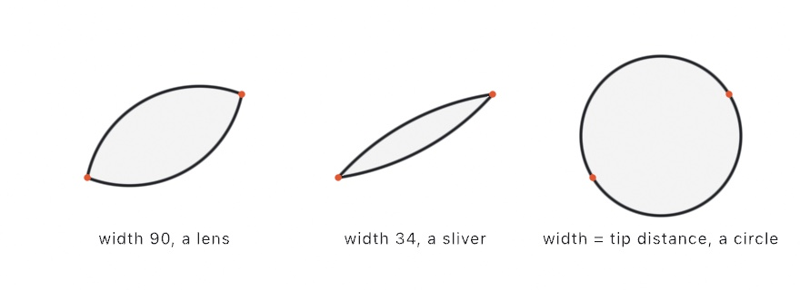
</picture>

```swift
fill(.black)
drawOrientedVesica(Vector2(100, 200), Vector2(400, 260), width: 90)   // lens between two points
drawOrientedVesica(100, 200, 400, 260, width: 90)                     // same, scalar form
```

<a name="moon"></a>

#### drawMoon

```swift
drawMoon(_ x: Double, _ y: Double, _ outerRadius: Double, _ innerRadius: Double, _ offset: Double, cornerRadius: Double = 0)
drawMoon(center: Vector2, outerRadius: Double, innerRadius: Double, offset: Double, cornerRadius: Double = 0)
```

A crescent moon at `(x, y)`, drawn as the disk of `outerRadius` with a disk of `innerRadius` removed, the cut disk shifted `offset` toward +x. Keep `innerRadius` near `outerRadius` with a modest `offset` for a classic crescent, since a larger `offset` opens it toward a half-moon. `cornerRadius` rounds the two cusps. It's an analytic SDF shape, so rotate it with the transform stack to face the crescent any direction.

<picture>
  <source media="(prefers-color-scheme: dark)" srcset="../Images/DrawMoon-dark.jpg">
  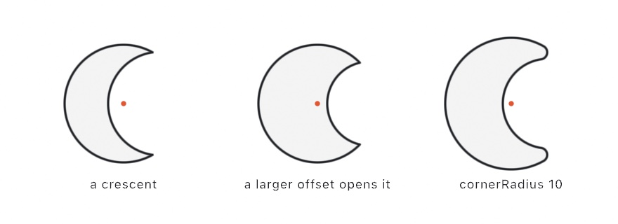
</picture>

```swift
drawMoon(width / 2, height / 2, 140, 130, 90)               // a fat crescent, opening right
withState { translate(width / 2, height / 2); rotate(time); drawMoon(0, 0, 120, 120, 80) }  // a slowly turning crescent
```

<a name="cross"></a>

#### drawCross

```swift
drawCross(_ x: Double, _ y: Double, _ length: Double, _ thickness: Double, cornerRadius: Double = 0)
drawCross(center: Vector2, length: Double, thickness: Double, cornerRadius: Double = 0)
```

A plus-sign cross centered at `(x, y)`, spanning `length` tip-to-tip on both axes with arms `thickness` wide. `cornerRadius` rounds the outer corners (the inner notches stay sharp), the usual rounded-plus look. It's an analytic SDF shape, so rotate it 45° with the transform stack for an ✕.

<picture>
  <source media="(prefers-color-scheme: dark)" srcset="../Images/DrawCross-dark.jpg">
  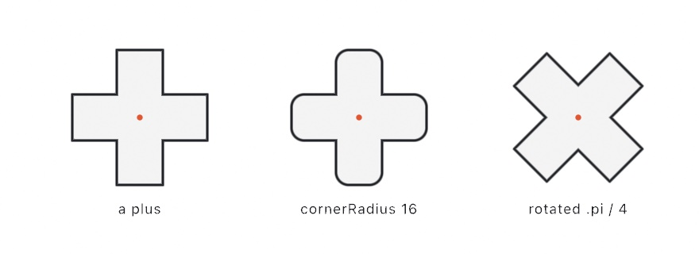
</picture>

```swift
drawCross(width / 2, height / 2, 200, 70, cornerRadius: 16)  // a rounded plus
withState { translate(width / 2, height / 2); rotate(.pi / 4); drawCross(0, 0, 200, 60) }  // an ✕
```

<a name="ring"></a>

#### drawRing

```swift
drawRing(_ x: Double, _ y: Double, _ innerRadius: Double, _ outerRadius: Double)
drawRing(center: Vector2, innerRadius: Double, outerRadius: Double)
```

A filled ring centered at `(x, y)`, between `innerRadius` and `outerRadius`. It takes the current `fill`, not stroke, so for two outlined circles instead, draw `drawCircle` twice with `noFill`. It's an analytic SDF shape, crisp at any size.

<picture>
  <source media="(prefers-color-scheme: dark)" srcset="../Images/DrawRing-dark.jpg">
  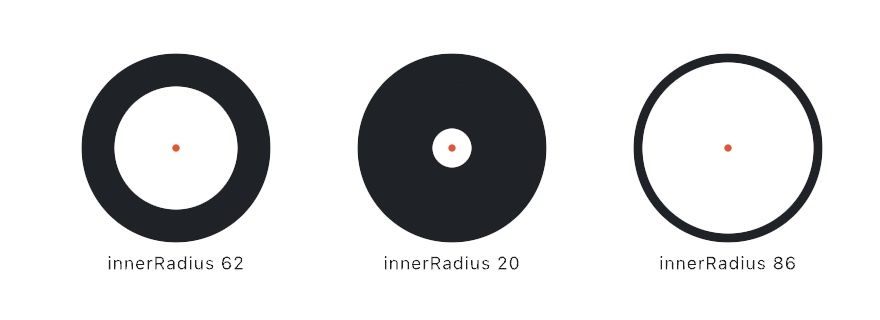
</picture>

```swift
drawRing(width / 2, height / 2, 80, 120)                    // a fairly thin ring
drawRing(width / 2, height / 2, 20, 120)                    // a thick one (small hole)
```

<a name="trapezoid"></a>

#### drawTrapezoid

```swift
drawTrapezoid(_ x: Double, _ y: Double, _ topWidth: Double, _ bottomWidth: Double, _ height: Double)
drawTrapezoid(center: Vector2, topWidth: Double, bottomWidth: Double, height: Double)
```

An isosceles trapezoid centered at `(x, y)`, `topWidth` across the top edge and `bottomWidth` across the bottom, `height` tall. Equal widths give a rectangle, and a zero width gives a triangle. It's an analytic SDF shape, crisp at any size, and you rotate it about its center with the transform stack.

<picture>
  <source media="(prefers-color-scheme: dark)" srcset="../Images/DrawTrapezoid-dark.jpg">
  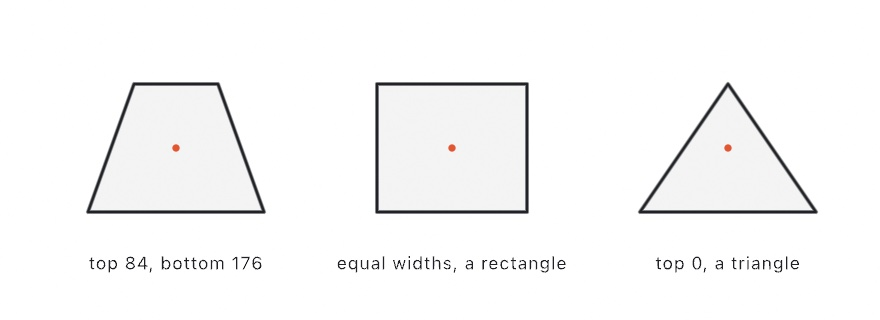
</picture>

```swift
drawTrapezoid(width / 2, height / 2, 120, 220, 160)         // narrow top, wide base
drawTrapezoid(width / 2, height / 2, 200, 200, 120)         // equal widths, a rectangle
```

<a name="parallelogram"></a>

#### drawParallelogram

```swift
drawParallelogram(_ x: Double, _ y: Double, _ width: Double, _ height: Double, _ skew: Double)
drawParallelogram(center: Vector2, width: Double, height: Double, skew: Double)
```

A parallelogram centered at `(x, y)`, `width` wide and `height` tall, with the top edge sheared `skew` points along +x relative to the bottom (`0` is a rectangle, negative leans the other way). It's an analytic SDF shape, and you rotate it about its center with the transform stack.

<picture>
  <source media="(prefers-color-scheme: dark)" srcset="../Images/DrawParallelogram-dark.jpg">
  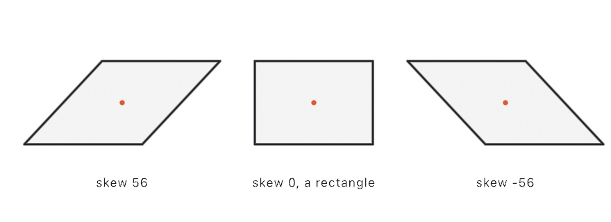
</picture>

```swift
drawParallelogram(width / 2, height / 2, 240, 160, 80)      // a right-leaning slab
drawParallelogram(width / 2, height / 2, 240, 160, -80)     // leaning the other way
```

<a name="egg"></a>

#### drawEgg

```swift
drawEgg(_ x: Double, _ y: Double, _ bottomRadius: Double, _ topRadius: Double)
drawEgg(center: Vector2, bottomRadius: Double, topRadius: Double)
```

An egg centered at `(x, y)`, drawn as a circle of `bottomRadius` at the fat lower end tapering to a rounded tip of `topRadius` at the top, pointing up. `bottomRadius` must be at least `topRadius` (equal gives a circle). It's an analytic SDF shape, and you rotate it about its center with the transform stack to tip it over.

<picture>
  <source media="(prefers-color-scheme: dark)" srcset="../Images/DrawEgg-dark.jpg">
  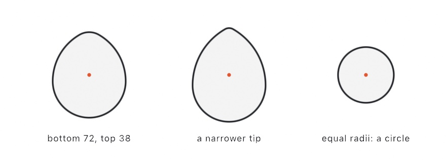
</picture>

```swift
drawEgg(width / 2, height / 2, 120, 60)                     // a classic egg
withState { translate(width / 2, height / 2); rotate(time); drawEgg(0, 0, 120, 40) }  // tumbling
```

<a name="heart"></a>

#### drawHeart

```swift
drawHeart(_ x: Double, _ y: Double, _ size: Double)
drawHeart(center: Vector2, size: Double)
```

A heart centered at `(x, y)`, `size` points wide (a touch shorter than it is wide), lobes up and point down. It's an analytic SDF shape, so rotate it with the transform stack (180° points it up, 45° tips it like a playing-card suit).

<picture>
  <source media="(prefers-color-scheme: dark)" srcset="../Images/DrawHeart-dark.jpg">
  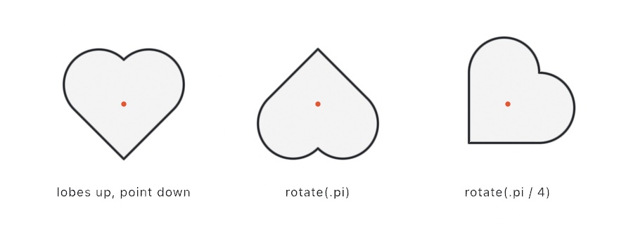
</picture>

```swift
drawHeart(width / 2, height / 2, 220)
withState { translate(width / 2, height / 2); rotate(sin(time) * 0.2); drawHeart(0, 0, 200) }  // a gentle wobble
```

<a name="cutdisk"></a>

#### drawCutDisk

```swift
drawCutDisk(_ x: Double, _ y: Double, _ radius: Double, _ cut: Double)
drawCutDisk(center: Vector2, radius: Double, cut: Double)
```

A disk of `radius` centered at `(x, y)` with a straight horizontal slice removed, giving a dome with the flat edge down and the bulge up. `cut` (in `-radius...radius`) is the signed offset of the flat edge from the center, where `0` is a half disk, positive raises the cut toward the dome and keeps a smaller cap, and negative keeps more than half. It's an analytic SDF shape, so rotate it with the transform stack to aim the flat edge.

<picture>
  <source media="(prefers-color-scheme: dark)" srcset="../Images/DrawCutDisk-dark.jpg">
  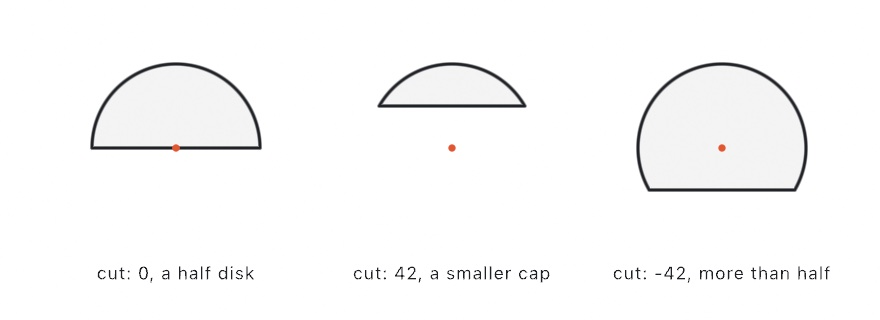
</picture>

```swift
drawCutDisk(width / 2, height / 2, 140, 0)                  // a half disk
drawCutDisk(width / 2, height / 2, 140, -40)               // a bit more than half
```

<a name="unevencapsule"></a>

#### drawUnevenCapsule

```swift
drawUnevenCapsule(_ a: Vector2, _ b: Vector2, _ ra: Double, _ rb: Double)
drawUnevenCapsule(_ x1: Double, _ y1: Double, _ x2: Double, _ y2: Double, _ ra: Double, _ rb: Double)
```

A tapered capsule, a round-capped bar with unequal end radii, running from `a` (radius `ra`) to `b` (radius `rb`) and taking fill and stroke like a shape. The end-to-end distance must be at least `|ra − rb|`, otherwise the smaller cap is swallowed. It's an analytic SDF shape, crisp at any size.

<picture>
  <source media="(prefers-color-scheme: dark)" srcset="../Images/DrawUnevenCapsule-dark.jpg">
  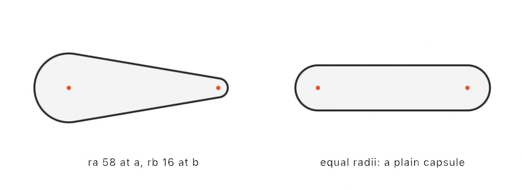
</picture>

```swift
drawUnevenCapsule(Vector2(200, 200), Vector2(880, 880), 90, 24)   // a long taper
drawUnevenCapsule(300, 540, 780, 540, 70, 70)                     // equal radii, a plain capsule
```

### Novelty shapes

These are less-common analytic forms, including curves, cut-outs, and a couple of pure doodles. They ride the same instanced-SDF path as everything above, so they stay crisp at any size, cost effectively nothing, and rotate through the transform stack.

<a name="horseshoe"></a>

#### drawHorseshoe

```swift
drawHorseshoe(_ x: Double, _ y: Double, _ radius: Double, _ thickness: Double, gap: Double)
drawHorseshoe(center: Vector2, radius: Double, thickness: Double, gap: Double)
```

A horseshoe, meaning a thick arc with a gap, centered at `(x, y)`. It's a band at mid-radius `radius`, `thickness` thick, with an opening that spans `gap` radians (the full angular gap, so a smaller `gap` is more nearly a closed ring). Rotate it with the transform stack to aim the opening.

<picture>
  <source media="(prefers-color-scheme: dark)" srcset="../Images/DrawHorseshoe-dark.jpg">
  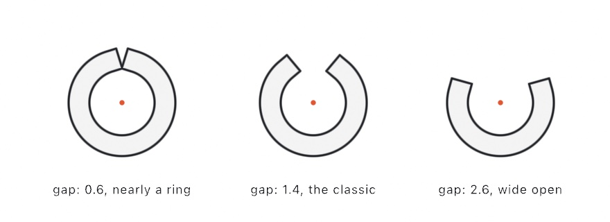
</picture>

```swift
drawHorseshoe(width / 2, height / 2, 160, 70, gap: 1.4)        // a classic open horseshoe
withState { translate(width / 2, height / 2); rotate(time); drawHorseshoe(0, 0, 150, 60, gap: 1.0) }  // a turning, nearly-closed ring
```

<a name="parabola"></a>

#### drawParabola

```swift
drawParabola(_ x: Double, _ y: Double, _ width: Double, _ height: Double)
drawParabola(center: Vector2, width: Double, height: Double)
```

A filled parabolic arch centered at `(x, y)`, `width` across the flat base and `height` tall, the curve peaking at the top. It's an exact parabola, with no tessellation. Rotate it with the transform stack.

<picture>
  <source media="(prefers-color-scheme: dark)" srcset="../Images/DrawParabola-dark.jpg">
  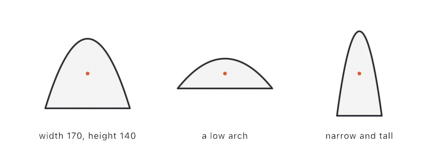
</picture>

```swift
drawParabola(width / 2, height / 2, 240, 240)                  // a rounded arch
```

<a name="roundedx"></a>

#### drawRoundedX

```swift
drawRoundedX(_ x: Double, _ y: Double, _ length: Double, _ thickness: Double)
drawRoundedX(center: Vector2, length: Double, thickness: Double)
```

An X (saltire) centered at `(x, y)`, `length` tip-to-tip along each axis, with round-capped arms `thickness` wide. It's `drawCross` turned 45°, but with rounded ends. Rotate it with the transform stack.

<picture>
  <source media="(prefers-color-scheme: dark)" srcset="../Images/DrawRoundedX-dark.jpg">
  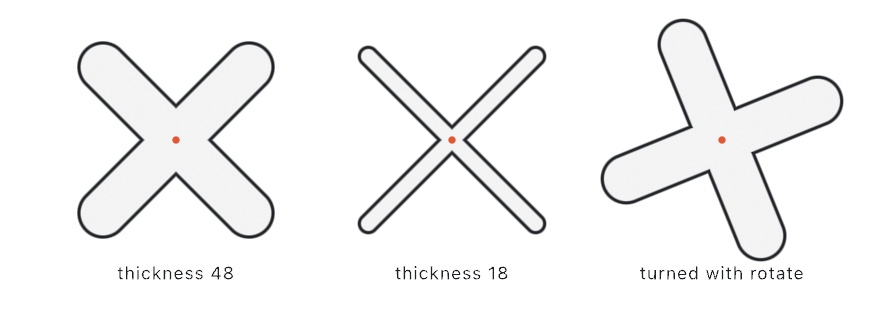
</picture>

```swift
drawRoundedX(width / 2, height / 2, 240, 56)                   // a chunky rounded X
```

<a name="blobbycross"></a>

#### drawBlobbyCross

```swift
drawBlobbyCross(_ x: Double, _ y: Double, _ radius: Double, blobbiness: Double = 0.5)
drawBlobbyCross(center: Vector2, radius: Double, blobbiness: Double = 0.5)
```

A four-armed cross with concave, inward-curving sides, its tips reaching `radius` along each axis. `blobbiness` (`0...1`) sets how pinched the waist is, so larger is more bulbous and smaller is spikier. Rotate it with the transform stack (45° gives a diagonal four-point pinwheel).

<picture>
  <source media="(prefers-color-scheme: dark)" srcset="../Images/DrawBlobbyCross-dark.jpg">
  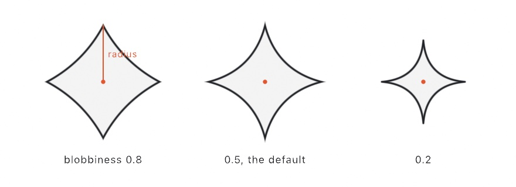
</picture>

```swift
drawBlobbyCross(width / 2, height / 2, 150)                    // the default waist
drawBlobbyCross(width / 2, height / 2, 150, blobbiness: 0.35)  // spikier arms
```

<a name="tunnel"></a>

#### drawTunnel

```swift
drawTunnel(_ x: Double, _ y: Double, _ width: Double, _ height: Double)
drawTunnel(center: Vector2, width: Double, height: Double)
```

A tunnel or archway centered at `(x, y)`, with vertical walls and a flat base under a semicircular top, `width` wide and `height` tall overall. The arch radius is half the width, so `height` must be at least `width / 2`. Rotate it with the transform stack to aim the opening.

<picture>
  <source media="(prefers-color-scheme: dark)" srcset="../Images/DrawTunnel-dark.jpg">
  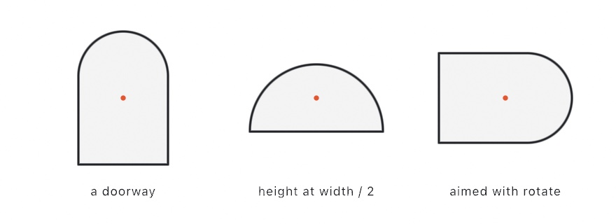
</picture>

```swift
drawTunnel(width / 2, height / 2, 200, 260)                    // a doorway
```

<a name="stairs"></a>

#### drawStairs

```swift
drawStairs(_ x: Double, _ y: Double, _ stepWidth: Double, _ stepHeight: Double, steps: Int)
drawStairs(center: Vector2, stepWidth: Double, stepHeight: Double, steps: Int)
```

A staircase centered at `(x, y)`, with `steps` steps ascending to the right, each `stepWidth` wide and `stepHeight` tall. The whole flight spans `stepWidth · steps` by `stepHeight · steps`. Rotate it with the transform stack.

<picture>
  <source media="(prefers-color-scheme: dark)" srcset="../Images/DrawStairs-dark.jpg">
  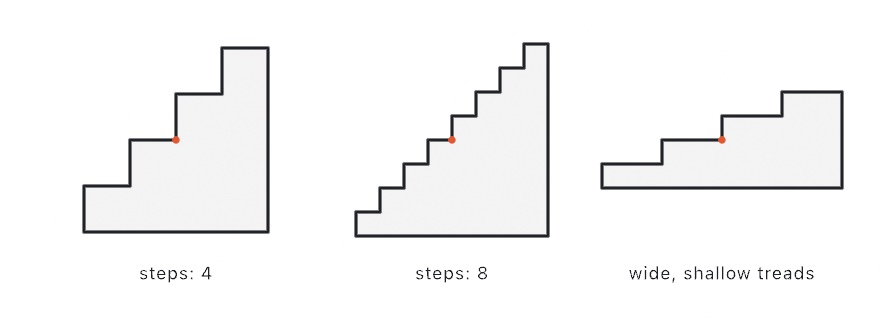
</picture>

```swift
drawStairs(width / 2, height / 2, 60, 60, steps: 4)            // a four-step flight
```

<a name="cools"></a>

#### drawCoolS

```swift
drawCoolS(_ x: Double, _ y: Double, _ size: Double)
drawCoolS(center: Vector2, size: Double)
```

The hand-drawn "S" off the back of every school notebook, centered at `(x, y)`, `size` points tall, drawn as its filled silhouette. Add a stroke to trace its outline, or rotate it with the transform stack.

<picture>
  <source media="(prefers-color-scheme: dark)" srcset="../Images/DrawCoolS-dark.jpg">
  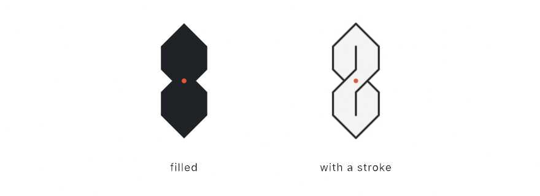
</picture>

```swift
drawCoolS(width / 2, height / 2, 360)                          // the doodle, filled
```

### Paths & custom shapes

<a name="polyline"></a>

#### drawPolyline

```swift
drawPolyline(_ points: [Vector2], closed: Bool = false)
```

A connected path through `points`, stroked. It's open by default, and `closed: true` joins it back to its first point. Its corners (including a closed path's seam) follow [strokeJoin](#strokeJoin), and its open ends follow [strokeCap](#strokeCap).

<picture>
  <source media="(prefers-color-scheme: dark)" srcset="../Images/DrawPolyline-dark.jpg">
  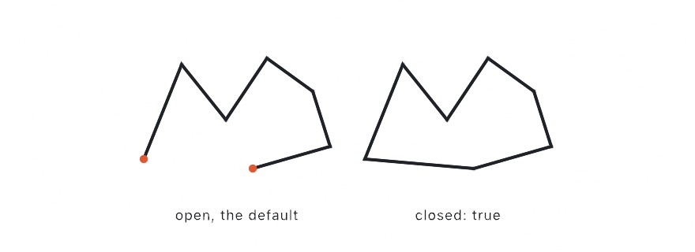
</picture>

```swift
let wave = stride(from: 0.0, through: width, by: 8).map { x in
    Vector2(x, height / 2 + sin(x * 0.02 + time) * 60)
}
stroke(.black)
drawPolyline(wave)
```

<a name="polygon"></a>

#### drawPolygon

```swift
drawPolygon(_ points: [Vector2])
```

A filled convex polygon through `points` (plus a stroked outline). The fan fill is convex-only, so for concave outlines or holes, use `drawShape`.

<picture>
  <source media="(prefers-color-scheme: dark)" srcset="../Images/DrawPolygon-dark.jpg">
  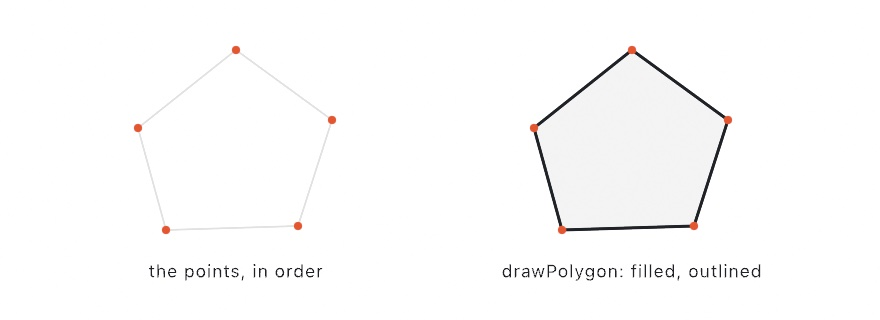
</picture>

```swift
let triangle = [Vector2(200, 120), Vector2(280, 280), Vector2(120, 280)]
fill(.black)
drawPolygon(triangle)
```

<a name="shape"></a>

#### drawShape

```swift
drawShape(_ shape: Shape)
```

A vector [`Shape`](../Drawing/Geometry.md#shape), which is a filled region that may be **concave** and may have **holes**, plus a stroked outline of each contour. The fill is triangulated with even-odd winding, so nested contours become holes, and open contours are stroke-only.

<picture>
  <source media="(prefers-color-scheme: dark)" srcset="../Images/DrawShape-dark.jpg">
  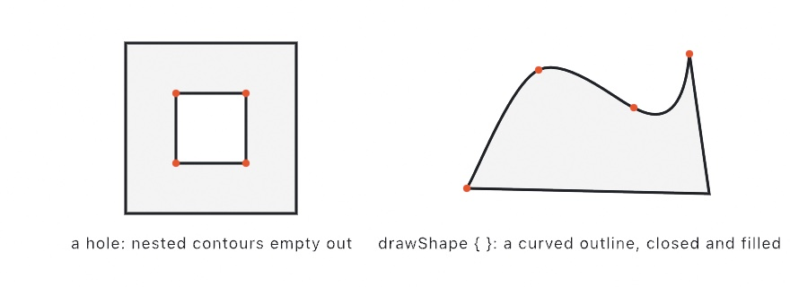
</picture>

```swift
// A square with a square hole, a frame.
let outer = [Vector2(60, 60), Vector2(260, 60), Vector2(260, 260), Vector2(60, 260)]
let hole  = [Vector2(120, 120), Vector2(200, 120), Vector2(200, 200), Vector2(120, 200)]
fill(.black)
drawShape(Shape(outer: outer, holes: [hole]))
```

There's also a closure form that builds a curved or straight outline inline with a [`Path`](../Drawing/Geometry.md#path). Trace it with the pen methods (`move`, `line`, `curve`, `quadCurve`, `cubicCurve`, `close`), and it fills (if closed) and strokes like any `Shape`:

```swift
drawShape { p in
    p.move(to: Vector2(200, 600))
    p.curve(to: Vector2(400, 480))     // smooth through the points
    p.curve(to: Vector2(600, 560))
    p.quadCurve(to: Vector2(820, 360), control: Vector2(720, 620))
    p.close()
}
```

<a name="curve"></a>

#### drawCurve

```swift
drawCurve(_ points: [Vector2], closed: Bool = false)
```

A **smooth curve through `points`**, a Catmull-Rom spline that passes through each point with tangents derived from its neighbors, so you draw a "wiggle" straight from a list of points with no control points to place. `closed: false` (the default) is an open, stroked line, and `closed: true` makes a closed, fillable loop. It's sugar over [`Path`](../Drawing/Geometry.md#path) + `curve(to:)`.

<picture>
  <source media="(prefers-color-scheme: dark)" srcset="../Images/DrawCurve-dark.jpg">
  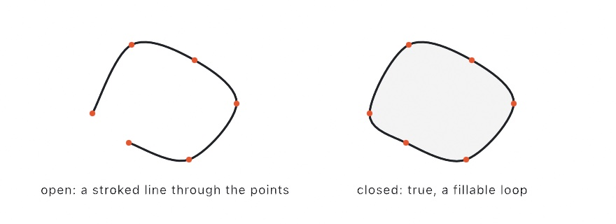
</picture>

```swift
let pts = (0...8).map { i in
    Vector2(120 + Double(i) * 100, height / 2 + sin(time + Double(i)) * 80)
}
stroke(.black)
strokeWeight(3)
drawCurve(pts)            // a smooth wave that animates with `time`
```

<a name="batches"></a>

### Batches

```swift
drawCircles(_ circles: [Circle])
drawCircles(_ centers: [Vector2], radius: Double)
drawPoints(_ points: [Vector2])
drawPoints(_ points: [Vector2], size: Double)
drawRects(_ rectangles: [Rectangle], cornerRadius: Double = 0)
```

These are collection-call sugar, where one Swift call draws a whole array. The current `fill`, `stroke`, and transform apply to every shape in the array, so reach for them when the shapes share a style, as a point cloud, a scatter, or a grid does. Each shape is still its own instanced quad, so a batch costs the same as the loop it replaces. It's the call site that gets shorter, not the GPU work.

```swift
let seeds = (0..<800).map { i -> Circle in
    let a = Double(i) * 2.39996                 // the golden angle
    let r = 8 * Double(i).squareRoot()
    return Circle(x: cos(a) * r, y: sin(a) * r, radius: 4)
}
fill(.white)
noStroke()
withState {
    translate(width / 2, height / 2)
    drawCircles(seeds)                          // a sunflower, in one call
}
```

To vary the style per shape, giving each a different color or radius, drop back to the single-shape call in a loop (`for c in circles { fill(...); drawCircle(c) }`). The batch forms are for when one style covers the whole array.

### Transforms and state

Transforms move, turn, and stretch the **coordinate system**, not the shapes you've already drawn, so every draw call *after* one is measured in the new frame. They stack (each builds on the previous), and they reset every frame, so `draw()` always starts from the top-left origin. Wrap them in [`withState { }`](#isolated) to keep a transform local. Order matters: `translate` then `rotate` moves out and spins in place (a top), while `rotate` then `translate` moves along the already-tilted axes (an orbit).

<picture>
  <source media="(prefers-color-scheme: dark)" srcset="../../Guide/Images/06-GridsAndRepetition/TransformSteps-dark.jpg">
  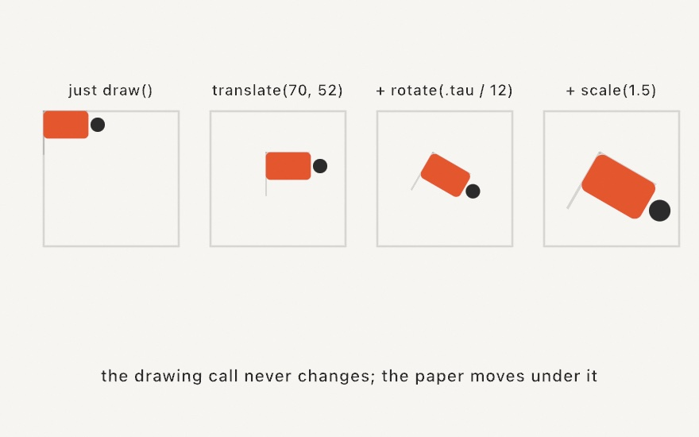
</picture>

<a name="translate"></a>

#### translate

```swift
translate(_ x: Double, _ y: Double)
translate(_ offset: Vector2)
```

Shift the origin. Part of the per-frame transform stack.

```swift
translate(width / 2, height / 2)        // origin now at the center
drawCircle(0, 0, 60)
```

<a name="rotate"></a>

#### rotate

```swift
rotate(_ radians: Double)
```

Rotate the coordinate system (clockwise, since y is down).

```swift
translate(width / 2, height / 2)
rotate(time)                            // spin over time
drawRect(center: .zero, width: 160, height: 40)
```

<a name="scale"></a>

#### scale

```swift
scale(_ amount: Double)
scale(_ x: Double, _ y: Double)
```

Scale the coordinate system, uniformly or per axis. (This is the transform, distinct from the read-only `scale` property in [Canvas](../Core/Canvas.md).)

```swift
translate(width / 2, height / 2)
scale(1.5)                              // everything after is 1.5×
drawCircle(0, 0, 80)
```

<a name="symmetry"></a>

#### symmetry / noSymmetry

```swift
symmetry(_ folds: Int, mirrored: Bool = false)
noSymmetry()
```

Replicate everything drawn next into `folds` copies rotated evenly around the current origin, which is the kaleidoscope, or mandala, mode. Draw one wedge and the folds complete the picture. `mirrored: true` adds a reflected copy per fold (mirrored across the local x-axis), the classic kaleidoscope's doubled symmetry.

<picture>
  <source media="(prefers-color-scheme: dark)" srcset="../../Guide/Images/06-GridsAndRepetition/Kaleidoscope-dark.jpg">
  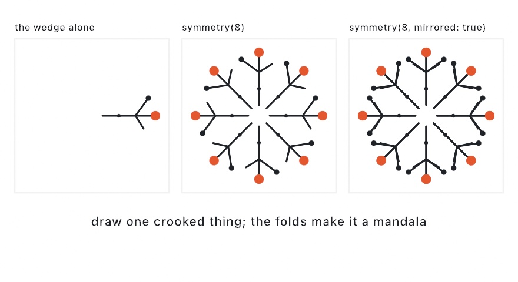
</picture>

The fold pivot and the mirror axis are the origin and x-axis *at the call*, so `translate` first to place the center, and `rotate` to aim the seam. Transforms applied after `symmetry` compose inside every fold, so an orbiting shape orbits in all of them at once. It's drawing state like `fill`, so it stays on until `noSymmetry()`, and `withState { }` restores it.

```swift
translate(width / 2, height / 2)   // fold around the canvas center
symmetry(8, mirrored: true)
drawCircle(240, 40, 30)            // appears 16 times
noSymmetry()
drawCircle(0, 0, 26)               // the center medallion, drawn once
```

Replication covers all 2D drawing (shapes, strokes, images, text, SDF fields) and rides into SVG export, while 3D geometry and GPU particles are untouched. Each copy is real geometry, so `folds` also multiplies the drawing cost, exactly as the equivalent loop would. See the [`Patterns/Kaleidoscope`](../../Examples/Patterns/Kaleidoscope/Sketch.swift) example.

<a name="clip"></a>

#### withClip

```swift
withClip(_ shape: Shape, _ body: () -> Void)
withClip(_ rect: Rectangle, _ body: () -> Void)
withClip(_ circle: Circle, _ body: () -> Void)
```

Run `body` with drawing confined to the region. It's a stencil mask, so everything drawn inside the block (fills, strokes, images, text, even 3D geometry) lands only where the region covers, and the previous clip is restored when the block ends. Any vector `Shape` works, holes and concavity included, and its `winding` rule is honored. Open contours don't fill, so a shape with no fillable region clips everything out. Nested clips intersect: a `withClip` block inside another draws only where both regions overlap.

<picture>
  <source media="(prefers-color-scheme: dark)" srcset="../../Guide/Images/06-GridsAndRepetition/ClipRegions-dark.jpg">
  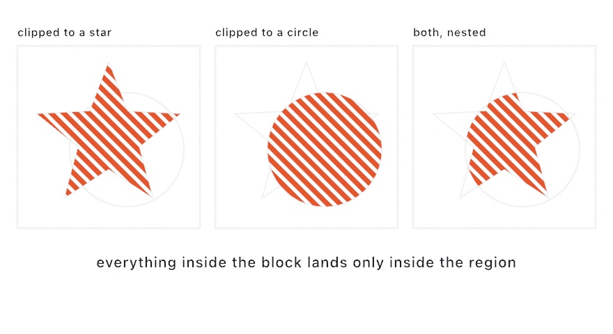
</picture>

The region is fixed where the current transform places it at the call, like a drawn fill, so transforms inside the block move the *drawing*, not the clip. Like `withState` (and `layer { }`), any drawing state the block changes is restored on exit. The clip edge anti-aliases at MSAA resolution, and the region rides into [SVG export](../Output/Export.md) as a native `<clipPath>`.

```swift
translate(width / 2, height / 2)
withClip(Circle(x: 0, y: 0, radius: 300)) {
    for i in 0 ..< 24 {                     // stripes exist only in the disk
        fill(i % 2 == 0 ? .white : .black)
        drawRect(Double(i) * 30 - 360, -360, 30, 720)
    }
}
drawCircle(0, 0, 12)                        // after the block: unclipped
```

Clipping is scoped to the current drawing surface, so a `layer { }` opened inside a clip block starts unclipped (clip inside the layer's own block instead). For masking a whole layer with soft edges or an image matte, reach for [`masked(by:)`](Effects.md) in the effects tier. `withClip` is the cheaper, geometric tool for "keep this drawing inside that region" mid-frame. See the [`Shapes/Clipping`](../../Examples/Shapes/Clipping/Sketch.swift) example.

<a name="viewbox"></a>

#### withViewBox

```swift
withViewBox(_ rect: Rectangle, fit: ImageFit = .contain, _ body: () -> Void)
```

Run `body` inside `rect` as if that rectangle were the whole canvas. Drawing is clipped to it and the coordinates are remapped, so `0...width` and `0...height` land on the box. That is how one window shows several versions of a piece at once.

```swift
for (i, cell) in grid(columns: 3, rows: 2, padding: 40, gutter: 24).cells.enumerated() {
    withViewBox(cell.frame) {
        randomSeed(i)
        drawThePiece()              // written as though it owned the window
    }
}
```

The block needs no changes to run in a box, and two things are remapped to keep that true:

- **`background(_:)` fills this box's own canvas** rather than setting the frame's clear color. The clear color belongs to the whole frame and to every other box on it, so a box wiping it would take the others with it.
- **The mouse arrives in the box's coordinates**, so an interactive piece works in each box independently. A pointer outside the box reads proportionally outside `0...width`, the way [`Rectangle.point(u:v:)`](Geometry.md#rectangle) does.

Both are restored on exit, and boxes nest: a box inside a box composes both mappings, and the clips intersect.

`fit` says what happens when the box is not the canvas's shape, and means exactly what it means for a picture (see [`ImageFit`](Images.md#fit)): `.contain` puts the whole virtual canvas inside and leaves the box showing along two edges, `.cover` fills the box and crops what runs past, `.stretch` squashes to fit. A box of the canvas's own shape gets the same answer from all three.

What does **not** change is `width` and `height`, on purpose: the code inside believes it has the whole canvas, which is what lets you hand an unmodified piece to a box. One thing follows from that, and it is worth knowing before you lay out a sheet. The virtual canvas has the *sketch's* shape, not the box's. Boxes shaped like the canvas are therefore the case where nothing is letterboxed. Labels and frames are best drawn outside the block, in canvas coordinates, so they keep one size while the pieces are scaled down. See the [`Rendering/ViewBoxes`](../../Examples/Rendering/ViewBoxes/Sketch.swift) example.

<a name="viewcontrol"></a>

#### viewControl

```swift
viewControl(center: Vector2? = nil, zoom: Double = 1, in range: ClosedRange<Double> = 0.05...50)
```

Hand the view of the canvas to whoever is watching: drag to pan, scroll to zoom. Call it once each `draw()`, before the drawing it should move. It is the 2D counterpart of [`cameraControl()`](../3D/Camera.md#control), and opt-in the same way: a sketch that never calls it never pays.

```swift
override func draw() {
    background(.white)
    viewControl()
    drawTheWholePiece()          // now pannable and zoomable
}
```

What it leaves in force is a plain transform, so everything drawn after it moves together and anything drawn *before* it stays put. That is where a fixed backdrop belongs. For a HUD that has to be drawn last, wrap the call and the piece in a `withState { }` block and draw the HUD after it.

`center` and `zoom` frame the *opening* view and are applied on the first call only, so passing them every frame does not fight the dragging. `zoom` is how many screen pixels one canvas unit covers, and `range` bounds where the wheel can take it. `viewCenter` and `viewZoom` report where the view is, and `resetView()` puts it back to its opening framing, which is what a reset key would call.

| Gesture | Action |
| --- | --- |
| Drag | Pan (the content follows the pointer exactly) |
| Scroll | Zoom about the pointer (what you point at stays under it) |

Neither gesture is damped, unlike the 3D camera. An orbit gains from a little inertia; a flat plane under a finger does not.

The mouse is remapped into the coordinates now on screen for the rest of the frame, so `drawCircle(mouseX, mouseY, 20)` lands under the pointer at any zoom and hit-testing keeps working. The pointer itself is restored before the next frame, so the remap never compounds. (It lasts the frame rather than the block, so a `withState { }` around the call does not put it back.)

Zooming costs nothing in fidelity, because the drawing is vector. Text set at four units is a smudge at the opening view and crisp four notches in, with nothing re-rendered to get there. See the [`Input/PanAndZoom`](../../Examples/Input/PanAndZoom/Sketch.swift) example.

<a name="isolated"></a>

#### withState

```swift
withState(_ body: () -> Void)
withState(at position: Vector2, rotation: Double = 0, scale: Double = 1, _ body: () -> Void)
withState(at position: Vector3, _ body: () -> Void)
```

Run `body` with the current transform and style saved, then restored. This is the scoped form of `pushState`/`popState`, and the one to reach for: the changes stay inside the braces, like scribbling on a sheet laid over your drawing and then lifting it off.

```swift
withState {
    translate(width / 2, height / 2)
    rotate(time)
    fill(.red)
    drawRect(center: .zero, width: 160, height: 40)
}
// transform and fill are back to what they were
```

The `at:` form builds the placement in, collapsing the most common block, "move there, turn, draw", to its one interesting line. Inside it the origin sits at `position`, so draw around `.zero`:

```swift
withState(at: p, rotation: a) {
    drawRect(center: .zero, width: 40, height: 8)
}
```

The moves apply in the fixed order translate, rotate, scale; for any other order, write the block out. The `Vector3` form is the same idea for placing a mesh in space.

<a name="push"></a>

#### pushState / popState

```swift
pushState()
popState()
```

Manually save and restore the transform and style. Prefer `withState { }` unless you need the calls separated.

```swift
pushState()
translate(100, 100)
drawCircle(0, 0, 40)
popState()
```
