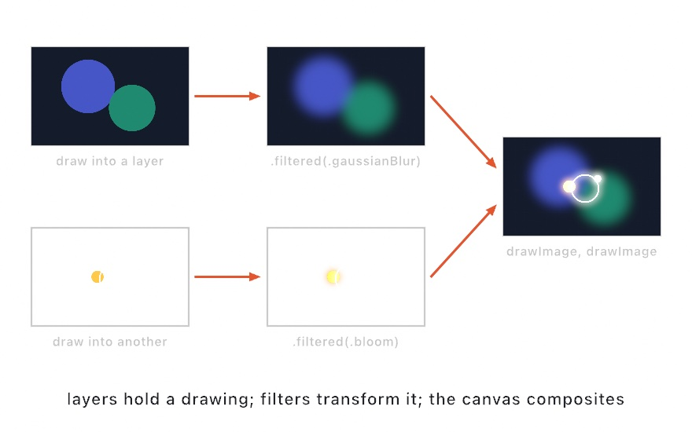
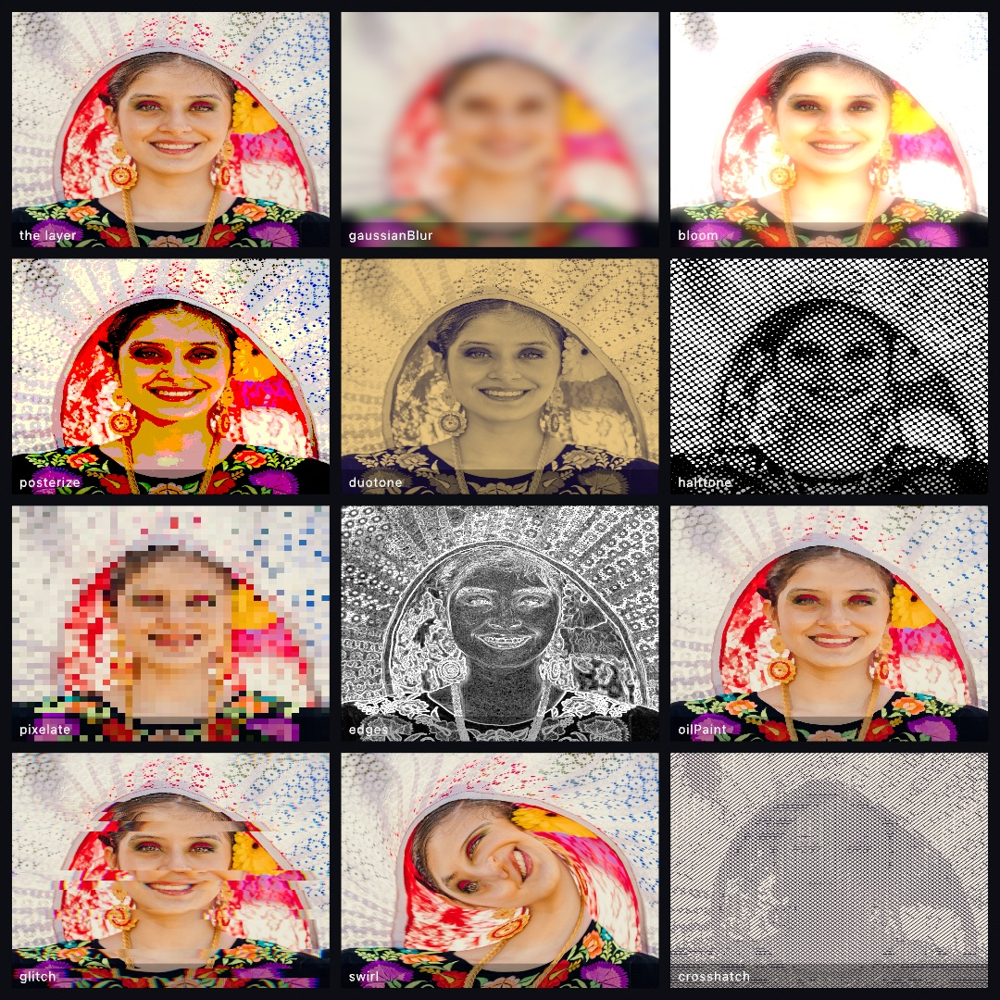
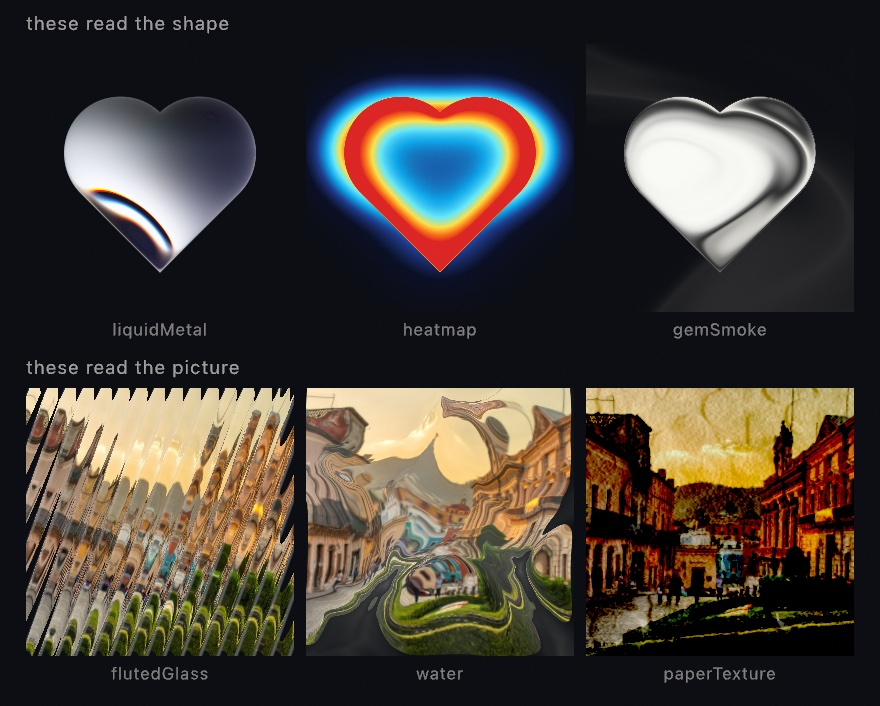
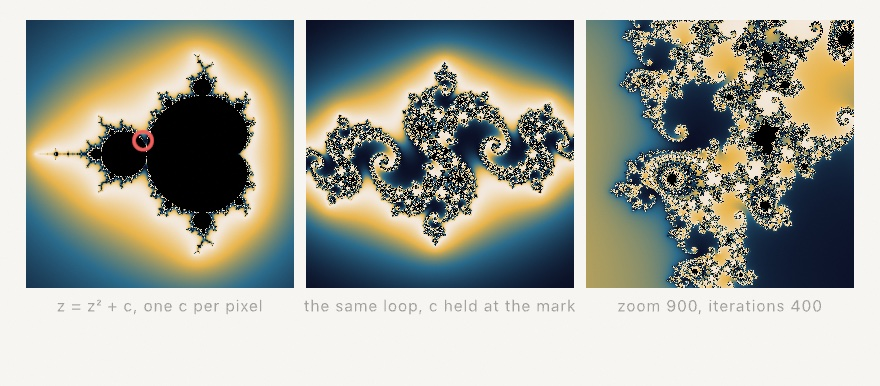
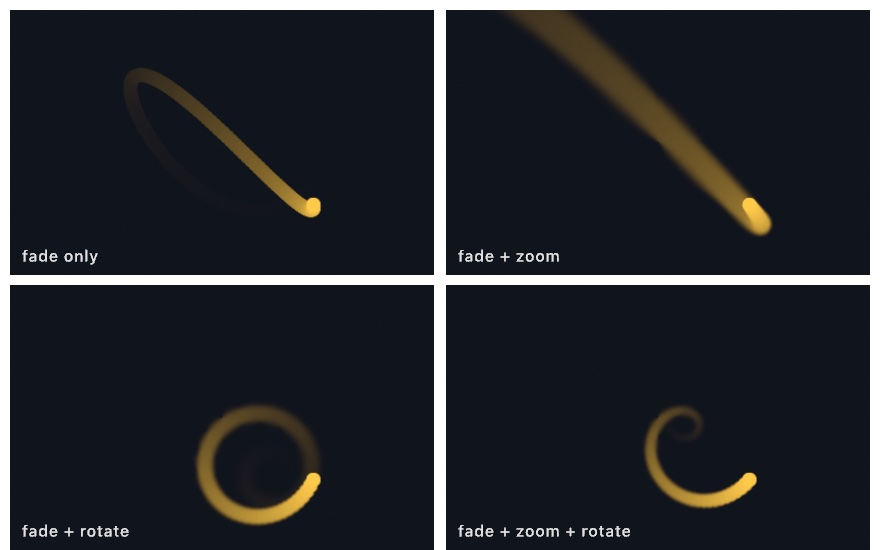
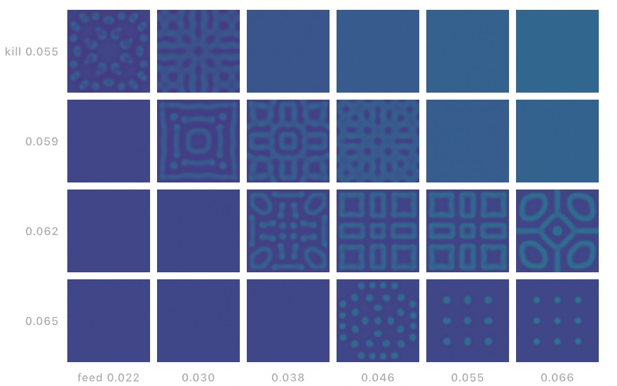
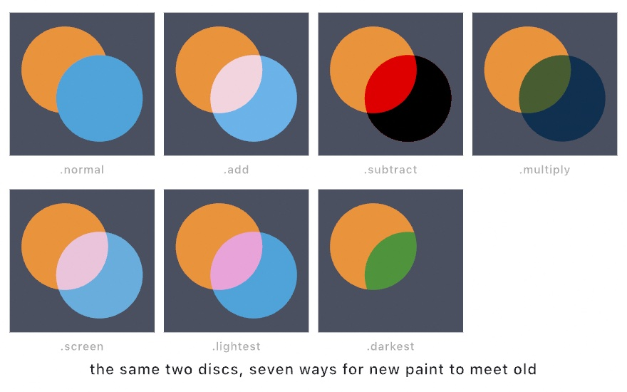

#### <sup>[Ollin](../../README.md) → [Documentation](../README.md) → [Drawing](./README.md) → `Effects`</sup>

---

## Layered effects

Draw into **off-screen layers**, run GPU **filters** over them (blur, bloom), and **composite** the results back onto the canvas with blend modes. That is how you build glow, soft backdrops, depth-of-field haze, and post-processing looks. The design follows the OPENRNDR `compose`/`Filter` model on Ollin's Metal core.

Everything stays on the GPU. A layer is a Metal texture you draw into and then sample. A filter reads one texture and writes another. Compositing is an ordinary [`drawImage`](../Drawing/Images.md) with a [`blendMode`](../Drawing/Drawing.md#blendMode). Nothing is ever read back to the CPU between steps. Copying a layer back to combine it is the slow path other tools fall into, and it never happens here.

<picture>
  <source media="(prefers-color-scheme: dark)" srcset="../../Guide/Images/16-LayersAndEffects/Layers-dark.jpg">
  
</picture>

```swift
override func draw() {
    background(.black)

    let layer = makeRenderTarget()                 // a full-canvas off-screen layer
    withTarget(layer) {                         // …draw into it, scoped like withState
        background(.clear)
        fill(.orange); noStroke()
        drawCircle(width / 2, height / 2, 200)
    }

    blendMode(.add)                             // add the glow as light
    drawImage(layer.filtered(.bloom(amount: 1.6)).image, 0, 0)
}
```

### Contents

- [renderTarget](#rendertarget) - make an off-screen layer
- [withTarget](#withtarget) - draw into a layer
- [RenderTarget.image](#image) - composite a layer back
- [filtered](#filtered) - run a filter over a layer
- [Filter](#filter) - the filter catalog (blur, bloom, color, stylize)
- [combined / Combine](#combined) - combine two layers (mask, displace, disperse, mix, seamless clone, defocus, ambient occlusion, screen-space reflections)
- [depth](#depth) - a 3D scene's depth buffer as a layer (feed `.defocus` / `.ambientOcclusion` / `.screenSpaceReflections`)
- [generate / Generator](#generate) - procedural pattern sources
- [postProcess](#postprocess) - filter the whole frame
- [feedback / withFeedback](#feedback) - a layer that remembers itself (trails, tunnels)
- [simField / Sim](#simfield) - a layer that runs a simulation (reaction-diffusion, Game of Life, fluid, the self-warp motion feedback)
- [compose / layer](#compose) - declare a stack of layers as one block
- [aside](#aside) - a helper layer that feeds another layer's effect
- [Notes](#notes)

<a id="rendertarget"></a>
### makeRenderTarget(scale:)

Make an off-screen layer to draw into. The no-argument form is full-canvas size, and `scale` renders the layer at a fraction of that resolution.

```swift
let layer = makeRenderTarget()              // full canvas
let haze  = makeRenderTarget(scale: 0.5)    // half-resolution, for a layer you'll blur
```

Effects are **fill-rate bound**, because the cost tracks pixels × passes. So a layer you are going to blur or glow rarely needs full detail. Lower `scale` and the layer upsamples when you draw it back. There is also an explicit-size form for a layer that is not full-canvas:

```swift
let badge = makeRenderTarget(width: 256, height: 256)
```

Make a target inside `draw()`. It is a per-frame handle. Ollin pools the GPU texture behind it and reuses it across frames, so making one each frame does not allocate.

`makeRenderTarget(scale:precision:)` also takes a `precision`. The default is `.float16` (`rgba16Float`). Use `.float32` (`rgba32Float`) for a layer whose values are sums rather than a picture. Half float stops moving once a step falls under about one part in a thousand of the value. Single precision costs twice the memory, and a filter over the layer still writes a half-float layer.

<a id="withtarget"></a>
### withTarget(_:_:)

Redirect everything drawn in the closure into `target` instead of the canvas. The block is scoped exactly like [`withState { }`](../Drawing/Drawing.md#isolated). The current drawing state and transform carry in, and drawing returns to the canvas when the block ends.

```swift
let layer = makeRenderTarget()
withTarget(layer) {
    background(.clear)                  // clear THIS layer (transparent here)
    fill(.white); noStroke()
    drawCircle(width / 2, height / 2, 120)
}
// back to drawing on the canvas
```

Call [`background(_:)`](../Drawing/Drawing.md#background) inside the block to clear the layer. Inside a `withTarget` it clears *that layer*, meaning its fill color and its geometry so far, and it leaves the canvas untouched. A layer starts transparent, so a layer you never wrote, or wrote only in part, composites as nothing where you did not draw.

<a id="image"></a>
### RenderTarget.image

A layer as a drawable [`Image`](../Drawing/Images.md). You composite it with the ordinary `drawImage`, and it follows the transform stack, `tint`, and `blendMode` like any image:

```swift
drawImage(layer.image, 0, 0)                       // at the top-left, native size
drawImage(layer.image, 0, 0, width, height)        // scaled to fill
blendMode(.add); drawImage(layer.image, 0, 0)      // added as light
```

The image always shows what was drawn into the layer *this* frame.

<a id="filtered"></a>
### filtered(_:)

Run a [`Filter`](#filter) over a layer and get back a new layer. The new layer is drawable and filterable in turn, so effects chain:

```swift
let blurred = layer.filtered(.gaussianBlur(radius: 20))
let glowed  = layer.filtered(.bloom()).filtered(.gaussianBlur(radius: 4))
drawImage(blurred.image, 0, 0)
```

The work runs on the GPU during the frame's render, and `filtered` only records it.

<a id="filter"></a>
### Filter

Filters are value descriptors built with static factories. They composite in
[linear light](../Drawing/HDR.md), so grades and blends are physically correct. Every family below is a segment of the `Effects/FilterCatalog` contact sheet,
and `Effects/Glitter` shows the iridescence and glitter pair on shapes. The catalog:



#### Blur & glow

- **`.gaussianBlur(radius:)`** a Gaussian blur, where `radius` is the extent in pixels, so larger is softer. It runs on a hardware Gaussian kernel.
- **`.bloom(threshold:intensity:radius:)`** glow, where pixels brighter than `threshold` bleed light into their surroundings. Ollin extracts the bright parts, blurs them by `radius`, and adds them back at `intensity`. The result is the original **plus** its glow, ready to composite, often additively. Brightness here is the **max color channel** (HSV "value"), not luminance, so a vivid full-brightness mark blooms the same whatever its hue. `threshold` runs `0…1` over the linear-light frame, so HDR highlights (values above 1, from additive light) bloom hardest.
- **`.bilateral(radius:sigma:)`** edge-preserving smoothing that blurs flat areas while keeping edges sharp, the base for a cartoon or a denoise look. `sigma` is how different a neighbor's color may be before it stops blending, so a smaller value keeps more edges.
- **`.motionBlur(angle:distance:)`** a directional smear along `angle`, where `distance` is a fraction of the layer. It gives you the streak of a moving subject.
- **`.radialBlur(amount:)`** a zoom blur smearing outward from the center, where `amount` is a fraction of the layer.

```swift
layer.filtered(.gaussianBlur(radius: 24))
layer.filtered(.bloom(threshold: 0.6, amount: 1.4, radius: 24))
layer.filtered(.bilateral(radius: 6, sigma: 0.18))
```

#### Color & tone

- **`.colorGrade(brightness:contrast:saturation:hue:)`** the everyday grade. It takes an additive `brightness` and a `contrast` that pivots on mid-gray. It also takes a `saturation` (0 = gray, >1 = punchier) and a `hue` rotation in **turns** (0…1 wraps the wheel). All four default to no change, so pass only the ones you want.
- **`.invert(amount:)`** move the colors toward the photographic negative, where `amount` 1 is the full negative.
- **`.posterize(levels:)`** quantize each channel to flat steps, for the banding of a screen print.
- **`.threshold(_:softness:)`** cut the layer to two tones at a brightness, where `softness` widens the edge.
- **`.sepia(amount:)`** a warm monochrome tone, blended by `amount`.
- **`.duotone(dark:light:amount:)`** map luminance between two colors (shadows → `dark`, highlights → `light`).
- **`.gradientMap(_:amount:)`** read luminance and look its color up along a [`Ramp`](../Drawing/Color.md) or [`Colormap`](../Drawing/Color.md) (viridis, magma, turbo, …). It is a fast way to recolor a grayscale field or a whole scene.
- **`.softProof(_:warning:amount:)`** show the layer as a press will print it, through an ICC profile. The colors ink cannot reach are pulled in, and the blacks are lifted to what ink can do. `warning` paints what will not survive in that color instead, and `amount: 0` leaves the colors alone so only the flag shows. See [Print color](../Output/PrintColor.md).
- **`.exposure(stops:)`** scale the light in linear-light stops (+1 doubles, −1 halves).
- `.develop(exposure:ground:)` print a layer of accumulated light. The layer is scaled by `exposure`, rolled off through the Reinhard curve, and laid on `ground`. The ground is added after the curve as a display color, and written as the display value itself. This is what an [`Accumulator`](./Accumulation.md#accumulator)'s `developed` runs. See [Depth of field from light](./DepthOfField.md#develop).
- **`.levels(blackPoint:whitePoint:gamma:)`** the levels control of a photo tool. It pulls `blackPoint` to black and `whitePoint` to white, then bends the midtones by `gamma` (>1 darkens).
- **`.solarize(_:softness:)`** invert the tones above a brightness with a soft fold, for the part-positive, part-negative darkroom look (the Sabattier effect).
- **`.temperature(amount:tint:)`** white balance: `amount` warms (>0) or cools (<0), `tint` pushes toward magenta (>0) or green (<0).
- **`.vibrance(amount:)`** saturation that lifts the muted colors most and the vivid ones least. It strengthens a flat image without blowing out tones that are already saturated.
- **`.colorama(cycles:shift:)`** cycle the hue wheel `cycles` times across luminance, turning a gradient into rainbow bands, and `shift` spins the wheel.
- **`.lumaKey(low:high:invert:)`** a luminance key. It makes the image transparent outside a brightness band, so a dark or light backdrop drops out.

```swift
layer.filtered(.colorGrade(contrast: 1.3, saturation: 1.6, hue: 0.05))
layer.filtered(.gradientMap(.turbo))
layer.filtered(.levels(blackPoint: 0.08, whitePoint: 0.92, gamma: 1.4))
layer.filtered(.vibrance(amount: 0.6))
```

#### Stylize & optical

- **`.antialias(amount:threshold:quality:)`** smooth the stair-stepped edges of a layer that a fragment shader wrote pixel by pixel. Ollin anti-aliases the shapes you draw. A [`generate(_:)`](#generate) pattern, a raymarched field, an [imported shader](../Tools/ShaderImport.md), or a finished chain is different. Each writes a final color per pixel and carries no coverage, so a hard edge inside one comes out as a staircase. This pass works from the image alone. It finds each edge by brightness, follows it to both ends, and reads the layer back a fraction of a pixel across it. That turns the steps into a ramp.

  `threshold` is the contrast an edge needs before the pass touches it at all. A lower value reaches fainter edges and costs more, and a layer with nothing over that contrast comes back byte for byte. `quality` is how far the pass may follow one edge. `amount` is how much of the result to keep, so `amount: 0` hands the layer back unchanged.

  It reads pixels rather than shapes, and that sets what it can do. It cannot tell a stair-step from detail that is genuinely one pixel wide, so it softens both. That is why you place this filter yourself instead of every layer getting it. Place it right after whatever wrote the layer, and before a warp that would smear the ramp it just made. On a measured shallow edge it halves how far the edge strays from the straight line it should lie on. Half rather than none is what a pass reading the finished image can do. See `Examples/Effects/Antialias`.
- **`.edges(intensity:)`** Sobel edge magnitude, drawn as bright edges on black. It is a quick ink or outline pass.
- **`.sharpen(amount:)`** an unsharp mask, which emphasizes local detail.
- **`.vignette(amount:radius:softness:)`** darken toward the corners. It is aspect-correct, so the darkening stays circular.
- **`.chromaticAberration(amount:mode:spectral:quality:)`** pull the color channels apart, the way cheap glass, a misprinted plate, or a lens wide open does. `amount` is the split in fractions of the canvas. `mode` picks which picture you get, because the members of this family look unlike each other rather than like one look at different strengths:

  - **`.magnify`** (the default) scales each channel about the center. Nothing splits in the middle, the split grows in step with the distance out, and straight lines stay straight. This is the physically honest form of lateral color.
  - **`.lens(radius:falloff:)`** shapes that growth. `radius` (0…1 of the half-diagonal) is where the fringe starts to show at all. `falloff` is the exponent it grows by past there, and about 2 reads like glass. `.lens(radius: 0, falloff: 1)` is `.magnify` again.
  - **`.offset(angle:)`** moves every pixel by the same vector, so the middle splits as much as the corner. This is misregistration rather than optics: a plate printed a hair off, an anaglyph, or a scan that slipped.
  - **`.edges`** fringes only where there is an edge. It slides along the local brightness gradient and scales by how strong that gradient is, so flat regions keep their exact color. A positive `amount` leaves a warm halo on the bright side of every edge, and a negative one leaves the cool, purple-fringing kind.
  - **`.axial`** is longitudinal color. The channels differ in *focus* rather than in position, so one end of the spectrum is sharp while the other softens. A positive `amount` keeps red sharp and a negative one keeps blue sharp. That is what turns an out-of-focus highlight green on one side of focus and magenta on the other. It carries most of the look of a fast lens wide open, and it pairs with [`.defocus`](#combined) rather than replacing it.

  `spectral: true` takes the split over a whole set of wavelength taps rather than three, which turns three hard ghosts into a continuous rainbow smear. `quality` sets how many taps (7 / 15 / 31). This is the largest single jump in quality here. It is off by default, because three taps give the cheap glitch look people often want. Every mode hands the layer back untouched at `amount: 0`, so an A/B costs nothing. Each tap is unpremultiplied before its channel is read. A layer with soft edges of its own then keeps them instead of growing a dark rim. Past the frame edge the sampler clamps. See `Examples/Effects/Dispersion`, and use [`.disperse`](#combined) to drive the amount from a second layer.
- **`.halftone(scale:angle:)`** a rotated dot screen, dot size tracking brightness.
- **`.dither(levels:)`** ordered dithering (Bayer 4×4), the retro look that fakes more shades than it has.
- **`.dither(dark:light:bias:pixelSize:)`** the two-tone variant. The same ordered pattern is mapped onto exactly two chosen colors and cut by tone, which gives the 1-bit or newsprint look in any palette. `bias` shifts the cut (positive lightens), and either color may be transparent so the shadows drop out.
- **`.grain(amount:seed:)`** film grain, so feed `seed` your `time` or `frameCount` for grain that moves.
- **`.pixelate(size:channel:tint:)`** mosaic into blocks `size` canvas-pixels across, where `channel` can read one channel out as gray and `tint` can recolor it.
- **`.lineScreen(scale:softness:angle:foreground:background:)`** a brightness-driven line screen. Each cell paints a centered bar whose width tracks that cell's brightness, in `foreground` over `background`.
- **`.emboss(amount:angle:)`** light the luminance slope along `angle` as a gray relief, like stamped metal.
- **`.oilPaint(radius:)`** the Kuwahara region filter. It flattens detail into oil-paint patches while keeping edges crisp. `radius` is the brush size in pixels, so bigger is broader and costs more.
- **`.crosshatch(scale:foreground:background:)`** pencil shading, drawn as layered diagonal strokes that thicken as the image darkens.
- **`.toon(levels:edges:)`** cel shading. It flattens the layer into `levels` brightness bands and inks the Sobel edges over them.
- **`.xdog(radius:sharpening:threshold:softness:flow:foreground:background:)`** the picture as pen and ink. A line goes where the picture has an edge, solid ink where it is dark, and the rest is left as paper, in `foreground` over `background`. Two blurs of the brightness are subtracted, the smaller one `radius` pixels wide and the other 1.6 times that. The difference is pushed over the tone by `sharpening`, and the result is cut at `threshold`: paper above it, ink below, through a ramp `softness` wide. A softness of 0 is a hard two-tone print, and the default of 0.2 keeps a gray wash under the cut, which is the look the technique is known for.

  The blur is taken across each edge, and its response is gathered `flow` pixels along it, following the edge's own direction. That is what makes the lines run continuous rather than breaking into speckle. `flow: 0` leaves that out, which is worth an A/B on a noisy picture. The picture is read as its perceptual brightness over the paper. So `threshold` is on the 0…1 scale a display shows, and an edge in a shadow counts as much as one in the light. Empty space on a transparent layer reads as paper rather than ink. A transparent `background` counts as white for that reading and stays transparent in the result. It runs as four passes, which the [web page](../Output/Web.md) export does not carry. See `Examples/Effects/InkDrawing`.
- **`.median()`** a 3×3 median, knocking out speckle and stray pixels while keeping edges sharp.
- **`.contour(levels:intensity:)`** dark iso-brightness lines (one every `1/levels` of the range), turning tone into a topographic map.
- **`.cmykHalftone(scale:)`** separate into cyan/magenta/yellow/black and screen each as rotated dots at the classic print angles, for the color-process look.
- **`.normalMap(strength:)`** read the image as a height field and output its surface normal as an RGB vector, which gives the bluish bump-map look. The result is ready to feed `.displace` (see [combine](#combined)) or a lighting pass.
- **`.relight(_:angle:elevation:height:intensity:color:)`** read the layer as a height map (bright = raised) and light it as embossed matter with a chosen finish. The finishes are `.matte` clay, `.metal`, wet `.glass`, grainy `.sand`, and `.liquid`, and the last two refract the image beneath. `angle` sets where the light comes from, and `elevation` how low it rakes, so grazing light deepens the relief. `height` exaggerates the slopes, and `color` overrides the material color, which the layer otherwise keeps as its own. It is the cheap 2D cousin of the 3D materials. A noise field or a simulation then reads at once as terrain, hammered gold, or wet skin. See `Examples/Effects/Relight`.

  The relief it lights is the layer's broad shape, not its finest pixels. Slope weights a wavelength by 1/L. Left alone, detail a few pixels across would tilt the surface as steeply as the shape the layer is made of. A razor highlight would then scatter that into speckle. So the slope is measured over a small span instead of a single pixel. That rolls off anything under about six pixels and leaves broader relief untouched. The span grows with resolution, so a sketch relit at 4K keeps the same surface character it had at 1080. Feed it something smooth, because a heavily dithered or noisy layer has little broad relief to light.
- **`.iridescence(amount:scale:bands:shift:)`** wash the content with the flowing rainbow sheen of a soap film or an oil slick. The colors come from thin-film interference, where each channel cycles at its own wavelength, so the bands run through the film color order. A noise field swirls them across the content, and they follow its shading. `amount` blends the sheen over the original, and `scale` sets how fine the swirl is. `bands` is how many color cycles the film runs through, and `shift` slides the colors, so feed it your `time` for a sheen that flows.
- **`.glitter(density:amount:size:saturation:phase:)`** scatter twinkling sparkle flecks across the content. You get a dense dust of small glints plus occasional bright cross-flare flashes, and they land only where something is drawn. `density` is the fleck grid resolution in cells across the layer. `amount` is the brightness, and flashes run past 1.0 in linear light, so a following `.bloom` makes them glow. `size` scales the flecks, and `saturation` tints them from white (0) toward each fleck's own color (1). `phase` drives the twinkle, so feed it your `time` and it sparkles.
- **`.thinFilm(amount:thickness:variation:ior:scale:shift:quality:)`** wash the content with a *measured* interference film. Where `.iridescence` styles the rainbow, this one works the real physics out per wavelength, over a `quality`-sized set of spectral taps. So the colors arrive in the true film color order. `thickness` is the film's mean depth in nanometers. About 100 is near-clear, 300 to 600 gives the strong colors, and toward 1500 you get the crowded pastel a bubble shows just before it pops. `variation` is how many nanometers the swirl adds and removes, and `ior` is the film's refractive index (1.35 soap, 1.45 oil). `scale` is the swirl frequency, and `shift` slides the swirl, so feed it your `time` for a draining film. See [Spectral color](Spectrum.md) and the `Effects/SoapFilm` example.
- **`.diffraction(amount:angle:orders:falloff:quality:)`** streak bright content into rainbow-split grating orders along `angle`. Each side of the image repeats `orders` times, and every repeat is offset in proportion to wavelength. That is the grating equation, so red always reaches farther than blue, while the image itself stays put. `amount` is the first order's reach as a fraction of the layer. `falloff` is how much dimmer each further order is, and `quality` is the wavelength tap count. Bright-on-dark content plus a following `.bloom` gives the full groove-pattern sparkle. See [Spectral color](Spectrum.md) and the `Effects/SoapFilm` example.

```swift
layer.filtered(.halftone(scale: 48))
layer.filtered(.oilPaint(radius: 5))
layer.filtered(.toon(levels: 5))
layer.filtered(.xdog(flow: 6, foreground: .black, background: Color(hex: 0xF3EBDD)))
layer.filtered(.lineScreen(scale: 60, angle: .pi / 6))
layer.filtered(.iridescence(amount: 0.85, shift: time * 0.2))
layer.filtered(.glitter(phase: time * 2)).filtered(.bloom(threshold: 0.8))
```

#### Retro / optical

- **`.scanlines(count:intensity:)`** darken alternating horizontal lines, the CRT look. `count` is how many lines span the height.
- **`.glitch(amount:seed:)`** tear random blocks of rows sideways and split their channels. Feed `seed` your `time` or `frameCount` so it flickers.
- **`.crt(curvature:scanline:aberration:)`** the whole old-monitor look in one pass: barrel curvature, scanlines, a corner vignette, and a touch of aberration.

```swift
layer.filtered(.scanlines(count: 240))
layer.filtered(.crt())
postProcess(.glitch(amount: 0.3, seed: time * 8))
```

#### Distortion

These filters warp the image's *coordinates*. They re-sample the source at a remapped position, so color passes through untouched. A warp measured from the center stays round on a non-square layer.

- **`.kaleidoscope(segments:angle:)`** fold into mirrored wedges around the center, rotated by `angle`.
- **`.swirl(angle:radius:center:)`** twirl the image into a vortex, with the rotation strongest at `center` and fading to none at `radius`.
- **`.bulge(amount:radius:center:)`** a radial lens where `amount` > 0 bulges (fisheye) and < 0 pinches, easing back to the image at `radius`.
- **`.ripple(amplitude:frequency:phase:center:)`** concentric waves spreading from `center`, like a drop in water.
- **`.wave(amplitude:frequency:phase:vertical:)`** ripple rows side to side (or columns up and down), and animate `phase` for motion.

The three radial warps take an optional `center` in fractions of the layer, measured from the top-left corner and defaulting to the middle. So a cursor-driven lens or vortex is one line: `.bulge(amount: 1, center: Vector2(mouseX / width, mouseY / height))`.
- **`.mirror(vertical:flip:)`** reflect one half of the image onto the other.
- **`.polar(amount:)`** bend around the center by remapping between Cartesian and polar coordinates, a tunnel or fold.
- **`.tile(count:mirror:)`** repeat the image in a `count`×`count` grid, and `mirror` flips alternate cells for a seamless tiling.
- **`.perturb(amount:scale:phase:)`** warp the image by its own internal fbm noise, with no map needed, for a smoky heat-haze ripple.
- **`.droste(inner:twist:zoom:center:angle:)`** put the picture inside itself, without end. The ring between `inner` and the layer's edge repeats at every scale. So a smaller copy of the picture sits in the middle of it, with a smaller copy inside that one. `inner` is the radius of the hole, which is also how much smaller each copy is. `twist` is how many copies one turn around the middle steps down. `0` leaves plain concentric rings, `1` winds them into the single spiral of the Escher construction, and a negative value winds it the other way. `zoom` slides the picture into itself in copies, so `zoom: time * 0.2` is an endless fall that loops exactly every five seconds. The join between one copy and the next shows unless the picture is made for it. Keep the content clear of both edges of the ring, or let the ring end on flat color at each end.

```swift
layer.filtered(.kaleidoscope(segments: 8))
layer.filtered(.swirl(angle: 3, radius: 0.6))
layer.filtered(.droste(inner: 0.4, twist: 1, zoom: time * 0.2))
postProcess(.ripple(amplitude: 0.02, frequency: 12, phase: time * 3))
```

#### Design

These are the image-filter siblings of the [design-pattern generators](#generate), and they share the
same conventions. Animation is an explicit `phase` you feed `time`, and palettes
blend in sRGB so designer colors read true. Three of them read the layer's
**alpha shape**, so draw a shape or logo into a transparent layer and then filter it.
The others transform the whole layer. `Effects/FilterCatalog`'s design family shows six of
them, and `Images/LuminanceMelt` shows the melt.



- **`.liquidMetal(repetition:softness:dispersion:distortion:contour:angle:tint:phase:)`**
  render the alpha shape as flowing chrome. Reflectance bands compress and wrap
  the silhouette as if the shape were inflated, and they carry chromatic fringing.
- **`.heatmap(colors:contour:innerGlow:outerGlow:angle:noise:phase:)`** thermal
  imaging of the alpha shape. Heat blooms inside, a halo radiates outside, and
  traveling waves pulse through. All of it is mapped cold to hot through `colors`,
  whose first stop fades to transparent.
- **`.gemSmoke(colors:body:innerSwirl:outerSwirl:innerGlow:outerGlow:offset:scale:angle:phase:)`**
  smoke coils trapped inside the alpha shape, and leaking around it, over a glassy
  body fill.
- **`.flutedGlass(flutes:shape:profile:distortion:shift:stretch:blur:edges:highlights:shadows:margins:angle:)`**
  ribbed architectural glass. Each flute refracts its slice of the image, and
  `FluteProfile` picks how (`.prism` / `.lens` / `.contour` / `.cascade` / `.flat`).
  `FluteShape` bends the flute layout (`.lines` / `.irregular` / `.wave` / `.zigzag` /
  `.eggCrate`). You also get boundary hairlines, shadow ramps, a frost `blur`, and
  `margins` in layer pixels, which leave a plain frame around the glass. The filter is
  static by design, so animate its parameters.
- **`.water(scale:waves:refraction:layering:edges:highlightAmount:highlightColor:phase:)`** the image
  under shallow rippling water. Broad waves wobble it, caustics shimmer it, and bright
  filaments wash over it.
- **`.paperTexture(paper:shading:contrast:roughness:fiber:crumples:folds:drops:seed:)`**
  lay the image onto a sheet of paper the filter synthesizes (tooth, fibers, crumple
  facets, fold creases, speckles), embossed by the same relief lighting. Static by design.
- **`.melt(colors:scale:warp:liquify:blend:phase:)`** the luminance melt. A warped
  noise field liquifies the layer, and the result is poured through a four-stop
  palette that runs dark to light. One displacement does two jobs. It warps the
  field's own domain and it shifts where the layer is sampled, so the picture smears
  along the field's currents while its brightness steers the field back. `liquify` is
  the smear, and `blend` is how much the image leads, where 1 reads the liquified
  picture straight through the palette. `warp` is the turbulence, and `scale` is the
  field zoom. The picture survives as light and shadow rather than as its own colors,
  and that dyed reading is the look.

```swift
let logo = makeRenderTarget()
withTarget(logo) { noStroke(); fill(.white); drawHeart(width / 2, height / 2, 400) }
drawImage(logo.filtered(.liquidMetal(phase: time)).image, 0, 0)
```

Filters chain, so an effect reads as one expression:

```swift
layer.filtered(.threshold(0.5)).filtered(.gaussianBlur(radius: 3)).filtered(.gradientMap(.magma))
```

<a id="combined"></a>
### combined(with:_:) and Combine

A [`Filter`](#filter) reads one layer, while a `Combine` reads **two**. It takes a base layer and an auxiliary layer that modulates it, which is what masking, displacement, and cross-dissolve need. `base.combined(with: aux, op)` runs the op on the GPU and hands back a new layer. That layer is filterable and combinable in turn, so multi-input effects chain like single-input ones.

A `Combine` is a value descriptor like `Filter`. A value descriptor cannot hold a `RenderTarget`, so the aux layer travels alongside it as the `with:` argument. The ops:

- **`.mask(channel:invert:)`** keep the base where the aux reads **bright** (`channel: .luminance`, the default, so draw the mask in white over transparent) or **opaque** (`channel: .alpha`). Everywhere else the base fades to transparent, and `invert` flips that. Use it for a spotlight reveal, a vignette, or a clip to a shape.
- **`.displace(amount:)`** offset the base's pixels by the aux read as a **vector field**. Red is horizontal, green is vertical, mid-gray is no shift, and the largest shift is `amount` of the layer. Feed it noise or a gradient for ripples, smearing, heat haze, and refraction.
- **`.disperse(amount:mode:spectral:quality:)`** chromatic aberration over the base, its amount scaled per pixel by the aux's brightness. A white aux splits by the full `amount`, and a black one leaves the base alone. So the aux decides *where* the color comes apart rather than how much. `mode`, `spectral`, and `quality` mean what they mean on [`.chromaticAberration`](#filter).
- **`.mix(amount:)`** cross-dissolve the base toward the aux by `amount` (0 = base, 1 = aux). It is the everyday transition.
- **`.light(reach:brightness:bounces:sky:quality:)`** light a flat scene. The base is what light meets, and its alpha stops a ray. The aux is what gives light off, and the result is the light arriving at every pixel. One measurement gives you shadows that are sharp at the shape and soft further away, falloff, beams through a gap, and the color a lit wall gives back. The cost does not follow how much was drawn. See [Light in a flat sketch](Light.md) and the `Effects/Light` example.
- **`.paintMix(amount:quality:)`** blend the base toward the aux the way scattering paints blend, rather than the way lights cross-dissolve. At each pixel both colors become reflectance spectra and mix through the Kubelka-Munk model, over a `quality`-sized set of wavelength taps. It is the GPU form of `Color.mix(_:_:t:in: .paint)` (see [Spectral color](Spectrum.md)). A yellow wash over a blue field meets it in green, and overlaps darken like glazes. The aux's own coverage gates the mix. Where the aux layer is empty the base passes through untouched, and the aux reads as paint laid over the base. `amount` is the mix where the aux is opaque.
- **`.seamlessClone(amount:threshold:)`** drop the aux layer into the base so the join disappears. The patch keeps its own detail and takes on the base's color and brightness, which is what stops a cut-out reading as a cut-out. It lands on **the aux's opaque region**, so draw the patch into a layer of its own, transparent everywhere else, positioned where you want it. Around the rim of the patch the op measures how far the patch's color sits from the base's. It spreads that difference across the inside as smoothly as it can, and adds it back. The rim then matches the base exactly, and the inside is nudged by the gentlest correction that reaches it. `amount` dials that correction: 1 is fully seamless, and 0 is a plain paste with the seam left in, which makes a useful before picture. `threshold` is the alpha a texel needs to count as part of the patch. Raise it if a soft-edged patch reads as larger than it looks. Two limits follow from what the op does rather than from how it is written. First, only the low, slow part of the patch's color is replaced, so the patch's **range of tone is kept**. Drop a contrasty patch somewhere much darker than itself and its shadows are pushed below black and clip. Second, the rim is where the whole answer comes from, so a rim laid **across a hard edge** in the base smears that edge inward. Keep the rim on quiet ground. See the `Effects/SeamlessClone` example.
- **`.lineIntegralConvolution(length:field:)`** brush the base along a direction field read from the aux. Every pixel becomes the average of the base along the streamline through it, walked both ways for `length`. That length is a fraction of the layer's long side, and it defaults to 0.04. Fine grain then comes out as streaks that follow the field, which is the classic way a flow is pictured. Give it a base with detail to drag, such as a `.grain` pass over a flat picture, a noise generator, or a photo. Pick how the aux is read with `field`. `.vector` (the default) takes red and green as a direction, with mid-gray meaning none, so a normal map or a hand-drawn flow steers it. `.angle(turns:)` reads the aux's brightness as a heading, black to white spanning `turns` full turns, so a noise layer turns into swirls. `.contour` runs the streaks along the level lines of the aux's brightness, around a blurred blob or along a gradient. Every field is unoriented, so a walk carries through where the field turns back on itself. A walk stops where the field is zero or at the layer's edge, so a flat aux hands the base back unchanged. One thing to know about `.angle`: at a hard edge between two tones the half-covered texel reads as the angle between them. That is a line along the edge, and a streak follows it instead of crossing it. Keep an angle field smooth, or harden its edges with `.threshold` first. The step count is capped, so a very long `length` walks in longer strides rather than more of them. See the `Effects/FlowStreaks` example.
- **`.defocus(focus:range:maxBlur:quality:)`** depth of field. It blurs the base by the aux read as a **depth map**, where luminance is the depth, 0 near and 1 far. The band `focus ± range` stays sharp, and the blur grows with distance from that band up to `maxBlur` pixels. The method is a circle-of-confusion bokeh gather with near and far kept apart. The depth map can be a smooth gradient for a tilt-shift plane, a real depth feed, or hard-edged discrete per-object depths. All three work. Overlapping defocused regions blend like real bokeh, and a defocused foreground spreads over and covers an in-focus subject behind it. A sharp subject occludes the blur behind it with a crisp edge. `quality` is a `RenderQuality` tier that sets the bokeh sample count, and the tiers are `.default`, `.performance`, and `.detail`, relative to the hardware. More taps trade frame rate for creamier, structure-free blur, so `maxBlur` is the blur *amount* and `quality` is the blur *smoothness*. Three parameters shape the highlights: **`blades`, `irisAngle`, and `catsEye`**. An out-of-focus point of light is a picture of the opening it came through. So an iris with `blades` makes that point a polygon of that many sides. A `blades` of `0` is round, and 5 to 11 is what a real lens carries. `irisAngle` turns the opening. The `catsEye` value (0 to 1) clips it toward the corners the way a lens barrel does. That lays a highlight down into a lemon shape the long way around the frame. The polygon is taken at the same *area* as the round opening. So a blade count changes the shape of a highlight, not how large it reads. `catsEye` changes shape only, so use `.vignette` to darken the corners as well. Leave `blades` unnamed and it takes the blade count from the camera that drew the depth layer (`Camera3D.apertureBlades`). A 3D scene defocused by its own depth then wears the same opening its [lens flare](../3D/LensFlare.md) ghosts and its [path-traced export](../Output/PathTraced.md) do. Name it at the call to shape a blur no camera knows about, such as a tilt-shift over a hand-drawn ramp. One limit is worth knowing. The shape is only as clean as the tap budget, so a light much smaller than the spacing between taps shows the gather's own pattern. Keep a light a few pixels across, or raise `quality`. A round opening costs exactly what it always did, and a shaped one costs about a third more GPU time. See the `Effects/Defocus` example.
- **`.ambientOcclusion(radius:intensity:bias:quality:)`** ambient occlusion. It darkens the base in crevices, gaps, and where surfaces meet, reading the aux as a **depth map**. Ollin reconstructs the view-space position and surface normal from the depth, so there is no separate normal buffer. It then estimates occlusion with a hemisphere of samples oriented to the normal. The kernel is a dense low-discrepancy one, so it stays stable without per-pixel jitter. Ollin smooths the result with a depth-aware blur and multiplies it into the base. Feed it a 3D scene's own [`depth`](#depth). That layer carries the camera's near and far planes and its field of view, so `radius` reads in **world units**. `intensity` scales the darkening. `bias` rejects self-occlusion, so raise it if flat faces speckle and lower it if contacts look weak. `quality` is the sample-count tier. As a post-process it darkens the final image rather than the ambient term alone. That is the standard screen-space trade, and `intensity` is how you dial it.
- **`.screenSpaceReflections(intensity:maxDistance:thickness:roughness:fresnel:edgeFade:quality:)`** screen-space reflections. The scene reflects off its own surfaces, such as a glossy floor, wet asphalt, or a polished tabletop. The aux is read as a **depth map**. Each pixel's reflection ray is built from the view-space position and surface normal, then marched through the depth buffer until it meets the scene. The color found there is composited back over the surface. Feed it a 3D scene's own [`depth`](#depth), because that layer carries the camera scale, so `maxDistance` reads in **world units**. `intensity` is the reflection strength. `thickness` is how close a ray must pass a surface to hit it. It is a fraction of the surface's distance, so it scales with the scene, and too large a value smears a reflection into a "cylinder". `roughness` blurs the reflection for a glossy rather than a mirror finish, and `fresnel` strengthens it at grazing angles. `edgeFade` fades a reflection as its ray nears the frame border, and `quality` is the ray-march step tier. It reflects only what is already on screen, so off-screen and hidden geometry cannot appear, and rays fade out as they reach the frame edge. Like all screen-space reflection, it is at its best on broad surfaces with well-separated reflected objects. A very dense scene, or one seen near grazing, can show faint artifacts where reflected surfaces graze the ray. A touch of `roughness` softens those, and the `Examples/3D/Effects/ScreenSpaceReflections` sketch shows a clean composition. Reflections are accumulated across frames, so they hold steady as the camera moves. The march runs at a resolution the `quality` tier sets, which is full on export. One limit is worth stating plainly. This effect makes a mirror out of the *finished picture*, and a picture does not contain the back of anything. Sometimes the true reflection is of a surface the camera cannot see. Examples are the underside of a ball resting on the floor, and the hidden face of a box. There the effect can only approximate, which shows as a soft, imperfect zone where objects meet the floor. For exact mirrors of real geometry, including hidden and off-screen surfaces, use [`rayTracedReflections()`](../3D/3D.md#ray-traced-reflections) on a ray-tracing GPU. See [Combining 3D features](../3D/Combining.md), which compares the two side by side.

```swift
let scene = makeRenderTarget()
withTarget(scene) { background(.black); fill(.orange); drawCircle(width / 2, height / 2, 300) }

let mask = makeRenderTarget()
withTarget(mask) { fill(.white); drawCircle(mouseX, mouseY, 200) }   // white = visible

drawImage(scene.combined(with: mask.filtered(.gaussianBlur(radius: 12)), .mask()).image, 0, 0)
```

The base and aux can render at different `scale`s, because the aux is sampled by normalized coordinates. In a `compose { }` block the same ops read as `aside` modifiers ([below](#aside)). The `Effects/Aside` example shows a displacement map and a spotlight mask in one scene. `Effects/PigmentMix` runs `.paintMix` and `.mix` over one yellow-over-blue pair at once, one half by hand and the other through `compose { }`.

<a id="depth"></a>
### depth: a 3D scene's depth as a layer

The depth map `.defocus` reads can be one you draw by hand, but when the scene **is** 3D its depth comes for free. Draw a 3D scene into a render target. Because meshes or point clouds land in it, the target captures depth too, and `target.depth` exposes it. That is a gray layer (0 near … 1 far) the renderer fills from the scene's own depth buffer. Feed it straight to `.defocus` as the aux and a real 3D render racks focus like a lens, with no hand-drawn depth map needed. The same layer feeds `.ambientOcclusion` and `.screenSpaceReflections`. It carries the camera's near and far planes and its field of view, so their world-unit parameters (`radius`, `maxDistance`) read in the scene's own scale.

```swift
let scene = makeRenderTarget()
withTarget(scene) {
    perspective(eye: Vector3(0, 2, 18), target: .zero, near: 5, far: 34)   // bracket the scene
    drawSphere(radius: 1.5)                                                 // 3D → depth captured
    // … more meshes …
}
let dof = scene.combined(with: scene.depth, .defocus(focus: 0.4, maxBlur: 30))
drawImage(dof.image, 0, 0)
```

`scene.depth` maps over the camera's `near` and `far`, so **set them to bracket your scene**. Tight planes make the focal plane sweep usefully, and they give the depth buffer its best precision. It is a normal layer otherwise, so draw it with `drawImage(scene.depth.image, 0, 0)` to see the depth, or filter it. Depth capture costs nothing on a 2D target, because no 3D drawn means no depth buffer. The extra normalize pass runs only when you read `.depth`. The `3D/SceneDefocus` example racks focus through a row of orbs by their own depth.

<a id="generate"></a>
### generate(_:) and Generator

A `Generator` is a procedural pattern filled from math alone, with no input layer. Where a
`Filter` transforms a layer you drew, a `Generator` **is** a layer. It is a source you composite,
filter, or feed into another effect. `generate(_:)` turns one into a `RenderTarget`,
which is drawable and filterable, so a pattern flows straight into the rest of the chain.
The `Effects/GeneratorCatalog` example shows the basic patterns, the design set,
and the composed chains, and `Effects/MeshGradient` shows the mesh gradient.

```swift
let stripes = generate(.bars(scale: 24, foreground: .black, background: .white))
drawImage(stripes.filtered(.gaussianBlur(radius: 4)).image, 0, 0)

// A layered mix: noise → colormap, with a grid multiplied over it.
let field = generate(.noise(scale: 5)).filtered(.gradientMap(.turbo))
drawImage(field.image, 0, 0)
blendMode(.multiply)
drawImage(generate(.gridLines(scale: 20, weight: 0.08)).image, 0, 0)
```

The basic patterns (cells stay square whatever the layer's aspect ratio):

- **`.checkers(scale:foreground:background:)`** a two-color board, `scale` cells across.
- **`.gridLines(scale:weight:foreground:background:)`** a line grid, each line `weight` (0…1) of a cell wide.
- **`.bars(scale:vertical:foreground:background:)`** parallel stripes, `scale` across, on either axis.
- **`.noise(scale:sharpness:warp:foreground:background:)`** fractal value noise, running from a soft cloud (`sharpness` 0) to a hard two-tone split (1). The `warp` value domain-warps the field, meaning the layers displace their own sampling coordinates, twice over. A `warp` of 0 is the plain field, and 1 is the classic flowing marble-and-cloud smear.
- **`.cellular(scale:jitter:style:foreground:background:phase:)`** Worley cellular noise, `scale` cells across. `style` is `.cells` (dark cores brightening toward the walls), `.borders` (thin cracks tracing the walls), or `.mosaic` (flat stained-glass panes). `jitter` runs the cells from a regular grid (0) to fully organic (1). `phase` makes the feature points wander on small orbits, so the cells crawl and reform. It is periodic over 2π, so `phase: loopProgress(over: 12) * .tau` loops seamlessly. See the `Cellular` example.
- **`.gaborNoise(wavelength:bandwidth:angle:spread:impulses:phase:seed:foreground:background:)`** Gabor noise, a field whose spectrum you design instead of inherit. Every kernel is a small Gaussian blob carrying a cosine wave, scattered at random and summed, so the field has one principal `wavelength` (in pixels) and, when `spread` is small, one direction: brushed metal, wood grain, straw, silk. `bandwidth` is the width of the band around that wavelength as a fraction of it, where 0.2 is nearly a pure wave with long interference patterns and 1 is blobby. `angle` is the wave direction (0 oscillates along x, so the stripes stand vertical), and `spread` is how far each kernel's own direction may wander from it: 0 is one direction, π (the default) every direction. `impulses` is how many kernels overlap at any point, the quality dial. `phase` slides every wave along its own direction and is periodic over 2π, so `phase: loopProgress(over: 8) * .tau` loops. A field at `angle + .pi` is the same field, so `angle: loopProgress(over: 8) * .pi` loops too. The kernels are filtered for a one-pixel footprint, so a wavelength driven toward two pixels fades to gray instead of aliasing. The CPU [`gaborNoise`](../Generators/Noise.md#gaborNoise) computes the same field at the same pixel. See the `GaborNoise` example.

**Design patterns**: richer animated sources in the same mold. Every one takes a
`phase` you feed `time` for motion, or hold fixed for a still. Most take a palette
of `colors` plus a `background`, and a centered composition stays centered and round
at any canvas aspect. Their palettes blend in sRGB, the space design gradients are
authored in, so the mixes match what a design tool would show:

```swift
// An animated wallpaper in one call.
drawImage(generate(.meshGradient(phase: time)).image, 0, 0)
```

- **`.meshGradient(colors:distortion:swirl:mixing:grain:phase:)`** soft blobs of up to 8 colors
  drifting on orbits, blended into the classic mesh-gradient wash. `distortion` smears it
  organically, and `swirl` winds a vortex. `mixing` runs the blend from hard poster cells (0)
  through the classic look (0.5) to a smooth wash (1), and `grain` dithers the boundaries and
  films the result.
- **`.filaments(color:highlight:background:scale:brightness:contrast:phase:)`** a glowing
  web of thin writhing filaments, the neural-lace look.
- **`.smokeRing(colors:background:radius:thickness:fill:scale:detail:phase:)`** a billowing
  ring of smoke, radially banded through the palette, and `fill` softens it from crisp ring
  toward a smoky disk.
- **`.colorPanels(colors:background:density:length:skew:blur:fadeIn:fadeOut:gradient:phase:)`**
  translucent color panes fanning around a central axis in fake perspective.
- **`.spiral(foreground:background:density:distortion:strokeWidth:taper:cap:noise:noiseScale:softness:scale:phase:)`**
  a two-color spiral, from crisp line-art through whirlpool to wobbly hand-drawn rings.
- **`.waves(foreground:background:shape:frequency:amplitude:spacing:proportion:softness:scale:phase:)`**
  wavy-line stripes, where `shape` (0…3) morphs zigzag → sine → irregular mixes.
- **`.dotOrbit(colors:background:scale:size:sizeVariation:spread:steps:phase:)`** a grid of
  dots, each orbiting its own cell on its own phase, colors quantized to flat print-like shades.
- **`.grainGradient(colors:background:shape:softness:intensity:noise:phase:)`** poster-style
  banded gradients over an animated field (`GrainShape`: `.wave` / `.dots` / `.truchet` /
  `.corners` / `.ripple` / `.blob` / `.sphere`), the band edges chewed by film grain.
- **`.pulsingBorder(colors:background:roundness:thickness:softness:intensity:bloom:spots:spotSize:pulse:smoke:smokeScale:margins:phase:)`**
  a glowing rounded border hugging the layer edge (inset by `margins`, in layer pixels),
  up to eight light spots per color racing the perimeter, with a heartbeat `pulse` and
  smoke wisps.
- **`.godRays(colors:background:center:density:breakup:coreSize:coreIntensity:intensity:bloom:bloomTint:phase:)`**
  crepuscular rays streaming from a point, one drifting streak layer per color. `bloom`
  morphs the stack from alpha layering to additive light, and `bloomTint` washes an extra
  glow color over the lit areas.

**Pattern fields**: closed-form animated fields, each a few lines of per-pixel math
with a look of its own. They follow the same conventions as the design patterns, with a
`phase` to feed `time`, sRGB palette blending, and square cells at any aspect:

- **`.quasicrystal(colors:background:symmetry:scale:contrast:phase:)`** plane waves at
  `symmetry` evenly spaced angles, summed into a pattern that is ordered but never repeats,
  with crisp N-fold stars around its bright centers. The field walks the palette,
  `contrast` sharpens the walk, and `phase` shimmers the whole crystal.
- **`.moire(foreground:background:sources:frequency:scale:phase:)`** a few concentric
  ring gratings on slowly orbiting centers, and where they overlap, their beat sweeps out
  large fringes that move much faster than the centers do.
- **`.gyroid(foreground:background:scale:thickness:phase:)`** a planar slice of the
  gyroid surface, drawn as interwoven organic bands with a dimmed echo for depth, and
  `phase` sweeps the slicing plane so the bands crawl and reconnect.
- **`.phyllotaxis(colors:background:count:dotSize:phase:)`** the sunflower's seed
  arrangement (golden-angle spiral) as a continuous dot field, colored center-to-rim
  by age. Past `dotSize` ≈ 1 the dots fuse into a cellular texture, and `phase` spins the head.
- **`.hexPulse(colors:background:scale:gap:phase:)`** a hexagonal lattice whose every
  cell breathes on its own hashed rhythm, brightness and a little size riding the pulse.
- **`.chladni(m:n:style:weight:grain:foreground:background:scale:phase:)`** the
  standing-wave field of a ringing square plate. `.sand` gathers speckled ink along the
  still nodal lines, where `weight` is the gather width and `grain` runs from smooth ink
  to loose sand, shivering as `phase` advances. `.wave` breathes the signed field between
  the colors. Integer `m` and `n` ring true modes, and fractional values morph between
  figures. The full story, covering the CPU field, nodal isolines, and the audio join, is
  on its [own page](../Generators/Chladni.md).

See `Examples/Effects/GeneratorCatalog` for the fields family, whose chains family has
the field chained into `.relight`, and `Examples/Patterns/Chladni` for the plate.

**Escape-time fractals**: the classic sets as generators, colored by the smooth,
stepless iteration count through the palette, with `phase` cycling the bands:

- **`.mandelbrot(colors:interior:center:zoom:iterations:cycles:phase:)`** the Mandelbrot
  set. It iterates z = z² + c from zero at every pixel's c and colors by how fast the
  orbit escapes. Points that never escape are the set, painted `interior`. `center` and
  `zoom` frame the complex plane, where zoom 1 shows the whole set and float precision
  holds useful detail to a few thousand times in. `iterations` caps the orbit, so raise
  it as you zoom.
- **`.julia(c:colors:interior:center:zoom:iterations:cycles:phase:)`** a Julia set. It is
  the same iteration with `c` fixed and the orbit started at each pixel, so every `c` yields
  a different filigree, and points near the Mandelbrot set's edge give the richest. Animate
  `c` a little and the whole form morphs.
- **`.orbitTrap(_:c:colors:center:zoom:iterations:glow:angle:)`** an orbit trap. It runs
  the same iteration, but colors by the orbit's closest pass to a trap shape held in the
  plane rather than by its escape. Orbits that graze the trap glow through the last
  of `colors`, and distant ones sit in the first. Stalks and filaments appear wherever
  orbits pass near the shape. The trap is a `Generator.OrbitTrap`: `.point(_:)`,
  `.cross(_:)` for the stalk look, `.circle(center:radius:)`, or
  `.square(center:radius:)`, with the outlines lit from both sides. `c: nil` works the
  Mandelbrot plane, and a fixed `c` picks that Julia set and re-centers the default
  framing. `glow` is the falloff distance in plane units, so tighten it to thin the
  filaments. `angle` turns the trap about its own center, so feed it your `time` and
  the stalks sweep.

<picture>
  <source media="(prefers-color-scheme: dark)" srcset="../../Guide/Images/18-IteratedForms/FractalPair-dark.jpg">
  
</picture>

**Diffusion**: not a look laid over a picture, but a picture made out of a few marks.
`.diffuse` holds every drawn pixel as a color source and lets the color out into the
empty space between them until it settles. Away from the marks every pixel ends up the
average of its four neighbors, which is the rule a soap film obeys. So the field is
smooth everywhere, nothing overshoots, and no color appears that was not put there.

- **`.diffuse(threshold:sharpness:)`** a pixel counts as a source when its alpha is at
  least `threshold`, and a half-opaque mark pulls half as hard as a solid one. So draw
  the marks into a layer of their own and filter that. `sharpness` (0…1) decides how much
  of the solving happens at full size. A low value is faster and softer, and 1 keeps a
  thin mark's color crisp right up against it.
- **`drawDiffusionCurve(_:left:right:width:)`** lay down the form the technique is named
  for. It draws the same path twice, a hair apart, carrying a different color on each
  side, so the field jumps across the curve and is smooth everywhere else. Left and right
  are named from walking the path in the order its points come, so reversing them swaps
  the colors. It takes a `Contour` or bare points, and `width` is how thick each side's
  mark is, where two or three points is plenty.

```swift
let marks = makeRenderTarget()
withTarget(marks) {
    drawDiffusionCurve(horizon, left: Color(hex: 0xE86F4A), right: Color(hex: 0x101A2E))
    noStroke(); fill(Color(hex: 0xFFE9B0))
    drawCircle(width * 0.7, height * 0.2, 26)     // a light the whole field bends around
}
drawImage(marks.filtered(.diffuse()).image, 0, 0)
```

A gradient needs a direction and two ends. This needs neither, which is why the field can
be shaped by where the marks are rather than by a line between two stops. See
`Examples/Effects/DiffusionCurves`.

The solve is the frame's cost, about 24 ms of GPU at 1080 square on an M2, and it runs
every frame while the marks move. When they do not move, solve once instead. Hold the
filtered layer in a property, fill it in `setup()`, and draw it each frame like any other
image.


**Measured distance fields**: a question asked of a layer rather than a look laid over it.
`.distanceField` measures how far every pixel is from the nearest edge of whatever was
drawn, and which way that edge lies. `.fieldMap` reads the answer back as a picture.
Growing and shrinking a shape, outlining it at an offset, drawing its contour lines, and
building a Voronoi keyed to the marks themselves are all one small step from there.

- **`.distanceField(from:threshold:maxDistance:)`** measure the field. Red is the distance
  in pixels, negative inside the shape. Green and blue are the unit direction to that
  nearest edge, so `pixel + direction * abs(distance)` is the edge point itself. `from`
  chooses what the threshold cuts, which is `.alpha` by default, or brightness or one
  channel for a layer with no transparency in it. `maxDistance` both bounds the answer and
  shortens the work.
- **`.fieldMap(_:from:to:repeating:)`** read a measured field back through a `Ramp` or
  `Colormap`, over a window given in pixels. With `repeating` the window wraps rather than
  clamps, which draws the field as contour bands.

```swift
let field = marks.filtered(.distanceField())
drawImage(field.filtered(.fieldMap(.viridis, from: 0, to: 40, repeating: true)).image, 0, 0)
```

A user shader reads the field with `sampleRaw`, which returns the layer's stored values
with no color conversion, and that is how the direction gets used. The whole surface,
including the nearest-edge shader, is in [Measured distance fields](DistanceFields.md).
See `Examples/Effects/DistanceField`.

The measurement costs about 4.9 ms of GPU at 1080 square on an M2 over the whole canvas,
and about 2.9 ms capped at 64 pixels.


**Domain coloring**: the same plane, asked a different question. Instead of iterating, it
evaluates a complex function once at every pixel and paints the *direction* its answer
points, off a palette wheel that wraps. The last stop blends back into the first, so a
turn has no seam. What you get is readable. A **zero** shows the whole wheel once
turning counter-clockwise, a **pole** shows it once the other way, and a repeated zero
shows it twice. Counting wheels counts zeros and poles, which is the argument principle
drawn rather than proved.

- **`.domainColoring(_:colors:shading:strength:center:zoom:phase:)`** the function is a
  `Generator.ComplexFunction`. `.rational(zeros:poles:)` places up to four of each and is
  the one to move around, so repeat a point for a double zero, and leave `poles` empty for
  a polynomial. `.power(_:)` winds the wheel that many times, and a fractional exponent
  leaves the seam of its branch cut on show. `.exponential`, `.sine`, and `.tangent` are
  the classics, with `tan z` alternating zeros and poles along the real axis. `.logarithm`
  draws its own cut down the negative real axis.
- `shading` is a `Generator.DomainShading`. `.phase` is color alone, the plain phase
  portrait, with every point fully lit. `.modulus` ramps dark to light between each
  doubling of the value's size, which is a contour map of magnitude. `.conformal` rules
  direction too, twelve sectors to the turn, so away from the interesting points the field
  tiles into little squares. `strength` (0…1) sets how hard the rulings press.
- `center` and `zoom` frame the plane as they do for the fractals, and zoom 1 shows about
  3 units across. The imaginary axis runs **up** the canvas, as it is written on paper.
  `phase` turns the palette around the wheel and only recolors, so `phase: time * 0.05`
  is free.

See `Examples/Effects/DomainColoring` for the four above, one of them swimming its zeros.

See `Examples/Effects/EscapeTime` for the first two, with the Julia's `c` on a
slow orbit, plus all four traps, two of them turning.

A pattern composes for the layer it fills. The default `generate(_:)` makes a
full-canvas layer, and `generate(_:width:height:)` fills one of an explicit size, so a
tile or panel gets its own undistorted pattern instead of a squashed full-canvas one.

<a id="postprocess"></a>
### postProcess(_:)

Apply a filter to the **whole finished frame**, just before it is shown. It is the quick way to bloom or blur everything without managing a layer:

```swift
override func draw() {
    background(.black)
    // …draw a bright scene…
    postProcess(.bloom(threshold: 0.7, amount: 1.2))   // glow the whole frame
}
```

Call it in `draw()`, and multiple calls chain in order.

<a id="feedback"></a>
### makeFeedback(scale:) and withFeedback(_:_:)

A `Feedback` layer **remembers itself across frames**. Each frame you read last frame's content, transform it by fading, zooming, rotating, or offsetting it, and draw new content on top. The result becomes next frame's content. That read, transform, and write loop is what makes trails, tunnels, and the video-feedback look of a camera pointed at its own screen.

This is not the same as the [accumulation surface](../Drawing/Accumulation.md) (`noClear`), which piles new draws onto an *unchanging* canvas. Feedback hands you the previous frame as an **image you can transform** before drawing it back, and that transform step is the whole effect.

`makeRenderTarget()` gives you a per-frame handle, but a `Feedback` is **persistent**, so make it once in `setup()` and hold it. Its identity is what ties this frame's write to last frame's read. Make a fresh one each `draw()` and nothing ever builds up.

<picture>
  <source media="(prefers-color-scheme: dark)" srcset="../../Guide/Images/16-LayersAndEffects/FeedbackSteps-dark.jpg">
  
</picture>

```swift
var trail: Feedback!

override func setup() { trail = makeFeedback() }      // make once, store it

override func draw() {
    background(.black)                            // clears the canvas (resets the frame)
    withFeedback(trail) { prev in                 // prev = last frame's content
        translate(width / 2, height / 2)          // spin + shrink the old frame
        rotate(0.06); scale(0.98)                 //   about the canvas center
        translate(-width / 2, -height / 2)
        tint(Color(white: 1, alpha: 0.94))        // gentle decay so trails fade
        drawImage(prev, 0, 0)
        noTint()
        fill(.white); drawCircle(mouseX, mouseY, 12)   // a fresh mark on top
    }
    drawImage(trail.image, 0, 0)                  // composite the result to the canvas
}
```

- `withFeedback(_:_:)` hands the previous frame in as the closure parameter. The `withTarget(feedback) { … }` form works too, reading last frame by name with `feedback.previous` inside.
- `feedback.previous` is last frame's content, and `feedback.image` is this frame's, for compositing.
- `feedback.filtered(_:)` runs this frame's result through a `Filter` like any layer, so you can bloom the trails or recolor them through a gradient map. The state the loop carries forward stays untouched.
- `makeFeedback(precision: .float32)` keeps the pair in single-precision float, for a loop that carries a long sum of faint light. Half float stops moving once each frame's contribution falls under one part in a thousand of the total. For a sum that should converge rather than grow, an [`Accumulator`](./Accumulation.md#accumulator) keeps the sum in single precision and divides by the passes for you.
- Call `background(_:)` **before** the block. On the canvas it resets the whole frame, so calling it after would wipe the layer's geometry, as it would for any other `withTarget` layer. Inside the block, `background(_:)` clears the feedback layer alone.
- See the `Effects/Feedback` example for a spiralling tunnel.

<a id="simfield"></a>
<a name="simfield"></a>

### makeSimField(_:) and Sim

Where a [`Filter`](#filter) transforms an image once, a `Sim` runs a **stateful simulation** on a persistent layer. The layer evolves every frame by reading its own neighborhood: reaction-diffusion patterns spreading, cellular-automaton cells living and dying, a fluid carrying color. You do not write the kernel. Pick a `Sim` from the catalog, make a `SimField` with it, and **draw into the field to seed or force it**.

A `SimField` is **persistent** like `Feedback`, so make it once in `setup()` and hold it. Each frame the marks you draw in `withField` land on the field's current state. The renderer then steps the simulation, and the result is the field's `image`. The raw state is *data*, so recolor it through the same `Filter` catalog as everything else.

<picture>
  <source media="(prefers-color-scheme: dark)" srcset="../../Guide/Images/19-GridSimulations/FeedKillMap-dark.jpg">
  
</picture>

```swift
var rd: SimField!

override func setup() { rd = makeSimField(.reactionDiffusion(), scale: 0.5) }   // half-res field

override func draw() {
    withField(rd) {                                  // draw to seed: marks inject chemical
        noStroke(); fill(.white)
        if mouseIsPressed { drawCircle(mouseX, mouseY, 16) }
    }
    drawImage(rd.filtered(.gradientMap(.magma)).image, 0, 0)   // evolve, then recolor
}
```

The catalog:

- **`.reactionDiffusion(feed:kill:)`** Gray-Scott reaction-diffusion, where two chemicals diffuse and react into coral, spots, stripes, and dividing cells. Draw light marks to inject chemical B, which spreads from there, and `feed` and `kill` pick the regime. The state is A in red and B in green. Recolor it with `.gradientMap` or `.threshold`. The **`.reactionDiffusion(feed:kill:toFeed:toKill:)`** form lets the regime *vary across the field*. Set the field's `modulation` to a layer. Its brightness then slides `feed` and `kill` per texel. The slide runs from the first pair where the map is black to the `to` pair where it is white. It stays one continuous simulation, so the pattern flows across the regime boundary instead of seaming at it. Use a camera matte as the map and it grows maze walls on a silhouette and spots everywhere else, which is the `Vision/TuringMirror` example. Any drawn or generated layer steers it the same way. Draw the map each frame before reading the field, because a frame with no map runs the plain black-end pair.
- **`.gameOfLife()`** Conway's Game of Life (B3/S23). Draw white to make cells alive, black to kill them. Use a low field `scale` so each texel is a visible cell. The `image` is crisp black-and-white.
- **`.lenia(radius:growthCenter:growthWidth:timeScale:rings:)`** Lenia, the *continuous* Game of Life. The state is a smooth `0...1` mass. Each step convolves it with a soft ring kernel. It then grows or starves every texel by how close its neighborhood mass sits to `growthCenter`. The `growthWidth` value is how forgiving that rule is. Blobs pulse, split, and swim. Seed it with a *dense* soup of soft gray-to-white marks, because sparse mass starves. The dying, labyrinth, rings, and fat-maze looks are all real regimes of the model, so if everything fades, seed denser or widen the growth. The kernel reads `radius` texels around every texel each step, which makes the field `scale` the cost lever. `SimField.sim` is settable live (`field.sim = .lenia(...)`), so growth parameters can ride a `@Param`. The `image` is grayscale mass, so recolor it with `.gradientMap`. The CPU cellular automata (Wolfram rules, turmites) live in [Generators → Cellular automata](../Generators/CellularAutomata.md).
- **`.ripples(speed:damping:)`** a water surface, running the 2D wave equation on a height field, the classic interactive ripple pool. A drawn mark's brightness is *added* to the surface height, and this sim's inject leaves the velocity channel alone. The bump then collapses, and rings spread, reflect softly off an absorbing rim, and die away by `damping`. Dab soft marks and do not hold them, because an opaque held mark pours water every frame. A `drawCircle` under a radial gradient fading to clear is the ideal drop. A hard-edged disc rings at every frequency, which is a real splash. The state is height in red and velocity in green, both signed. The raw `image` is a debugging view, so recolor it, or shade it as a surface with `.filtered(.relight(...))`. `speed` is the neighbor-coupling gain and is capped at 1. The step goes unstable at 2. There the shortest wave the grid can hold grows with every step, and settles into a grid-scale rattle that shades into glitter. Rings still travel at a good pace, because the step takes six substeps a frame. See the `Simulation/Ripples` example.
- **`.multiScaleTuring(scales:seed:)`** McCabe's multi-scale Turing patterns: one substance, looked at through several magnifications at once. Each scale averages the field over a small disc, the *activator*, and a larger one, the *inhibitor*. Where the small average is the greater the field brightens a little, and otherwise it darkens. That rule at a single scale grows the stripes of a zebra. At several scales, each pixel each step runs them all and lets only the one whose two averages *disagree least* act. So broad forms and fine detail settle into the same picture, and it comes out looking like an electron micrograph of a diatom. Unlike the rest of the catalog, a Turing field **needs no seeding**. It starts from noise and organizes itself, so reading it is enough to run it. A `withField` block is only for disturbing a settled pattern, where a mark's brightness replaces the field and the pattern heals around it. Edges wrap, so the picture tiles. The `image` is grayscale, ready for `.gradientMap`, or for `.relight` to read it as relief. Try the relief first, because the lit-from-above look is an accident of a flat 2D rule and reads as real depth. See the `Simulation/MultiScaleTuring` example.
- **`.cyclic(states:threshold:range:neighborhood:seed:)`** Griffeath's cyclic cellular automaton. Every cell wears one of `states` colors arranged in a circle. A cell advances to the next color the moment at least `threshold` neighbors already wear it. So each color eats the one before it and is eaten by the one after. The field **needs no seeding**. It starts from seeded random states, because a uniform field is a fixed point and noise is the required start. The same `seed` replays the same run. From there it self-organizes through the famous four acts: colored static, growing droplets, spiral defects, and finally a field of turning spiral cores. The defaults are the classic rule, with 14 states, threshold 1, and the four edge-sharing neighbors. Raising `threshold` with a wider `range` (and `.moore`, the eight-cell block) trades spirals for churning block turbulence. Drawing *stamps* states, where brightness picks the state and white is the top, and the flow swallows the wound. The `image` is one flat gray level per state. It is made for `.gradientMap` with a ramp whose last stop repeats the first hue, so the wheel closes without a seam. One texel is one cell, and edges wrap. See the `Simulation/Automata` example (its cyclic rule).
- **`.excitable(states:threshold:range:neighborhood:)`** the Greenberg-Hastings model, the classic cellular automaton of excitable media such as heart tissue, neurons, and a chemical oscillator. A resting cell fires when at least `threshold` neighbors are firing, then climbs alone through its refractory tail back to rest. Mid-recovery it cannot be re-lit, which is exactly what turns a spark into a traveling ring with a dead zone behind it. Rings annihilate where they collide, and a broken front curls into a pair of counter-rotating spirals that re-excite the medium forever. The field starts at rest, so **draw to spark it**. A bright mark excites the cells it covers, and a black mark calms them. Dab sparks for rings, or excite a line, let it grow, then wipe half the plane with black, and the cut ends curl into spirals. Rest reads black, a firing cell faint gray, and the refractory tail climbs toward white. Run it through `.gradientMap` with a dark-to-hot ramp so the wavefronts glow. See the `Simulation/Automata` example (its excitable rule).
- **`.briansBrain()`** Silverman's three-state automaton, where every cell is ready, firing, or resting. A ready cell fires on exactly two firing neighbors. A firing cell spends the next step resting and cannot be re-lit, and a resting cell returns to ready. Almost nothing settles, so the field boils forever, with gliders racing along diagonals and orthogonals. So **draw loose sprinkles, not solid blobs**. A solid blob dies at once, because every interior cell rests together and a flat edge shows three neighbors where a birth needs exactly two. A random soup explodes into permanent traffic instead. The raw `image` is already the classic picture (white fire, mid-gray afterglow, black ground), and a `.gradientMap` restyles it. See the `Simulation/Automata` example (its brain rule).
- **`.hodgepodge(states:infectedDivisor:illDivisor:infectionRate:neighborhood:seed:)`** the Gerhardt-Schuster hodgepodge machine, the automaton built to mimic an oscillating chemical reaction. Its curling wavefronts are dead ringers for the Belousov-Zhabotinsky reaction in a dish. Cells run from healthy (0) through degrees of infection to ill (`states`). A healthy cell catches `⌊a/infectedDivisor⌋ + ⌊b/illDivisor⌋` from its infected and ill neighbors. An infected cell climbs to its neighborhood's average infection plus `infectionRate`. That is the speed of infection and the behavior dial: low dies out, mid plateaus, and high locks into the spiral regime. An ill cell recovers to healthy at once. Like the cyclic automaton it **needs no seeding**, because all-healthy is a fixed point. It starts from seeded random states, and the same `seed` replays the same run. Drawing stamps degrees of infection, and the waves close over the wound. The `image` is the infection degree as grayscale, made for `.gradientMap` across a hot or rainbow ramp, the classic way these figures are pictured. See the `Simulation/Automata` example (its hodgepodge rule).
- **`.sandpile(pour:topplings:)`** the Abelian sandpile, the Bak-Tang-Wiesenfeld model that named *self-organized criticality*. Grains pile up on a grid. Any cell holding four or more topples, sending one grain to each of its four neighbors for every four it holds. A single grain dropped on a settled pile can then set off an avalanche of any size. Draw into the field to pour sand. A full-white mark adds `pour` grains to every texel it covers, each frame, scaled by the mark's brightness and rounded to whole grains. Nothing erases, and grains that topple over the field's edge fall off and are gone. That slow leak is what lets the pile keep settling. The classic circular figure with its self-similar lobes comes from the drop-and-relax protocol. Pour one heavy mark on one frame (`pour: 1024` under a small disc), then let the mountain collapse. A mark *held* down is a torrent instead. Its center stays molten, at four and above, the top of the ramp, for as long as you keep pouring. The state is the grain count in quarters, so a stable cell reads 0, ¼, ½, or ¾ gray. Those four flat levels are made for `.gradientMap`, one color per count, the classic way these piles are pictured. `topplings` is the pacing dial. An avalanche front moves one texel per pass, so a few passes per frame let you watch each wave roll, while 128 hurries a collapse. See the `Simulation/Automata` example (its sandpile rule).
- **`.fallingSand(passes:friction:)`** the falling-sand automaton, the toy every sand game is built on. Every cell is empty, water, sand, or wall, and gravity is a local rule. A grain of sand drops into an empty cell below it and sinks through water, lifting the water into its place. When it cannot drop straight down it rolls into an empty diagonal below, so sand builds into heaps with a slope of its own. Water spreads sideways into empty cells, so a pool levels out and fills a basin. Walls never move, and the field's edge is a closed box. `friction` (0 to 1) is the chance a grain stays put instead of rolling. A value of 0 slumps every heap to the flattest slope the rule allows, higher lets heaps stand steeper, and near 1 sand stacks into towers. The field starts empty, so **draw to fill it**. A mark's brightness picks the material it lays down: black erases, a third gray is water, two-thirds gray is sand, and white is wall. `SandMaterial` names those levels, so a sketch writes `fill(SandMaterial.sand.color)`, and a mark held down is a tap that keeps pouring. The raw `image` reads back the same four levels, made for `.gradientMap` with one color per material. Each pass settles the field in 2x2 blocks, and the block grid walks through its four positions over four passes. A grain falls one cell per two passes, and water spreads one cell per pass. So `passes` is the pacing dial, kept a multiple of four and 16 by default. Pour a *thin* stream. Sand landing on top of a heap can only leave it from the heap's edges. A stream that lands more grains than those edges can shed piles up under itself, the way a torrent does. See the `Simulation/Automata` example (its sand rule).

  Each rung is a `TuringScale`, carrying `activatorRadius`, `inhibitorRadius`, `amount`, `weight`, `symmetry`, and `variationRadius`. Three presets cover the usual ground. `.ladder` is the default: five rungs, doubling from radius 2 to 32. `.broad` is three widely separated scales, which give big smooth lobes. `.rosette(n)` is the ladder folded into n-fold rotational symmetry about the center, the diatom plates of McCabe's later figures. Three things about tuning it are worth knowing, because each one is the difference between the pattern and a near-miss:

  - **Keep the amounts equal across scales** unless you want one to dominate. Whichever rung pushes hardest sets the field's range, and every step renormalizes, so the others get squeezed toward mid gray. An uneven ladder then gives you one scale's pattern with the rest as a faint wash.
  - **`variationRadius` decides how large a region a scale can claim.** Read at a single point (`variationRadius: 0`), a fine scale's disagreement passes through zero along every contour of its own structure. Least disagreement wins, so that scale takes a dense web of pixels everywhere and buries the coarse ones. It defaults to the rung's `inhibitorRadius`, which is the balanced choice, and a smaller value sharpens the boundaries between scale regions.
  - **Radii are in field texels**, so they follow the field's `scale`. A rung at radius 1 works on single texels, which reads as speckle rather than detail. Keep a clear gap between rungs, the way the default ladder doubles.

  Cost is the one place it differs from the other sims. A step runs a blur pyramid, a variation chain per scale, an extent reduction, and the step itself, so it wants a field `scale` of about 0.5. `symmetry` multiplies the gather, so a rosette costs n times a free field.

- **`.fluid(curl:velocityDissipation:densityDissipation:pressureIterations:buoyancy:)`** a real-time fluid, an incompressible flow that carries color. The mark's *color* injects dye, and `withField`'s `force:` pushes the flow where the mark lands, so dragging, or an animated force, swirls the color. `curl` is the swirliness, and the dissipations are how fast flow and dye fade. `buoyancy` is an optional upward lift on bright dye, for smoke that rises on its own. The `image` is the dye, so composite it directly or run `.filtered(.bloom)` over it.

```swift
var fluid: SimField!
override func setup() { fluid = makeSimField(.fluid(curl: 30), scale: 0.5) }

override func draw() {
    let push = Vector2(cos(time), sin(time)) * 4         // an animated push (or a mouse delta)
    withField(fluid, force: push) {                      // color -> dye, motion -> velocity
        noStroke(); fill(Color(hue: time * 0.08, saturation: 0.9, brightness: 1))
        drawCircle(width / 2, height / 2, 16)
    }
    drawImage(fluid.filtered(.bloom()).image, 0, 0)      // the swirling dye, bloomed
}
```

- **`.selfWarp(strength:refresh:decay:smoothing:)`** the picture dragging its own history around. Draw the scene into the field each frame, where a `background` inside the block keeps the seed opaque, which is the usual whole-picture use. The sim then measures a dense motion field between this frame's drawing and the last one. That measurement is a coarse-to-fine least-squares fit over the luminance, the classic Lucas-Kanade scheme. It needs no cooperation from the sketch, because anything that visibly moves, moves the history. The sim carries its accumulated history along that motion and mixes `refresh` of the fresh drawing back in. Whatever moves smears, and whatever holds still stays sharp, so a camera or video frame drawn into the field smears along whatever moves in it. `strength` picks the look. Below 1 the picture outruns its history and stretches it into ribbons trailing the motion, which is the default regime. At 1 the carried ghost lands exactly back under the mover, which reads as almost nothing. Above 1 it overshoots into glitchy echoes thrown ahead, and a negative value drags the history against the motion. `decay` fades old trails toward black, and `smoothing` steadies the measured motion over time. It reads best on content with some texture or edges, and soft gradients are ideal, because a flat field has no motion to measure. See the `Simulation/SelfWarp` example.

```swift
var warp: SimField!
override func setup() { warp = makeSimField(.selfWarp()) }

override func draw() {
    withField(warp) {                                    // draw the scene into the field
        background(.black)
        fill(.orange)
        drawCircle(width / 2 + cos(time) * 300, height / 2 + sin(time) * 300, 60)
    }
    drawImage(warp.image, 0, 0)                          // the smeared picture
}
```

- **`.watercolor(pigments:...)`** wet paint on rough paper, the classic three-layer wash simulation: shallow water above the sheet, pigment settling onto it, and moisture creeping through it. It is rendered by optical Kubelka-Munk layer compositing, so washes glow and glazes mix like real paint. Its field is a `WatercolorField`, made with `watercolor(...)` rather than `simField`, whose palette maps onto the mark's color channels, with **alpha as water**. `paint.ink(0)` and `paint.water()` build brush colors. `paint.dry()` bakes the wash into a dried glaze for wet-on-dry layering, and `paint.blot()` lifts the water while the pigment stays movable, which is the backrun setup. Edge darkening, dry-brush, backruns, granulation, wet-in-wet flow, and glazing all come out of the simulation. The whole model has [its own page](../Simulation/Watercolor.md). See the `Simulation/Watercolor` example.

```swift
var paint: WatercolorField!
override func setup() { paint = watercolor(pigments: [.frenchUltramarine, .burntUmber]) }

override func draw() {
    withField(paint) {
        noStroke()
        if mouseIsPressed { fill(paint.ink(0)); drawCircle(mouseX, mouseY, 24) }
    }
    drawImage(paint.image, 0, 0)                         // the painting, over its paper
}
```

- `withField(field, force:) { … }` draws into the field's state, scoped like `withTarget`, and an empty block lets the field evolve untouched. `force`, in canvas points per frame, is the velocity a `.fluid` receives where the marks land, and the single-field sims ignore it.
- `field.modulation` attaches a layer whose brightness re-tunes the sim per texel, for the sims that support one, which today is `.reactionDiffusion` above. Set it once and draw into the layer each frame. Attach a drawn or generated layer, not a `filtered(_:)` output. Filters resolve after the sims each frame, so a filtered map would always be a frame stale.
- `field.image` is the evolved field, and `field.filtered(_:)` recolors or post-processes it like any layer.
- `scale` sets the field's internal resolution: lower it for broader reaction-diffusion features, chunkier automaton cells, and a cheaper, softer fluid.
- See `Simulation/GrayScott` (reaction-diffusion), `Simulation/Automata` (seven automata behind one rule picker), `Simulation/Fluid`, and `Simulation/Watercolor`.

<a id="compose"></a>
### compose(_:) and layer(_:)

`compose { }` is the declarative form of everything above. Instead of making each off-screen layer, filtering it, and compositing it back by hand, you declare the whole stack as one block. Each `layer { }` is a drawing, `.post(...)` are its filters, and `.blended(...)` is the mode it composites with. Ollin manages the intermediate layers for you.

```swift
override func draw() {
    background(.black)
    compose {
        layer {                                  // beneath: a soft, blurred field
            noStroke(); fill(.indigo)
            drawCircle(width / 2, height / 2, 300)
        }
        .post(.gaussianBlur(radius: 40))
        .scale(0.5)                              // half-res: the blur hides it

        layer {                                  // on top: marks that glow…
            noStroke(); fill(.cyan)
            drawCircle(mouseX, mouseY, 60)
        }
        .post(.bloom(amount: 1.6))
        .blended(.add)                             // …added as light
    }
}
```

It is pure sugar over the substrate. `compose` makes a [`renderTarget`](#rendertarget) for each layer, draws into it with [`withTarget`](#withtarget), chains its [`filtered`](#filtered) calls, and composites the result with [`drawImage`](#image) under its [`blendMode`](../Drawing/Drawing.md#blendMode). Anything you can do in a block, you can do by hand with those calls, and `compose` only gathers them.

<picture>
  <source media="(prefers-color-scheme: dark)" srcset="../../Guide/Images/16-LayersAndEffects/BlendModes-dark.jpg">
  
</picture>

The layer modifiers chain in any order:

- `.post(_:)` runs a filter over the layer before it composites. Chain calls, or pass several to `.post(_:_:)`, to stack filters: `.post(.threshold()).post(.bloom())`.
- `.blend(_:)` sets the [blend mode](../Drawing/Drawing.md#blendMode) the layer composites with (default `.normal`).
- `.scale(_:)` renders the layer at a fraction of the canvas resolution (default `1`), like [`makeRenderTarget(scale:)`](#rendertarget). Lower it for a layer a blur or glow will soften anyway.

Notes:

- **Order is bottom-to-top.** Layers composite in the order written, so the first sits beneath the rest.
- **A layer clears to transparent.** A `layer { }` that does not call `background(_:)` composites only what it draws. Call `background(_:)` inside to give it an opaque backdrop, and that clears just that layer.
- **Call it near the top of `draw()`.** Layers composite onto whatever is already on the canvas. So draw a `background(_:)`, or a base layer, first. As with `withTarget`, an active transform carries into each layer's drawing.
- See the `Effects/Layers` example for the same stack written with `compose { }` and by hand.

<a id="aside"></a>
### aside(_:)

An `aside` is a helper layer drawn only to **feed** another layer's effect rather than composite on its own. It might be a mask, a displacement map, or the other half of a cross-dissolve. It is the [`Combine`](#combined) ops written as `compose` modifiers, so a multi-input effect reads as a small graph. The compositor manages the intermediate textures instead of you threading them by hand.

Build the helper with `aside { }`, then hand it to a layer's combine modifier. `aside { }` is the same as `layer { }`, named for how it is used, and it takes the same `.post(...)` and `.scale(...)` modifiers. Its `.blended(...)` is unused, because an aside never composites:

```swift
compose {
    layer { drawImage(photo, 0, 0) }
        .masked(by: aside {                          // a soft spotlight reveal
            fill(.white); drawCircle(mouseX, mouseY, 200)
        }.post(.gaussianBlur(radius: 30)))

    layer { drawImage(scene, 0, 0) }
        .displaced(by: aside { drawImage(noise, 0, 0) }, amount: 0.04)   // ripple
}
```

The combine modifiers mirror the [`Combine`](#combined) ops:

- **`.masked(by:channel:invert:)`** keep the layer where the aside reads bright (or, with `channel: .alpha`, opaque).
- **`.displaced(by:amount:)`** push the layer's pixels around by the aside read as a vector field.
- **`.dispersed(by:amount:mode:spectral:quality:)`** pull the layer's colors apart where the aside is bright.
- **`.mixed(with:amount:)`** cross-dissolve the layer toward the aside.
- **`.cloned(from:amount:threshold:)`** drop the aside into the layer so the join disappears, with the aside keeping its detail and taking the layer's color. It lands where the aside is opaque.
- **`.streaked(along:length:field:)`** brush the layer along the aside read as a direction field (line integral convolution), with `field` choosing how the aside is read.
- **`.defocused(by:focus:range:maxBlur:)`** depth of field, blurring the layer by the aside read as a depth map. It takes `blades`, `irisAngle`, and `catsEye` too, so the highlights wear the shape of a real opening.

They interleave with `.post(_:)` in call order. An aside can carry filters of its own, such as a blurred mask edge or a softened displacement map. See the `Effects/Aside` example for a displacement map and a spotlight mask in one scene. `Effects/FlowStreaks` shows a grainy picture brushed along three kinds of field, and `Effects/Defocus` racks focus through a depth map.

<a id="notes"></a>
### Notes

- **It is GPU-resident, by design.** Layers are Metal render targets, and filter inputs are texture samples. So a layer is never copied back to the CPU. The other approach is combining `createGraphics`-style buffers on the CPU, which forces a full-frame upload every frame.
- **Linear light, premultiplied.** Layers composite in the same [linear-float](../Drawing/HDR.md) space as the canvas. So blur and bloom are physically correct, blurring in linear light rather than gamma. Tone-mapping and dithering still happen once, at present, so a layer holds raw linear color.
- **Layers take 2D and 3D alike.** A `withTarget` block is a full drawing surface. 2D marks, meshes, point clouds, and GPU particles all render into it and composite back. A target a 3D scene is drawn into also captures depth, which is what [`depth`](#depth) reads.
- **Filtered layers composite on the canvas, not inside another target.** Geometry layers are filled before the frame's filters run. So a `withTarget` block that draws a *filtered* layer's `image` samples it before it exists, and gets an empty texture. Composite filtered results on the canvas, or chain further `filtered(_:)` and `combined(_:)` calls, which resolve in order.
- **Pair bloom with `.add`.** Bloom output is self-contained, holding the sharp image plus its glow. Compositing it with [`blendMode(.add)`](../Drawing/Drawing.md#blendMode) over a scene reads as added light rather than a covering layer.
- See the `Effects/Layers` example for a blurred backdrop behind a bloomed foreground.

---

#### <sup>[Drawing](../Drawing/Drawing.md) · [HDR & tone mapping](../Drawing/HDR.md) · [Images](../Drawing/Images.md) · [Accumulation](../Drawing/Accumulation.md)</sup>
