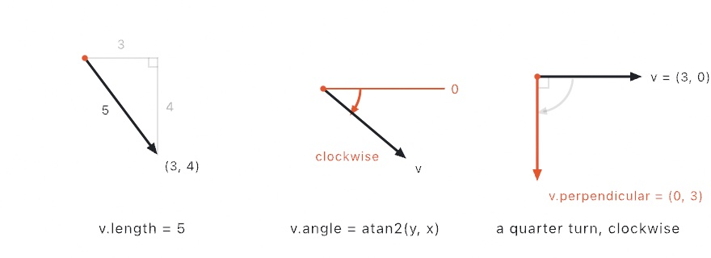
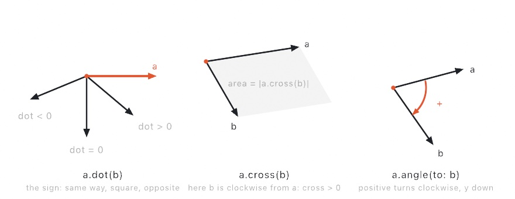
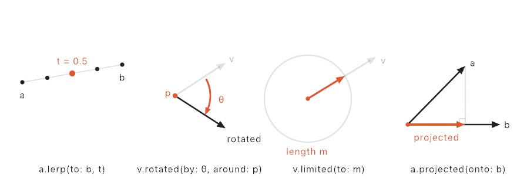
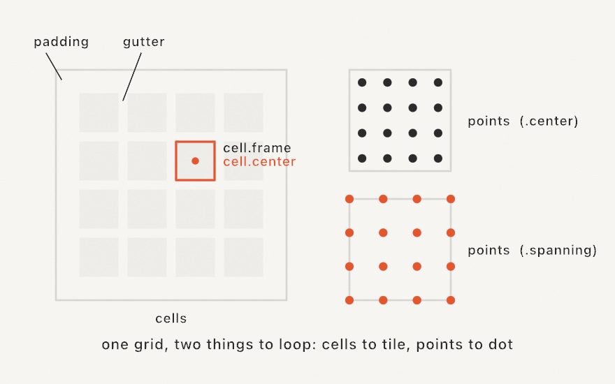
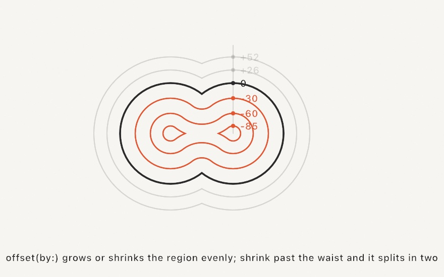

#### <sup>[Ollin](../../README.md) → [Documentation](../README.md) → [Drawing](./README.md) → `Geometry`</sup>

---

## Geometry

`Vector2`, `Vector3`, `Rectangle`, `Circle`, `Contour`, `Shape`, and `Path` are Ollin's geometry value types: the data primitives take, and the values you pass around and compose. Canvas coordinates use a top-left origin with y increasing downward.

### Contents

- [Vector2](#vector2)
  - [Constants](#v2-constants)
  - [Length & direction](#v2-length)
  - [Arithmetic](#v2-arithmetic)
  - [Measuring between two vectors](#v2-measuring)
  - [Producing new vectors](#v2-producing)
  - [Putting it together](#v2-together)
- [Vector3](#vector3)
- [Rectangle](#rectangle)
- [Grid](#grid)
- [Insets](#insets)
- [Circle](#circle)
- [Contour](#contour)
- [Shape](#shape)
  - [Set operations](#shape-booleans)
  - [Offsetting](#shape-offset)
  - [Stroke as shape](#shape-stroked)
- [Convex hull](#convex-hull)
- [Path](#path)

<a name="vector2"></a>

### `Vector2`

An `(x, y)` point in sketch points. The type primitives like `drawPolyline`, `drawCircle(center:)`, and `drawLine` take. A `Vector2` doubles as a **point** (a location) and a **vector** (an arrow with a direction and a length), and the methods below lean on whichever reading fits.

```swift
Vector2(_ x: Double, _ y: Double)
Vector2(x: Double, y: Double)
Vector2(angle: Double, length: Double = 1)   // polar: `length` units at `angle` radians
```

<a name="v2-constants"></a>

**Constants:** `.zero` `(0, 0)`, `.one` `(1, 1)`, `.unitX` `(1, 0)`, `.unitY` `(0, 1)`.

**A note on orientation.** Ollin's y-axis points down (top-left origin), the opposite of the math-class convention where y points up. The formulas are the same, but the direction of rotation looks flipped on screen. A positive angle, and anything the usual math convention calls "counter-clockwise", turns clockwise as you watch it. The diagrams below are drawn in screen space (y down) to match what you see.

<picture>
  <source media="(prefers-color-scheme: dark)" srcset="../../Guide/Images/01-HelloOllin/CoordinateSystem-dark.jpg">
  
</picture>

<a name="v2-length"></a>

#### Length & direction

**`length` / `lengthSquared`** measure how far the point is from the origin, that is, how long the arrow is. It's the Pythagorean theorem, the hypotenuse of the right triangle with sides `x` and `y`: `(3, 4)` has length `√(3² + 4²) = 5`. `lengthSquared` is that without the square root (`25` here), for when you only compare.

<picture>
  <source media="(prefers-color-scheme: dark)" srcset="../Images/VectorHeading-dark.jpg">
  
</picture>

**In a sketch:** turn a distance or a speed into something you can see, a dot that grows as the mouse nears, or a trail that reacts to how fast it moves (`velocity.length`).

**`normalized`** is the same direction rescaled to length exactly 1 (a "unit vector"), each component divided by the length, so `(3, 4)` becomes `(0.6, 0.8)`. Handy when you want a pure heading and will set the length yourself. Returns `.zero` if `v` has no length to scale.

**In a sketch:** this is the move-toward-a-target trick, where `pos += (target - pos).normalized * speed` steps a fixed amount the right way, however far the target is.

**`angle`** gives the direction as one number, the angle of the arrow from the `+x` axis, in radians (`atan2(y, x)`), growing clockwise on screen because `+y` points down. `Vector2(angle:length:)` is the inverse, building an arrow from an angle and a length.

**In a sketch:** point a shape the way it's heading. Call `rotate(velocity.angle)` before you draw, so an arrow or a fish faces where it's going.

**`perpendicular`** is a quarter turn, swapping and negating the components so `(x, y)` becomes `(−y, x)`, which turns `(3, 0)` into `(0, 3)`: clockwise on screen, y-down. Useful for offsetting to the side of a line (for example giving a stroke its width).

**In a sketch:** this is the sideways direction, so you can give a freehand line real thickness by stepping out both ways, or make a thing strafe or orbit.

<a name="v2-arithmetic"></a>

#### Arithmetic

<picture>
  <source media="(prefers-color-scheme: dark)" srcset="../../Guide/Images/10-Vectors/VectorArithmetic-dark.jpg">
  
</picture>

**`+`, `-`, unary `-`** add two vectors *head to tail*, and subtract to get the step between two points: `a - b` is the step from `b` to `a`. Unary `-` keeps the length and flips the direction. (Plus the in-place `+=` / `-=`, the `pos += vel` idiom.)

**In a sketch:** `target - pos` is the arrow pointing from one point to another, the seed of every chase, spring, and look-at. `pos += velocity` is how anything moves.

**`*` / `/` by a scalar** stretch or shrink the arrow, keeping its heading (negative flips it). For `*` the scalar can sit on either side. (Plus the in-place `*=` / `/=`.)

**In a sketch:** set how big a step is. Use `direction * speed` to go faster, or `* deltaTime` so motion runs the same on any machine.

<a name="v2-measuring"></a>

#### Measuring between two vectors

**`distance(to:)` / `distanceSquared(to:)`** measure the straight-line distance between two points. (Same Pythagoras as `length`, applied to `a − b`, and the squared form skips the `√` for comparisons.)

**In a sketch:** proximity effects, so you can connect dots closer than N, fade things by how near they are, or push neighbors apart when they crowd. (Use the squared form inside big loops to skip the slow `√`.)

**`dot(_:)`** is one number measuring how much two vectors point the *same way*, `ax·bx + ay·by`, which equals `|a|·|b|·cos θ`. Its sign alone tells you the rough relationship: positive under 90° (aiming similar ways), zero at exactly 90°, negative past it (aiming opposite ways).

<picture>
  <source media="(prefers-color-scheme: dark)" srcset="../Images/VectorMeasures-dark.jpg">
  
</picture>

**In a sketch:** this answers "same way or opposite?" and "in front of me or behind?", the basis of simple lighting (how squarely a surface faces the light) and field-of-view checks.

**`cross(_:)`** is the 2D "perp-dot", `ax·by − ay·bx`, also one number. Its *magnitude* is the area of the parallelogram the two vectors span, and its *sign* tells you the turn direction from `a` to `b`: positive when `b` is clockwise from `a` (on screen, y-down), negative when counter-clockwise, and zero when they're parallel and the area collapses.

**In a sketch (2D):** the sign answers "is the target on my left or my right?", so a creature can turn the short way toward it. Summed around a shape's points it gives the area and which way the shape winds.

**`angle(to:)`** is the *signed* angle from `a` to `b`, in `−π…π` (it's `atan2(cross, dot)`). Unlike `b.angle − a.angle`, it never wraps and tells you which way to turn: positive turns clockwise on screen, negative the other way.

**In a sketch:** swivel to face something smoothly. Rotate by a fraction of `heading.angle(to: toTarget)` each frame and a creature tracks the mouse.

<a name="v2-producing"></a>

#### Producing new vectors

**`lerp(to:_:)`** slides from `a` toward `b` by a fraction `t` (`0` = `a`, `1` = `b`). `t = 0.5` is the midpoint, and `t` past `0…1` extrapolates.

<picture>
  <source media="(prefers-color-scheme: dark)" srcset="../Images/VectorMoves-dark.jpg">
  
</picture>

**In a sketch:** this is the easiest smooth-follow there is, since `pos = pos.lerp(to: target, 0.1)` makes anything glide after the mouse with a soft lag. Also midpoints and in-betweens.

**`rotated(by:)` / `rotated(by:around:)`** spin the arrow by an angle (positive turns clockwise, y-down), about the origin or about a given pivot point.

**In a sketch:** lay things out in a ring, orbit a moon around a planet, or swing a clock hand with `rotated(by:around:)` about its pivot.

**`limited(to:)`** clamps the length to a maximum, keeping the direction. Shorter vectors pass through untouched (for example a velocity cap).

**In a sketch:** keep speeds from blowing up, since `vel = vel.limited(to: maxSpeed)` is the staple that keeps flocking and steering stable.

**`projected(onto:)`** is the part of `a` that lies along `b`, its shadow cast straight down onto `b`'s line (drop a perpendicular from `a`'s tip; the foot marks the projection).

**In a sketch:** snap a point onto a guide line, find the nearest spot on a path, or split a bounce into "along the wall" and "into the wall".

**`with(x:)` / `with(y:)`** return a copy with one component replaced (the other kept). `p.with(y: 0)` flattens a point onto the top edge, for instance.

**In a sketch:** pin one axis, dropping points to the top edge with `.with(y: 0)`, or letting x scroll while y holds still.

**`points.centroid`** works on any collection of `Vector2`, giving the centroid (arithmetic mean) of the points, or `nil` when the collection is empty. It's the mean of the points themselves, so where vertices crowd the centroid is pulled toward them, which means for a polygon outline it's not the area's center of mass.

**In a sketch:** find the center of a cluster, a flock's middle to steer toward, or the center of a tracker's landmark points (an eye region's loop, a quad's corners).

<a name="v2-together"></a>

#### Putting it together

```swift
let a = Vector2(100, 100)
let b = a + Vector2(angle: .pi / 4, length: 80)   // 80 units out at 45°
drawLine(a, b)

let dir = (b - a).normalized        // unit direction from a to b
let mid = a.lerp(to: b, 0.5)        // the midpoint
var p = a
p += dir * 10                       // step 10 units toward b
```

<a name="vector3"></a>

### `Vector3`

An `(x, y, z)` point or vector. Ollin draws in 2D, but some values live in space (a 3D body joint in meters, a point of a depth cloud), and `Vector3` carries them with `Vector2`'s arithmetic plus a `z`.

```swift
Vector3(_ x: Double, _ y: Double, _ z: Double)
Vector3(x: Double, y: Double, z: Double)
```

- **Constants:** `.zero`, `.one`, `.unitX`, `.unitY`, `.unitZ`.
- **Same surface as `Vector2`** where it generalizes: `length` / `lengthSquared` / `normalized`, the `+ - * /` operators and their in-place forms, `dot`, `distance(to:)` / `distanceSquared(to:)`, `lerp(to:_:)`, `limited(to:)`, `projected(onto:)`, and `with(x:)` / `with(y:)` / `with(z:)`.
- **3D-specific:** `cross(_:)` returns the perpendicular `Vector3` (in 2D it's a scalar), and `xy` drops the depth, the projection back onto the canvas plane.
- **Not here:** the angle and rotation helpers, because a 3D rotation needs an axis, which lives in the [3D transform stack](../3D/3D.md#transforms), not a lone vector.

Axis meaning (which way is up, where the origin sits) belongs to whatever produced the value, so a producer like [`Body3D`](../Vision/Vision.md#body3d) documents its own spaces.

```swift
let joint = Vector3(0.2, 1.4, -0.3)          // meters, say
drawCircle(center + joint.xy * 200, 6)        // front view: drop the z
drawCircle(center + Vector2(joint.z, -joint.y) * 200, 6)   // side view: look along x
```

<a name="rectangle"></a>

### `Rectangle`

An axis-aligned rectangle: a `corner` plus `width` and `height`. The typed form `drawRect` takes (with the bare scalar `drawRect(x, y, width, height)` as sugar over it).

```swift
Rectangle(corner: Vector2, width: Double, height: Double)
Rectangle(x: Double, y: Double, width: Double, height: Double)
Rectangle(center: Vector2, width: Double, height: Double)
Rectangle(fitting size: Vector2, in container: Rectangle)
Rectangle(covering size: Vector2, in container: Rectangle)
```

- **Properties:** `corner`, `width`, `height`, `x`, `y`, `center`.
- **Corners:** `topLeft`, `topRight`, `bottomRight`, `bottomLeft`.
- **Test:** `contains(_ point: Vector2)` (the boundary counts as inside).
- **Inset:** `inset(by: Insets)`, the rectangle shrunk inward by a per-edge margin (see [`Grid`](#grid)).
- **Normalized coordinates:** `point(u:v:)`, the point at 0…1 fractions of the rectangle (`point(u: 0.5, v: 0.5)` is `center`; values outside 0…1 land proportionally outside), and its inverse `uv(of:)`. The canvas-wide sugar is [`uv(u, v)`](../Core/Canvas.md#uv).

`Rectangle(fitting:in:)` is the letterbox fit, the largest rectangle of `size`'s aspect ratio centered inside `container`. That is the box to draw an image or video frame into without stretching it (the fit behind `drawFrame` and `fittedRect(in:)`). `Rectangle(covering:in:)` is its other end: the *smallest* rectangle of that shape that covers the container, so it runs past two edges and what falls outside is meant to be cropped. The two are what [`drawImage`'s](Images.md#fit) `.contain` and `.cover` are built on.

```swift
let box = Rectangle(center: Vector2(width / 2, height / 2), width: 200, height: 120)
drawRect(box)
let p = randomVector(in: box)       // a random point inside it
```

<a name="grid"></a>

### `Grid`

A regular grid of `columns × rows` over a rectangle, the typed answer to the margin-then-nested-loop boilerplate so many sketches repeat. `Grid` is geometry, not a draw call. It gives you two things, and you loop whichever you're drawing: the **points** (the dots) or the **cells** (the rectangles). Each element carries its `column`/`row`, so **one** loop covers the indexed cases too, with no nested `for`.

```swift
Grid(in: Rectangle, columns: Int, rows: Int, padding: Insets = .zero, gutter: Double = 0, distribution: Distribution = .center)
grid(columns: Int, rows: Int, padding: Insets = .zero, gutter: Double = 0, distribution: Distribution = .center)   // Sketch sugar, over the canvas
```

The `Sketch` form `grid(columns:rows:…)` lays the grid over the canvas `bounds`, while the `Grid(in:…)` initializer takes any rectangle, so a grid can fill a render target, or a single cell, since grids nest. `padding` insets the whole grid from the edges, and `gutter` is the gap *between* cells.

The labeled comparison sheet is its own call: `drawSheet(_:columns:gutter:_:)` lays a list of `(label, item)` pairs into a near-square grid over the canvas, hands each item's cell to your closure to draw, and sets each label on a dark plate along its cell's bottom edge. A filter gallery, a palette lineup, a parameter sweep:

```swift
drawSheet(filters.map { ($0.name, $0) }) { filter, cell in
    drawImage(scene.filtered(filter).image, in: cell)
}
```

`columns` left out picks the near-square count; `gutter` defaults to 1% of the canvas width; labels use the current `textFont` and the state around the call is untouched.

- **Layout:** `bounds` (the region the cells fill, after `padding`), `columns`, `rows`, `gutter`, `cellWidth`, `cellHeight`, `cellSize`.
- **Points:** `points`, every dot (`[Point]`, row-major), each carrying a `column`, `row`, and `position`, laid out per the grid's `distribution` (below). Use `point(column:row:)` for one.
- **Cells:** `cells`, every cell (`[Cell]`, row-major), each carrying a `column`, `row`, true `center`, and `frame` rectangle. Use `cell(column:row:)` for one.

Loop whichever you're drawing, and the indices ride along, so a checkerboard or a hue-by-position is still one loop:

```swift
for dot in grid.points {                          // dots
    drawCircle(center: dot.position, radius: 6)
}
for cell in grid.cells {                          // cells, with indices
    fill((cell.column + cell.row) % 2 == 0 ? .white : .black)
    drawRect(cell.frame)
}
```

**Cells or dots: `distribution`.** A grid gives you the same `columns × rows` count either way, and `distribution` only chooses where the **points** fall (`cells` always tile the bounds):

- `.center` (default): one dot at the center of each cell, inset half a cell from the edges. The "a thing in every cell" layout.
- `.spanning`: the dots form a lattice spanning the bounds edge to edge, the outer ones sitting on the boundary (the four corners at the rectangle's corners). The "grid of dots" layout, when you want the dots to reach the edges rather than float inside. (`gutter` doesn't apply, since spanning dots span the full bounds.)

<picture>
  <source media="(prefers-color-scheme: dark)" srcset="../../Guide/Images/06-GridsAndRepetition/GridAnatomy-dark.jpg">
  
</picture>

```swift
for dot in grid(columns: 24, rows: 24, padding: 60, distribution: .spanning).points {
    drawCircle(center: dot.position, radius: 6)   // dots reaching the edges
}
```

**Gaps between cells: `gutter`.** `padding` is the margin around the whole grid, and `gutter` is the gap *between* cells (0 = they touch). A contact sheet of tiles with an even gap inside and between them:

```swift
let g = grid(columns: 3, rows: 2, padding: .all(12), gutter: 12)
for cell in g.cells {
    drawImage(thumbnails[cell.row * g.columns + cell.column], in: cell.frame)
}
```

Grids nest because a cell's `frame` is just another `Rectangle`:

```swift
for cell in grid(columns: 4, rows: 4, padding: 20).cells {
    for sub in Grid(in: cell.frame, columns: 3, rows: 3, padding: 6).cells {
        drawRect(sub.frame)
    }
}
```

<a name="insets"></a>

### `Insets`

A per-edge margin in sketch points (`top`, `right`, `bottom`, `left`), the currency for a `Grid`'s `padding` and `Rectangle.inset(by:)`. Build it the way the layout reads:

```swift
.all(20)                                 // every edge
.symmetric(horizontal: 40, vertical: 20) // left/right vs top/bottom
.horizontal(40)                          // left and right only
.vertical(20)                            // top and bottom only
Insets(top: 10, right: 0, bottom: 30, left: 0)
```

A bare number is an even inset on every edge, so `padding: 20` reads as `.all(20)`:

```swift
let g = grid(columns: 12, rows: 8, padding: 24)   // 24pt margin all around
```

<a name="circle"></a>

### `Circle`

A circle: a `center` plus a `radius`. The typed form `drawCircle(_:)` takes (with the bare scalar `drawCircle(x, y, radius)` as sugar over it), and what the [`drawCircles`](../Drawing/Drawing.md#batches) batch call draws an array of.

```swift
Circle(center: Vector2, radius: Double)
Circle(x: Double, y: Double, radius: Double)
```

- **Properties:** `center`, `radius`, `x`, `y`, `diameter`, `bounds` (the bounding `Rectangle`).
- **Test:** `contains(_ point: Vector2)`.

```swift
let dot = Circle(center: Vector2(width / 2, height / 2), radius: 60)
drawCircle(dot)
if dot.contains(Vector2(mouseX, mouseY)) { /* pointer is inside */ }
```

<a name="contour"></a>

### `Contour`

One connected path, an ordered run of points, either open (a stroked path) or closed (a fillable outline). It is polygonal, with straight segments between the points. The building block of a `Shape`. To author a *curved* outline, use [`Path`](#path) (or the `curveThrough` initializer below, which fairs a smooth spline through points).

```swift
Contour(_ points: [Vector2], closed: Bool = true)
Contour(curveThrough points: [Vector2], closed: Bool = true)   // smooth curve through the points

var length: Double              // distance along the segments (closed: plus the return leg)
func point(at t: Double) -> Vector2   // the point a fraction t (0...1) along, by walked length
var midpoint: Vector2           // point(at: 0.5)
func resampled(spacing: Double) -> Contour   // points respaced evenly along the walk
```

The walk helpers measure *along* the contour, so they land mid-stroke even when the points are spaced unevenly (a `textToShapes` glyph, a two-point diagonal). `midpoint` is the handy anchor for styling per contour, so you can color each strand of a [Truchet tiling](./Truchet.md) by a noise field sampled at its middle, or hang a label off a path's center.

`resampled(spacing:)` rebuilds the contour with its points an even arc-length `spacing` apart, keeping `isClosed`. It's the step before dot, dash, and jitter effects, because contours that arrive with uneven vertices (a glyph outline is dense on curves and sparse on straights) come back marching at a steady interval, so marks placed one-per-point spread evenly. `Shape.resampled(spacing:)` applies it to every contour, keeping the shape's `winding`. See the `PointShimmer`, `JitterType`, and `GlyphContours` examples.

<a name="shape"></a>

### `Shape`

A fillable region of one or more `Contour`s. Unlike a convex `drawPolygon`, a `Shape` can be **concave** and can have **holes**, since contours nested inside the outer one cut holes out of the fill (even-odd winding, so a contour's direction doesn't matter). Draw it with [`drawShape`](../Drawing/Drawing.md#shape).

```swift
Shape(_ points: [Vector2], closed: Bool = true)   // a single contour
Shape(outer: [Vector2], holes: [[Vector2]])        // an outer boundary with holes
Shape(contours: [Contour])                         // explicit contours
Shape(curveThrough: [Vector2], closed: Bool = true)  // a single smooth-curved contour
```

```swift
let outer = [Vector2(60, 60), Vector2(260, 60), Vector2(260, 260), Vector2(60, 260)]
let hole  = [Vector2(120, 120), Vector2(200, 120), Vector2(200, 200), Vector2(120, 200)]
fill(.black)
drawShape(Shape(outer: outer, holes: [hole]))      // a square frame
```

**Fill winding.** A `Shape` carries a `winding` rule (`FillWinding`) that decides which regions are inside the fill. It is `.evenOdd` by default (a contour's direction doesn't matter, the simple rule for hand-built shapes), or `.nonZero` (direction *does* matter, and a self-overlapping outline still fills, which is the rule font outlines use, so glyph shapes from [`textToShapes`](../Drawing/Text.md#texttoshapes) set it). Pass it to `Shape(contours:winding:)`.

**Transforming a shape.** `mapPoints(_:)` returns a copy with every contour point passed through a closure, keeping the `winding` rule and open/closed flags. That makes it the safe way to move or warp a shape (a glyph from `textToShapes`, say) without dropping its winding:

```swift
let wobbled = shape.mapPoints { $0 + Vector2(0, signedNoise($0.x * 0.01, time) * 20) }
drawShape(wobbled)
```

**Point-in-shape test.** `contains(_:)` reports whether a point lies inside the filled region, honoring the shape's `winding` rule, with every contour treated as closed the way a fill treats an outline. It's the hit-test for "did the click land in the blob" and the membership test scatter algorithms build on. A point exactly on an edge may land on either side (it's a floating-point ray test), so don't lean on the boundary itself:

```swift
if shape.contains(Vector2(mouseX, mouseY)) { fill(.red) }
```

<a name="shape-booleans"></a>

**Set operations.** Two shapes combine like sets, each call returning a new `Shape`:

```swift
func union(_ other: Shape) -> Shape                // covered by either
func intersection(_ other: Shape) -> Shape         // covered by both
func subtracting(_ other: Shape) -> Shape          // this one, with `other` cut away
func symmetricDifference(_ other: Shape) -> Shape  // covered by exactly one
```

The operations work on the **filled region**, so each side first resolves under its own `winding` rule (self-overlaps and holes mean exactly what they mean when the shape draws), closed contours take part, and open contours sit out. The result is an ordinary `Shape` you can fill, stroke, hatch, offset, or export, whose outer boundaries and holes come back oppositely wound, marked `.nonZero`. Where regions don't touch, the result simply holds more than one contour. Where nothing remains (say, intersecting shapes that don't overlap), `contours` comes back empty and drawing it is a no-op.

<picture>
  <source media="(prefers-color-scheme: dark)" srcset="../../Guide/Images/15-ShapesAsMaterial/BooleanOps-dark.jpg">
  
</picture>

```swift
let bite = star.subtracting(disc)     // a star with a bite taken out
fill(.black)
drawShape(bite)
```

The `Examples/Shapes/Booleans` sketch shows all four operations side by side over the same two moving shapes.

<a name="shape-offset"></a>

**Offsetting.** Grow or shrink the filled region by a uniform distance, in points:

```swift
func offset(by delta: Double, join: StrokeJoin = .miter) -> Shape
```

Positive `delta` grows, negative shrinks. Holes move the opposite way, so offsetting a ring outward thickens the band on both edges. Shrinking past a region's narrowest waist pinches it apart (one contour can split into several) and eventually leaves nothing, which is what makes repeated insets read as topographic contour lines:

```swift
var ring = blob
while !ring.contours.isEmpty {        // inset until the region pinches out
    drawShape(ring)
    ring = ring.offset(by: -12, join: .round)
}
```



`join` decides the corners with the same vocabulary as [`strokeJoin(_:)`](../Drawing/Drawing.md#strokeJoin): `.miter` keeps them sharp (falling back to a flat bevel past the same spike limit the stroked path uses), `.bevel` always cuts them flat, `.round` arcs around them. Open contours sit out here too, because `offset` moves a region's edge, not a stroked line.

The `Examples/Patterns/Topography` sketch is the inset loop above, drawn live.

<a name="shape-stroked"></a>

**Stroke as shape.** Turn a stroked line into a closed region, so a thick stroke stops being a rendering effect and becomes geometry:

```swift
// On Contour and on Shape (all contours, merged):
func stroked(width: Double, join: StrokeJoin = .round, cap: StrokeCap = .butt) -> Shape
```

The path is thickened by half the width on each side. An open contour takes `cap` ends with the same vocabulary as [`strokeCap(_:)`](../Drawing/Drawing.md#strokeCap) (`.butt`, `.round`, `.square`), while a closed contour's stroke runs all the way around it and comes back as a band, an outer boundary plus a hole. A path that crosses itself merges into one clean region. The result feeds everything a `Shape` can do: fill it with a gradient, `offset` it, cut it with the booleans, hatch it for a plotter, export it as a true SVG region instead of a stroke attribute.

```swift
let ribbon = Contour(line, closed: false).stroked(width: 90, join: .round, cap: .round)
drawShape(ribbon.subtracting(stencil))
```

The `Examples/Shapes/InkRibbon` sketch strokes a drifting brush line and insets contour bands inside it.

<a name="convex-hull"></a>

### Convex hull

The smallest convex polygon containing a point set, like a rubber band snapped around it:

```swift
func convexHull(of points: [Vector2]) -> [Vector2]
```

Returns the hull's corners in order around the boundary (collinear points along an edge are dropped, and fewer than three distinct points return what there is). The result is an ordinary point list, so `drawPolygon` it, wrap it in a `Contour` to stroke or offset it, or use it as a coarse "footprint" for a scatter of marks. The `Examples/Shapes/RubberBand` sketch recomputes the hull of a drifting herd every frame.

When the rubber band bridges too much, the tighter wraps live on the [`Hulls`](../Generators/Hulls.md) page: `concaveHull` (one simple polygon that dips into the gulfs) and `alphaShape` (the scatter's true footprint, islands and holes included).

<a name="path"></a>

### `Path`

A builder for one curved or straight outline. Trace it with pen-style commands and it samples the curves into a polygonal [`Contour`](#contour) (and a single-contour [`Shape`](#shape)) you can fill or stroke. Curved geometry rides the same triangulated-fill and stroked path everything else does, with no special setup.

```swift
Path()                          // empty; trace it with the methods below
Path(_ build: (inout Path) -> Void)   // build inline

mutating func move(to: Vector2)                                   // start the outline
mutating func line(to: Vector2)                                   // straight segment
mutating func curve(to: Vector2)                                  // smooth (Catmull-Rom)
mutating func quadCurve(to: Vector2, control: Vector2)            // quadratic Bézier
mutating func cubicCurve(to: Vector2, control1: Vector2, control2: Vector2)  // cubic Bézier
mutating func close()                                             // close into a fillable loop

var contour: Contour            // the sampled outline
var shape: Shape                // a single-contour Shape, ready for drawShape
```

The three curve verbs differ in who supplies the bend:

- **`curve(to:)`** is a smooth curve that passes *through* the points, with tangents derived automatically from the neighbors. Consecutive `curve(to:)` calls form one smooth run. This is the "draw a wiggle straight from points" curve, and the bare name `curve` is reserved for it precisely because you give no control point.
- **`quadCurve(to:control:)`** is a quadratic Bézier, where you supply one control point.
- **`cubicCurve(to:control1:control2:)`** is a cubic Bézier, where you supply two.

A `Path` describes a *single* outline. For a filled region with holes (a donut, a frame), compose contours with `Shape(outer:holes:)` instead.

```swift
let blob = Path { p in
    p.move(to: Vector2(200, 300))
    p.curve(to: Vector2(400, 200))   // smooth through the points
    p.curve(to: Vector2(600, 360))
    p.close()
}
fill(.black)
drawShape(blob.shape)
```

The drawing-side sugar, `drawShape { p in … }` and `drawCurve`, is in [Drawing](../Drawing/Drawing.md#shape).
