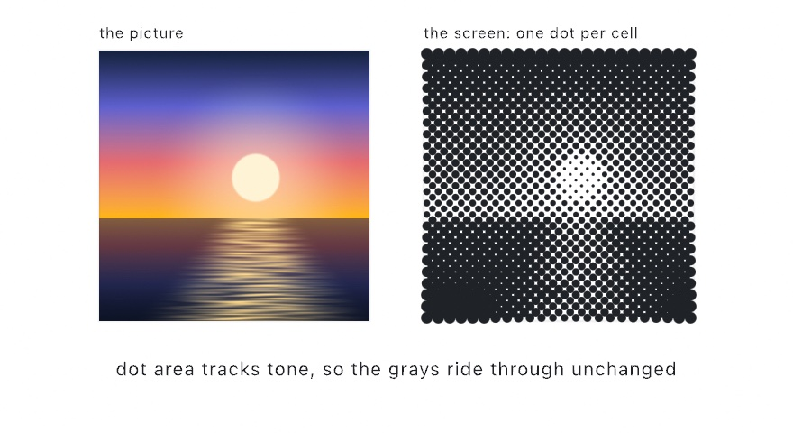

#### <sup>[Ollin](../../README.md) → [Documentation](../README.md) → [Drawing](./README.md) → `Halftone`</sup>

---

## Halftone

**`drawHalftone`** rebuilds an image as the classic print dot screen. Round dots sit on a grid rotated to the traditional 45 degrees. Each one is sized so its ink area matches the tone under its cell. It is how newspapers and screen prints have carried photographs for a century, and the vector counterpart of the raster screening the [print separations](../Output/PrintSeparations.md) use. Because the sizing is area-exact, tone survives the screen. A 30 percent gray becomes dots covering 30 percent of their cells. Shadows grow dots that overrun their cells and merge into the traditional checkered diamonds.

<picture>
  <source media="(prefers-color-scheme: dark)" srcset="../Images/HalftoneScreen-dark.jpg">
  
</picture>

### Contents

- [drawHalftone](#draw)
- [halftone (the data form)](#data)
- [Getting the classic looks](#looks)
- [Practical notes](#notes)

<a name="draw"></a>

#### drawHalftone

```swift
drawHalftone(_ image: Image,
             pitch: Double = 12,
             angle: Double = .pi / 4,
             in bounds: Rectangle? = nil,
             inverted: Bool = false,
             colored: Bool = false)
```

Draws the screen in one call. `pitch` is the cell spacing in canvas units, and `angle` the screen rotation. The classic single-ink screen sits at 45 degrees, where the eye notices the grid least. The image keeps its aspect inside `bounds` (the whole canvas by default). Dots draw with the current `fill` and `stroke`. Setting `colored: true` tints each dot with the average color under its cell instead.

```swift
fill(.black)
noStroke()
drawHalftone(picture, pitch: 14)
```

By default dark regions get big dots (ink on paper). `inverted: true` sizes dots by brightness instead, for light marks on a dark canvas:

```swift
background(.black)
fill(.white)
drawHalftone(picture, pitch: 14, inverted: true)
```

<a name="data"></a>

#### halftone (the data form)

```swift
halftone(of image: Image,
         pitch: Double = 12,
         angle: Double = .pi / 4,
         in bounds: Rectangle? = nil,
         inverted: Bool = false) -> [HalftoneDot]
```

The screen as data, for custom drawing. Each `HalftoneDot` carries its lattice `column` and `row` in the rotated screen, its `center` on the canvas, and its area-exact `radius`. It also carries the cell's ink `coverage`, from 0 bare to 1 solid, and the average `color` underneath. Swap the mark, jitter the grid, or keep only part of the tonal range:

```swift
for dot in halftone(of: picture, pitch: 16) {
    drawNgon(center: dot.center, radius: dot.radius, sides: 6)
}
```

Cells lighter than the printable minimum are omitted entirely, so highlights stay clean paper. That minimum is 2 percent coverage, the same cutoff the print separations apply. At the other end coverage above 98 percent floods the cell: the radius caps at `pitch / sqrt(2)`, the corner-reaching disk.

<a name="looks"></a>

#### Getting the classic looks

- **Newsprint.** Black fill on a warm white canvas, `pitch` 10 to 16, the default 45-degree angle. Smooth tonal ramps are where the screen shines; every step of a gradient lands on its own dot size.
- **The inverted poster.** `inverted: true` with a pale fill on a near-black canvas reads as light emerging from dark, the screen-print negative.
- **Pop-art color.** `colored: true` with a chunky `pitch` keeps the picture's own palette in fat discrete dots.
- **The rosette.** Screen the same image several times at the conventional print angles of 45, 15, 75, and 0 degrees. Use one translucent ink per pass, and the overlap makes the traditional rosette instead of moire. For real spot-color work, split the image with [print separations](../Output/PrintSeparations.md) first and screen each master.
- **Other marks.** The data form turns the screen into a layout. Draw glyphs at `radius`, rings, squares rotated by `coverage`, or anything that can scale with the tone.

<a name="notes"></a>

#### Practical notes

- **The dots are real geometry.** They draw as circles through the analytic SDF path, and they ride the vector exports. `--export-svg` and `--export-pdf` write each dot as a true circle, which is exactly what a pen plotter wants.
- **CPU work at the image's resolution.** The binning pass reads every source pixel once. A few-hundred-pixel source screens comfortably every frame, and the dot pass itself is a few thousand circles.
- **Deterministic.** The screen is a pure function of the image, pitch, angle, and bounds. No rng is consumed, so screens are snapshot- and recipe-safe.
- **Tone is measured in linear light.** Coverage is 1 minus linear luminance, times alpha. That is the same rule stippling uses, because a dot's ink area maps to reflectance physically. Transparency carries no ink.
- **Texture-backed images return no dots**, because they hold no CPU pixels. Read a video frame through its `snapshot()` first.
- **For the pixel-space version** of the same look, filter a layer with `.halftone` or `.cmykHalftone` from the [effects catalog](./Effects.md). The GPU form is per-frame cheap at any resolution, but it rasterizes, so it does not feed the plotter path.

---

Related: [`Images`](./Images.md) (the `Image` type and pixel access), [`Print separations`](../Output/PrintSeparations.md) (the raster screening and spot-color masters), [`Pixel sorting`](./PixelSorting.md), [`Glyph mosaic`](./GlyphMosaic.md) and [`Single line`](../Generators/SingleLine.md) (the other image-as-input renderings), [`Effects`](./Effects.md) (the GPU `.halftone` filter and the `.melt` design filter).
