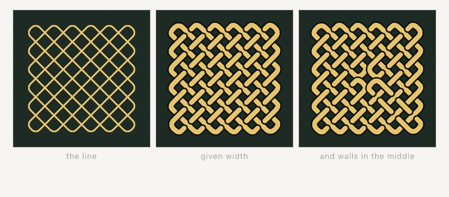

#### <sup>[Ollin](../../README.md) → [Documentation](../README.md) → [Drawing](./README.md) → `Celtic knotwork`</sup>

---

## Celtic knotwork

The [kolam line](./Kolam.md) given width, and a rule about who passes over whom.

A plait is one line, or a few, launched between a field of dots at 45 degrees and turned by the edge of the field and by any wall placed between two dots. Wherever two passes meet, one goes over and the other goes under. The whole design holds together because that choice **alternates**: follow any cord and it goes over, under, over, under, the whole way around. A knot drawn that way is called alternating, and it is what the eye reads as woven rather than as a heap of lines.

```
  the two rules, and nothing else:

  over/under alternates along every cord  ->  it reads as woven
  a wall turns the line where it stands   ->  the plait becomes a knot
```

The bands come back **already broken where they dive under**, so stroking them is the weave. There is no masking to do and no draw order to get right.

<picture>
  <source media="(prefers-color-scheme: dark)" srcset="../../Guide/Images/07-Tiles/KnotworkWeave-dark.jpg">
  
</picture>

### Contents

- [knotwork](#knotwork)
- [drawKnotwork](#drawKnotwork)
- [The faces](#faces)
- [Walls](#walls)

<a name="knotwork"></a>

#### knotwork

```swift
knotwork(in bounds: Rectangle? = nil,
         columns: Int, rows: Int,
         mirrors: [Kolam.Mirror] = []) -> Knotwork
```

A knot woven over a `columns × rows` field of dots filling `bounds` (the whole canvas by default). Nothing here is random: the same field always weaves the same knot.

```swift
let knot = knotwork(columns: 7, rows: 5)
strokeCap(.round); strokeJoin(.round)
for band in knot.bands(gap: 30) {
    let line = band.smoothed(iterations: 3)
    withState {
        stroke(.black); strokeWeight(22)          // the outline
        drawPolyline(line.points, closed: line.isClosed)
        stroke(.white); strokeWeight(15)          // the cord inside it
        drawPolyline(line.points, closed: line.isClosed)
    }
}
```

The `withState` around each band is what keeps the second color from becoming the next band's outline. Drawing one band at a time, outline then cord, is also what lets the next band's outline cut the last one cleanly where it passes over.

<a name="drawKnotwork"></a>

#### drawKnotwork

```swift
drawKnotwork(in bounds: Rectangle? = nil,
             columns: Int, rows: Int,
             mirrors: [Kolam.Mirror] = [],
             weight: Double = 18,
             cordColor: Color = .white,
             rounding: Int = 3)
```

The two-tone band above in one call: the current `stroke` is the outline at `weight`, `cordColor` fills it, and the gap is sized to the band.

<a name="faces"></a>

#### The faces

- **`bands(gap:)`** the visible pieces, one open `Contour` per piece, already broken where the cord dives under. `gap` is how much cord is taken out at each dive, in canvas points; left to itself it is a little over half the distance between two crossings, which suits a band about as wide as it. A cord that dives nowhere (a single dot's loop has nothing to cross) comes back whole and closed.
- **`cords`** the whole cords, unbroken, one closed `Contour` each. This is the same line-work the [kolam](./Kolam.md) gives, and it is what to draw when the weave is not wanted.
- **`crossings`** where two passes meet. A plain field of `rows` by `columns` dots has `2 × rows × columns - rows - columns` of them: every point of the field except the ones on the outside edge, where the line turns and only one pass ever arrives. Each wall takes one more away.

<a name="walls"></a>

#### Walls

Walls are `Kolam.Mirror` values and work exactly as they do for a [kolam](./Kolam.md#walls): a short wall between two neighboring dots, which the line turns at. They are what makes a plait into a knot with a shape, since a wall both joins or splits a cord and takes away the crossing that would have been there.

```swift
let knot = knotwork(columns: 6, rows: 6,
                    mirrors: [.rightOf(column: 2, row: 2), .below(column: 2, row: 2),
                              .rightOf(column: 2, row: 3), .below(column: 3, row: 2)])
```

---

Related: [`Kolam and sona`](./Kolam.md) is the same walk drawn as a single line; [`Geometry`](./Geometry.md) covers the `Grid`, `Contour`, and shape booleans the bands ride on; [`Fabrication`](../Output/Fabrication.md) takes them to a pen plotter.
