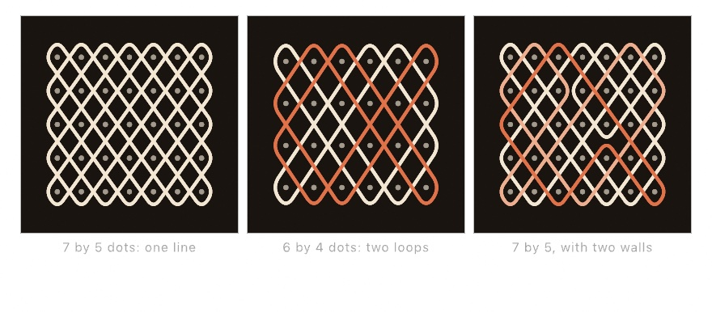

#### <sup>[Ollin](../../README.md) → [Documentation](../README.md) → [Drawing](./README.md) → `Kolam and sona`</sup>

---

## Kolam and sona

A kolam or a sona is one line that travels between a field of dots at 45 degrees. The line runs straight until it meets the edge of the field, then it turns and carries on. It always comes back to where it started, so the drawing is the path it took.

The tradition belongs to more than one place. In south India a **kolam** is chalked on the doorstep at dawn around a grid of pulli (dots). In Angola a **sona** is drawn in the sand with one finger while the story that goes with it is told. The mathematics under both is the same, and it is exact. Over a plain field the line closes into **gcd(rows, columns)** loops. A 7 by 5 field is one unbroken line, and a 6 by 4 field is two.

A **wall** placed between two neighboring dots turns the line there as well. Each wall inside the field either cuts one loop in two or joins two loops into one, and it never does more than that. You steer a drawing toward a single line by placing walls, and that is how the figures of a sona are built.

<picture>
  <source media="(prefers-color-scheme: dark)" srcset="../../Guide/Images/07-Tiles/KolamLoops-dark.jpg">
  
</picture>

The line-work is geometry, not a picture. `loops` hands back closed `Contour`s. You can stroke them, feed them to the [shape booleans](./Geometry.md), hatch them, and export them to SVG for a pen plotter. The walk draws a kolam with square corners, and [`Contour.smoothed(_:)`](./Curves.md) rounds those corners into the drawn form.

### Contents

- [kolam](#kolam)
- [drawKolam](#drawKolam)
- [The two faces](#faces)
- [Walls](#walls)

<a name="kolam"></a>

#### kolam

```swift
kolam(in bounds: Rectangle? = nil,
      columns: Int, rows: Int,
      mirrors: [Kolam.Mirror] = []) -> Kolam
```

A kolam over a `columns × rows` field of dots that fills `bounds`, which is the whole canvas by default. Nothing here is random, so there is no seed, and the same field always draws the same line.

```swift
let design = kolam(columns: 7, rows: 5)
noFill(); stroke(.white); strokeWeight(6); strokeJoin(.round)
for loop in design.loops { drawPolyline(loop.smoothed(iterations: 3).points, closed: true) }
```

<a name="drawKolam"></a>

#### drawKolam

```swift
drawKolam(in bounds: Rectangle? = nil,
          columns: Int, rows: Int,
          mirrors: [Kolam.Mirror] = [],
          rounding: Int = 2)
```

Draw the line-work with the current `stroke`, rounded by `rounding` passes of corner cutting. Use 2 for the drawn look and 0 for the square lattice path. The call does not draw the dots, because a kolam shows them and a sona does not, so that choice stays yours.

<a name="faces"></a>

#### The two faces

- **`loops`** one closed `Contour` per loop, in canvas coordinates. Wherever the walls are placed, the loops always hold `4 × rows × columns` segments between them, four in every cell, one against each of its four sides.
- **`dots`** the field itself, row-major, for marking the pulli a kolam is drawn around.
- **`loopCount`** how many closed loops the line makes. A count of one is the single unbroken line, which is what most traditional drawings aim for.

The design keeps the `grid` it was built on. That means `design.grid.cells` and `design.grid.bounds` are there when a piece needs to place something else against the same field. The grid's `gutter` does not apply, because the line needs an even field to bounce in.

<a name="walls"></a>

#### Walls

A `Kolam.Mirror` is a short wall between two neighboring dots. You name it after the dot it sits against, counting from the top-left dot.

```swift
Kolam.Mirror.rightOf(column: 2, row: 1)   // standing between this dot and its right neighbor
Kolam.Mirror.below(column: 3, row: 2)     // lying between this dot and the one below
```

```swift
let design = kolam(columns: 7, rows: 5,
                   mirrors: [.rightOf(column: 2, row: 1), .below(column: 3, row: 2)])
```

A wall you ask for on the outside edge is dropped rather than counted, because the edge already turns the line. Every other wall moves `loopCount` by exactly one, up or down.

---

Related: [`Hitomezashi stitching`](./Hitomezashi.md) is the other grid pattern whose whole design is a handful of bits. See [`Geometry`](./Geometry.md) for the `Grid`, `Contour`, and shape booleans the line-work is built on. See [`Curves`](./Curves.md) for the corner cutting that rounds it, and [`Fabrication`](../Output/Fabrication.md) for taking it to a pen plotter.
