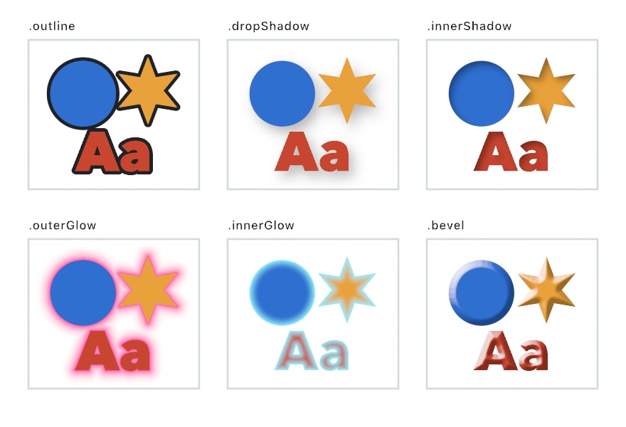

#### <sup>[Ollin](../../README.md) → [Documentation](../README.md) → [Drawing](./README.md) → `Layer styles`</sup>

---

## Layer styles

A layer style gives a layer an edge of its own: an outline, a shadow, a glow, or a bevel. Each one reads the layer's alpha, so it follows whatever was drawn there, letters and photographs as closely as shapes. Each is one `Filter`, so styles chain like any other filters, and the chain's order is the order they stack in.

<picture>
  <source media="(prefers-color-scheme: dark)" srcset="../Images/LayerStyles-dark.jpg">
  
</picture>

### Contents

- [Quick start](#quick-start)
- [An outline](#outline)
- [Shadows](#shadows)
- [Glows](#glows)
- [A bevel](#bevel)
- [Stacking styles](#stacking)
- [How exact they are](#precision)
- [On a web page](#web)
- [How it works](#how-it-works)

<a name="quick-start"></a>

### Quick start

```swift
let face = OutlineFont(name: "AvenirNext-Heavy") ?? .systemBold

override func draw() {
    background(Color(hex: 0xD9D4CA))
    let title = makeRenderTarget()
    withTarget(title) {
        fill(Color(hex: 0xC8452F))
        textFont(face)
        textSize(300)
        textAlign(.center, .center)
        drawText("Ollin", width / 2, height / 2)
    }
    let styled = title
        .filtered(.bevel(width: 16))
        .filtered(.outline(width: 6, color: .black))
        .filtered(.dropShadow(offset: Vector2(10, 14), radius: 16))
    drawImage(styled.image, 0, 0)
}
```

The layer is drawn the ordinary way, and nothing in it knows about the styles. Each style is measured off it afterward.

Every width, radius, and offset is in the layer's pixels, the unit `gaussianBlur` uses. Every color's alpha is that style's strength. A clear color, or a width or radius of 0, hands back the layer's own bytes. A style faded to nothing by a `@Param` costs its passes and changes nothing.

<a name="outline"></a>

### An outline

```swift
layer.filtered(.outline(width: 6, color: .black))                    // outside the edge
layer.filtered(.outline(width: 6, color: .black, align: .inside))    // inside it
layer.filtered(.outline(width: 6, color: .black, align: .center))    // half on each side
```

`.outline(width:color:align:)` draws a band of color along the layer's edge. `align` takes the same `StrokeAlign` a shape's stroke does, and it defaults to `.outside`. Outside, the band is laid under the layer, so it shows only past the edge. Inside, it paints over the layer within the layer's own coverage. Either way the layer's antialiased edge is composited once, so no seam opens between the band and the layer.

The edge is where the alpha crosses one half, measured between pixels. Outside corners come out rounded, since everything within the width of a corner is a quarter circle around it. Inside, a part of the shape thinner than the band fills solid.

A band narrower than a pixel fades with its width rather than staying a pixel wide. Its ink is kept equal to its width, the way a thin stroke's is. A 0.25 pixel band carries a quarter of a pixel's ink, and a width of 0 draws nothing.

<a name="shadows"></a>

### Shadows

```swift
layer.filtered(.dropShadow(offset: Vector2(8, 12), radius: 14))
layer.filtered(.innerShadow(offset: Vector2(5, 6), radius: 6, color: Color(white: 0, alpha: 0.6)))
```

`.dropShadow(offset:radius:color:)` blurs the layer's alpha by `radius`, moves it by `offset`, paints it in `color`, and lays it under the layer. The blur is the same Gaussian `gaussianBlur` runs, with `radius` as its sigma. The offset is in the canvas's own directions, so a positive `y` drops the shadow down the page. The shadow shows only where the layer is not opaque. A translucent layer therefore shows its shadow through itself, the way glass does. Whatever the offset moves past the canvas's edge is gone rather than smeared along it.

`.innerShadow(offset:radius:color:)` is the same blur read the other way round. It blurs and moves what the layer does *not* cover, and holds that inside the layer. The shadow falls along the edges the offset points away from. The default offset points down and to the right, so it darkens the top and left. That is how a light from the upper left falls on a shape cut into the page. Past the canvas's edge counts as empty, so a shape cut off by the edge takes a shadow along it too.

<a name="glows"></a>

### Glows

```swift
layer.filtered(.outerGlow(radius: 30, color: Color(hex: 0xFF4FA8)))
layer.filtered(.innerGlow(radius: 16, color: Color(hex: 0xFFF4C8)))
```

`.outerGlow(radius:color:)` lays color under the layer, full on its edge and fading to nothing `radius` pixels out. `.innerGlow(radius:color:)` paints it over the layer instead, full on the edge and fading inward.

A glow follows the measured distance from the edge, not a blur of the layer. So it keeps its strength right up to the edge of a thin line or a small letter. A blurred halo turns thin and faint there. It also reaches exactly `radius` whatever the shape. It falls off as the square of the share of the radius left to cross. That starts steep at the edge and ends with no visible rim.

A glow is laid under or painted over, never added in light. For light that spills from bright parts of a picture, use `.bloom`.

<a name="bevel"></a>

### A bevel

```swift
layer.filtered(.bevel(width: 14))                                   // rounded, lit from the upper left
layer.filtered(.bevel(width: 10, depth: 1.5, profile: .chiseled, angle: .pi, elevation: 0.4))
```

`.bevel(width:depth:profile:angle:elevation:highlight:shadow:)` raises the band `width` pixels in from the edge into a slope, then lights it. `profile` sets the slope's cross-section. `.rounded` climbs as a quarter sine, steepest at the edge and easing into the top. `.chiseled` climbs as one straight ramp, with a crease where it meets the top. `depth` is how high the slope climbs for its width: 1 is a 45 degree ramp for `.chiseled`.

The light comes from `angle`, in radians in the canvas's directions, and stands `elevation` above the layer, from 0 grazing to π/2 overhead. These are the conventions `relight` uses, and the default is the upper left. A slope turned toward the light moves toward `highlight`, reaching it when it faces the light squarely. A slope turned away moves toward `shadow`, reaching it when it takes no light at all. The flat top keeps the layer's own bytes, and so does everything outside the shape.

A part of the shape narrower than twice the width never reaches the top. It rises to a ridge where the slopes from its two sides meet, which is what a chiseled letter looks like.

<a name="stacking"></a>

### Stacking styles

Chained styles run in order, and each reads the layer the one before it produced:

```swift
let styled = layer
    .filtered(.bevel(width: 16))          // the shape's own surface first
    .filtered(.innerGlow(radius: 12))     // then what lies inside its edge
    .filtered(.outline(width: 6))         // a band around the result
    .filtered(.dropShadow())              // and a shadow of all of it
```

So order matters. An outline after a bevel is a plain band around a beveled shape, and an outline before it is beveled too. A shadow last falls from the outlined shape, outline included. The order above, the surface, then what is inside, then a band, then what lies under, is the usual one.

Each style is a few passes over the layer, and a stack pays for each style in it. The styles that read the distance field measure it only as far as they reach. A 6 pixel outline's field is a short ladder.

<a name="precision"></a>

### How exact they are

The styles were measured against the shape they were drawn from, in linear light.

- **An outline** is within 0.06 pixel of its width on either side, and within 0.125 pixel centered. Within a pixel of the edge the measured field is the distance to the nearest of a row of points along the edge. That reads a little long there, so a band narrower than two pixels carries slightly less than its width.
- **A drop shadow** is the layer's Gaussian moved by its offset, the same bytes as blurring the layer and drawing the blur moved. A fractional offset reads between the blurred pixels.
- **A glow** follows its falloff to within a few thousandths on average at every distance. A single pixel strays by the drawn edge's own unevenness, about a quarter pixel of distance on a multisampled edge.
- **A bevel's** light follows the model above exactly on a straight slope, and its direction is held under a degree along a curve, so a disc's rim shades smoothly.

The edge each style measures is the layer's own, so it inherits how that edge was drawn. A disc drawn with `drawCircle` keeps its thin rim's coverage remapped to look even, which moves its half-covered contour a quarter pixel out. Every style follows that contour.

<a name="web"></a>

### On a web page

All six styles cross to a [web page](../Output/Web.md). The page runs the same distance field, the seed, the flood ladder, and the resolve, through the Mac's own fragments carried to GLSL. It runs its own Gaussian for the shadows, then each style's composite, also the Mac's own fragment. `.distanceField` crosses with them, so `.fieldMap` behind it does too.

The ladder holds positions in 32-bit floats. On a GPU that cannot draw into those, the page falls back to its own half-float layers and measures coarser far from an edge.

<a name="how-it-works"></a>

### How it works

The outline, both glows, and the bevel read the layer's [measured distance field](DistanceFields.md), cut where the alpha crosses one half. They measure it only as far as they reach, plus a margin for antialiasing, which keeps the ladder short. Outlining and glowing by thresholds on a distance field is Chris Green's technique from 2007, from rendering vector art at Valve. The shadows read the layer blurred by the hardware Gaussian instead. They read it at the moved position from the four nearest texels, so a whole-pixel offset lands on one texel exactly.

Every style then composites in one of two ways, both in premultiplied linear light. *Under* lays paint beneath the layer where it is not opaque. *Inside* moves the layer's color toward a paint within its own coverage. Both are written so a weight of zero adds exactly nothing.

The bevel's slope comes from the field in two parts. Its steepness is the profile's, read at the measured distance. Its direction is the field's gradient, taken across a two-pixel stencil. The field's own direction channel turns by up to a pixel's width over the distance between neighboring pixels. Once lit, that draws streaks radiating from the edge. The wider stencil averages along the edge, holding the direction within a degree. See [`Examples/Effects/LayerStyles`](../../Examples/Effects/LayerStyles/Sketch.swift).
