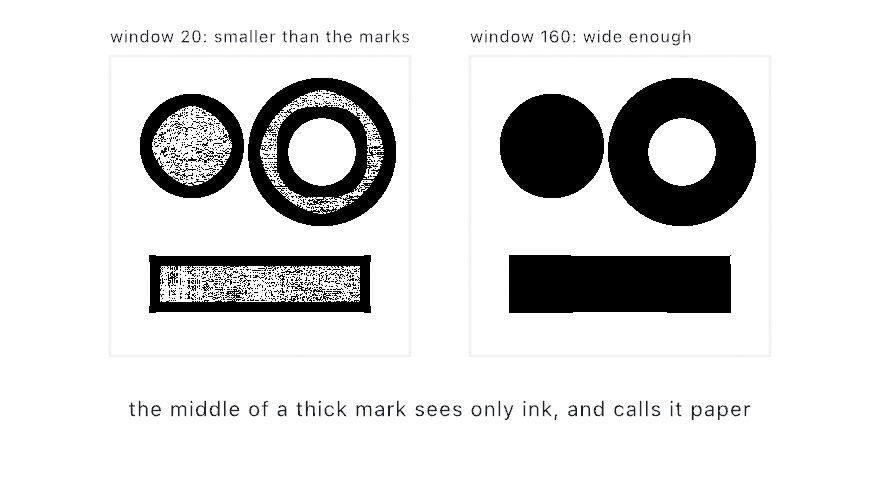
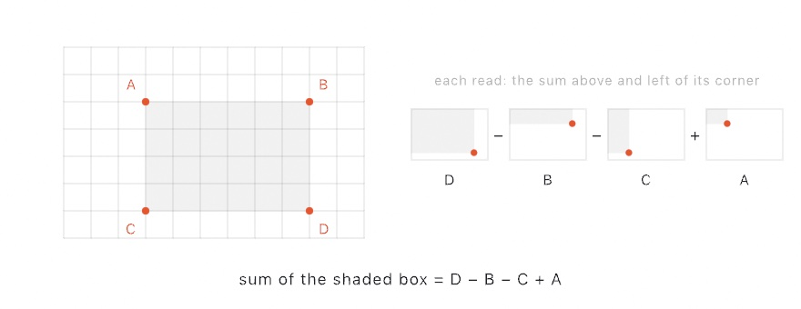

#### <sup>[Ollin](../../README.md) → [Documentation](../README.md) → [Drawing](./README.md) → `Local averages`</sup>

---

## Local averages

Sketches often need to know what the neighborhood around a pixel looks like. There are two
ways to answer that, an expensive one and a cheap one. The expensive answer reads every pixel
in the neighborhood, so a wide neighborhood costs more than a narrow one. The cheap answer
builds one table first, and then reads any neighborhood, of any size, in four lookups.

That table is a **summed-area table**, and two filters are built on it. `Filter.boxBlur`
averages the square around each pixel. `Filter.adaptiveThreshold` cuts each pixel against the
average of its own surroundings, rather than against one number for the whole picture.

<picture>
  <source media="(prefers-color-scheme: dark)" srcset="../../Guide/Images/16-LayersAndEffects/LocalAverages-dark.jpg">
  
</picture>

### Contents

- [Quick start](#quick-start)
- [A blur that does not care how wide it is](#box-blur)
- [A cut that ignores the light](#adaptive-threshold)
- [Choosing the window](#the-window)
- [How it works](#how-it-works)
- [What it costs](#what-it-costs)

<a id="quick-start"></a>
### Quick start

```swift
let layer = makeRenderTarget()
withTarget(layer) {
    background(.white)
    fill(.black)
    drawText("a page of notes", 80, 200)
}

// Average the 601-pixel square around every pixel. Four lookups each.
drawImage(layer.filtered(.boxBlur(radius: 300)).image, 0, 0)

// Or cut the page to two tones, each pixel against its own surroundings.
drawImage(layer.filtered(.adaptiveThreshold()).image, 0, 0)
```

<a id="box-blur"></a>
### A blur that does not care how wide it is

`boxBlur(radius:)` replaces every pixel with the average of the square of that radius around
it. It is the plainest blur there is, and you pick it for what it costs rather than for how it
looks:

```swift
layer.filtered(.boxBlur(radius: 4))     // these two
layer.filtered(.boxBlur(radius: 400))   // cost the same
```

A Gaussian blur looks better, and while the radius stays small it is also faster, so use
[`gaussianBlur`](Effects.md) there. Use a box blur when the radius is large, or when the
radius has to change while a sketch is running and you do not want the frame rate changing
with it.

Three box blurs in a row come close enough to a Gaussian that the eye stops telling them
apart, and that is still only three passes at the same fixed price:

```swift
layer.filtered(.boxBlur(radius: 90))
     .filtered(.boxBlur(radius: 90))
     .filtered(.boxBlur(radius: 90))
```

A window that hangs over the border averages only the pixels that are really there. It does
not count the empty space outside as black, so the edges of the layer keep their brightness.

<a id="adaptive-threshold"></a>
### A cut that ignores the light

A plain [`threshold`](Effects.md) picks one number, then sends every pixel above it to white
and every pixel below it to black. On a photograph of a page lit from one side, no single
number works, because the number that keeps the shadowed corner floods the lit one.

`adaptiveThreshold` compares each pixel with the average of its own neighborhood instead
(Bradley & Roth, 2007). Hard contrast survives that comparison and a slow change in lighting
does not, so both corners come out:

```swift
let page = makeRenderTarget()
withTarget(page) { drawImage(photo, 0, 0) }
drawImage(page.filtered(.adaptiveThreshold()).image, 0, 0)
```

| | |
|---|---|
| `window` | how wide the neighborhood is, in pixels. The default, `nil`, uses an eighth of the layer |
| `bias` | the fraction below the local average a pixel must fall before it goes dark. 0.15 by default |
| `invert` | swap the two tones |

`bias` is a *fraction* rather than a distance, and that is what makes the cut survive uneven
lighting. Light falling on a page multiplies what comes back off it, and only a test that
scales with the average is unchanged by a multiplication. Ollin makes that comparison in
linear light, where a change in lighting really is a plain scale.

The two tones carry the layer's own alpha, so a mark drawn on an empty layer is cut to two
tones without the empty part turning into a black rectangle.

<a id="the-window"></a>
### Choosing the window

The window has to be large enough to hold both ink and paper. If it is smaller than the marks,
the middle of a thick stroke sees nothing but more stroke. The filter takes that as the local
paper color, so the stroke comes out hollow:

<picture>
  <source media="(prefers-color-scheme: dark)" srcset="../Images/HollowStroke-dark.jpg">
  
</picture>

Widening the window costs nothing, so prefer a wide one. The published default of an eighth of
the image is a good starting point for a page of text.

<a id="how-it-works"></a>
### How it works

A summed-area table (Crow, 1984) holds one value at every texel: the sum of everything above
and to the left of that texel, itself included. Once you have the table, the sum over any
rectangle takes two subtractions and an addition:

<picture>
  <source media="(prefers-color-scheme: dark)" srcset="../Images/SummedAreaLookup-dark.jpg">
  
</picture>

Divide that sum by the area and you have the average. It is always four lookups.

Ollin builds the table by recursive doubling (Hensley et al., 2005). One pass adds what sits
one texel back, the next adds what sits two back, then four, and so on, so a row's whole
running total is finished in about eleven passes rather than a thousand. The same run of
passes then works down the columns. Ollin implements both techniques from those papers and
credits them in [`ATTRIBUTION.md`](../../ATTRIBUTION.md).

<a id="what-it-costs"></a>
### What it costs

The table costs you two things, and neither of them grows with the window.

**Time.** Building the table takes about twenty passes over the layer, which is roughly 6 ms
of GPU time for a 1080 square. One of these in a frame is comfortable. A dozen are not.

**Precision.** This is the structure's one real weakness, and it helps to know which way it
points. A running total spends most of a float's mantissa on itself, so a box sum is a
difference between two large numbers and carries a small *absolute* error. You see that error
divided by the area you asked for, so it **falls away as the window grows**. On a 1080 square
that error is about 7/255 in the worst corner of a 3-pixel window, and under 1.5/255 from 37
pixels up. The narrow end is the weak end, and that is the end where you would use a Gaussian
anyway.

---

See also [Effects](Effects.md) for the layers and filters this is built on. [Measured distance
fields](DistanceFields.md) answers the other question you can ask of every pixel of a layer at
once, and [Images](Images.md) covers getting a photograph into a layer in the first place.
