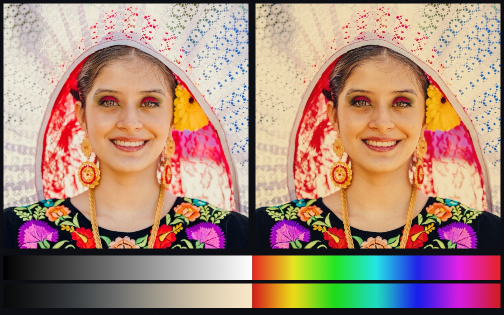

#### <sup>[Ollin](../../README.md) → [Documentation](../README.md) → [Drawing](./README.md) → `Looks`</sup>

---

## Looks: a grade from a `.cube` file

Color tools trade grades as `.cube` files. The file is a table that says, for every
color, which color to show instead. A colorist builds one and hands it over. A film
stock's look ships as one. A camera maker publishes one for its footage. Ollin reads
that file into a `ColorLUT` and applies it with `Filter.lut`, on one layer or on the
whole frame, and a look can also be written in code and saved as a `.cube` for any other
tool to read.



### Contents

- [Quick start](#quick-start)
- [What a `.cube` file holds](#the-file)
- [Reading one](#reading)
- [Applying it](#applying)
- [How it reads a color](#how-it-reads)
- [Writing one of your own](#writing)
- [The bundled look](#the-bundled-look)
- [On the web page](#web)
- [Notes](#notes)

<a id="quick-start"></a>
### Quick start

```swift
import Ollin

final class Graded: Sketch {
    var look = ColorLUT.warmPrint                      // the bundled look

    override func setup() {
        // Your own, beside the sketch. Read it once: it is a whole table.
        look = try! ColorLUT(resource: "teal-orange", withExtension: "cube", in: .module)
    }

    override func draw() {
        drawImage(photo, 0, 0)
        postProcess(.lut(look, amount: 0.8))           // most of the way there
    }
}
```

<a id="the-file"></a>
### What a `.cube` file holds

The format is plain text, published by Adobe and written by DaVinci Resolve, Premiere,
Photoshop, and the rest. It comes in two forms, and a file holds one of them.

- **A cube** (`LUT_3D_SIZE n`) holds an output color for every node of an `n`-sided lattice
  over the input's red, green, and blue. Any color can go anywhere, which is what a film
  look, a grade, or a print emulation needs. Grading tools export 33 on a side; 17 is
  common for a preview, 65 for a master.
- **Curves** (`LUT_1D_SIZE n`) hold one curve per channel with `n` nodes each. Each channel
  bends on its own and none can see the others. That is a tone curve or a transfer function,
  and it cannot turn one hue into another.

A `#` opens a comment, `TITLE "…"` names the table, and `DOMAIN_MIN` and `DOMAIN_MAX` (or
Resolve's `LUT_3D_INPUT_RANGE`) say what input range the table covers, which is 0 to 1
unless the file says otherwise. Every other line is one entry of three numbers. In a cube
the entries run with red changing fastest, then green, then blue, so the second line is one
step of red and not one of blue.

<a id="reading"></a>
### Reading one

```swift
let look = try ColorLUT(contentsOf: "/Users/me/Looks/kodachrome.cube")   // a path
let look = try ColorLUT(resource: "kodachrome", withExtension: "cube", in: .module)
let look = try ColorLUT(data: bytes)                                     // from anywhere
let look = try ColorLUT(text: "LUT_3D_SIZE 2\n0 0 0\n1 0 0\n…")            // from a string
```

Every reader throws. A file that is not a `.cube` is refused with a `ColorLUT.ReadError`
that names the line that stopped it, so a bad download or a truncated export says where it
went wrong:

```
line 3: unknown keyword 'COLOR_SPACE'
line 12: an entry is three numbers; this line has 4 fields
the size declares 4913 entries and the table holds 4912
```

A read table carries its `title`, its `form` (`.cube` or `.curves`), and its `size`. Read
in `setup()`, since a 33-sided cube is thirty-six thousand entries, and keep the value: the
renderer keeps the table on the GPU by its contents, so a table built every frame is uploaded
every frame.

<a id="applying"></a>
### Applying it

```swift
postProcess(.lut(look))                       // the whole frame
layer.filtered(.lut(look, amount: 0.5))       // one layer, half way toward the look
```

`.lut(_:amount:)` is a `Filter` like any other in the [catalog](Effects.md#filter), so
it chains, runs inside a `compose` block, and applies to a layer or to the frame. `amount`
fades the look in, from 0 (the picture as drawn) to 1 (the table's answer), mixed in linear
light like the other color filters.

<a id="how-it-reads"></a>
### How it reads a color

A table is authored on the picture as a display shows it, the encoded values, not the linear
light a layer holds. So the filter encodes each pixel before the read and decodes the answer
after it, and a value above white reads as white, since a table has no node past its last.
What the table does to white is still applied to a brighter value, which keeps the rest of
it, so a tone map still sees the highlight.

A cube is read by **tetrahedral interpolation**, the way a grading tool reads it. The cell
around the input is cut into six tetrahedra along its gray diagonal, and the four corners
of the one that holds the point are weighed. Every one of those tetrahedra has the cell's
black and white corners, so a gray input meets only the two gray corners, whatever the six
colored corners around it hold. A table that leaves gray alone then does so between its
nodes too, where the sampler's trilinear read would pull the colored corners in and tint a
neutral. Curves are read linearly between their nodes, which is all a curve wants.

The same read is there on the CPU as `color(for:)`, for a swatch, a palette, or a check:

```swift
let printed = look.color(for: .red)
```

A table value below black reads as black. A file with a domain other than 0 to 1 has its
input scaled into it first, and an input past the domain holds at the nearest end.

<a id="writing"></a>
### Writing one of your own

A cube can be built from a function of color, one node at a time, and written out as a
`.cube` file that any grading tool reads:

```swift
let cooler = ColorLUT(size: 17, title: "Cooler") { c in
    Color(red: c.red * 0.92, green: c.green, blue: min(1, c.blue * 1.08))
}
postProcess(.lut(cooler))
try cooler.write(to: "cooler.cube")
```

`ColorLUT.identity(size:)` is the table that changes nothing: the control for a comparison,
and the starting point for a look written by hand. `cubeText` is the file's text without the
file, for a table that goes somewhere other than disk.

<a id="the-bundled-look"></a>
### The bundled look

`ColorLUT.warmPrint` is a warm print, written by Ollin from four rules: blacks lifted a
little, a gentle S through the midtones, the highlights warmed toward amber and the shadows
cooled toward slate, and the whites held just short of paper. It is there to try the filter
on, and the file itself (`Sources/Ollin/Resources/Looks/WarmPrint.cube` in the framework) carries
the rules in its header, so it doubles as a template for a look of your own.

<a id="web"></a>
### On the web page

A curves table crosses to the recorded [web page](../Output/Web.md) as a strip, the way a
gradient map does, and the page reads it live. A cube stays with video for now: the export
stops and names the `.lut` filter.

<a id="notes"></a>
### Notes

- **Two forms, one file.** A file that declares both a `LUT_1D_SIZE` and a `LUT_3D_SIZE`
  (Resolve can write a shaper curve ahead of a cube) is refused at the second size. Export
  the cube alone.
- **Sizes.** A cube may be 2 to 256 on a side; curves 2 to 16,384 nodes.
- **Where the look lands.** A look applied with `postProcess` reads the whole frame after
  every layer has composited, so it grades the marks, the pictures, and the effects alike. A
  look on one layer grades that layer alone.
- **Precision.** An identity table hands the picture back byte for byte. The table's change is
  applied as a difference, and a difference under a millionth is taken as none, so the round
  trip through the transfer curve never moves a pixel the table did not.
- See [`Examples/Color/Look`](../../Examples/Color/Look/Sketch.swift) for the bundled look
  wiped across a portrait, a look written in code, and any `.cube` dropped on the window.

---

See also [Effects](Effects.md) for the layers and the rest of the filter catalog,
[Color](Color.md) for `Color`, `Ramp`, and `Palette`, and [Print color](../Output/PrintColor.md)
for the other table a picture goes through, a press profile.
