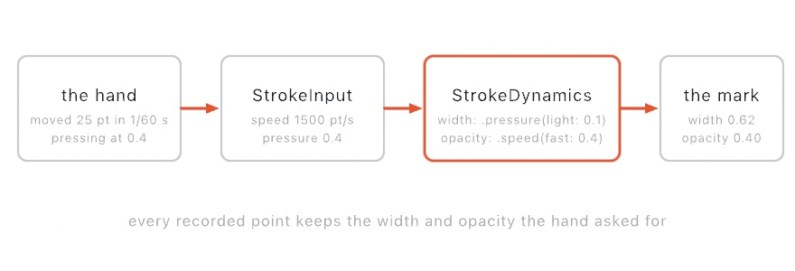

# Marks

Stroke dynamics drive width and opacity from how a mark is being made, rather than from where you are along it.

[`strokeProfile`](Drawing.md#strokeProfile) shapes a stroke by its *shape*. It reads the fraction along a finished path and answers with a width. That is the right tool for a designed mark, such as a taper you decided on in advance. It is the wrong tool for a mark someone is drawing right now. The path has no length yet, so there is no fraction to read.

<picture>
  <source media="(prefers-color-scheme: dark)" srcset="../../Guide/Images/15-ShapesAsMaterial/MarkWidth-dark.jpg">
  
</picture>

A **`StrokeMark`** is the other half. It records a path as it happens, and it measures how fast the pointer is traveling and how hard it is pressed. It then keeps the width and opacity the hand asked for at every point.

```swift
var mark = StrokeMark(.speed(fast: 0.15))

override func draw() {
    background(.white)
    if mouseIsPressed { record(into: &mark) }
    stroke(.black)
    strokeWeight(24)
    drawMark(mark)
}
```

Drag, and the mark comes out full where you moved slowly and thin where you hurried.

<picture>
  <source media="(prefers-color-scheme: dark)" srcset="../../Guide/Images/15-ShapesAsMaterial/MarkDynamics-dark.jpg">
  
</picture>

**Contents:** [The pieces](#pieces) · [StrokeInput](#input) · [StrokeResponse](#response) · [StrokeDynamics](#dynamics) · [StrokeMark](#mark) · [drawMark](#drawMark) · [Pressure](#pressure) · [Building a mark by hand](#byhand) · [Brushes](#brushes) · [What exports](#export)

<a name="pieces"></a>

## The pieces

A mark is built from four types, each doing one thing:

| Type | What it is |
| --- | --- |
| `StrokeInput` | What was measured at one point: speed, pressure, direction, and distance so far. |
| `StrokeResponse` | How **one axis** answers that measurement, as a multiplier. |
| `StrokeDynamics` | A response for width and a response for opacity, which together make the brush. |
| `StrokeMark` | The recorded path, with the width and opacity at every point of it. |

<picture>
  <source media="(prefers-color-scheme: dark)" srcset="../Images/MarkDataflow-dark.jpg">
  
</picture>

<a name="input"></a>

## StrokeInput

```swift
struct StrokeInput {
    var speed: Double        // canvas points per second, smoothed
    var pressure: Double     // 0...1, smoothed
    var direction: Vector2   // unit heading
    var distance: Double     // points travelled so far
}
```

`speed` runs around 200 for a careful hand, and past 1500 for a flick across a 1080-point canvas. `distance` is a distance rather than a fraction, because a mark in progress has no known length. There is nothing to take a fraction of, so dynamics only sees what has already happened.

<a name="response"></a>

## StrokeResponse

```swift
StrokeResponse.speed(reference: 1200, slow: 1, fast: 0.1)
StrokeResponse.pressure(light: 0.1, heavy: 1)
StrokeResponse.unchanged
StrokeResponse { input in ... }
```

A `StrokeResponse` is one axis's answer, given as a multiplier.

| Response | What drives it |
| --- | --- |
| `.speed(reference:slow:fast:)` | Pace. `slow` is the multiplier at rest, and `fast` is the multiplier at `reference` points per second and beyond. Works on any device. |
| `.pressure(light:heavy:)` | Press force. `light` applies at the faintest touch, and `heavy` at full force. Needs a device that measures it, see [Pressure](#pressure). |
| `.unchanged` | Nothing drives it. This axis keeps the stroke's own weight or alpha. It is the default. |
| `StrokeResponse { ... }` | Anything else you write, computed from the whole `StrokeInput`. |

Pass a `fast` larger than `slow` to reverse the mapping, so the mark swells as it speeds up. `reference` is in canvas points per second, so on a much larger or smaller canvas pass `1200 * scale`.

<a name="dynamics"></a>

## StrokeDynamics

```swift
StrokeDynamics(width: StrokeResponse = .unchanged,
               opacity: StrokeResponse = .unchanged)

StrokeDynamics.speed(reference: 1200, fast: 0.1)   // width only
StrokeDynamics.pressure(light: 0.1)                // width only
StrokeDynamics.uniform                             // neither
```

A `StrokeDynamics` is the brush, with one response per axis. Both responses are multipliers, matching `strokeProfile`. Width scales `strokeWeight`, opacity scales the stroke color's alpha, and `1` leaves either one as set.

Naming each axis says what each one does, and it lets the two come from different measurements:

```swift
StrokeDynamics(width: .pressure(light: 0.1),      // press for a fat mark
               opacity: .speed(fast: 0.4))        // hurry for a faint one
```

An axis you leave out is `.unchanged`, so nothing is ever driven by accident. `.speed(fast:)` and `.pressure(light:)` are shorthands for the everyday brush, and they drive **width only**. To fade as well, write both axes out.

A response runs where the stroke is expanded, not inside `draw()`. Like a profile closure it is `@Sendable`, so it cannot reach `time` or a `@Param`. Everything it needs is already in its `StrokeInput`, and the named forms take their shaping as arguments.

<a name="mark"></a>

## StrokeMark

```swift
StrokeMark(_ dynamics: StrokeDynamics = .speed(),
           smoothing: Double = 0.5,
           minSpacing: Double = 1.5)

mark.record(_ position: Vector2, deltaTime: Double, pressure: Double = 1)
mark.clear()
mark.append(_ sample: StrokeMark.Sample)

mark.samples      // [Sample], each a position + width + opacity
mark.positions    // just the path
mark.count / .isEmpty / .length / .bounds
```

A `StrokeMark` is the recording. `record` adds to the live path, and `Sketch.record(into:)` fills its three arguments from the running sketch. That is the form you want in `draw()`:

```swift
if mouseIsPressed { record(into: &mark) }
```

Three parameters:

- **`dynamics`** can be set mid-mark, so a live parameter can change the brush while a stroke is in progress. Points already recorded keep the width and opacity they were given.
- **`smoothing`** (`0` raw to `1` heavy, default `0.5`) is how much the measured speed and pressure are filtered. Raw per-frame speed is far too noisy to drive a width directly. The default sits where a mark reads as deliberate without visibly trailing the pointer.
- **`minSpacing`** (default `1.5` points) is how far the pointer must travel before a new point is recorded. It keeps a slow hand from piling hundreds of near-identical points into one spot. Frames under that distance keep their time rather than dropping it, so the point that does land measures its speed over the whole interval.

Passing `dt` is what makes a mark come out the same on a 60 Hz display and a 120 Hz one. A mark measures distance per frame. Without the real elapsed time, a faster display would read every stroke as half as fast and lay down a fatter mark.

A mark is an ordinary value, so keeping a finished one is a copy:

```swift
override func mouseReleased() {
    strokes.append(mark)
    mark.clear()
}
```

The first recorded point is held back until a second one gives it a heading, so a direction-driven brush starts with a real direction. A one-point mark draws nothing anyway, so `count` is `0` until the second point lands.

<a name="drawMark"></a>

## drawMark

```swift
drawMark(_ mark: StrokeMark)
```

`drawMark` strokes the recorded path at the width and opacity it asked for at every point. It goes through the same fringe expander every other stroke uses. That means it honors `stroke`, `strokeWeight`, `strokeJoin`, `strokeCap`, the transform stack, clipping, symmetry, and retained batches. It needs at least two recorded points and a stroke.

A width profile already set with `strokeProfile(_:)` still applies, and the two **multiply**. That is how a dynamic mark also gets a clean lift-off:

```swift
strokeProfile(.taper(start: 1))   // ... and fade out at the end
drawMark(mark)
```

A mark whose dynamics ask for nothing (`.uniform`) draws exactly like `drawPolyline` of the same points, down to the pixel.

<a name="pressure"></a>

## Pressure

```swift
pressure              // 0...1, 0 when nothing is held
pressureIsAvailable   // whether this device can measure it at all
```

`Sketch.pressure` is how hard the pointer is being pressed. On a pressure-sensing device, such as a Force Touch trackpad or a pen tablet, it varies continuously through a press. On a device that cannot measure pressure it is `1` while a button is down. A pressure-driven brush still draws there, at one weight throughout.

A pen tablet says more than how hard: [`stylus`](../Helpers/Input.md#stylus) carries the stylus's lean, its barrel turn, which end is down, and whether it is over the tablet at all, and the lean is what a broad-edged nib is made of. `pressureIsAvailable` says which kind of device you have. The answer comes from the event rather than from the machine, so it is `false` until the first press. Read it in `mousePressed()` rather than in `setup()`:

```swift
override func mousePressed() {
    mark = StrokeMark(pressureIsAvailable ? .pressure(light: 0.1)
                                          : .speed(fast: 0.15))
}
```

Ollin asks the trackpad for the drawing gesture. That gesture is a single stage over the full range, so a press reads as a smooth amount. No force-click fires look-up in the middle of a stroke.

<a name="byhand"></a>

## Building a mark by hand

A mark does not need a pointer. `append` adds a finished sample, with its width and opacity already decided. That is how you draw a mark deterministically, replay one, or feed one from some other measured signal:

```swift
var mark = StrokeMark()
for (i, p) in path.enumerated() {
    let t = Double(i) / Double(path.count - 1)
    mark.append(StrokeMark.Sample(position: p, width: 1 - t, opacity: 1))
}
```

`record` still works on a hand-built mark, and continues from the last sample.

This is also how a mark differs from `StrokeProfile.values([...])`, and why it is its own type. A profile's values are spread **evenly** along the path. A recorded hand's points are not evenly spaced. They bunch where the hand slowed and spread out where it hurried, which is the information the mark carries. Spreading its widths evenly would slide every one of them off the place it was measured. `StrokeProfile.values(_:at:)` is the general form, taking the fractions to place the values at, and it is what `drawMark` builds internally.

<a name="brushes"></a>

## Brushes

A width profile and a recorded mark both shape one continuous ribbon. A **`Brush`** replaces that ribbon, and repeats a shape along the path instead.

<picture>
  <source media="(prefers-color-scheme: dark)" srcset="../../Guide/Images/15-ShapesAsMaterial/BrushStamps-dark.jpg">
  
</picture>

```swift
strokeWeight(20)
strokeBrush(.spray())
drawPolyline(points)
```

`strokeBrush(_:)` is style. You set it once and it is held, like `strokeCap` or `strokeProfile`, and `noStrokeBrush()` goes back to the ribbon. It applies wherever a path is stroked: `drawLine`, `drawBezier`, `drawPolyline`, `drawCurve`, `drawArc`, `drawMark`, and the outlines of `drawShape` and `drawPolygon`. The analytic shapes, such as `drawCircle` and `drawRect`, have no path to walk. They keep drawing a continuous outline, and they say so once.

The stamp takes its **size** from `strokeWeight` and its **color** from `stroke`. A brush decides texture, not weight or color, so you can swap brushes without re-tuning anything else.

### The parameters

| | |
|---|---|
| `tip` | What gets stamped: `.circle`, `.square`, `.shape(Shape)`, or `.image(Image)` |
| `spacing` | Gap between stamps, as a fraction of the stamp's size. `0.2` reads as one mark, and `1` as a row of beads |
| `sizeJitter` | How much each stamp's size varies, `0` to `1` |
| `angle` | `.followPath`, `.fixed(radians)`, or `.random` |
| `angleJitter` | A random turn on top of `angle`, in radians |
| `scatter` | How far stamps stray off the line, as a fraction of their size |
| `count` | Stamps laid down at each step. Set it above `1` together with `scatter` for a scatter brush |
| `opacityJitter` | How much each stamp's opacity varies, `0` to `1` |
| `seed` | Fixes the randomness |

Four presets cover the common marks: `.round`, `.chisel()`, `.spray()`, and `.scatter()`.

### Spacing is measured in stamps, not pixels

Every distance in a brush is a fraction of the stamp's own size, so one brush keeps its texture at any weight. The same brush at twice the `strokeWeight` makes the same mark at twice the size, rather than a mark with a different texture.

### It multiplies with a profile

`strokeProfile` still shapes the size along the path, so a scattered mark that tapers at both ends is one more call:

```swift
strokeBrush(.spray())
strokeProfile(.taper())
drawPolyline(points)
```

A `drawMark`'s recorded widths and opacities feed in the same way, so the hand can drive a brush too.

### It is stable

A stamp's randomness comes from its index along the path and from the brush's `seed`, never from the sketch's `random`. That means a brush cannot shift randomness a sketch is using elsewhere, and the same path draws the same mark every frame. Animate the path and the stamps travel with it rather than boiling in place.

<a name="export"></a>

## What exports

A mark's **width** exports exactly. `--export-svg` and `--export-pdf` write the region it covers as a filled outline, not as a stroked path with one width. Any profiled stroke exports the same way, so a plotted or printed mark matches the screen.

A mark's **opacity flattens** to its average, weighted along the mark's length. A vector document draws one fill at one alpha per path, so a varying opacity has nowhere to go. Ollin says so once on the console rather than dropping it silently. For a plotter, with one pen and one ink, this costs nothing.

A **brush** exports as its stamps. Each stamp becomes a real circle, polygon, or path a plotter can follow. The exported document then carries the mark the screen showed, rather than the bare path running under it. Because each stamp is its own shape, a brushed mark keeps its varying opacity in vector export, where a ribbon has to flatten it. A brush cannot vary opacity over a *gradient* stroke, because that would mean rewriting the ramp. It says so once and stamps at the ramp's own alpha.

## See also

- [Drawing](Drawing.md#strokeProfile) for `strokeProfile`, which shapes a designed mark
- [Input](../Helpers/Input.md) for the rest of the pointer and keyboard surface
- [Export](../Output/Export.md) for the vector exporters
- Example: `Examples/Shapes/Brushwork` (paint with it), `Examples/Shapes/StrokeProfiles` (the profile family), `Examples/Shapes/Brushes` (the brush family)
