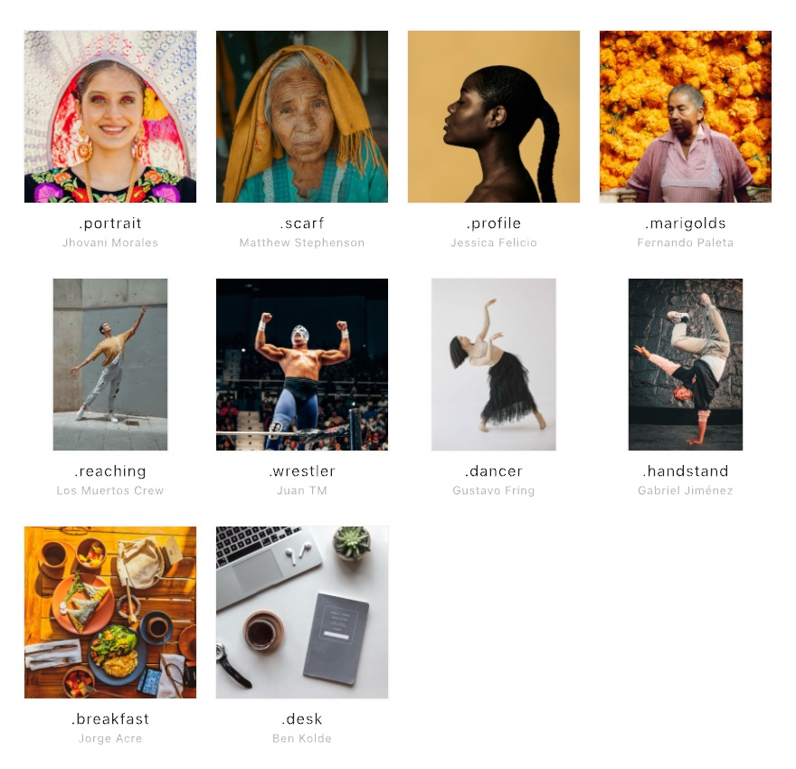

#### <sup>[Ollin](../../README.md) → [Documentation](../README.md) → [Drawing](./README.md) → `Sample photographs`</sup>

---

## Sample photographs

Ten photographs travel with Ollin so that an image technique, a filter, or a reader of any kind can be tried on a real picture before you have one of your own. Four are faces, four are whole figures, and two are tables seen from above. They live in their own library, `OllinSamplePhotos`, rather than in the framework, so an app that never imports it ships none of them.

```swift
import OllinSamplePhotos

final class Portrait: Sketch {
    var picture = Image(width: 1, height: 1)

    override func setup() {
        picture = SamplePhoto.portrait.load()
    }

    override func draw() {
        drawImage(picture, in: canvasRectangle, fit: .cover)
    }
}
```

<picture>
  <source media="(prefers-color-scheme: dark)" srcset="../Images/SamplePhotos-dark.jpg">
  
</picture>

### Contents

- [The faces](#faces) - four squares, and what each is good for
- [The figures](#figures) - four whole bodies, and what each is good for
- [The tables](#tables) - two from above, for naming things and reading print
- [SamplePhoto](#samplephoto) - `load`, `credit`, `all`
- [Working copies](#copies) - `resized(width:height:)`
- [Terms](#terms) - the licenses the pictures are used under

<a name="faces"></a>

### The faces

Each is a 1600-pixel square, cropped from the original around its subject.

- **`.portrait`** is a young woman in a lace headdress and an embroidered blouse, smiling at the camera. The frontal face, and the widest tonal range, from bare paper to solid ink: what the face and eye trackers, the person matte, the mosaics, the halftone, and the filter catalog read best.
- **`.scarf`** is an elderly woman in a yellow scarf, looking straight at the camera. The face with the most in it, every line of it an edge: what the ink drawing and the dithers show best. Its tones sit in the middle, so a stipple of it comes out nearly even.
- **`.profile`** is a woman in profile against a plain tan ground. The silhouette, bold masses on nothing: what the stipple, the single line, the spanning tree, and the string art read best. The head sits left of center on purpose, the way a profile is framed, and the braid runs to the right edge.
- **`.marigolds`** is a woman before a wall of cempasúchil, the marigolds of Día de Muertos. The color and texture picture: what palette extraction, the color-vision simulation, the shock filter, and the frequency domain show best.

The examples in `Examples/Images`, `Examples/Color`, and `Examples/Effects` read them, and so do the Guide's ink, brushwork, shock, filter-sheet, thread, and photo-mosaic figures.

<a name="figures"></a>

### The figures

Each is 1600 pixels on its long side, framed so that no limb runs off the edge, which is what a body needs if its joints are to be read. Three stand upright, since a square would cut a raised arm or a foot off; the wrestler is square, his arena frame having had the room to crop that way.

- **`.reaching`** is a dancer reaching up the face of a concrete wall, whole body, feet on a paved floor. All nineteen joints read, so it is the straightforward one to start from.
- **`.wrestler`** is a masked luchador with both fists raised over a full arena. Both arms read, and so does the crowd behind him, which makes him a person and a scene at once. The mask leaves the face trackers nothing to find, which is the reason he sits here beside the faces.
- **`.dancer`** is a contemporary dancer on a white ground, one arm reaching up and a long black skirt around the legs. Nothing stands behind her, so she is the cleanest figure to matte.
- **`.handstand`** is a breakdancer upside down on one hand against a stone wall. The hard pose: a body the wrong way up, which the joint model reads as readily as any other, and a good check that a sketch never assumed the head is on top.

Every one of them was read by the joint model before it was bundled. Three give all nineteen joints; the wrestler gives seventeen, since his ankles are behind the ring rope.

<a name="tables"></a>

### The tables

Two squares, both shot from above, for the readers that want a scene rather than a person.

- **`.breakfast`** is an Oaxacan breakfast: plates, bowls, cups, cutlery, a napkin, glasses, a phone. The densest table here for anything that names things. The object detector finds five (two cups, two bowls, a sandwich), where a person in a scene gives it three.
- **`.desk`** is a laptop, earbuds, a plant, a watch, a cup of coffee, and a notebook whose cover is printed. It is the one with text, and the reason it is cropped in as far as it is: at the photograph's full width the recognizer read nothing, and cropped it reads five lines. The rectangle detector finds seven quadrilaterals in it.

Small print needs `TextRecognizer`'s `.accurate` quality rather than the `.fast` a live camera defaults to, and the first accurate pass on a Mac prepares the system's reader, which can take the better part of a minute before anything appears. After that it costs about 140 ms a frame here.

<a name="samplephoto"></a>

### SamplePhoto

```swift
struct SamplePhoto {
    let name: String            // the file name inside the bundle
    let subject: String         // a few words on what it shows
    let credit: Credit
    func load() -> Image
    static let portrait, scarf, profile, marigolds: SamplePhoto
    static let all: [SamplePhoto]
}

struct SamplePhoto.Credit {
    let photographer: String
    let place: String
    let source: String          // the page the photograph came from
    let license: String
    let licenseURL: String
    var line: String            // "Photograph by …, … (… License)"
}
```

`load()` decodes the picture through the library's own bundle, so there is no `in:` to pass. Decoding happens on every call, so keep the result in a property rather than calling it from `draw()`.

`credit` is the photographer, the place, the page the picture came from, and the license, carried in code so a sketch can draw the line the photographer is owed:

```swift
drawText(SamplePhoto.scarf.credit.line, 24, height - 24)
// Photograph by Matthew Stephenson, Oaxaca, Mexico (Unsplash License)
```

`all` lists all eight, the faces first and then the figures.

<a name="copies"></a>

### Working copies

A 1600-pixel square is more than most CPU techniques want. A stipple, a dither, a mosaic, or a string-art winding reads every pixel, and a copy of a few hundred pixels a side is what they were tuned on. [`resized(width:height:)`](./Images.md#image) makes that copy:

```swift
let small = SamplePhoto.profile.load().resized(width: 340, height: 340)
let line = singleLine(of: small, points: 3600, in: canvasRectangle.inset(by: 96))
```

A filter that runs on the GPU reads the full picture as it is: draw it into a layer with `fit: .cover` and filter the layer.

<a name="terms"></a>

### Terms

The scarf, the profile, and the desk come from Unsplash under the [Unsplash License](https://unsplash.com/license); the other seven come from Pexels under the [Pexels License](https://www.pexels.com/license/). Both allow free use, commercial use included, and modification, and neither requires attribution, which is given all the same. Both forbid selling unaltered copies and compiling the pictures into a competing stock service, and the Pexels License adds that an identifiable person may not be shown in a bad light or as endorsing anything. The photographs are credited in [`THIRD-PARTY-NOTICES.md`](../../THIRD-PARTY-NOTICES.md), with what was changed: each was resized, converted to sRGB, and re-encoded with its metadata removed, the faces and the tables cropped square and two of the figures cropped in. The desk photograph carries a notebook whose printed cover names its maker, which the text recognizer reads aloud; that is incidental to a photograph of a desk rather than an endorsement. The licenses ride on the photographs, not on Ollin's code, which stays MIT.

---

Example sketches: every sketch in [`Examples/Images`](../../Examples/Images/README.md), plus [`Examples/Color/Dithering`](../../Examples/Color/Dithering/Sketch.swift), [`Examples/Color/PaletteFromImage`](../../Examples/Color/PaletteFromImage/Sketch.swift), [`Examples/Effects/InkDrawing`](../../Examples/Effects/InkDrawing/Sketch.swift), [`Examples/Effects/Brushwork`](../../Examples/Effects/Brushwork/Sketch.swift), [`Examples/Effects/Coherence`](../../Examples/Effects/Coherence/Sketch.swift), [`Examples/Effects/FilterCatalog`](../../Examples/Effects/FilterCatalog/Sketch.swift), and [`Examples/Effects/Fourier`](../../Examples/Effects/Fourier/Sketch.swift). For the figures, see [body pose](../Vision/Vision.md).
