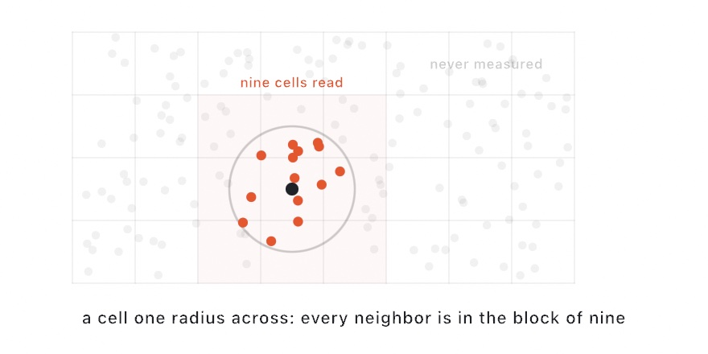

#### <sup>[Ollin](../../README.md) → [Documentation](../README.md) → [Drawing](./README.md) → `Spatial index`</sup>

---

## Spatial index

A `SpatialIndex` answers the question "what is near here" over a set of points, and it does that without comparing against every point. Use it as soon as a loop over points holds a second loop over points. That nested shape is what makes a sketch feel instant at 500 points and crawl at 5,000.

One type answers three questions:

- **Which point is nearest?** Use `nearest(to:)`, or `kNearest(_:to:)` for the few nearest.
- **Which points are within reach?** Use `neighbors(of:within:)`, or `forEachNeighbor(of:within:_:)`, which allocates nothing.
- **Which points are inside this box?** Use `indices(in:)`.

Every answer is an **index into `points`**. Your sketch keeps its own payload in its own array (a color, a velocity, an age), and reads that payload back with the same index.

### Contents

- [Quick start](#quick-start)
- [The two kinds](#kinds)
- [Growing a set](#growing)
- [Asking about a point in the set](#self)
- [Cell size](#cell-size)
- [Reproducibility](#reproducibility)
- [Reference](#reference)

<a name="quick-start"></a>

### Quick start

```swift
override func draw() {
    background(.black)
    let index = SpatialIndex(points)

    // The nearest point to the mouse.
    if let i = index.nearest(to: Vector2(mouseX, mouseY)) {
        stroke(.white)
        drawLine(Vector2(mouseX, mouseY), points[i])
    }

    // Everything within 80 of it.
    fill(.orange)
    for j in index.neighbors(of: Vector2(mouseX, mouseY), within: 80) {
        drawCircle(center: points[j], radius: 4)
    }
}
```

Building the index costs one pass over the points, so it is normal and cheap to build it fresh each frame from moving points. Do not build it inside the loop that queries it.

<a name="kinds"></a>

### The two kinds

```swift
SpatialIndex(points)               // .grid, the default
SpatialIndex(points, kind: .tree)  // a k-d tree
```

`.grid` sorts the points into square cells, and a query then reads only the block of cells it can reach. It suits points spread over the area at a similar density, which covers nearly every sketch. It is also the kind that takes new points cheaply.

<picture>
  <source media="(prefers-color-scheme: dark)" srcset="../../Guide/Images/12-FlocksAndSwarms/NeighborCells-dark.jpg">
  
</picture>

`.tree` cuts the set in half along its widest axis, then cuts each half again. A search reads the other side of a cut only when the answer could lie there. So it holds its speed when the points gather into tight clumps with wide empty space between them. A grid has to walk many empty cells to reach those clumps.

The kind is a speed choice, not a correctness one. Every query that answers with an array gives the same answer either way, down to the order.

<a name="growing"></a>

### Growing a set

Some sketches grow a set rather than start with one: dart throwing, aggregation, or a mark dropped where the mouse goes. For those, build an empty index over the area and add to it.

```swift
var index = SpatialIndex(bounds: canvasRectangle, cellSize: 30)
var points: [Vector2] = []

override func draw() {
    let p = randomVector(in: canvasRectangle)
    if !index.hasNeighbor(of: p, within: 30) {   // nothing too close
        index.insert(p)
        points.append(p)
    }
    for q in points { drawCircle(center: q, radius: 6) }
}
```

`insert(_:)` returns the new point's index. That index matches the position the point takes in `points` when both grow together. A point that lands outside `bounds` is still indexed correctly, because the box grows to take it.

A tree rebuilds itself on every insert, so grow a grid instead, and build a tree from a set that is already finished.

The yes-or-no form matters here. `hasNeighbor(of:within:)` stops at the first point it finds instead of collecting them all. `anyNeighbor(of:within:)` runs the same search and tells you *which* point it found, such as the particle a walker stuck to.

<a name="self"></a>

### Asking about a point in the set

Flocking, relaxation, and repulsion all have every point ask about the others. Pass the point's **index** rather than its position, and the answer leaves that point itself out:

```swift
for i in points.indices {
    var push = Vector2.zero
    index.forEachNeighbor(of: i, within: 40) { j, distanceSquared in
        push = push + (points[i] - points[j]) / max(distanceSquared, 1)
    }
    points[i] = points[i] + push
}
```

The closure form allocates nothing. It gives you the **squared** distance, which is the number this kind of loop wants anyway, because comparing squares avoids a square root per point.

<a name="cell-size"></a>

### Cell size

With no `cellSize`, a grid sizes its cells so that one cell holds about one point. That size balances the walk (fewer points to reject) against the cell count (fewer cells to visit).

When you know the radius you will query with, pass it:

```swift
let index = SpatialIndex(points, cellSize: 40)   // and query within: 40
```

A cell equal to the query radius reads a 3 by 3 block of cells and nothing more. That is as tight as this structure gets. A cell much smaller than the radius makes a query walk many cells. A cell much larger makes it reject many points. Neither one changes the answer.

<a name="reproducibility"></a>

### Reproducibility

A seeded sketch has to draw the same picture twice, so the index is built to be repeatable:

- Results come back in a fixed order. The nearest queries sort ascending by distance and then by index, and the neighbor and region lists sort ascending by index.
- Equal distances answer with the **lower index**, so a tie never depends on which cell the search reached first.
- Cells are cut on the lattice that runs through the origin, so a given cell size always divides the plane the same way. An index rebuilt after its points moved sorts them into the same cells. A walk over them then reports the same neighbors in the same order. Without that, the last digits of a sum over neighbors drift from frame to frame, and over enough steps that drift moves a simulation.

<a name="reference"></a>

### Reference

| Building | Meaning |
| --- | --- |
| `SpatialIndex(_ points: [Vector2], kind: Kind = .grid, cellSize: Double? = nil)` | An index over a finished set. |
| `SpatialIndex(bounds: Rectangle, cellSize: Double, kind: Kind = .grid)` | An empty index ready to be grown. |
| `insert(_ point: Vector2) -> Int` | Adds a point and answers with its index. |
| `points: [Vector2]` / `count: Int` / `isEmpty: Bool` / `cellSize: Double` | What the index holds. |

| Query | Meaning |
| --- | --- |
| `nearest(to: Vector2) -> Int?` | The nearest point, or nil when the index is empty. |
| `kNearest(_ k: Int, to: Vector2) -> [Int]` | The `k` nearest, ascending by distance then index. |
| `neighbors(of: Vector2, within: Double) -> [Int]` | Every point within the radius, ascending by index. |
| `neighbors(of: Int, within: Double) -> [Int]` | The same query around a point of the set, leaving that point out. |
| `forEachNeighbor(of: Vector2, within: Double, _ body: (Int, Double) -> Void)` | The same walk with no array built. `body` gets the index and the squared distance. |
| `forEachNeighbor(of: Int, within: Double, _ body: (Int, Double) -> Void)` | The same walk around a point of the set, leaving that point out. |
| `anyNeighbor(of: Vector2, within: Double) -> Int?` | The first point found within the radius. |
| `hasNeighbor(of: Vector2, within: Double) -> Bool` | Whether anything is within the radius. |
| `indices(in: Rectangle) -> [Int]` | Every point inside the region, ascending by index, boundary included. |

Runnable: [`Examples/Shapes/Neighbors`](../../Examples/Shapes/Neighbors/Sketch.swift).

---

See also [`Geometry`](./Geometry.md) for the `Vector2` and `Rectangle` types the queries use. Read [`Voronoi & Delaunay`](./Voronoi.md) when the question is the whole partition rather than one neighborhood. Read [`Compute`](../Shaders/Compute.md) for `spatialHash`, the GPU form that lets thousands of particles find each other in a compute kernel.
