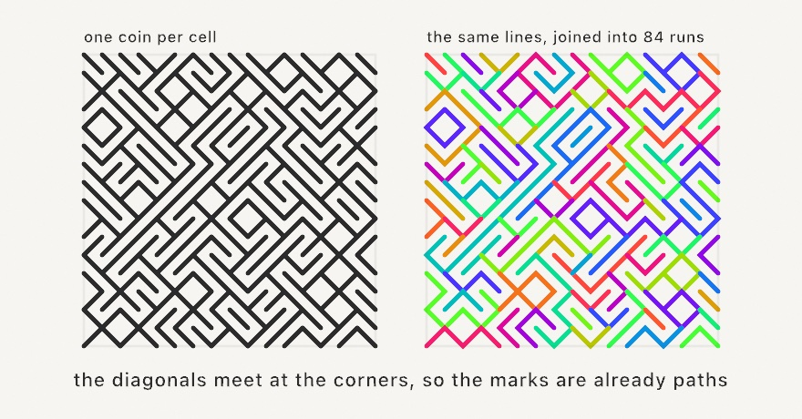

#### <sup>[Ollin](../../README.md) → [Documentation](../README.md) → [Drawing](./README.md) → `Ten print`</sup>

---

## Ten print

**`tenPrint`** fills a grid with diagonals, one per cell, each leaning one way or the other by a coin flip. The diagonals meet at the cells' corners, so what comes out is not a field of loose marks but a tangle of long connected paths, and no two runs of the coin give the same one.

It is the picture a famous one-line program printed forever on an early home computer, and about the smallest amount of code anyone has needed to make something worth looking at.

<picture>
  <source media="(prefers-color-scheme: dark)" srcset="../../Guide/Images/07-Tiles/DiagonalMaze-dark.jpg">
  
</picture>

### Contents

- [tenPrint](#tenprint)
- [The two faces](#faces)
- [Bits of your own](#bits)
- [Practical notes](#notes)

<a name="tenprint"></a>

#### tenPrint

```swift
tenPrint(in bounds: Rectangle? = nil, columns: Int, rows: Int,
         probability: Double = 0.5) -> TenPrint

drawTenPrint(in bounds: Rectangle? = nil, columns: Int, rows: Int,
             probability: Double = 0.5)
```

A `columns × rows` field of diagonals over `bounds` (the whole canvas by default), each cell's coin flipped by the seeded `random`, so `seed(_:)` makes the design reproducible. `drawTenPrint` strokes the joined runs for you.

```swift
seed(5)
let maze = tenPrint(columns: 40, rows: 40)
stroke(.white); strokeWeight(6); strokeCap(.round)
for run in maze.runs { drawPolyline(run.points) }
```

`probability` biases the coin. At `0.5` the balanced tangle. Pushed toward 0 or 1 the field combs into long parallel diagonals with the odd cell crossing them, which is a different and quieter picture.

<a name="faces"></a>

#### The two faces

| On `TenPrint` | What it gives |
|---|---|
| `lines` | One open two-point `Contour` per cell: the diagonal that cell drew. The plain reading, and what the original printed. |
| `runs` | The same diagonals joined end to end wherever they meet, so a pen travels a long way before it lifts. The one to stroke and the one to plot. |
| `bits` | One bit per cell, row-major, so it zips with `grid.cells`. `false` leans forward, `true` leans back. |
| `bit(column:row:)` | The bit for a cell, with a shorter `bits` array repeating. |
| `grid` | The grid the diagonals are drawn in. |

Coloring each run separately is the clearest way to see what the joining found, since a run is one continuous path through the tangle:

```swift
for (index, run) in maze.runs.enumerated() {
    stroke(CosinePalette.rainbow.color(at: (Double(index) * 0.618)
        .truncatingRemainder(dividingBy: 1)))
    drawPolyline(run.points)
}
```

<a name="bits"></a>

#### Bits of your own

The coin is not required. `TenPrint(grid:bits:)` takes the bits directly, and a shorter array repeats, so a small motif tiles a large field.

```swift
let woven = TenPrint(grid: Grid(in: bounds, columns: 30, rows: 30),
                     bits: [true, false, false])
```

All-`false` bits are the plainest case worth knowing: every cell leans the same way, and the runs come back as exactly the anti-diagonals of the grid.

<a name="notes"></a>

#### Practical notes

- **The `gutter` does not apply.** A diagonal runs corner to corner of a lattice the cells sit on, so neighbors always meet, whatever the grid's gutter is.
- **`strokeCap(.round)` is what makes it read as one tangle.** Butt caps leave a notch at every corner where two diagonals meet.
- **`runs` is not the provably shortest set of paths.** Every walk starts at a corner where an odd number of diagonals meet, since such a corner has to end some path, and that keeps the count near the fewest possible. What the walks leave behind is taken as loops. Splicing the leftovers back in would shorten the list a little, and is more machinery than a pen lift is worth.
- **Deterministic.** The same seed gives the same design, and the runs come back in the same order every time, so a colored-by-index reading is stable.
- **Plotter-ready.** `runs` are real polylines, so `--export-svg` writes them as paths.

---

Related: [`Hitomezashi`](./Hitomezashi.md) (one bit per grid *line* rather than per cell), [`Truchet`](./Truchet.md) (the same idea with tiles that carry arcs), [`Ulam spiral`](../Generators/UlamSpiral.md) (another one-rule picture over a grid), [`Geometry`](./Geometry.md) (the `Grid` underneath).
