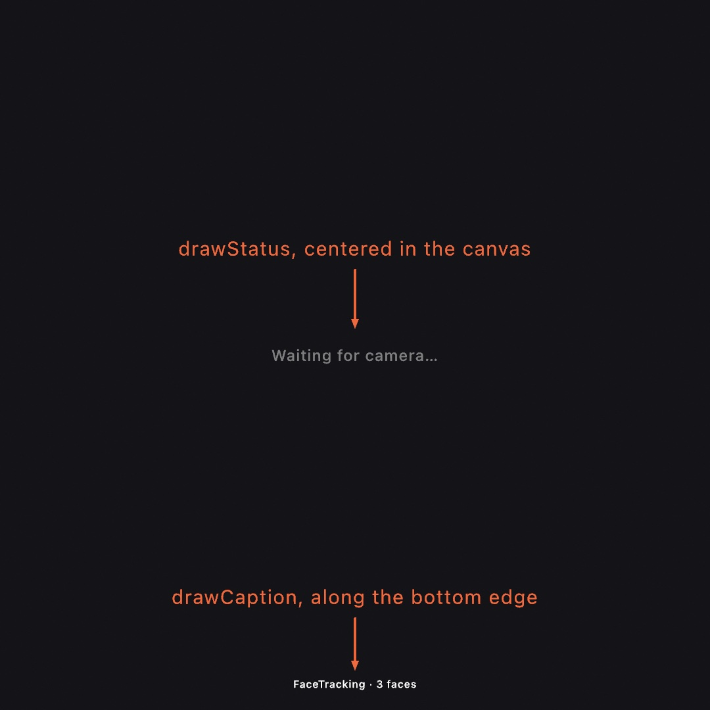
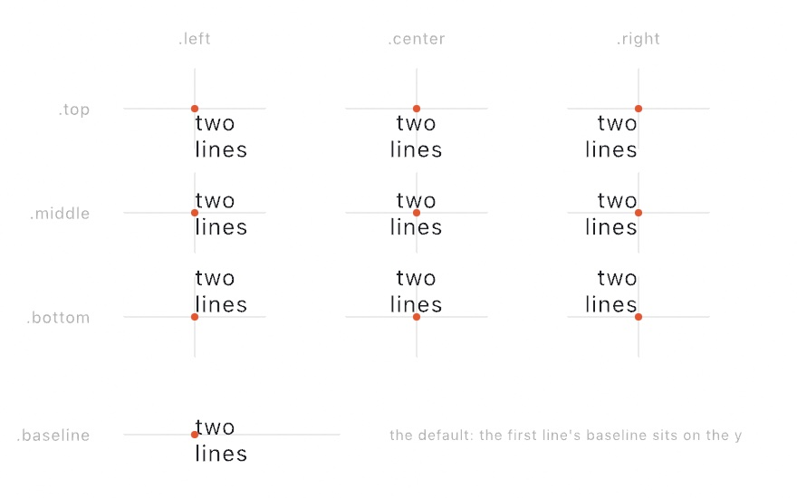
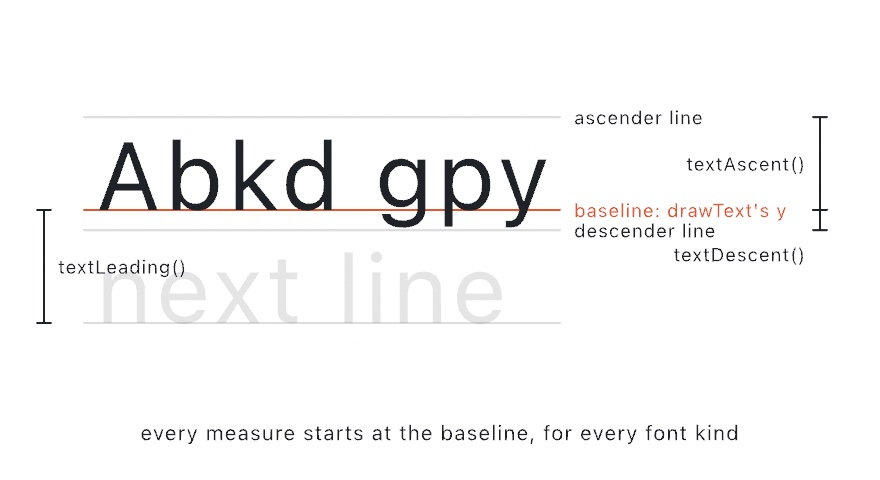

#### <sup>[Ollin](../../README.md) → [Documentation](../README.md) → [Drawing](./README.md) → `Text`</sup>

---

## Text

Ollin draws text in three kinds of font, all behind the same `drawText` / `textFont` / `textSize` / `textAlign` surface:

- An **outline font** is a real TrueType/OpenType (`.ttf`/`.otf`) face, each glyph stored as vector contours and drawn as a [`Shape`](../Drawing/Geometry.md#shape). One load draws crisp at *any* size, the type takes `fill` and any `stroke` you set, and the glyph geometry is yours to manipulate. The default font is an outline font, so text works with zero setup.
- A **bitmap font** stores each glyph as a small grid of pixels, each lit pixel stamped as one square on the same instanced-SDF path the shapes use. No rasterizer, no separate pipeline.
- A **stroke font** is a single-line (plotter) face whose glyphs are open pen paths with *no fill*, drawn with the current `stroke`. It's the kind of letterform a pen plotter draws, and Hershey Sans comes bundled.

All three ride the [transform stack](../Drawing/Drawing.md#translate), composite in draw order with everything else, and stay crisp at any size.

<picture>
  <source media="(prefers-color-scheme: dark)" srcset="../../Guide/Images/08-Words/TypeSpecimen-dark.jpg">
  
</picture>

The default font is `OutlineFont.systemMedium`, the system UI face (San Francisco on macOS) at medium weight, a touch sturdier than the regular weight so text holds up over busy canvases, which is why `drawText` works with zero setup. For a pixel look, the bundled `BitmapFont.builtIn` is **[Cozette](https://github.com/the-moonwitch/Cozette)**, a 13px pixel font covering a wide range: Latin (including the Spanish accents `á é í ó ú`, `ñ`, `ü`, `¿`, `¡`), Cyrillic, Greek, and Japanese kana. Call these bare inside `draw()`, and they forward to the `Drawer`.

### Contents

- [drawText](#drawtext) - draw a string
- [drawStatus & drawCaption](#notices) - standard notices and labels, one call each
- [textFont](#textfont), [textSize](#textsize), [textAlign](#textalign) - text state
- [textWidth](#textwidth) - measure a string
- [Outline fonts](#outlinefont) - `OutlineFont`, loading a `.ttf`/`.otf` from anywhere
- [Rendering at volume](#textmode) - `textMode(.atlas)` for paragraphs and large glyph counts
- [Variable fonts](#variable) - animate weight, width, and other axes
- [Stroke fonts](#strokefont) - `StrokeFont`, single-line / plotter type
- [Per-glyph drawText](#perglyph) - give each letter its own transform and color
- [Text on a path](#onpath) - lay glyphs along a curve
- [Box layout](#box) - wrap a paragraph into a rectangle
- [textToShapes](#texttoshapes) - text as first-class geometry
- [Type as a solid](#solid) - `drawText3D`, a word extruded into a 3D mesh
- [Metrics](#metrics) - `textAscent` / `textDescent` / `textLeading` / `textBounds`
- [Every script](#scripts) - Arabic, Devanagari, Thai, Japanese, emoji, and what changes
- [textDirection](#textdirection) - which way a line runs
- [Writing in columns](#vertical) - Japanese and Chinese set top to bottom
- [Columns that fill the other way](#mongolian) - traditional Mongolian, whose letters join
- [textJustify](#justify) - both edges of the box flush
- [textHangingPunctuation](#hanging) - let a stop sit past the end of a line
- [textMissingCharacters](#missing) - what the font cannot draw
- [BitmapFont](#bitmapfont) - the bitmap font value type, and authoring your own

<a name="drawtext"></a>

### drawText

```swift
drawText(_ string: String, _ x: Double, _ y: Double)
drawText(_ string: String, at position: Vector2)
drawText(_ string: String, at position: Vector2,
         size: Double? = nil, color: Color? = nil,
         align horizontal: HorizontalTextAlign? = nil, _ vertical: VerticalTextAlign? = nil)
```

Draw `string` at a point, in the current `fill` color, using the active `textFont` / `textSize` / `textAlign`. `\n` starts a new line. Glyphs are geometry (vector shapes for an outline font, SDF squares for a bitmap one), so text rotates and scales with the [transform stack](../Drawing/Drawing.md#translate) like everything else. `noFill()` draws nothing, and characters the font doesn't have advance the pen but draw nothing.

```swift
background(.black)
fill(.white)
textSize(120)
textAlign(.center, .middle)
drawText("ollin", width / 2, height / 2)
```

The styled form is the one-call label. Any of `size`, `color`, and `align` you give apply to this text alone, and the standing state comes back untouched. It replaces the four-call preamble a label usually drags along:

```swift
drawText("Hello", at: center, size: 32, color: .white, align: .center, .middle)
```

`align` takes the same pair as `textAlign(_:_:)`, vertical defaulting to `.baseline`. `color` paints the glyphs in exactly that color whatever the font kind (it sets the fill, or the stroke for a stroke font, and suppresses the outline decoration a standing `stroke` would add). The scalar `(x, y)` and [box](#box) forms take the same three arguments.

<a name="notices"></a>

### drawStatus & drawCaption

```swift
drawStatus(_ message: String, style: StatusStyle = .info, in container: Rectangle? = nil)
drawCaption(_ text: String, edge: CaptionEdge = .bottom)
```

Two one-call conveniences for the text every sketch ends up wearing, so the states a sketch should report never stay silently blank:

- `drawStatus` centers a standard notice in `container` (the whole canvas by default), wrapped if long. It draws quiet gray for `.info` ("Waiting for camera…", which [`drawFrame`](../Vision/Vision.md#camera) does for you) and salmon for `.warning` (a vision model that [can't run here](../Vision/Vision.md#availability), a missing install).
- `drawCaption` sets a small white label along the bottom edge (or the top, with `edge: .top`), saying what the sketch is, what it's showing, and what to do with it.

```swift
if let reason = tracker.unavailableReason {
    return drawStatus(reason, style: .warning)
}
drawCaption("FaceTracking · \(faces.count) faces")
```



Both draw in their own standard typeface, size, and alignment, scoped like a `withState { }`, so the sketch's fill, font, and alignment are untouched afterward.

<a name="textfont"></a>

### textFont

```swift
textFont(_ font: BitmapFont)
textFont(_ font: OutlineFont)
textFont(_ font: StrokeFont)
```

Set the active font, either a bitmap (pixel-grid), outline (`.ttf`/`.otf`), or stroke (single-line) face. The default is `OutlineFont.systemMedium`, and `textFont(OutlineFont.systemMedium)` switches back to it (or `textFont(BitmapFont.builtIn)` for the bundled Cozette pixel font). Like the other drawing state, the active font is part of the [push/pop stack](../Drawing/Drawing.md#withstate), so `withState { textFont(custom); … }` restores the previous font automatically on exit. (See [BitmapFont](#bitmapfont) to load or build a bitmap font, [Outline fonts](#outlinefont) for a `.ttf`/`.otf`, or [Stroke fonts](#strokefont) for single-line type.)

<a name="textsize"></a>

### textSize

```swift
textSize(_ size: Double)
```

Set the rendered text height in points, the height one line of glyphs occupies on screen. A `BitmapFont` is authored at a native pixel height, and `textSize` scales each pixel to a module of `size / font.pixelHeight` points, so `textSize(140)` makes one line of the font 140 points tall whatever the font's grid. Defaults to 24.

<a name="textalign"></a>

### textAlign

```swift
textAlign(_ horizontal: HorizontalTextAlign, _ vertical: VerticalTextAlign = .baseline)
```

Set how text is anchored to the `drawText` position.

- Horizontal (`HorizontalTextAlign`): `.left` (default) starts the text at the x, `.center` centers it, `.right` ends it at the x.
- Vertical (`VerticalTextAlign`): `.baseline` (default, like p5) sits the first line's baseline on the y, `.top` / `.bottom` align the block's top / bottom edge, and `.middle` centers the whole block (`.center` is accepted as an alias, so `textAlign(.center, .center)` compiles).

<picture>
  <source media="(prefers-color-scheme: dark)" srcset="../Images/TextAlignAnchors-dark.jpg">
  
</picture>

```swift
textAlign(.center, .top)
drawText("two\nlines", width / 2, 100)   // centered, growing downward from y = 100
```

<a name="textwidth"></a>

### textWidth

```swift
textWidth(_ string: String) -> Double
```

The on-screen width of `string`'s widest line, in points, at the current `textFont` / `textSize`, for laying text out (centering by hand, wrapping, marquees).

```swift
let size = 42; textSize(size)
let w = textWidth(label)
drawRect(center: Vector2(x, y), width: w + 24, height: size + 16)   // a padded backing
```

<a name="outlinefont"></a>

### Outline fonts

```swift
textFont(_ font: OutlineFont)
```

An `OutlineFont` is a real TrueType/OpenType (`.ttf`/`.otf`) face. Unlike a bitmap font it stores each glyph as **vector contours**, so one load draws crisp at *any* `textSize` and you never reload per size. Set it with the same `textFont`, and `drawText`, `textSize`, `textAlign`, and `textWidth` all work exactly as before.

Because an outline glyph is rendered as a [`Shape`](../Drawing/Geometry.md#shape), the same vector fill the triangulator draws, outline text takes the current `fill` and composites in draw order with everything else. Once you've set a `stroke`, text takes that too. Filled, outlined, and stroke-only text all fall out of that:

```swift
let display = OutlineFont(name: "Avenir Next") ?? .system
textFont(display)
textSize(160)
textAlign(.center, .middle)

fill(.white); noStroke()
drawText("filled", width / 2, 240)

noFill(); stroke(.white); strokeWeight(2)
drawText("outline", width / 2, 480)
```

> [!NOTE]
> Text honors a stroke you have *set*, so a leftover `stroke(...)` from earlier drawing will outline your glyphs; call `noStroke()` when that isn't the look you want. The one stroke that never applies to text is the initial default, the 1px black every fresh sketch starts with. A band straddling every contour would bold text on a light ground and eat thin light glyphs on a dark one, so glyphs only decorate with a stroke the sketch asked for.

**Loading a font, from anywhere:**

```swift
OutlineFont(name: "Helvetica Neue")             // an installed family / PostScript name
OutlineFont(path: "/path/to/Font.otf")          // a file on disk
OutlineFont(url: fileURL)                        // a file:// URL
OutlineFont(data: bytes)                          // raw .ttf/.otf data
OutlineFont(resource: "Font.ttf", in: .module)   // a font bundled beside your sketch

OutlineFont.system        // the system UI font (San Francisco on macOS)
OutlineFont.systemMedium  // medium weight, the default text font
OutlineFont.systemBold
OutlineFont.systemMono
```

`init(name:)` returns `nil` if no installed font matches, so a typo fails loudly instead of silently substituting another face. Pair it with a fallback, as in `OutlineFont(name: "Futura") ?? .system`. A remote `https://` URL needs an asynchronous download, which can't run on the draw thread, so fetch it in `setup()` (or ahead of time) and pass the bytes to `init(data:)`.

Ollin ships no `.ttf`/`.otf` of its own, so you bring the font (installed, bundled, or fetched). Layout goes through Core Text, so kerning, ligatures, and fallback for missing glyphs come for free.

<a name="textmode"></a>

### Rendering at volume

By default each outline glyph is filled as a vector shape, the highest quality, and it takes `fill` *and* `stroke`. That's the right choice for headlines and body text, but a paragraph of thousands of glyphs re-tessellated every frame gets expensive. `textMode(.atlas)` switches outline text to a signed-distance-field atlas instead, where each glyph is rasterized once into a shared texture and drawn as a single quad sampling it, so the per-glyph cost drops to a handful of vertex writes. It stays crisp under magnification, and one raster serves every `textSize`.

```swift
textFont(OutlineFont.systemMono)
textSize(18)
textMode(.atlas)              // the default is .outline

for (i, line) in paragraph.enumerated() {
    drawText(line, margin, top + Double(i) * lineHeight)
}
```

`textMode` is drawing state, like `textSize` and `textAlign`, so it persists until you change it and scopes with `withState { }`, letting you keep big headlines on the crisp `.outline` path and switch to `.atlas` for the wall of small text:

```swift
textMode(.outline); textSize(120); drawText("Title", x, y)
textMode(.atlas);   textSize(16);  drawText(bodyText, x, y2)
```

Two things to know. The atlas path is **fill-only** (it ignores `stroke`, since the volume case is filled text, so reach for `.outline` when you want stroked glyphs), and the single-channel field rounds *very* sharp corners at extreme magnification, which is invisible at the body and display sizes this path is for. `textMode` is a no-op for bitmap and stroke fonts, which have no atlas. See the [TextVolume example](../../Examples/Text/TextVolume).

<a name="variable"></a>

### Variable fonts

A variable font packs a family's continuous design axes (weight, width, optical size, slant) into one file. `OutlineFont` exposes them, so `variation(_:)` returns a copy with axes set and `variationAxes` lists what a font offers and its ranges.

```swift
let skia = OutlineFont(name: "Skia")!
print(skia.variationAxes)   // [(tag: "wght", name: "Weight", min: 0.48, max: 3.2, default: 1), …]

textFont(skia.variation(["wght": 2.6, "wdth": 1.2]))   // heavy, a touch wide
```

Keys are the 4-character axis tags (`"wght"`, `"wdth"`, `"opsz"`, `"slnt"`), and values are in the font's **own** axis units (ranges are font-specific, so read them from `variationAxes`). The one-axis conveniences `weight`, `width`, `opticalSize`, and `slant` set a single axis, so combine several in one `variation(_:)` call and they don't reset each other.

A varied font is just another `OutlineFont`, so you can animate the axes for a word that breathes from thin to heavy:

```swift
textFont(skia.variation(["wght": map(sin(time), -1, 1, 0.5, 3.1)]))
drawText("ollin", width / 2, height / 2)
```

(A non-variable font ignores variation and returns an empty `variationAxes`.)

<a name="strokefont"></a>

### Stroke fonts

```swift
textFont(_ font: StrokeFont)
```

A `StrokeFont` is a **single-line** font, so each glyph is a set of open pen paths with no interior. Where a bitmap font stamps pixels and an outline font fills contours, a stroke font is *stroked*, drawing with the current `stroke` (weight, join, cap) and **ignoring `fill`**, the mirror image of outline text. It's the letterform a pen plotter wants, and it pairs naturally with thin, even line weights.

```swift
textFont(StrokeFont.builtIn)        // Hershey Sans, bundled
textSize(160)
textAlign(.center, .middle)
stroke(.white); strokeWeight(2)
strokeCap(.round); strokeJoin(.round)   // a softer, drawn line
drawText("ollin", width / 2, height / 2)
```

The bundled default is **Hershey Sans**, from the public-domain [Hershey vector fonts](https://paulbourke.net/dataformats/hershey/). Because the glyphs are open paths, `textToShapes` hands them back as open contours (stroke or warp them rather than filling), and they flow through the same [per-glyph](#perglyph) and [text-on-a-path](#onpath) surface as the other kinds.

**Loading more single-line fonts:** Ollin reads the Hershey `.jhf` format, so you can drop in any of the many Hershey faces (serif, script, gothic, Cyrillic, Greek):

```swift
let serif = StrokeFont(resource: "rowmans.jhf", in: .module) ?? .builtIn
textFont(serif)
```

`StrokeFont(resource:in:)` loads one bundled beside your sketch (pass `.module` for a `swift run` sketch's resources), `StrokeFont(jhfContentsOf:)` takes any file URL, and `StrokeFont(jhf:)` parses `.jhf` text you already have. The Hershey faces live in many public-domain mirrors (for example [kamalmostafa/hershey-fonts](https://github.com/kamalmostafa/hershey-fonts)), and for the wider world of single-line type, [Golan Levin's single-line-font resources](https://github.com/golanlevin/p5-single-line-font-resources) is a good map (mind the per-font licenses there). Ollin ships only the parser and the one Hershey default.

<a name="perglyph"></a>

### Per-glyph drawText

```swift
drawText(_ string: String, _ x: Double, _ y: Double, perGlyph: (TextGlyph) -> Void)
drawText(_ string: String, at position: Vector2, perGlyph: (TextGlyph) -> Void)
```

A trailing-closure form of `drawText` that hands you each glyph as a `TextGlyph` instead of drawing the string for you. Give each letter its own transform or color, then stamp it with `g.draw()`. It's the hook for per-letter waves, rainbows, and springs. Single line.

```swift
textAlign(.center, .middle)
drawText("ollin", at: center) { g in
    fill(palette.color(at: g.t))                 // a hue per letter
    withState {
        translate(0, sin(time * 3 - Double(g.index) * 0.7) * 60)   // bob on a wave
        g.draw()
    }
}
```

The closure runs once per **piece**. A piece is one character in Latin, a whole syllable in Devanagari, or a ligature. See [Every script](#scripts).

A `TextGlyph` carries:

- `text` is the source characters of the piece, and `character` the first of them.
- `index` and `count` are its place in the run, and `t` the normalized position `0...1` across it.
- The order runs left to right on the canvas, even for a right-to-left script that reads the other way.
- `position` is the pen origin (left edge, on the baseline) in canvas space, `center` the natural pivot for rotating the glyph in place, and `bounds` its advance box.
- `shapes` is the glyph geometry in canvas space, for text-as-geometry per letter.
- `isPicture` marks an emoji stored as a bitmap in the font; shapes are empty, but `draw()` still stamps it.
- `draw()` stamps the glyph with the current `fill` / `stroke`, through your transform.

To rotate a glyph about its own center, pivot on `center`:

```swift
withState {
    translate(g.center); rotate(angle); translate(g.center * -1)
    g.draw()
}
```

<a name="onpath"></a>

### Text on a path

```swift
drawText(_ string: String, along path: Path, offset: Double = 0)
```

Lay each glyph along a [`Path`](../Drawing/Geometry.md#path), rotated to the path's tangent so the baseline follows the curve. Each glyph is centered on the point `offset` plus its distance along the run, measured as arc length from the path's start. Glyphs that fall before the start or past the end are **skipped**, so animating `offset` flows the text on and off the ends. Single line, and it takes `fill` and `stroke` like `drawText`.

```swift
let path = Path { p in
    p.move(to: Vector2(0, height / 2))
    for i in 1...60 {
        let f = Double(i) / 60
        p.curve(to: Vector2(f * width, height / 2 + sin(f * .pi * 3) * 160))
    }
}
fill(.white)
drawText("text on a curve · ", along: path, offset: -time * 120)   // scrolling
```

(Where a path bends tighter than the text is tall, glyphs crowd on the concave side. That's inherent to text-on-path, so keep curves broad relative to the text size.)

<a name="box"></a>

### Box layout

```swift
drawText(_ string: String, in rect: Rectangle)
```

Wrap `string` into a [`Rectangle`](../Drawing/Geometry.md#rectangle), so words break to the next line at the box width and `textAlign` positions the wrapped block within the box, horizontal `.left`/`.center`/`.right` against the box edges, vertical `.top`/`.middle`/`.bottom`. Explicit `\n`s start new paragraphs. Works for every font kind.

```swift
textSize(42); textAlign(.left, .top)
let box = Rectangle(center: Vector2(width / 2, height / 2), width: 600, height: 700)
fill(.white)
drawText(paragraph, in: box)
```

Measuring and wrapping happen every frame, so the text reflows live if the box (or the size) changes. Text taller than the box overflows below it (no vertical clip yet).

Where a line may break comes from the system's own rules, not from the spaces in the string. So a Japanese paragraph breaks between characters and a Thai one between words, both of which are written with no spaces at all. See [Every script](#scripts).

<a name="texttoshapes"></a>

### textToShapes

```swift
textToShapes(_ string: String, _ x: Double, _ y: Double) -> [Shape]
textToShapes(_ string: String, at position: Vector2) -> [Shape]
```

The glyphs of `string` as vector [`Shape`](../Drawing/Geometry.md#shape)s, positioned exactly where `drawText` would place them (current `textFont` / `textSize` / `textAlign`). This is **text as first-class geometry**: warp it, sample points along it, scatter particles on it, or animate the contours, then fill or stroke the result like any other shape. An outline font returns one `Shape` per glyph, so a letter with a counter (`o`, `e`, `a`) keeps its hole, while a bitmap font returns its lit pixels as squares.

```swift
textSize(300); textAlign(.center, .middle)
for shape in textToShapes("ollin", width / 2, height / 2) {
    // Ripple each letterform with a bounded, smooth field.
    let rippled = Shape(contours: shape.contours.map { c in
        Contour(c.points.map { p in
            p + Vector2(signedNoise(p.x * 0.004, p.y * 0.004, time),
                        signedNoise(p.x * 0.004 + 40, p.y * 0.004, time)) * 14
        }, closed: c.isClosed)
    })
    drawShape(rippled)
}
```

> [!WARNING]
> Displacing outline points by a *large or uneven* amount can fold a contour over itself, which the fill renders as a spike. Keep warps **bounded and smooth** (for example `signedNoise`, which stays in `-1...1`) rather than raw `curlNoise`, whose magnitude is unbounded. See the `TypeAsGeometry` example.

An emoji has no geometry to hand back, since the font stores it as a bitmap. It is left out, with a note printed once. `drawText` still draws it. See [Every script](#scripts).

One more thing to know about the returned geometry is that the outline points come back **unevenly spaced**, the raw layout vertices, dense on curves and sparse on straights. That's fine for warping and filling, but marks placed one-per-point (dots, dashes, particles) would clump. Respace a glyph first with [`resampled(spacing:)`](Geometry.md#contour), as `shape.resampled(spacing: 8)` or per contour, and the marks spread evenly. The `GlyphContours` and `TypeAsGeometry` examples do exactly this.

<a name="solid"></a>

### Type as a solid

Glyphs are shapes, and a shape extrudes, so a word can be a 3D solid that takes a material and throws a shadow:

```swift
drawText3D("Ollin", size: 2, depth: 0.4)
```

`size` is measured in **world units**, not the canvas points `textSize` uses, and only the *font* comes from the text state. `Mesh.text(...)` builds the same word once for a string that does not change, and `Mesh.textGlyphs(...)` returns it a letter at a time, each letter knowing where it sits. Two traps live under those calls (canvas y runs down while the world's runs up, and a glyph is simplified against the size it is asked for), which is why this is a call rather than an extrusion you write yourself. See [3D](../3D/3D.md#solid-type) for the whole story, and the [`3D/SolidType`](../../Examples/3D/Geometry/SolidType/) example.

<a name="metrics"></a>

### Metrics

```swift
textAscent() -> Double      // baseline up to the top of the tallest glyphs
textDescent() -> Double     // baseline down to the bottom of the lowest descenders
textLeading() -> Double     // baseline-to-baseline distance (what `\n` advances by)
textBounds(_ string: String, _ x: Double, _ y: Double) -> Rectangle
textBounds(_ string: String, at position: Vector2) -> Rectangle
```

<picture>
  <source media="(prefers-color-scheme: dark)" srcset="../Images/TypeMetrics-dark.jpg">
  
</picture>

All in points at the current `textFont` / `textSize`, for every font kind. `textBounds` returns the box `string` would occupy if drawn at `(x, y)` with the current alignment, handy for backings, layout, and hit-testing.

<a name="scripts"></a>

### Every script

An outline font lays text out through the system's own shaping engine, so a string in any script draws with no setup:

```swift
drawText("مرحبا بالعالم", 80, 200)      // Arabic, right to left, letters joined
drawText("क्षि नमस्ते", 80, 300)          // Devanagari
drawText("ที่นี่มีคนอยู่", 80, 400)          // Thai, marks stacked
drawText("日本語のテキスト", 80, 500)     // Japanese
drawText("hi 👋", 80, 100)              // and a picture the font carries
```

<picture>
  <source media="(prefers-color-scheme: dark)" srcset="../../Guide/Images/08-Words/EveryScript-dark.jpg">
  
</picture>

What is worth knowing is where the English assumptions stop, because four of them do:

**One glyph is not one letter.** A Devanagari syllable is several glyphs, one of which the shaper moves to the *left* of the letter it follows. An Arabic letter carrying a vowel mark is two glyphs at almost the same place. A ligature is the opposite: one glyph standing for two characters. So [per-glyph `drawText`](#perglyph) hands you a **piece a reader would point at**, not a glyph, and `TextGlyph.text` is a `String` for exactly that reason. `character` is still there for the one-character case.

**A line does not always run left to right.** Arabic and Hebrew run right to left, and a line can hold both directions at once. The pieces still come out **left to right on the canvas**, so `g.index` sweeps across the drawing rather than through the reading. Where the base direction matters, name it: see [`textDirection`](#textdirection).

**Not every script marks its word ends with a space.** Japanese and Chinese write without spaces and may break between almost any two characters; Thai writes without spaces and breaks only between words. [Box layout](#box) asks the system where a line may break rather than splitting on spaces, so a paragraph in any script fits its box. The Japanese rules about line edges come with that break set. A full stop, a comma, a closing bracket and a small kana all arrive joined to the character before them. So none of them can open a line, and an opening bracket cannot close one.

**An emoji is a picture, not an outline.** The color emoji font stores each one as bitmaps, so there are no contours to fill. `drawText` rasterizes it and places it as an image. Three things follow. It carries its own colors and takes neither `fill` nor `stroke`. `textToShapes` leaves it out, with a note printed once, since there is no geometry to hand back. An SVG or PDF export skips it like any other image. In a per-glyph closure, `TextGlyph.isPicture` marks those pieces. Their `shapes` are empty, and `draw()` still works.

The picture is rasterized once at the largest size the font actually carries. For Apple Color Emoji that is 160 pixels per em, read from the font's own table. So one raster serves every `textSize`, and an emoji drawn much larger softens. That is the format's limit rather than Ollin's.

**Font fallback happens whether you ask or not.** Asking a Latin font for Japanese does not fail: the system borrows a face that has the letters. `OutlineFont.fontsUsed(for:)` shows which faces a line really used.

```swift
print(OutlineFont.system.fontsUsed(for: "Ollin 日本語 👋"))
// ["System Font Regular", ".PingFang UI Text SC Regular Text", ".Apple Color Emoji UI"]
```

Bitmap and stroke fonts have no shaping engine and no fallback. They lay out character by character, left to right, from the glyphs in their own file. That is the right model for a pixel font or a plotter pen. It is also why [`textMissingCharacters`](#missing) matters more there.

Worked example: `Examples/Text/Scripts`.

<a name="textdirection"></a>

### textDirection

```swift
textDirection(_ direction: TextDirection)     // .automatic (default) / .leftToRight / .rightToLeft
```

The *base* direction of a line: the one the line as a whole runs in. It decides where the neutral characters (spaces, brackets, digits) land, and which end the line starts at.

`.automatic` reads the direction off the text, taking it from the first letter that has one. That is right for a paragraph in one language and wrong when the line opens with something neutral:

```swift
textDirection(.leftToRight)
drawText("(1) مرحبا", 80, 100)      // (1) on the left

textDirection(.rightToLeft)
drawText("(1) مرحبا", 80, 200)      // (1) on the right
```

Direction reorders a line; it never changes how wide it is. It is drawing state, so it rides `withState { }` like `fill` and `textSize`, and it applies to outline fonts only.

<a name="vertical"></a>

### Writing in columns

```swift
textDirection(.topToBottom)
```

Japanese and Chinese can be written down the page instead of across it. The columns fill right to left. This `TextDirection` turns the writing onto its other axis. That changes what the other text settings measure.

```swift
textDirection(.topToBottom)
textAlign(.right, .top)
drawText("春はあけぼの。やうやう白くなりゆく山ぎは、", 980, 120)
```

<picture>
  <source media="(prefers-color-scheme: dark)" srcset="../../Guide/Images/08-Words/WritingInColumns-dark.jpg">
  
</picture>

Turned characters come from the font. A font carries a second shape for the characters that turn, and vertical setting picks them. Brackets lie down. A comma moves to the top right of its square.

The face therefore decides what happens to Latin in a column. A Japanese face carries turned Latin forms, so an English word reads sideways among the kana. A Latin face has none, so its letters stack upright.

| | across a line | down a column |
|---|---|---|
| `\n` | the next line, below | the next column, to the **left** |
| the vertical `textAlign` | places the block of lines | says where each column **starts** |
| the horizontal `textAlign` | says where each line **starts** | places the block of columns |
| `textWidth` | how wide the line is | how **long** the column is |
| `drawText(_:in:)` wraps against | the box width | the box **height** |

Columns are one em wide, so a block of columns keeps its width as the text changes. Column spacing is `textLeading`.

Two things stay out. Text on a path keeps running along the path, since the curve already says which way the text travels. Bitmap and stroke fonts stay horizontal and say so once, as they do for `.rightToLeft`.

Example: `Examples/Text/Columns`.

<a name="mongolian"></a>

### Columns that fill the other way

```swift
textDirection(.topToBottomLeftToRight)
```

Traditional Mongolian is vertical too. Its columns fill left to right, so `\n` starts the next column to the **right**.

```swift
textFont(OutlineFont(name: "Noto Sans Mongolian")!)
textDirection(.topToBottomLeftToRight)
textAlign(.left, .top)
drawText("ᠮᠣᠩᠭᠣᠯ ᠪᠢᠴᠢᠭ", 200, 120)
```

These letters join into one connected stroke. Each letter is as wide as its own shape, so an em square cannot hold it.

Ollin shapes the line horizontally, which keeps the joins and the widths. It then turns that line a quarter turn clockwise.

<picture>
  <source media="(prefers-color-scheme: dark)" srcset="../../Guide/Images/08-Words/ColumnsTheOtherWay-dark.jpg">
  
</picture>

A column otherwise behaves as it does under `.topToBottom`, `textAlign` axes included.

A column is as wide as the face's ascent and descent together, since the turn puts the line's height across the column. The face must also have the script, since a column takes its width from the face you gave it. The system font lacks this script, so ask for one that has it.

Use `.topToBottom` for Japanese. This mode would lay every character on its side.

Example: `Examples/Text/MongolianColumns`.

<a name="justify"></a>

### textJustify

```swift
textJustify(_ on: Bool = true)     // default off
noTextJustify()
```

Make wrapped text reach both edges of its box.

```swift
textJustify()
drawText(paragraph, in: Rectangle(x: 80, y: 80, width: 400, height: 600))
```

Only a box says how far a line should run, so this applies to [box layout](#box) and nothing else. Text at a plain position is never stretched.

The last line of each paragraph keeps its natural width. That line is short because the writing ended there, and the box had nothing to do with it. `textAlign` says which way it sits.

The layout engine decides where the extra room goes. English opens the spaces between words. Japanese has none, so it opens the gaps between characters. A column justifies like a line and reaches the bottom of its box.

Justification never squeezes. A line already at or past the box is left alone.

<a name="hanging"></a>

### textHangingPunctuation

```swift
textHangingPunctuation(_ on: Bool = true)     // default off
noTextHangingPunctuation()
```

Let a full stop or comma at the end of a line sit past that end.

```swift
textHangingPunctuation()
drawText(passage, in: box)
```

A stop may not open a line. So a stop that will not fit normally takes the character it follows to the next line. That leaves a hole at the edge where both used to be. Hanging leaves the pair where it is and lets the stop cross the edge. Japanese calls it ぶら下げ, and it is the same move a Latin typesetter makes to keep a right margin looking straight.

<picture>
  <source media="(prefers-color-scheme: dark)" srcset="../../Guide/Images/08-Words/HangingStops-dark.jpg">
  
</picture>

Only stops and commas hang: `。` and `、`, their full-width and half-width forms, and the Latin `.` and `,`. A closing bracket may not open a line either, but hanging one would leave the bracket outside the thing it closes.

The wrap is where this happens, so it applies to [box layout](#box) and nothing else, exactly as justification does. A hung character is left out of how far its line counts as running, so alignment and justification measure the rest of it. That part is outline-font work; a bitmap or stroke font still wraps this way, and still aligns on the whole line.

It shows only where a stop would not otherwise fit. Change the box width and it comes and goes.

Example: `Examples/Text/HangingStops`.

<a name="missing"></a>

### textMissingCharacters

```swift
textMissingCharacters(_ string: String) -> [Character]
```

The characters the current font cannot draw, in the order they appear.

For an **outline** font this asks the whole system. It is empty unless no installed face has the character at all, in which case the character draws as a box rather than vanishing. For a **bitmap** or **stroke** font it is the question that matters. Those have only the glyphs in their own file, and anything else advances the pen and draws nothing.

```swift
textFont(BitmapFont.builtIn)
print(textMissingCharacters("日本語"))     // [] - Cozette has the kanji
print(textMissingCharacters("नमस्ते"))      // the Devanagari, which it does not
```

<a name="bitmapfont"></a>

### BitmapFont

A `BitmapFont` is a value type, a table of `BitmapGlyph`s (each a small bit grid) plus layout metrics (`pixelHeight`, `baseline`, `lineHeight`). The built-in font is **Cozette** (see above).

Load your own pixel font from a **BDF** file (the standard bitmap-font format, what the X11 catalog and Cozette ship):

```swift
if let mine = BitmapFont(bdfContentsOf: url) {
    textFont(mine)
}
```

BDF fonts are easy to come by: the classic [X11 bitmap fonts](https://github.com/toitlang/pkg-font-x11-adobe) (Adobe/DEC, permissively licensed) and the large [u8g2 font collection](https://github.com/olikraus/u8g2/wiki/fntlistall) are good places to look (check each font's own license). Drop the `.bdf` beside your sketch and load it with `BitmapFont(resource:in:)`.

Or hand-author a fixed-cell font from ASCII art with the grid initializer, where `#` marks a lit pixel:

```swift
let blocks = BitmapFont(grid: [
    "A": [".##.", "#..#", "####", "#..#", "#..#"],
    "I": ["###", ".#.", ".#.", ".#.", "###"],
    // …
], pixelHeight: 5)

textFont(blocks)
drawText("AI", width / 2, height / 2)
```

#### Loading a Playdate `.fnt`

Ollin also reads the **Playdate `.fnt`** format, a line-oriented metrics file (per-glyph widths, `tracking`, and kerning pairs) paired with a 1-bit glyph strike, either embedded in the file as base64 or sitting beside it as a `<name>-table-<width>-<height>.png`. It's a common pixel-font format, with a large pool of free community fonts to draw from. Kerning pairs in the file are applied automatically during layout.

```swift
let font = BitmapFont(resource: "MyFont.fnt", in: .module) ?? .builtIn
textFont(font)
```

`BitmapFont(resource:in:)` is the easy path for a font bundled beside your sketch. Pass the filename (the loader picks BDF or `.fnt` from the extension) and the bundle it lives in, `.module` for a `swift run` sketch's own resources or the default `.main` for an app. It returns `nil` if the resource is missing, so the `?? .builtIn` falls back to the default font.

Under it, `BitmapFont(fntContentsOf:)` takes a file URL and handles both strike forms, finding the sibling `-table` PNG when the strike is external. If you already have the text (say, fetched over the network), `BitmapFont(fnt:)` parses the self-contained embedded form directly:

```swift
let text = try String(contentsOf: someURL, encoding: .utf8)
if let font = BitmapFont(fnt: text) { textFont(font) }
```

Ollin bundles only the *loader*, not a library of `.fnt` fonts, so drop your own beside your sketch (the `PlaydateFont` example does exactly this). Free, redistributable pixel fonts are easy to find, and the public-domain set at [playdate-arcade-fonts](https://github.com/idleberg/playdate-arcade-fonts) is one source.
