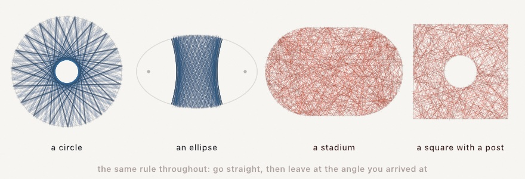

#### <sup>[Ollin](../../README.md) → [Documentation](../README.md) → [Generators](./README.md) → Billiards</sup>

---

## Billiards: one rule, and the room does the rest

A ball travels straight until it meets a wall, then leaves at the angle it arrived at. That is the whole system. Everything you see comes from the shape of the room. That is why the same two lines of code draw a rosette in a circle and a scribble in a stadium.

```swift
let room = Billiard(.circle(Circle(center: middle, radius: 380)))
drawPolyline(room.path(from: start, heading: 0.7, bounces: 400))
```

The path comes back as the points where the ball turns, so it is ordinary geometry. You can stroke it, fade it along its length, or cut it with the [shape booleans](../Drawing/Geometry.md#shape-booleans). You can also send it to a pen through [SVG export](../Output/Export.md).

### Contents

- [The rooms](#rooms)
- [Letting a ball go](#running)
- [What each room draws](#pictures)
- [Things standing in the room](#obstacles)
- [Drawing the room itself](#outline)

<a name="rooms"></a>

#### The rooms

```swift
Billiard(.circle(Circle(center: middle, radius: 380)))
Billiard(.ellipse(center: middle, radii: Vector2(400, 250)))
Billiard(.polygon(outline))                              // any closed straight-sided outline
Billiard(.stadium(center: middle, straight: 380, radius: 240))
```

A stadium is a circle cut through the middle and pulled apart by `straight`, so it is two flats joined by two half-circles. It gets its own case because of what it draws, which is shown [below](#pictures).

<a name="running"></a>

#### Letting a ball go

```swift
room.path(from: start, heading: 0.7, bounces: 400)          // [Vector2], start first
room.path(from: start, direction: Vector2(1, 0.3), bounces: 400)
room.contains(start)                                        // is this a place a ball can be?
```

The path stops early when there is no answer. That happens at a corner the ball hits exactly, at a start outside the room, or on a direction that meets no wall. So the path holds `bounces + 1` points when everything went normally, and fewer when it did not.

Where you let a ball go matters as much as the room. In a circle the starting point decides how big the hole in the middle is. A ball let go at the exact middle leaves no hole at all. Check `contains` first. The middle of a room with a post in it falls inside the post, so a ball let go there would be trapped.

<a name="pictures"></a>

#### What each room draws

<picture>
  <source media="(prefers-color-scheme: dark)" srcset="../../Guide/Images/18-IteratedForms/BallInARoom-dark.jpg">
  
</picture>

**A circle keeps a hole.** A bounce turns the path about the radius, and that leaves the chord's distance from the middle unchanged. Every chord of the path misses the middle by the same distance, so the whole rosette wraps one smaller circle it can never enter. Every chord is also the same length as every other one. Each bounce moves the ball around the rim by the same angle. So a turn that is a whole fraction of a circle closes exactly into a star.

**An ellipse sorts paths into two kinds.** Take the distances from the two foci to a chord, then multiply them. That product is the same for every chord of one path. So a path that passes between the foci keeps passing between them, and one that misses keeps missing forever. Those are two entirely different pictures from the same room. `foci` gives you the two points that decide which one you get.

**A stadium keeps nothing.** Cut the circle in half, pull the halves apart, and the hole goes. The path fills the room. Two balls let go a hair apart end up nowhere near each other within a few dozen bounces. That is what the shape is famous for.

<a name="obstacles"></a>

#### Things standing in the room

```swift
Billiard(.polygon(square), obstacles: [Circle(center: middle, radius: 150)])
```

A post in the middle of a square has the same effect as pulling a circle apart. The path fills the room, and two balls let go close together separate. Aim a ball straight at the middle of a round post and it comes straight back the way it came. That happens because the wall it meets is square to it.

An obstacle is always a circle. You can put obstacles anywhere in the room, and you can use any number of them.

<a name="outline"></a>

#### Drawing the room itself

```swift
let walls = room.outline()          // a Contour, curved parts cut into segments
let walls = room.outline(segments: 480)
```

`outline()` returns the room as geometry, so you can draw it with everything else. A polygon room returns the outline you gave it, unchanged.

### See also

- [`Geometry`](../Drawing/Geometry.md) - `Contour`, `Circle`, and the booleans you can cut a path with
- [`Attractors`](../Drawing/Attractors.md) - the other generator in the catalog where one small rule draws a picture nobody designed
- [`Export`](../Output/Export.md) - SVG output, because a path is already the lines a pen draws
- Example: [Patterns/Billiards](../../Examples/Patterns/Billiards/Sketch.swift)
