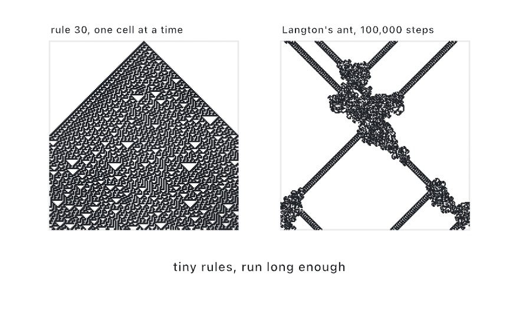

#### <sup>[Ollin](../../README.md) → [Documentation](../README.md) → [Generators](./README.md) → `Cellular automata`</sup>

---

## Cellular automata

Grids of cells that evolve by a local rule. The one-dimensional family, `elementaryCA` and `totalisticCA`, computes a row of cells generation by generation. Stacking the generations as rows is the classic picture. One number picks the rule, and the rule picks order, fractals, or chaos. The **turmite** family, `Turmite`, is the other shape of the idea. It is a tiny machine that *walks* a 2D grid and paints as it goes, Langton's ant being the famous one. Both are pure CPU geometry sources, deterministic, and cheap enough to rebuild live under a knob.

<picture>
  <source media="(prefers-color-scheme: dark)" srcset="../../Guide/Images/19-GridSimulations/WolframAndTurmite-dark.jpg">
  
</picture>

The GPU sibling is **Lenia**, the continuous Game of Life, which runs as a `Sim` on a persistent field. It lives with the other simulations in [Layered effects → simField](../Drawing/Effects.md#simfield), next to `.gameOfLife()`.

### Contents

- [Elementary rules](#elementary)
- [Totalistic rules](#totalistic)
- [Random start rows](#random-start)
- [Turmites](#turmites)
- [Custom turmite rules](#turmite-rules)

<a name="elementary"></a>

#### Elementary rules

`elementaryCA` runs one of the 256 two-color rules. Every cell reads its three-cell neighborhood, left, self, and right, and looks its next value up in the rule's 8-bit table. The rule number *is* the system. It returns `generations` rows, each `width` cells wide, ready to draw as rects or over a [`Grid`](../Drawing/Geometry.md#grid). The first row is the start row.

```swift
func elementaryCA(rule: Int, width: Int, generations: Int,
                  from start: [Bool]? = nil, wrap: Bool = true) -> [[Bool]]
```

```swift
let rows = elementaryCA(rule: 30, width: 181, generations: 181)
let cell = width / 181.0
noStroke(); fill(.white)
for (r, row) in rows.enumerated() {
    for (c, on) in row.enumerated() where on {
        drawRect(Double(c) * cell, Double(r) * cell, cell, cell)
    }
}
```

`start` is the first row, and `nil` is the classic single live cell at the center. `wrap` joins the row's two ends into a ring, and turning it off reads past the edges as dead. Three rules are worth knowing.

- **30** is chaos, once used as a random-number source.
- **90** draws the Sierpinski triangle.
- **110** is structured machinery, famously Turing-complete.

<a name="totalistic"></a>

#### Totalistic rules

`totalisticCA` is the multi-color generalization. A cell's next value depends only on the *sum* of its three-cell neighborhood, looked up as a digit of `code` written in base `colors`. With three or more colors it draws textures the elementary rules can't reach.

```swift
func totalisticCA(code: Int, colors: Int = 3, width: Int, generations: Int,
                  from start: [Int]? = nil, wrap: Bool = true) -> [[Int]]
```

Rows hold color indices `0 ..< colors`, so a palette lookup per cell is the natural draw. Code **777** over 3 colors is a classic irregular grower, and sweeping the code with a knob is a good way to prospect.

<a name="random-start"></a>

#### Random start rows

Both functions also come as sketch methods with a `startDensity` in place of `from`. The start row is then rolled on the sketch's seeded [`random`](./Random.md), and a [`variation`](../Core/Variations.md) brings the same field back.

```swift
let rows = elementaryCA(rule: 22, width: 181, generations: 181, startDensity: 0.3)
```

<a name="turmites"></a>

#### Turmites

A `Turmite` is a Turing machine on a wrapped color grid. Each step, every ant reads the color under it and looks up its `(state, color)` rule. It writes that rule's color, turns, moves one cell forward, and adopts the rule's next state. Make one and hold it, the way [`DifferentialGrowth`](./DifferentialGrowth.md) is held. `step(_:)` it each frame, and read the painted cells back.

```swift
let ant = Turmite(.langton, columns: 270, rows: 270)

override func draw() {
    ant.step(500)
    background(.black)
    let cell = width / 270.0
    noStroke(); fill(.white)
    for painted in ant.paintedCells {
        drawRect(Double(painted.column) * cell, Double(painted.row) * cell, cell, cell)
    }
}
```

The `Preset` catalog collects known characters, each a distinct personality:

| Preset | Behavior |
|---|---|
| `.langton` | the classic ant, chaotic at first, then an endless diagonal highway after ~10,000 steps |
| `.spiral` | spiral growth, a tightening square coil |
| `.highway` | builds a highway after a period of chaotic growth |
| `.chaos` | chaotic growth with a distinctive woven texture |
| `.frame` | textured growth inside an expanding frame |
| `.fibonacci` | counts its way outward in a Fibonacci-like spiral, growing very slowly |

`paintedCells` is every non-zero cell. It is rebuilt per call, so use `colorIndex(column:row:)` for tight loops. `antPositions` marks the walkers, and `stepCount` is how far the machine has run. Everything is deterministic, with no randomness anywhere, so a fixed step count always paints the same picture. Multiple ants are one array away with `Turmite(.langton, columns: 270, rows: 270, ants: [(60, 60), (210, 210)])`. Within a step they move in array order.

<a name="turmite-rules"></a>

#### Custom turmite rules

A rule table is `[state][color]` of `Turmite.Rule(write:turn:state:)`. Each rule carries the color to write, a `Turn` of `.straight`, `.right`, `.uTurn`, or `.left`, and the next state. Langton's ant is one state and two colors:

```swift
let langton = Turmite(rules: [[Turmite.Rule(write: 1, turn: .right, state: 0),
                               Turmite.Rule(write: 0, turn: .left, state: 0)]],
                      columns: 270, rows: 270)
```

Every state must handle the same number of colors, and that count is the machine's `colors`. Writes and next-states are clamped into range. Two states and two colors are already enough for spirals, highways, and framed textures, so small tables are worth exploring by hand.

---

Examples: [`Patterns/ElementaryCA`](../../Examples/Patterns/ElementaryCA/Sketch.swift), [`Patterns/Turmites`](../../Examples/Patterns/Turmites/Sketch.swift), and [`Simulation/Automata`](../../Examples/Simulation/Automata/Sketch.swift) for the GPU sibling.
