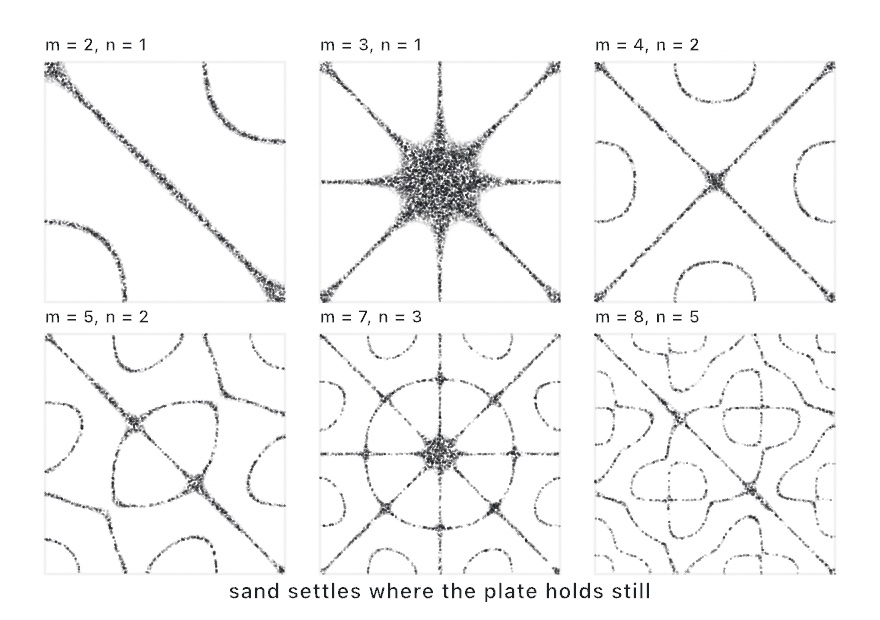

#### <sup>[Ollin](../../README.md) → [Documentation](../README.md) → [Generators](./README.md) → Chladni figures</sup>

---

## Chladni figures

Chladni figures are the patterns that sand forms on a ringing plate. When you bow or drive a square plate at one of its resonant modes, the plate vibrates everywhere except along its **nodal lines**. Loose sand walks off the moving regions and gathers where the plate stands still, so it traces the symmetric figures Ernst Chladni cataloged in 1787. Ollin ships the standing-wave field in closed form. You can reach it as a per-point function for geometry, or as a GPU [`Generator`](../Drawing/Effects.md#generate) that fills a layer with the finished figure.

<picture>
  <source media="(prefers-color-scheme: dark)" srcset="../../Guide/Images/17-YourFirstShader/ChladniModes-dark.jpg">
  
</picture>

### Contents

- [The field](#field)
- [The generator](#generator)
- [Nodal lines as geometry](#geometry)
- [Ringing the plate with sound](#audio)
- [Practical notes](#notes)

<a name="field"></a>

#### The field

```swift
let s = chladni(u, v, m: 5, n: 2)          // -1…1 at plate coordinates 0…1
let s = chladni(u, v, m: 5, n: 2, a: 1, b: -1)   // amplitude mix
```

The closed form adds a plate mode to its mirror image:

```
s(x, y) = a·cos(nπx)·cos(mπy) + b·cos(mπx)·cos(nπy)
```

The result is normalized, so it spans `-1…1` over plate coordinates `0…1`. The zero set of `s` is the figure. `m` and `n` are the **mode numbers**. A whole number rings a true mode of the square plate, and higher numbers ring finer figures. A fractional value gives one of the fields in between, so animating `m` or `n` blends one figure smoothly into the next. Outside `0…1` the field continues seamlessly as mirrored plates.

The default amplitudes `a: 1, b: -1` describe a plate driven at its center. That field is antisymmetric across the diagonal, so the diagonal itself is always nodal, and swapping `m` and `n` negates the field. Setting `m == n` cancels the field to zero everywhere and leaves no figure, because that drive is not ringing a mode. Other mixes of `a` and `b` weight the two mirrored modes unevenly, which gives you the wider family of figures.

<a name="generator"></a>

#### The generator

```swift
let plate = generate(.chladni(m: 5, n: 2))                    // sand on a dark plate
let wave  = generate(.chladni(m: 7, n: 3, style: .wave, phase: time))
drawImage(plate.image, 0, 0)
```

`generate(.chladni(...))` evaluates the same field for every pixel and paints one of two readings:

- **`.sand`** (the default): ink gathers around the nodal lines with a Gaussian falloff, `weight` wide in field units. `grain` runs the lines from smooth airbrushed ink at `0` to loose sand speckle at `1`. Each advance of `phase` re-throws the grains in small steps, so the sand shivers the way it does on a ringing plate.
- **`.wave`**: the signed field itself. The antinodes swing between `background` and `foreground` by `cos(phase)`, while the nodal lines hold still. Pass your `time` as `phase` and the plate breathes.

A `scale` above 1 tiles mirrored plates. Like every generator, this one composes with the effect chain, so use `generate(_:width:height:)` for a layer of an explicit size, and `.filtered(...)` to post-process it. It also animates only by the `phase` you pass, the way the design patterns do, so exports repeat the same result.

The `noise` module of the shader library provides the same function as `chladni(p, m, n)`. A look you build on the field therefore carries into [user shaders](../Shaders/ShaderLibrary.md) unchanged.

<a name="geometry"></a>

#### Nodal lines as geometry

The lines of the figure are the zero contour of the field, so the [marching-squares tracer](Isolines.md) extracts them directly:

```swift
let plate = Rectangle(x: 90, y: 90, width: 900, height: 900)
let lines = isolines(at: 0, in: plate, resolution: 240) { p in
    let uv = plate.uv(of: p)
    return chladni(uv.x, uv.y, m: 5, n: 2)
}
for line in lines { drawPolyline(line.points, closed: line.isClosed) }
```

That gives you the figure as plotter-ready `Contour`s for [SVG/PDF export](../Output/Export.md), for hatching, or for any of the geometry tools. The other classic reading seeds particles at random and walks each one downhill on `|s|`, which is sand marching to the nodes. `chladni` is cheap enough to evaluate for every particle on every frame.

<a name="audio"></a>

#### Ringing the plate with sound

A physical plate picks its figure by frequency. Each `(m, n)` mode rings at its own pitch, which rises with the square plate's `m² + n²` eigenvalue. A sketch can borrow that mapping from the [audio analyzer](../Helpers/Audio.md). Give every mode in a small table its own frequency. Then read `magnitude(in:)` around each pitch, and morph the plate toward the mode with the most energy. The `Audio/ChladniResonance` example does exactly this. It sweeps a synthesized `Tone` across the resonances. The figures then snap in and out the way they do under a signal generator on a real plate. Swap the tone for an `AudioInput()`, and whistling at the Mac sweeps the figures instead.

<a name="notes"></a>

#### Practical notes

- **Pick `m ≠ n`, and watch the diagonal.** Equal modes cancel at the default amplitudes. The sand style then floods the whole plate, which is an honest reading of a plate that is not ringing. When you animate between modes, keep `m > n` at every stop. The morph then never crosses the degenerate diagonal.
- **`(m, n)` and `(n, m)` draw the same figure.** The swap negates the field, and both readings are symmetric in sign. Because of that, treat a mode pair as unordered.
- **The result is deterministic.** The field is a pure function, and the generator animates only by `phase`, so a fixed phase exports byte-identically. The sand speckle is a hash of the pixel position and the phase, with no random state.
- **The wave style is the debugging view.** When a figure surprises you, switch to `.wave`. The signed field shows which regions move together and where the sign flips, which makes the mode numbers easy to read.

---

Related: [`Isolines`](Isolines.md) (nodal lines as contours), [`Effects`](../Drawing/Effects.md) (the generator substrate), [`Audio`](../Helpers/Audio.md) (ringing the plate by ear), [`Noise`](Noise.md) (the field-function family it joins).
