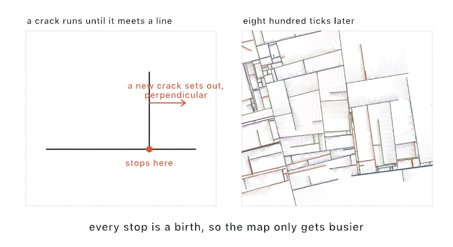

#### <sup>[Ollin](../../README.md) → [Documentation](../README.md) → [Generators](./README.md) → `Crack growth`</sup>

---

## Crack growth

**`CrackGrowth`** subdivides the plane the way glaze crackles: straight cracks race across the canvas, and every collision births a new perpendicular crack. The rules fit in a sentence. A crack advances until it reaches another crack's line or the edge. There it stops, restarts perpendicular to a random point on the existing pattern, and recruits one more crack. Out of that comes a street map that keeps densifying for as long as you let it run. The technique is the crack-subdivision algorithm of Jared Tarbell's *Substrate* (2003), implemented independently from the published descriptions.

Each crack also drags a translucent **wash** across the open space on one side of its line. That sand-painter shading is what gives the classic watercolor reading. The helper emits geometry only. You draw the marks, so the wash can be inks on paper, glowing additive dust, or nothing at all.

<picture>
  <source media="(prefers-color-scheme: dark)" srcset="../../Guide/Images/13-GrowingThings/CrackedCity-dark.jpg">
  
</picture>

### Contents

- [CrackGrowth](#stepper)
- [The marks and the wash](#marks)
- [Practical notes](#notes)

<a name="stepper"></a>

#### CrackGrowth

```swift
CrackGrowth(width: Double, height: Double,
            cracks: Int = 3, seedAngles: Int = 16,
            maxCracks: Int = 200, seed: UInt64 = 0)
```

A stateful stepper you hold across frames. `cracks` start moving at once over a grid seeded with `seedAngles` phantom angles, and the population grows to `maxCracks`. The same `seed` always grows the same city.

```swift
let field = CrackGrowth(width: 1080, height: 1080, seed: 7)

override func setup() { noClear() }

override func draw() {
    if frameCount == 1 { background(.white) }
    for mark in field.step(4) {
        fill(Color.black.withAlpha(0.33))
        drawPoint(mark.point)
    }
}
```

The canvas never clears, so each frame lays only that frame's marks and the picture is the accumulation. `field.segments` returns every crack line so far as plain `(Vector2, Vector2)` segments, ready for [SVG export](../Output/Export.md) and the pen plotter.

<a name="marks"></a>

#### The marks and the wash

```swift
field.step()          // one tick; returns [Mark]
field.step(_ ticks:)  // several ticks, marks collected

CrackGrowth.grains(from: Vector2, to: Vector2,
                   gain: Double, count: Int = 64) -> [Grain]
```

Each `Mark` carries the crack's index (a stable palette key), the new `point` on its line, and the `washExtent` where the open space ends. It also carries a `gain` in `0...1` that wanders slowly per crack. `grains` lays the classic wash along that span: `count` translucent grains crowded toward the crack by a doubled sine ease, alpha fading outward from `0.1`.

```swift
for mark in field.step(4) {
    let ink = inks[mark.crack % inks.count]
    for grain in CrackGrowth.grains(from: mark.point, to: mark.washExtent,
                                    gain: mark.gain) {
        fill(ink.withAlpha(grain.alpha))
        drawPoint(grain.position)
    }
}
```

<a name="notes"></a>

#### Practical notes

- **Accumulate, don't redraw.** The look is thousands of faint marks piling up. `noClear()` plus a one-time `background` is the whole recipe; see `Examples/Patterns/Cracks`.
- **The wash breathes on its own.** `gain` random-walks per crack, so the shading swells and thins along a line with no styling work from you.
- **One ink per crack reads best.** `mark.crack` is stable for the crack's whole life, restarts included, so it maps cleanly onto a palette.
- **`maxCracks` is the density dial.** The population only grows. Two hundred cracks fill a canvas in about a minute; forty stay airy and architectural.
- **Plotter output is the segments, not the marks.** `field.segments` is the street plan as clean line work. The wash is a raster effect; leave it out of the vector layer.

---

Related: [`Single line`](./SingleLine.md) and [`Spanning tree`](./SpanningTree.md) (the other line-work generators), [`Walks`](./Walks.md), and [`Export`](../Output/Export.md) (SVG and the plotter path).
