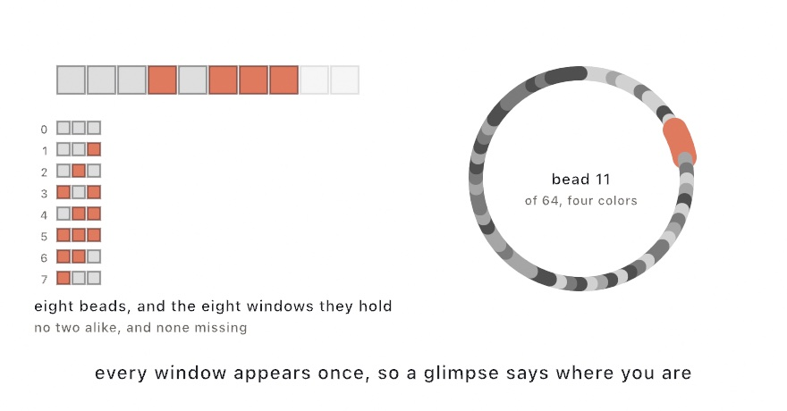

#### <sup>[Ollin](../../README.md) → [Documentation](../README.md) → [Generators](./README.md) → `De Bruijn sequences`</sup>

---

## De Bruijn sequences

**`deBruijnSequence`** builds a cyclic run in which every possible window of a given length appears, and each appears exactly once.

```swift
deBruijnSequence(symbols: 2, window: 3)   // 0,0,0,1,0,1,1,1
```

```
   0 0 0 1 0 1 1 1        read three at a time, around the ring:
   ^^^^^                  000  001  010  101  011  111  110  100
     ^^^^^                eight windows, and there are eight
       ^^^^^              three-bit patterns. none repeated,
         ...              none missing
```



That is as short as such a run can be. There are `symbols` to the power of `window` windows to fit, and each one takes a place, so the run is exactly that long.

**The point is local uniqueness.** Any few symbols in a row identify their own position. That is what a rotary encoder reads to find its angle, what a camera reads off a printed ruler, and what keeps a strip of tiles from repeating itself close up. [`DeBruijnCode`](#code) is that reading, made cheap.

### Contents

- [deBruijnSequence](#sequence)
- [DeBruijnCode](#code)
- [lyndonWords](#lyndon)
- [Practical notes](#notes)

<a name="sequence"></a>

#### deBruijnSequence

```swift
deBruijnSequence(symbols: Int, window: Int) -> [Int]
```

The run, as symbols numbered from zero. It is cyclic, so the last window wraps around to the front, and reading it means taking indices modulo its length.

The one that comes back is the **smallest in dictionary order**, which is why it always opens with a row of zeros. That makes it a fixed answer rather than any valid one. The same arguments always give the same run, so a sketch built on it reproduces.

An empty alphabet or an empty window gives back nothing. One symbol gives back a single zero, since there is only one window and it is all zeros.

<a name="code"></a>

#### DeBruijnCode

```swift
struct DeBruijnCode {
    init(symbols: Int, window: Int)
    let symbols: Int, window: Int
    let sequence: [Int]
    func position(of run: [Int]) -> Int?     // where those symbols sit
    func window(at position: Int) -> [Int]   // the symbols starting there
}
```

The sequence with the reading in the other direction. Hand it a window and it says where in the run that window sits, which is the whole use of the thing.

```swift
let code = DeBruijnCode(symbols: 4, window: 3)   // 64 beads
code.position(of: [2, 0, 1])                     // where that triple sits
code.window(at: 17)                              // the triple starting there
```

`window(at:)` wraps, so any position is fair, including a negative one. `position(of:)` is nil for a run of the wrong length, or one holding a symbol the alphabet does not have. Such a run is not somewhere in the sequence. It is nowhere.

The table is built once, with one entry per window, so `symbols` to the power of `window` entries. Fine into the thousands, not into the millions.

<a name="lyndon"></a>

#### lyndonWords

```swift
lyndonWords(symbols: Int, maxLength: Int) -> [[Int]]
```

Every Lyndon word up to `maxLength`, in dictionary order. A Lyndon word is a run strictly smaller than every rotation of itself, which is another way of saying it is the one representative of a necklace with no repeat in it.

```swift
lyndonWords(symbols: 2, maxLength: 3)   // 0, 001, 011, 1
```

They are the pieces the sequence is made of. Take the words whose length divides the window, in order, lay them end to end, and that *is* the de Bruijn sequence. On their own they catalog the patterns of a given length that are genuinely different rather than the same pattern turned round, which is what a set of motifs wants.

<a name="notes"></a>

#### Practical notes

- **The run is a ring, not a line.** Drawing it as a strip leaves the last few windows looking broken. Draw it around a circle, or repeat the first `window - 1` symbols at the end.
- **Symbols are numbers, so they map onto anything**: colors, tile shapes, rotations, note names. Four symbols and a window of three gives 64 beads, which is a comfortable size for a picture.
- **The length grows fast.** Five symbols with a window of five is 3,125, and six with six is 46,656. Choose the window from how much a reader can see at once, not from how long a run is wanted.
- Nothing here touches `random`, so a sketch built on the sequence reproduces exactly.

Example: `Patterns/DeBruijn`. Guide: [Chapter 6](../../Guide/06-GridsAndRepetition.md).

---

#### Where this comes from

Named for Nicolaas Govert de Bruijn, who counted the binary case in 1946. Camille Flye Sainte-Marie had done it in 1894, and Sanskrit prosodists knew the two-symbol, three-window case as the *yamātārājabhānasalagām* mnemonic long before either. The construction is the Lyndon-word concatenation of Harold Fredricksen, James Maiorana, and Irving Kessler. See [`ATTRIBUTION.md`](../../ATTRIBUTION.md).

#### Go deeper

- [Wave Function Collapse](./WaveFunctionCollapse.md): the other way to build a pattern under local rules, by picking rather than by counting
- [Polyominoes](./Polyominoes.md): pieces that have to fit exactly, the other exhaustive-search generator
- [Randomness](./Random.md): the seeded generators, and what a sequence like this is *not*
