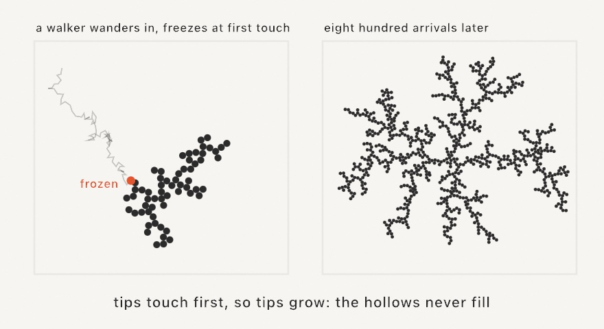

#### <sup>[Ollin](../../README.md) → [Documentation](../README.md) → [Generators](./README.md) → `DiffusionLimitedAggregation`</sup>

---

## Diffusion-limited aggregation

**Diffusion-limited aggregation** (DLA) grows the branching, dendritic clusters you see in frost, coral, and mineral deposits. Random walkers drift in from far away, and each one freezes the moment it touches the cluster. A tip catches a walker before a hollow ever sees one, so the arms grow wispy and the gaps stay open. The shape comes from the order in which the walkers arrive.

<picture>
  <source media="(prefers-color-scheme: dark)" srcset="../../Guide/Images/13-GrowingThings/FrozenWalkers-dark.jpg">
  
</picture>

`DiffusionLimitedAggregation` is a stateful stepper that you hold on to between frames. `step()` walks one particle until it sticks, and `step(_:)` grows a batch of them, which is what you call each frame. The stepper is seeded, so the same seed freezes the same cluster.

```swift
let cluster = DiffusionLimitedAggregation(seeds: [center], seed: 7)

override func draw() {
    cluster.step(12)
    background(.black)
    fill(.white)
    noStroke()
    drawCircles(cluster.positions, radius: 3)
}
```

### Contents

- [Building a cluster](#building)
- [Growing it](#growing)
- [Drawing it](#drawing)

<a name="building"></a>

#### Building a cluster

```swift
DiffusionLimitedAggregation(seeds: [Vector2], particleRadius: Double = 4,
                            stickiness: Double = 1, bounds: Rectangle? = nil,
                            maxParticles: Int = 20000, seed: UInt64 = 0)
```

`seeds` are the frozen starting particles, and their arrangement decides the shape. One center point grows a radial snowflake. A row of points along the bottom edge grows frost that creeps up, and a ring grows inward and outward at once. `stickiness` is the density parameter. At `1` a walker freezes on first contact, which gives wispy, open fingers. A lower value lets walkers slide deeper into the cluster before they freeze, so the cluster grows denser and rounder. `bounds` keeps the walkers inside a rectangle, and growth that reaches that edge crawls along it.

<a name="growing"></a>

#### Growing it

`step()` releases one walker and returns the index of the new particle. It returns `nil` once the cluster reaches `maxParticles`. `step(_:)` grows a batch, and that is the call you usually make each frame. A dozen particles per frame reads as steady growth. Ollin handles the walker mechanics for you and tunes them from `particleRadius`. A walker spawns on a circle just outside the cluster, and it respawns if it drifts far away. It takes long strides while it is far from the cluster, then switches to fine diffusion steps once it is near.

<a name="drawing"></a>

#### Drawing it

`positions` is the frozen cluster, ready to pass to `drawCircles`. Each `Particle` also records the `parent` it stuck to, so `segments` gives you the branching skeleton as line pairs. Those pairs are ready for stroking or for SVG export, which turns the dendrite into pen-plotter line-work. Arrival order is meaningful too, because `particles[i]` froze `i`-th. Tinting by index paints the growth history as rings, as the `Patterns/Dendrite` example does.

---

Related: [`Space colonization`](./SpaceColonization.md) (branching by attraction instead of chance), [`Differential growth`](./DifferentialGrowth.md), [`Random`](./Random.md) (the seeded randomness underneath).
