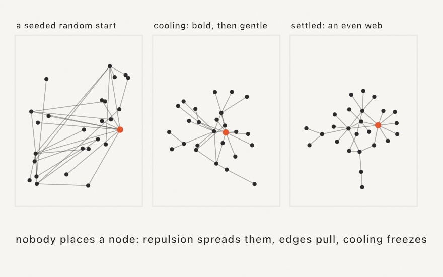

#### <sup>[Ollin](../../README.md) → [Documentation](../README.md) → [Generators](./README.md) → `Force-directed layout`</sup>

---

## Force-directed layout

**`ForceLayout`** lays out a graph from its connections alone, with no coordinates given. Every node pushes every other node apart, and every edge pulls its two ends together, so the graph untangles itself into an even, readable web. This is the standard spring-embedder layout. In a sketch it also gives you animation, because you can step it once each frame and the untangling itself is the motion on screen. The web then reflows live as nodes join or as you drag one.

<picture>
  <source media="(prefers-color-scheme: dark)" srcset="../../Guide/Images/11-ForcesAndPhysics/GraphSettles-dark.jpg">
  
</picture>

You provide only a node count and index pairs for the edges. Positions start at seeded random spots and improve step by step. In each step every node moves a little along its summed force, and a temperature caps how far it moves. The temperature cools linearly to zero, so the layout moves a lot at first, then refines in smaller moves, and then freezes. The layout is deterministic, so the same seed replays the same run.

### Contents

- [ForceLayout](#build)
- [Stepping, settling, and reheating](#step)
- [Growing and interacting](#interact)
- [drawGraph](#draw)
- [Practical notes](#notes)

<a name="build"></a>

#### ForceLayout

```swift
ForceLayout(count: Int, edges: [(Int, Int)] = [], in bounds: Rectangle,
            idealDistance: Double? = nil, seed: UInt64 = 1)
ForceLayout(positions: [Vector2], edges: [(Int, Int)] = [], in bounds: Rectangle,
            idealDistance: Double? = nil)
```

The first form makes a layout of `count` nodes joined by `edges` and places them at seeded random positions inside `bounds`. The second form takes explicit `positions` instead, which can come from a circle, a grid, or the output of another pass. Nodes clamp to `bounds` every step, so the graph always stays drawable.

```swift
let ring = (0 ..< 24).map { ($0, ($0 + 1) % 24) }
let layout = ForceLayout(count: 24, edges: ring, in: bounds, seed: 7)
```

The edges can come from anywhere: a hand-written list, a [Delaunay triangulation](../Drawing/Voronoi.md), a [maze](../Drawing/Tiling.md), or a word-adjacency map. `idealDistance` is the spacing constant `k` that every force is measured against. It defaults to `√(area / count)`. Settled edges come out near `k` only in a small or dense graph. In a large sparse web, the combined repulsion of all the nodes compresses the spacing below `k`. For that reason, treat `k` as a size control rather than an exact length. Raise it to open the web out, and lower it to tighten it. A per-edge `weight`, set through `layout.edges` or `connect`, multiplies that edge's pull, so its two ends settle closer together than the rest.

`gravity` defaults to 0. A nonzero value adds an extra, invisible edge from every node to the center of `bounds`, with a pull scaled by that value. Leave it at 0 for a single connected graph. A small value around 0.01 keeps *disconnected* pieces from repelling each other onto the walls of `bounds`.

<a name="step"></a>

#### Stepping, settling, and reheating

```swift
layout.step()          // one pass: repel, attract, move, cool
layout.step(10)        // several
layout.settle()        // run to a standstill (setup-shaped)
layout.reheat(0.3)     // stir a settled layout back into motion
```

The live form is one `step()` per frame in `draw()`. With the default `coolingSteps` of 250, the layout settles in about four seconds on screen. `settle()` runs the whole cooling schedule at once. Use it when you want the finished web and not the motion of the layout settling. Once a layout is settled, `step()` returns immediately, so the call can stay in `draw()`.

`temperature` is the cap on how far a node may move in one step. It starts at `initialTemperature`, which is a tenth of the frame's larger side, and cools linearly to zero. `isSettled` reports when it has reached zero. `reheat(_:)` raises the temperature again. Passing `1` restarts the full run, and a small fraction gives a gentle reflow that looks right after a change. Try `0.3` after adding a node or releasing a drag.

```swift
override func draw() {
    layout.step()
    background(.white)
    stroke(.black); fill(.black)
    drawGraph(layout)
}
```

<a name="interact"></a>

#### Growing and interacting

```swift
let i = layout.addNode(at: point)   // appends, returns the index
layout.connect(i, parent)           // appends an edge
layout.nearestNode(to: mouse)       // picking a node up
layout.pinned[i] = true             // a pinned node exerts forces but never moves
```

To grow a network, add a node, connect it, and reheat. The web then makes room for each new node. Dragging uses the same calls. Pin the grabbed node, write its position each frame, keep a little heat on so the neighbors follow, and unpin it on release:

```swift
override func mousePressed() {
    grabbed = layout.nearestNode(to: Vector2(mouseX, mouseY))
    if let grabbed { layout.pinned[grabbed] = true }
}

override func draw() {
    if let grabbed, mouseIsPressed {
        layout.positions[grabbed] = Vector2(mouseX, mouseY)
        layout.reheat(0.15)
    }
    layout.step()
    // ...
}
```

Pins also hold structure in place. Pin a root node at the top, and a tree hangs from it.

<a name="draw"></a>

#### drawGraph

```swift
drawGraph(layout)                  // edges in the stroke, nodes in the fill
drawGraph(layout, nodeRadius: 0)   // edges only
```

`drawGraph` draws each edge as a line in the current stroke and each node as a disk in the current fill. For anything more, such as node size by degree, edge color by weight, or labels, read `positions` and `edges` directly and draw from them. They are ordinary arrays, and everything drawn is ordinary geometry, so the result goes to [SVG and PDF export](../Output/Export.md) like any other line work.

<a name="notes"></a>

#### Practical notes

- **Cost is all pairs.** Each step is O(n²) over the nodes plus O(m) over the edges. That is fast enough to step live up to the low thousands of nodes. Beyond that, call `settle()` in `setup()`. `ForceLayout` is a layout tool, so for a simulation of thousands of moving *agents*, use the GPU systems in [artificial life](../Simulation/ArtificialLife.md) instead.
- **It finds a good layout, not the best one.** A force-directed layout settles into a local minimum. Different seeds untangle the graph in different ways, and all of those layouts are equally reasonable. That is what [variations](../Core/Variations.md) are for, so keep the seed that reads best.
- **A growing graph needs its spacing recomputed.** `idealDistance` is set once from the starting count. If the node count grows a lot, set it again as you add nodes, using `√(area / count)` scaled to taste. That keeps the web filling the frame.

The worked example is [`Examples/Patterns/ForceGraph`](../../Examples/Patterns/ForceGraph/Sketch.swift). In it a scale-free network adds one node at a time and lays itself out as it grows. You can drag any node, and the web reflows around it.
