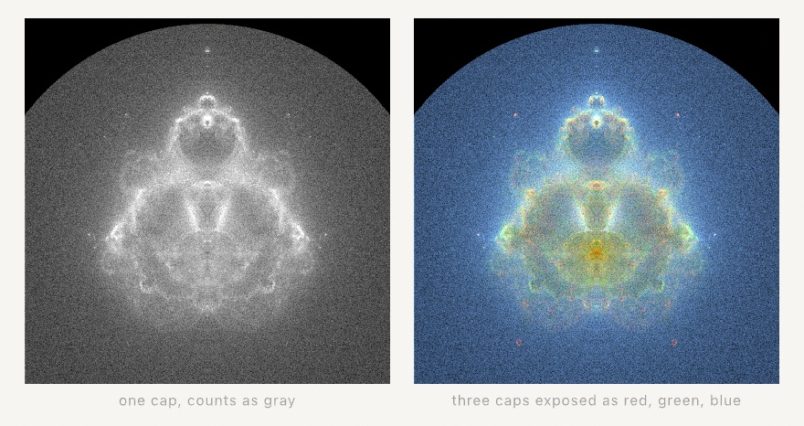

#### <sup>[Ollin](../../README.md) → [Documentation](../README.md) → [Generators](./README.md) → `Fractals`</sup>

---

## Fractals

Six ways a handful of numbers unfolds into infinite detail:

- **Iterated function systems** condense a few affine maps onto a fern.
- **Fractal flames** are the chaos game grown up, with nonlinear warps and a log-density display.
- **The Buddhabrot** plots the Mandelbrot set's escaping orbits as a density plate.
- **Circle-inversion limit sets** are lace living in the gaps of a mirror arrangement.
- **Kleinian limit sets** are the fractal boundary curves of Möbius groups, traced in order.
- **Schottky circle orbits** pair circles off by Möbius maps, and the pairs nest forever.

All six are deterministic. The point emitters run off a seedable generator, and the Kleinian walk uses no randomness at all. The escape-time siblings (`.mandelbrot`, `.julia`, `.orbitTrap`) live on the GPU as [generators](../Drawing/Effects.md#generate).

### Contents

- [IFS (the chaos game)](#ifs)
- [FractalFlame](#flame)
- [Buddhabrot](#buddhabrot)
- [inversionLimitSet](#inversion)
- [kleinianLimitSet](#kleinian)
- [schottkyCircles](#schottky)
- [fitted](#fitted)

<a name="ifs"></a>

#### IFS (the chaos game)

```swift
IFS(maps: [IFS.Map])                                   // x' = a·x + b·y + e, y' = c·x + d·y + f
system.points(count: Int, burnIn: Int = 20,
              using rng: inout some RandomNumberGenerator) -> [Vector2]
ifsPoints(_ system: IFS, count: Int) -> [Vector2]      // the sketch form, seeded by `variation`
```

An iterated function system is a small set of affine contractions, each with a pick `weight`. The chaos game applies a randomly chosen map over and over, and every orbit condenses onto the maps' common attractor. Three classics come bundled: `.barnsleyFern` (four maps, the famous coefficient table), `.sierpinskiTriangle`, and `.sierpinskiCarpet`.

<picture>
  <source media="(prefers-color-scheme: dark)" srcset="../../Guide/Images/18-IteratedForms/ChaosGame-dark.jpg">
  
</picture>

```swift
let cloud = ifsPoints(.barnsleyFern, count: 60_000)
    .map { Vector2($0.x, -$0.y) }                     // the fern grows upward
fill(.white)
drawPoints(fitted(cloud, in: canvasRectangle.inset(by: 80)), size: 1.5)
```

Points return in the system's own coordinates, so place them with [`fitted`](#fitted). Build your own system by writing each map's six numbers. Weights steer how often each map is visited, and the fern spends 85 percent of its time in the map that draws the main copy.

<a name="flame"></a>

#### FractalFlame

```swift
FractalFlame(transforms: [FractalFlame.Transform], colors: [Color], gamma: 2.2,
             vibrancy: 1, brightness: 1, window: Rectangle)
FractalFlame.random(using: &rng)                       // a few contractive maps, one variation each
flame.render(width: Int, height: Int, quality: Double = 60,
             supersample: Int = 1, using: &rng) -> Image
FractalFlame.Renderer(flame, width: Int, height: Int, seed: Int)   // the progressive form
```

The flame algorithm extends the chaos game three ways.

- **Variations.** Each transform follows its affine map with a weighted blend of nonlinear plane-warps: `.sinusoidal`, `.spherical`, `.swirl`, `.horseshoe`, `.polar`, `.handkerchief`, `.heart`, `.disc`, `.spiral`, `.hyperbolic`, `.diamond`, `.ex`, `.julia`.
- **Structural coloring.** The orbit carries a color coordinate that averages toward each visited transform's palette index. Color therefore encodes *which maps* shaped each region.
- **Log density.** The render accumulates a per-pixel density histogram and shows it through a logarithm, which is why filaments, veils, and cores all stay visible at once.

Three knobs tune the development. `gamma` goes up to 4 to pull faint structure out of the veils. `vibrancy` at 1 keeps colors saturated under a strong gamma, and 0 washes them toward pastel. `brightness` multiplies the log-scaled density before gamma.

```swift
let renderer = FractalFlame.Renderer(flame, width: 560, height: 560, seed: variation)
// each frame:
renderer.accumulate(samples: 120_000)
drawImage(renderer.image(), in: canvasRectangle)
```

`quality` is chaos-game samples per output pixel. A few dozen give a preview, and hundreds make a clean still. The `Renderer` is the live form: feed it a slice of samples per frame and the picture rises out of the noise. Both are deterministic for a fixed seed and sample count. `FractalFlame.random` rolls a new flame from contractive affines, one variation each. Some rolls are duds, so reroll the seed until one sings.

<a name="buddhabrot"></a>

#### Buddhabrot

```swift
Buddhabrot(iterations: [Int] = [5000, 500, 50],
           window: Rectangle = Rectangle(x: -1.6, y: -2.05, width: 3.2, height: 3.2),
           gamma: 2, brightness: 1)
plate.render(width: Int, height: Int, quality: Double = 10, using: &rng) -> Image
Buddhabrot.Renderer(plate, width: Int, height: Int, seed: Int)   // the progressive form
```

The Mandelbrot set, displayed by its escaping orbits. Random plane points are tested with the same z = z² + c loop the escape-time generators run. Each one that escapes is run again, and every point its orbit visited brightens the pixel under it. The accumulated density, developed like a photographic plate, is the seated figure Melinda Green discovered in 1993.

`iterations` is one cap or three. One cap develops a grayscale plate. Three caps expose red, green, and blue at different orbit lengths, so short orbits haze the background blue and the longest draw the figure's red spine. An orbit that outlives every cap is taken to be inside the set and plots nothing. `window` frames the plane in the classic upright reading: `x` spans the imaginary axis, `y` the real one, the antenna at the top. Orbits deposit mirrored about the real axis, which is the set's own symmetry, so each sample exposes both halves.

<picture>
  <source media="(prefers-color-scheme: dark)" srcset="../../Guide/Images/18-IteratedForms/BuddhaPlate-dark.jpg">
  
</picture>

```swift
let renderer = Buddhabrot.Renderer(Buddhabrot(), width: 560, height: 560, seed: 7)
// each frame:
renderer.accumulate(samples: 20_000)
drawImage(renderer.image(), in: canvasRectangle)
```

A plate this deep is meant to be watched, and the `Renderer` is the live form. `quality` on the one-shot `render` is orbit samples per output pixel, sized for small stills and tests. `gamma` at its default 2 lifts the faint structure. The develop normalizes each channel to a percentile ceiling, so a few hot pixels near the antenna cannot dim the plate. Deterministic for a fixed seed and sample count.

<a name="inversion"></a>

#### inversionLimitSet

```swift
inverted(_ point: Vector2, in circle: Circle) -> Vector2
inversionLimitSet(of circles: [Circle], count: Int, burnIn: Int = 16,
                  using rng: inout some RandomNumberGenerator) -> [Vector2]
inversionLimitSet(of circles: [Circle], count: Int) -> [Vector2]   // seeded by `variation`
```

Inversion in a circle turns the plane inside out around it. Centers map far away, the rim stays put, and `d · d' = r²` along every ray. Play the inversions of an arrangement against each other, choosing a random circle at each step but never the one just used. Inversion is its own inverse, so reusing a circle would undo the step. The orbit converges onto the arrangement's limit set. Circles live in canvas coordinates, so the dust needs no fitting: it lands among the mirrors that made it.

```swift
let mirrors = /* a ring of tangent circles */
fill(Color(hex: 0xE8C97D, alpha: 0.6))
drawPoints(inversionLimitSet(of: mirrors, count: 30_000), size: 1.5)
```

Tangent rings give the classic gasket-like lace. Separated circles give Cantor dust, and overlapping ones tear the lace apart. The regions near tangency points fill slowly, because inversions move points very little there, so give dense arrangements more `count`.

<a name="kleinian"></a>

#### kleinianLimitSet

```swift
kleinianLimitSet(ta: Vector2, tb: Vector2, epsilon: Double = 0.002,
                 maxDepth: Int = 60) -> Contour
kleinianLimitSet(_ preset: KleinianPreset, ...) -> Contour
```

Two complex traces, carried as `Vector2(re, im)`, pick a two-generator Möbius group by the classic recipe. A depth-first walk of the group's reduced words then traces its limit set as **one ordered closed curve**. Subdivision stops when an arc drops under `epsilon`, measured in limit-set units that run roughly ±2 across. Points therefore come back evenly spaced along the curve, plotter-ready. No randomness at all.

```swift
let curve = kleinianLimitSet(.lace)
noFill()
drawPolyline(fitted(curve.points, in: canvasRectangle.inset(by: 100)), closed: true)
```

`KleinianPreset` names the landmarks: `.gasket`, `.spiralPair`, `.lace`, `.doubleCusp`, `.cusp`, and `.symmetricCusps`. `.gasket` is the Apollonian gasket at traces `(2, 2)`, and `.doubleCusp` is the celebrated 1/15 cusp. Custom traces just inside the quasi-Fuchsian region spiral tighter and tighter. Outside it there is no curve to trace, and the polyline degenerates. Cusps converge slowly, so they reward a larger `maxDepth`.

<a name="schottky"></a>

#### schottkyCircles

```swift
schottkyCircles(pairing: [SchottkyPairing], viewpoint: Vector2? = nil,
                minRadius: Double = 0.5, maxDepth: Int = 40) -> [Circle]
schottkyCircles(_ preset: SchottkyPreset, in bounds: Rectangle, ...) -> [Circle]
schottkyCircles(ta: Vector2, tb: Vector2, in bounds: Rectangle, ...) -> [Circle]
schottkyLimitSet(pairing: [SchottkyPairing], ...) -> [Vector2]
```

Take an even number of circles and pair them up. A `SchottkyPairing` is the Möbius map carrying the *outside* of one circle onto the *inside* of its partner. Applying it drops whatever it touches into the partner disc, smaller. Apply the pairings and their inverses in every order, and the circles nest forever. What they close down onto is the group's limit set.

The output is real `Circle`s, not a flattened polyline, because a Möbius map carries a circle to a circle. `drawCircles` renders them analytically and the vector-export path writes true circle geometry, so the whole lace goes to a plotter as circles.

```swift
noFill()
drawCircles(schottkyCircles(.kissing, in: canvasRectangle.inset(by: 80)))
```

Circles come back in canvas coordinates and need no fitting: the lace lands among the circles that made it. The walk is rng-free and adaptive. It stops a branch once its circle falls under `minRadius`, since everything below nests inside it. `schottkyLimitSet` keeps the centers of those stopped circles instead, each within `minRadius` of the limit set. It uses no randomness, where the chaos game behind [`inversionLimitSet`](#inversion) does.

**Tangency is what fills the picture.** When a pairing's two circles *touch*, its generator holds the tangency point fixed and is parabolic. It barely contracts near that point, so the orbit keeps producing large circles for many generations, and they crowd into a fan at the tangency. Pair circles across a ring instead and every generator contracts hard, leaving a thin dust. The difference is not subtle, and it is why there are two family builders:

```swift
schottkyCuspedPairs(in: Rectangle, spread: Double = 1,
                    lean: Double = 0, twist: Double = 0) -> [SchottkyPairing]
schottkyNecklace(pairs: Int, in: Rectangle,
                 tightness: Double = 0.9, twist: Double = 0) -> [SchottkyPairing]
```

`schottkyCuspedPairs` is the dense one: four circles in two touching pairs. Three dials shape them.

- `spread` slides the pairs apart. At `1` all four circles are mutually tangent, and the limit set closes into a round circle with four cusps. Above `1` the top and bottom tangencies open into gaps.
- `lean` swings each pair about its own tangency point, in opposite senses. That keeps both generators parabolic, and so keeps the lace dense all the way along it.
- `twist` turns each pairing off its tangency-preserving setting. It winds the limit set into a spiral, but thins it as it goes.

`lean` is the dial to animate. `twist` is the one that costs you density.

`SchottkyPreset` names the landmarks: `.kissing`, `.leaning`, `.cusped`, `.spiral`, and `.dust` (the thin cross-ring pairing, for contrast).

Discs should be disjoint, and tangency is allowed. Overlapping circles make the group non-discrete, and the lace turns to mud. A hard ceiling on emitted circles keeps such an arrangement from running away instead of letting it exhaust memory.

**Viewing and containing.** Two refinements produce the classic framings. A `viewpoint` re-seats the whole picture by sending that point to the horizon. Put it inside one of the pairing discs, and that disc turns inside out to become the picture's outer boundary. The fundamental domain then shows as the large empty pockets. A pairing's disc may also be declared its circle's *exterior*, through `fromExterior:` and `toExterior:` on `SchottkyPairing`. That lets one circle contain the whole arrangement, the way the gasket figures are drawn.

**From traces.** `schottkyCircles(ta:tb:in:)` renders the circle orbit of the same trace-recipe group whose boundary [`kleinianLimitSet`](#kleinian) traces as a curve. It takes each generator's isometric circles as its pairing discs. The `KleinianPreset` overload accepts the same named landmarks, so `schottkyCircles(.gasket, in:)` and `kleinianLimitSet(.gasket)` are one group drawn two ways. At the gasket traces `(2, 2)` the orbit is the classic tangent-circle packing of the Apollonian gasket. Nearby traces bend and twist it, which is what the `Patterns/Schottky` example animates. The deep-cusp presets sit at the region's edge where the orbit shrinks slowly, so they reward a larger `minRadius`.

<picture>
  <source media="(prefers-color-scheme: dark)" srcset="../../Guide/Images/18-IteratedForms/GasketFamily-dark.jpg">
  
</picture>

<a name="fitted"></a>

#### fitted

```swift
fitted(_ points: [Vector2], in frame: Rectangle) -> [Vector2]
```

Uniformly scale and center a point cloud into a frame, keeping its aspect. This is the "fit the points, not the transform" rule as a helper, so a generated figure lands in place without `scale()` fattening its strokes. It serves any of the point emitters here, and walks, attractors, and harmonographs just as well.

---

Related: [`Random & noise`](./Random.md) (the seeded generators these draw from), [`Attractors`](../Drawing/Attractors.md) (the strange-attractor cousins), [`Tiling`](../Drawing/Tiling.md) (the Apollonian gasket by Descartes' theorem), [`Effects`](../Drawing/Effects.md#generate) (the GPU escape-time fractals), [`L-systems`](./LSystem.md) (growth by rewriting instead of iteration).
