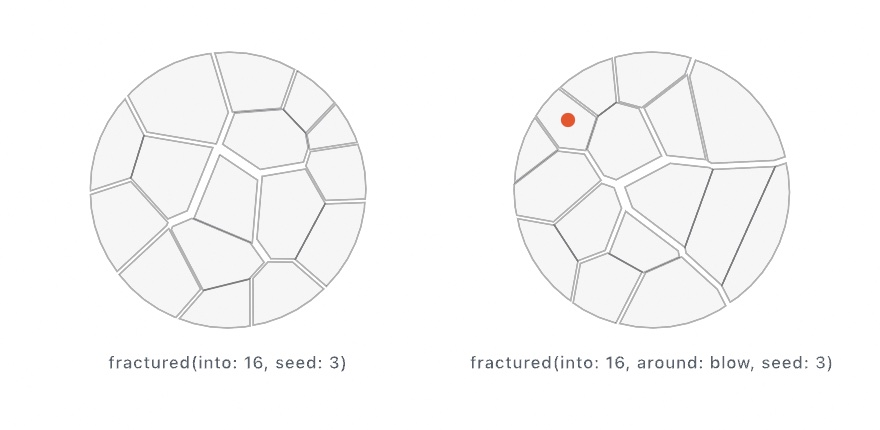

#### <sup>[Ollin](../../README.md) → [Documentation](../README.md) → [Generators](./README.md) → `Fracture`</sup>

---

## Breaking things

A shape breaks into pieces that fit back together exactly. **`fractured(into:seed:)`** cuts the filled region into cells with no gap between them and no overlap, and their areas add up to the area you started with. The same call on a `Mesh` cuts a solid the same way, into convex cells whose volumes add up to its own.

The cut is the Voronoi diagram of a handful of seeds scattered inside the thing being broken, which is why every cell comes out convex. Convex is exactly what a rigid body wants, so a piece is ready to fall on its own the moment it exists. Spread the seeds evenly and the break reads as something that came apart by itself; crowd them at a point with **`fractured(into:around:seed:)`** and it reads as something struck there, with small chips at the blow and long wedges away from it.

<picture>
  <source media="(prefers-color-scheme: dark)" srcset="../Images/FractureCut-dark.jpg">
  
</picture>

Pieces are ordinary geometry. A broken `Shape` draws, strokes, hatches, exports to SVG, and feeds the [booleans](../Drawing/Geometry.md#shape-booleans) like any other shape; a broken `Mesh` draws, exports, and goes into a body like any other mesh.

### Contents

- [Breaking a shape](#shape)
- [Breaking a solid](#solid)
- [Pieces as rigid bodies](#bodies)
- [Measuring a piece](#measuring)
- [The convex hull in space](#hull)
- [Practical notes](#notes)

<a name="shape"></a>

### Breaking a shape

```swift
Shape.fractured(into pieces: Int, seed: Int = 0) -> [Shape]
Shape.fractured(into pieces: Int, around impact: Vector2, seed: Int = 0) -> [Shape]
```

```swift
let tile = Shape(outline)
for piece in tile.fractured(into: 14, seed: 7) {
    fill(.white)
    drawShape(piece)
}
```

`pieces` is how many cells to cut. The same `seed` always gives the same break, so a sketch reproduces and a figure stays put. The point in the second form is in the shape's own coordinates, and it may sit outside the shape, which breaks it as if struck off one edge.

Fewer pieces than asked for can come back. Two seeds landing in the same spot leave one cell between them. A shape too small for the next seed to find room in stops the search early. Asking for one piece, or breaking an empty shape, gives the shape straight back.

A concave shape is handled the whole way through. A cell that straddles a notch arrives as two separate islands. Each island comes back as its own piece, so nothing you are handed is two loose regions pretending to be one thing. Holes survive: break a ring and the pieces cover the ring, not the disc.

<a name="solid"></a>

### Breaking a solid

```swift
Mesh.fractured(into pieces: Int, seed: Int = 0) -> [Mesh]
Mesh.fractured(into pieces: Int, around impact: Vector3, seed: Int = 0) -> [Mesh]
```

```swift
for piece in Mesh.box(size: 1).fractured(into: 12, around: corner, seed: 3) {
    withState {
        translate(piece.centroid)
        drawMesh(piece.mapPositions { $0 - piece.centroid })
    }
}
```

The same two forms, and the same promises: the volumes add up to the solid's own, no two pieces overlap, one seed gives one break. Each piece is a closed convex mesh, flat-shaded one normal per face, and it carries the source mesh's `material`.

A solid that is **not** convex breaks as its convex hull. That is the honest limit of a Voronoi cut: a cup breaks into the pieces of the solid cup rather than the hollow one. Every built-in primitive except the torus and the Klein bottle is convex, and so is the hull of a scan.

<a name="bodies"></a>

### Pieces as rigid bodies

A body's geometry lives around the body's own origin, so a piece moves onto its `centroid` first and the body goes where the piece was. That is the same two lines in both dimensions.

```swift
let middle = piece.centroid
let local = piece.mapPoints { $0 - middle }              // 2D
let shard = world.addBody(.polygon(local.contours[0].points), at: here + middle)
```

```swift
let middle = piece.centroid
let local = piece.mapPositions { $0 - middle }           // 3D
let shard = world.addBody(.hull(local.positions), at: here + middle)
```

Give each piece the parent's velocity plus a push away from the break, and the cloud keeps travelling while it spreads. Read everything the pieces inherit **before** the parent leaves the world: [`World.remove(_:)`](../Simulation/Physics.md#rigid-bodies) and [`World3D.remove(_:)`](../Simulation/Physics3D.md) spend the body they take.

Working sketches: [`Examples/Physics/Burst`](../../Examples/Physics/Burst/Sketch.swift) and [`Examples/3D/Physics/Burst`](../../Examples/3D/Physics/Burst/Sketch.swift), one in each dimension. [Chapter 11](../../Guide/11-ForcesAndPhysics.md#breaking-things) teaches the 2D one from scratch.

<a name="measuring"></a>

### Measuring a piece

```swift
Shape.area: Double          Shape.centroid: Vector2     Shape.bounds: Rectangle?
Shape.separated() -> [Shape]
Mesh.volume: Double         Mesh.centroid: Vector3
Mesh.mapPositions((Vector3) -> Vector3) -> Mesh
```

`area` and `volume` are what the pieces are checked against: break something, add them up, and you have what you started with. Both honor what they measure. `area` resolves the shape under its own winding rule, so a ring is the difference between its circles whichever way its hole was wound. `volume` reads the triangles of a closed mesh.

`centroid` is the balance point of the filled region or the enclosed volume, not the average of the points. A densely drawn end does not drag it, and a hole pulls it the way a bite out of a biscuit does.

`separated()` splits a shape into its islands, one `Shape` each, with every hole kept in the island it belongs to. Nesting decides what is a hole, not winding. That holds for a shape built by hand as well as one that came out of a boolean.

<a name="hull"></a>

### The convex hull in space

```swift
convexHull(of points: [Vector3]) -> Mesh
```

The smallest solid that contains every point: the shape a balloon takes when it shrinks onto them. Points inside are dropped, and the mesh comes back flat-shaded, one normal per face, ready to draw or to hand to a body as `.hull(...)`. It is what the solid break stands on. It is also how a scan or a scatter becomes something the eye and the solver can both work with.

Fewer than four points, or points that all lie on one plane, enclose no volume, so an empty mesh comes back. The flat answer in two dimensions is [`convexHull(of:)`](../Drawing/Geometry.md#convex-hull), and its tighter siblings are on the [hulls](Hulls.md) page.

<a name="notes"></a>

### Practical notes

- **Cost grows with the square of the piece count**, because every cell is cut against every other seed. A few dozen pieces is comfortable at a break or two a frame; a few hundred is a one-off, not something to do every frame. In 3D the source mesh's own faces are cut once and shared by every cell, so a coarse mesh breaks faster than a finely tessellated one that looks the same.
- **The 2D solver caps a convex polygon at eight corners.** A cell with more is simulated as the eight that keep the most of its outline, while it is drawn in full. Cells of a disc or a box average five or six corners, so the difference rarely shows.
- **Break in the shape's own coordinates**, before any `translate` or `rotate`, and place the pieces with the transform you were going to use anyway. Breaking a shape you have already moved works, but then every piece carries the offset and the centroids are in the wrong frame for a body.
- **The seed is the identity of a break.** Roll it once, remember it, and the same break comes back on the next run, in an export, and in a [variation](../Core/Variations.md) grid.

---

Related: [`Hulls`](./Hulls.md) (the tighter answers to "what shape are these points?"), [`Geometry`](../Drawing/Geometry.md) (`Shape`, the booleans, `convexHull` in the plane), [`Voronoi & Delaunay`](../Drawing/Voronoi.md) (the diagram the cut is built on), [`Physics`](../Simulation/Physics.md) and [`Physics in 3D`](../Simulation/Physics3D.md) (the bodies the pieces become), [`Crack growth`](./CrackGrowth.md) (cracks that subdivide a plane as a pattern rather than a break).
