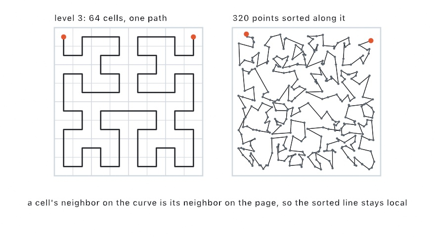

#### <sup>[Ollin](../../README.md) → [Documentation](../README.md) → [Generators](./README.md) → `Hilbert order`</sup>

---

## Hilbert order

**`hilbertOrder`** sorts points by their place along a Hilbert curve, the space-filling curve David Hilbert described in 1891. The curve visits every cell of a square grid once. Two cells next to each other along it are next to each other on the page. Sort a scatter by where the curve visits each point and you get one line through all of them that stays local. That is a [stipple](./Stippling.md) drawn as one stroke, a cloud of points walked in an order that keeps neighbors together, or a large set put in order by a single sort. It is the cheap relative of the [single line](./SingleLine.md). That one runs a tour and finds a short route. This one sorts and finds a local one.

<picture>
  <source media="(prefers-color-scheme: dark)" srcset="../Images/HilbertOrder-dark.jpg">
  
</picture>

The curve's grid is laid over the points' own bounds, so the order follows the scatter's shape rather than the canvas. The line it gives is not a shortest tour, and where the scatter has a gap the line crosses it in one step. But it keeps neighbors together, which is what a reveal, a plotter path, or a walk through a point cloud wants.

### Contents

- [hilbertOrder and hilbertSorted](#order)
- [hilbertIndex](#index)
- [Practical notes](#notes)

<a name="order"></a>

#### hilbertOrder and hilbertSorted

```swift
hilbertOrder(of points: [Vector2], level: Int = 16) -> [Int]
hilbertSorted(_ points: [Vector2], level: Int = 16) -> [Vector2]
```

`hilbertOrder(of:)` returns the indices of the points in the order the curve visits them, so `order.map { points[$0] }` is the points sorted, and anything that travels with a point (a color, a size, a weight) can be reordered beside it. `hilbertSorted(_:)` is the points themselves in that order, a permutation of the input.

```swift
let dots = stipple(of: picture, count: 4000, in: frame)
let line = hilbertSorted(dots)
noFill()
stroke(.black)
drawPolyline(line)                     // one line through the stipple
```

```swift
let order = hilbertOrder(of: dots)
for (place, i) in order.enumerated() { // colored by the place along the curve
    fill(ramp.color(at: Double(place) / Double(dots.count)))
    drawCircle(center: dots[i], radius: 3)
}
```

`level` is how fine the curve is: a grid of `2^level` cells across. At the default of 16 the grid is 65,536 cells across, finer than any canvas, so every point has a place of its own. A lower level makes a coarser order: the points in one cell read as the same place and keep the order they were given, so a line through them scribbles inside each cell before moving to the next. The [`Examples/Images/HilbertLine`](../../Examples/Images/HilbertLine/Sketch.swift) sketch draws the curve under the line at low levels to show that.

The order is deterministic, and the sort is the whole cost: a hundred thousand points order in a few milliseconds.

<a name="index"></a>

#### hilbertIndex

```swift
hilbertIndex(of point: Vector2, in bounds: Rectangle, level: Int = 16) -> Int
```

The place of one point along the curve laid over `bounds`: the index of the cell it falls in, from 0 at the first cell to `4^level - 1` at the last. The curve starts at the top left of the bounds and ends at the top right. A point outside the bounds reads at the nearest cell, a bounds with no width or no height maps that axis to the first cell, and `level` is held to `1 ... 30`. This is the primitive the sort uses; reach for it to order points by a curve over a fixed rectangle rather than over their own bounds, or to give a point a fraction along the curve (`Double(index) / Double(1 << (2 * level))`) for a color or a delay.

```swift
let place = hilbertIndex(of: mouse, in: canvasRectangle, level: 8)   // 0 ..< 65,536
```

<a name="notes"></a>

#### Practical notes

- **Sort once, then hold the order.** The sort is quick, but a reveal that draws a growing prefix of the sorted points needs the same order every frame, so keep the result.
- **Local, not short.** The curve's square turns show in the line, which is part of the look. For the shortest line through the same points, [`singleLine`](./SingleLine.md) runs a tour at a far greater cost.
- **A gap is one step.** Where the scatter is empty, the curve passes through empty cells and the line jumps straight across. Lower the level if the jumps should group by region instead.
- **Large sets.** This is the order to walk a point cloud or a particle set in when nearby points should be handled near each other in time, since the sort is a single pass.

---

Related: [`Stippling`](./Stippling.md) (places the dots), [`Single line`](./SingleLine.md) (the tour through the same dots), [`Spanning tree`](./SpanningTree.md) (the branching rendering), [`L-systems`](./LSystem.md) (`LSystem.hilbertCurve` draws the curve itself as a turtle path), [`Export`](../Output/Export.md) (SVG and the plotter path).
