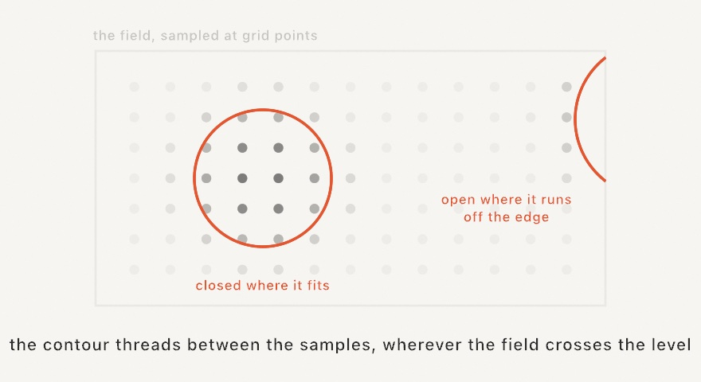

#### <sup>[Ollin](../../README.md) → [Documentation](../README.md) → [Generators](./README.md) → `Isolines`</sup>

---

## Isolines

**`isolines`** traces the level curves of a scalar field by marching squares. Give it any `(Vector2) -> Double` field and a level, and back come the contours where the field crosses that level. The field can be noise, image brightness, or your own math. It reads a surface as a topographic map, outlines a metaball blob, and renders a photograph in tone lines, all from one call.

<picture>
  <source media="(prefers-color-scheme: dark)" srcset="../../Guide/Images/Docs/IsolineMarch-dark.jpg">
  
</picture>

A contour that closes inside the bounds comes back as a closed `Contour`. One that runs off the edge comes back open, ending on the boundary, so check `isClosed` when drawing. The output feeds `drawPolyline`, `drawCurve` for the rounded reading, `smoothed(iterations:)`, and [hatching and SVG export](../Output/Export.md).

<picture>
  <source media="(prefers-color-scheme: dark)" srcset="../../Guide/Images/14-FieldsAndFlow/Isolines-dark.jpg">
  
</picture>

### Contents

- [isolines (a field)](#field)
- [isolines (levels)](#levels)
- [isolines (an image)](#image)
- [Practical notes](#notes)

<a name="field"></a>

#### isolines (a field)

```swift
isolines(at level: Double,
         in bounds: Rectangle? = nil,
         resolution: Int = 128,
         field: (Vector2) -> Double) -> [Contour]
```

Sample `field` on a grid over `bounds`, the whole canvas by default, and trace every contour at `level`. `resolution` is the number of grid cells across the longer side. Raise it for tighter curves, at linearly more field samples.

```swift
let rings = isolines(at: 0.5, in: frame) { p in
    fbm(p.x * 0.004, p.y * 0.004)
}
noFill()
stroke(.black)
for ring in rings { drawPolyline(ring.points, closed: ring.isClosed) }
```

In a saddle cell the curve could pair up two ways. Those cells are settled by the cell's average value, the standard marching-squares rule, so metaball necks merge and split cleanly.

<a name="levels"></a>

#### isolines (levels)

```swift
isolines(at levels: [Double],
         in bounds: Rectangle? = nil,
         resolution: Int = 128,
         field: (Vector2) -> Double) -> [[Contour]]
```

A stack of levels from a single sampling pass: one `[Contour]` per level, in order. This is the contour-map form. The field is the expensive part, so ten levels cost barely more than one.

```swift
let levels = Array(stride(from: 0.3, through: 0.7, by: 0.04))
for (i, group) in isolines(at: levels, in: frame, field: terrain).enumerated() {
    strokeWeight(i % 5 == 0 ? 2 : 0.8)     // the cartographer's index contour
    for curve in group { drawPolyline(curve.points, closed: curve.isClosed) }
}
```

<a name="image"></a>

#### isolines (an image)

```swift
isolines(of image: Image,
         at level: Double,          // or at levels: [Double]
         in bounds: Rectangle? = nil,
         resolution: Int = 128) -> [Contour]
```

The tone lines of a picture: contours traced where its brightness crosses `level`. The tone runs from `0` for black to `1` for white. Brightness is read as if the picture sat on white paper, so transparency counts as light. The sampling is bilinear, so the curves stay smooth past the pixel grid. The image is stretched over `bounds`. Pass a `Rectangle(fitting:in:)` of the image's size to keep its aspect. A stack of levels turns a photograph into a topographic map of its lighting.

```swift
for group in isolines(of: portrait, at: [0.25, 0.45, 0.65], in: frame) {
    for curve in group { drawPolyline(curve.points, closed: curve.isClosed) }
}
```

Needs CPU pixels: read a video frame through its `snapshot()` first.

<a name="notes"></a>

#### Practical notes

- **Cheap enough to re-trace live.** The trace itself is fast, and the field samples are the cost. A drifting field at the default resolution re-traces comfortably every frame, and the levels form shares one sampling across the whole stack.
- **Resolution follows the features.** Size the grid so the field's features span many cells and the traced chords disappear into the curve. For a coarse grid, one pass of `smoothed(iterations:)` rounds the corners.
- **Metaballs are a field.** Sum `strength / distanceSquared` per blob and trace a level: the outlines merge and pinch exactly as metaballs should.
- **The exact level matters less than its neighbors.** For noise in `0...1`, levels between `0.3` and `0.7` cross the most terrain. A level near the field's extremes traces only a few small islands.

---

Related: [`Noise`](./Noise.md) (fields worth tracing, including the looping forms), [`Spanning tree`](./SpanningTree.md) and [`Single line`](./SingleLine.md) (the other plotter-friendly renderings), [`Curves`](../Drawing/Curves.md) (Chaikin smoothing), [`Export`](../Output/Export.md) (SVG and the plotter path).
