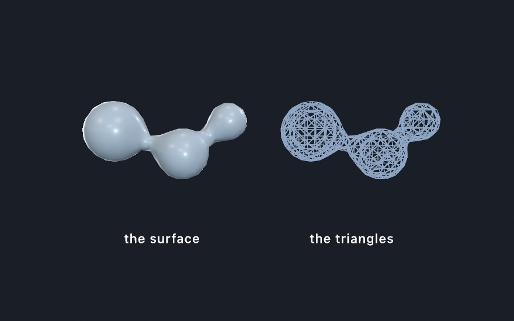

#### <sup>[Ollin](../../README.md) → [Documentation](../README.md) → [Generators](./README.md) → Isosurfaces</sup>

---

## Isosurfaces and metaballs

The 3D reading of a contour line. **`isosurface`** takes any scalar field over space and builds the skin where that field crosses a level. It hands back a `Mesh` you draw, light, and export like any other. **`Metaballs`** is the field worth reaching for first: soft spheres whose values add, so they bulge toward each other and fuse.

```swift
var blobs = Metaballs()
blobs.add(at: Vector3(-40, 0, 0), radius: 50)
blobs.add(at: Vector3(40 * sin(time), 0, 0), radius: 40)
drawMesh(blobs.mesh())
```

This is the volumetric sibling of [isolines](Isolines.md). There, a field over the plane traced out closed curves. Here, a field over space encloses a solid.



### Contents

- [Metaballs](#metaballs)
- [Any field at all](#fields)
- [Resolution and cost](#resolution)
- [Which side is inside](#inside)
- [How the march works](#march)
- [Practical notes](#notes)

<a name="metaballs"></a>

#### Metaballs

```swift
var field = Metaballs(level: 0.5)
field.add(at: center, radius: 50)
field.add(at: other, radius: 30, strength: 1.4)
let mesh = field.mesh(resolution: 56)
```

`radius` is the size the ball reads at **on its own**, so one lone ball meshes to a sphere of exactly that radius. Bring a second within reach and the two fields add. The value in the gap lifts above what either makes there alone, the surface swells across it, and the pair fuses into one skin. Pull them apart and the bridge necks down and snaps.

Three parameters shape the merging:

| Parameter | Effect |
|---|---|
| `level` | The value the surface is drawn at. Lower fattens every ball and makes them merge from further apart. Raise it and they thin and separate. |
| `strength` | How hard one ball pushes. Above `1` it swells and reaches further. A **negative** value carves into its neighbors instead of joining them. |
| `radius` | The ball's own size, and with it how far its influence carries. |

A ball's influence stops at a finite distance rather than trailing off forever. A ball on the far side of the scene therefore costs nothing, and the field has an exact extent. `mesh(resolution:)` uses that. It takes the box from the balls themselves and pads it, so the surface always closes instead of being clipped.

`value(at:)` reads the raw field, and `bounds` reports the box, for sketches that want to drive something else with it.

<a name="fields"></a>

#### Any field at all

`isosurface` doesn't care where the numbers come from:

```swift
let box = Box3(min: Vector3(-100, -100, -100), max: Vector3(100, 100, 100))

// A noise volume, carved into caves.
let caves = isosurface(at: 0.55, in: box, resolution: 64) { p in
    fbm(p.x * 0.01, p.y * 0.01, p.z * 0.01, octaves: 4)
}

// A gyroid, the classic triply-periodic surface.
let gyroid = isosurface(at: 0, in: box, resolution: 96) { p in
    let q = p * 0.05
    return cos(q.x) * sin(q.y) + cos(q.y) * sin(q.z) + cos(q.z) * sin(q.x)
}
```

Anything that returns one number per point works: a distance function, a physics field, an accumulated density, a sampled volume.

<a name="resolution"></a>

#### Resolution and cost

`resolution` is how many cells fit across the **longest** side of the box, and the cells stay cubic. A long thin box therefore gets proportionally fewer across its short sides, rather than stretched ones. Cost is cubic in that number. Doubling it is eight times the field samples and roughly four times the triangles.

The defaults are chosen so a modest field rebuilds every frame comfortably. Past about 96, march once in `setup()` and keep the mesh, the way [terrain](Terrain.md) does.

<a name="inside"></a>

#### Which side is inside

**The surface encloses the region where the field is greater than `level`.** Normals point out of that region, and the triangles wind to match.

Signed distance functions run the other way (negative inside), so negate one to mesh it:

```swift
isosurface(at: 0, in: box) { -myDistanceFunction($0) }
```

Getting this backwards gives an inside-out mesh. It still draws, but it lights as if lit from within.

<a name="march"></a>

#### How the march works

Marching cubes walks a grid of cubes over the box. Each corner is either inside the surface or outside it. Wherever an edge joins one of each, the surface crosses that edge, and interpolating the two values says where. Those crossings get stitched into triangles, one cube at a time.

The wrinkle is that some corner arrangements can be stitched more than one way. If two neighboring cubes pick differently, the surface tears open along the face between them. Ollin settles each shared face by reading the four values on that face alone. Both cubes therefore reach the same answer, and the seam always closes. Vertices are welded across cubes, and their normals come from the field's own gradient. A smooth field therefore gives a smooth surface with no shading facets.

<a name="notes"></a>

#### Practical notes

- **The mesh is watertight** wherever the surface stays inside `bounds`. Where it runs out through a wall it is left open, the same way a contour that leaves its rectangle comes back open. `Metaballs.mesh()` pads its box so this doesn't happen.
- **It's deterministic.** The same field and the same arguments give the same mesh, vertex for vertex, so an animated blob exports frame-accurate.
- **No texture coordinates.** There's no natural parameterization of a blob, so the mesh carries none. Use a [material](../3D/3D.md) rather than a texture.
- **A moving field is CPU work**, unlike the [raymarched fields](../Drawing/Combinators.md), which shade on the GPU but produce no geometry. Reach for a mesh when you need real geometry, to light with shadows, to export, or to hand to something else. Reach for a raymarched field when you just want it on screen.

### See also

- [Isolines](Isolines.md), the same idea one dimension down.
- [Terrain](Terrain.md), the other generator that emits a `Mesh`.
- [3D mode](../3D/3D.md), for drawing, lighting, and materials.
- [SDF combinators](../Drawing/Combinators.md), for fields shaded directly on the GPU.
