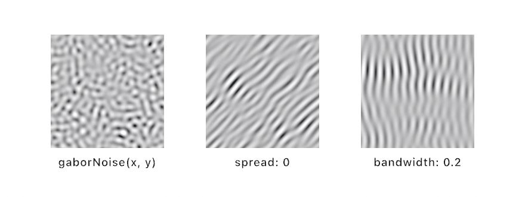

#### <sup>[Ollin](../../README.md) → [Documentation](../README.md) → [Generators](./README.md) → `Noise`</sup>

---

## Noise

Perlin `noise` is coherent, which means nearby inputs give nearby outputs. That reads as smooth, organic variation, so `noise` is the smooth counterpart to the uncorrelated [Random](../Generators/Random.md). It lives on the sketch and takes a seed, and the output is contrast-calibrated to fill its range.

<picture>
  <source media="(prefers-color-scheme: dark)" srcset="../../Guide/Images/05-Noise/RandomVsNoise-dark.jpg">
  
</picture>

### Contents

- [noise](#noise)
- [signedNoise](#signedNoise)
- [Looping noise: `loop:`](#loop)
- [fbm / signedFbm](#fbm)
- [Tiling noise: a picture that repeats](#tiling)
- [curlNoise](#curlNoise)
- [simplexNoise / signedSimplexNoise](#simplexNoise)
- [worley](#worley)
- [ridgedFbm / turbulence](#ridgedFbm)
- [warpedFbm](#warpedFbm)
- [gaborNoise](#gaborNoise)
- [Choosing a scale](#scale)
- [noiseSeed](#noiseSeed)
- [seed](#seed)

### Functions

<a name="noise"></a>

#### noise

```swift
noise(_ x: Double[, _ y: Double[, _ z: Double]]) -> Double
```

1D/2D/3D Perlin noise in `0...1`, contrast-calibrated to fill the range.

```swift
let n = noise(x * 0.01, y * 0.01)        // 0...1, smooth across the canvas
drawCircle(x, y, n * 20)
```

<a name="signedNoise"></a>

#### signedNoise

```swift
signedNoise(_ x: Double[, _ y: Double[, _ z: Double]]) -> Double
```

The same field in `-1...1`, following the `ofSignedNoise` and OPENRNDR convention. Use it for offsets that swing both ways.

```swift
let dx = signedNoise(time * 0.5, 0) * 40   // drift left and right
drawCircle(width / 2 + dx, height / 2, 30)
```

<a name="loop"></a>

#### Looping noise: `loop:`

```swift
noise(loop: Double, radius: Double = 1) -> Double
noise(_ x: Double, loop: Double, radius: Double = 1) -> Double
noise(_ x: Double, _ y: Double, loop: Double, radius: Double = 1) -> Double
signedNoise(/* same three forms */) -> Double
```

Noise that loops. As `loop` runs `0...1`, the sample follows a closed circle through the field and lands exactly where it started. A drift driven by `loop:` therefore returns to its starting value every lap, which is what a seamless GIF needs. A growing input never does that, because `noise(x, y, time * 0.1)` walks a straight line through the field and never comes back. Feed `loop:` looping progress instead:

```swift
let lap = loopProgress(over: 6)                      // 0...1, every 6 seconds
let n = noise(x * 0.006, y * 0.006, loop: lap)       // a field that drifts and returns
let sway = signedNoise(x * 0.002, loop: lap) * 40    // a looping offset
```

`radius` is how much of the field one lap covers, so a bigger lap changes more per cycle. The same parameter closes loops in *space* too. Sample around a ring by its angle, and the variation meets itself where the ring closes:

```swift
let bump = noise(2.5, loop: angle / .tau, radius: 0.8)   // seamless around a circle
```

Under the hood, the loop uses extra noise dimensions, and the two-coordinate form samples a 4D field. That is the standard construction for a looping animation. Exports and snapshots stay deterministic, because `loop` wraps, so `loop: 0` and `loop: 1` are the same sample bit for bit.

<a name="fbm"></a>

#### fbm / signedFbm

```swift
fbm(_ x[, _ y[, _ z]], octaves: Int = 4, gain: Double = 0.5, lacunarity: Double = 2) -> Double
fbm(_ x, _ y, loop: Double, radius: Double = 1, octaves: Int = 4, ...) -> Double
signedFbm(/* the same forms */) -> Double
```

Fractal (layered) noise in `0...1`. It sums `octaves` samples of the field, and each octave is `lacunarity`× smaller in feature size and `gain`× lighter in weight. The sum is normalized, so the result still fills the range. One call gives you the shape-plus-detail layering you would otherwise write by hand, such as `noise(x * s) * 0.7 + noise(x * s * 8) * 0.3`. With `octaves: 1` you get exactly `noise`. The name and defaults match the [shader library's `fbm`](../Shaders/ShaderLibrary.md), so the same vocabulary carries into per-pixel code.

<picture>
  <source media="(prefers-color-scheme: dark)" srcset="../../Guide/Images/05-Noise/NoiseLayers-dark.jpg">
  
</picture>

```swift
let ridge = fbm(x * 0.004)                            // big moves plus fine grain
let ground = fbm(x * 0.003, y * 0.003, octaves: 5)    // a busier field
let weather = fbm(x * 0.003, y * 0.003, loop: loopProgress(over: 8))
```

`signedFbm` is the same value in `-1...1`. In the looping form, every octave follows its own closed circle, so the layered field loops too.

<a name="tiling"></a>

#### Tiling noise: a picture that repeats

```swift
tilingNoise(_ u: Double, _ v: Double, detail: Double = 4) -> Double
signedTilingNoise(_ u: Double, _ v: Double, detail: Double = 4) -> Double
tilingFbm(_ u: Double, _ v: Double, detail: Double = 4, octaves: Int = 4, gain: Double = 0.5, lacunarity: Double = 2) -> Double
signedTilingFbm(/* the same form */) -> Double
```

Noise that tiles. As `u` and `v` each run `0...1`, the sample follows a closed circle in *both* directions, so the field meets itself at every edge. Lay the picture down beside itself and you cannot find the join.

Use it whenever a picture will be repeated, and a projected picture always is. For example, [`triplanarTextured`](../3D/3D.md#triplanar) carries its picture across the whole surface, so a map written the ordinary way draws a line wherever the picture wraps. A normal map shows this most clearly. The two sides of the join light differently, so the line reads as a crease in the surface.

```swift
// filling a 512-square map, one texel at a time
let u = (Double(x) + 0.5) / 512, v = (Double(y) + 0.5) / 512
let shade = Color(white: tilingFbm(u, v, detail: 5, octaves: 5))
```

`detail` is roughly how many features fit across one tile. It is the frequency you would otherwise multiply into the coordinates, so moving a map across is a direct swap. Write `tilingFbm(u, v, detail: 8)` where you had `fbm(u * 8, v * 8)`, and the grain stays the same. Under the hood, both directions use the same 4D construction as the [looping forms](#loop). Those forms spend it on time, and tiling spends it on space twice.

The example is [`Randomness/TilingNoise`](../../Examples/Randomness/TilingNoise/Sketch.swift). It lays one tile down nine times, from `fbm` and from `tilingFbm` side by side.

<a name="curlNoise"></a>

#### curlNoise

```swift
curlNoise(_ x: Double, _ y: Double) -> Vector2
curlNoise(_ p: Vector2) -> Vector2
```

A divergence-free 2D flow vector, the curl of the Perlin field. It is the usual basis for flow fields. Take `.normalized` for the direction alone, and sample on scaled-down coordinates such as `x * 0.003` for broad swirls. See the `FlowField` example.

```swift
var p = Vector2(width / 2, height / 2)
for _ in 0..<100 {                         // trace a streamline through the field
    let next = p + curlNoise(p * 0.003).normalized * 4
    drawLine(p, next)
    p = next
}
```

<a name="simplexNoise"></a>

#### simplexNoise / signedSimplexNoise

```swift
simplexNoise(_ x: Double[, _ y: Double[, _ z: Double]]) -> Double
signedSimplexNoise(/* the same forms */) -> Double
```

Another kind of the same idea as `noise`. It is smooth, seeded, contrast-calibrated the same way, and in `0...1`, with the signed form in `-1...1`. The classic field interpolates over a square grid, while simplex sums smooth kernels over triangles, so its grain is more even in every direction. The classic field carries a faint bias along its grid axes that shows in large flat washes, and simplex does not. Simplex also reads slightly crisper at the same scale. Try both. They take the same inputs, so swapping is a one-word edit.

```swift
let n = simplexNoise(x * 0.008, y * 0.008)             // rounder grain than noise()
let sway = signedSimplexNoise(time * 0.4, 7) * 30
```

Both fields take the same seed from `noiseSeed`, but they stay separate fields, so `noise` and `simplexNoise` at the same point do not correlate.

<picture>
  <source media="(prefers-color-scheme: dark)" srcset="../../Guide/Images/05-Noise/NoiseFlavors-dark.jpg">
  
</picture>

The `Randomness/NoiseKinds` example reads four of these off one set of coordinates under one `noiseSeed`. It shows `simplexNoise`, `signedSimplexNoise` split at zero, `worley` with its `feature` and `jitter` parameters, and `turbulence`.

<a name="worley"></a>

#### worley

```swift
worley(_ x: Double, _ y: Double[, _ z: Double],
       feature: WorleyFeature = .nearest, jitter: Double = 1) -> Double
```

Cellular noise. Space is divided into unit cells, each holding one seeded feature point, and the value is the distance to the nearest point. Shading by that value draws organic cells such as stone, foam, cracked earth, and water caustics. The value is near zero at each cell's core and rises toward its walls. It runs roughly `0...1`, occasionally a little above that where cells run sparse. Sample on scaled-down coordinates just like `noise`.

`feature` picks the reading:

- `.nearest` (the default): the classic cell field.
- `.second`: the distance to the *second*-nearest point, which gives a blunter plateau.
- `.border`: the gap between those two distances, which is zero exactly on the walls between cells. Threshold it small for crack and vein line work.

<picture>
  <source media="(prefers-color-scheme: dark)" srcset="../../Guide/Images/05-Noise/CellsFromPoints-dark.jpg">
  
</picture>

`jitter` runs the cells from a regular grid at `0` to fully organic at `1`. Drift `z` over time and the 3D form bubbles in place:

```swift
let cell = worley(x * 0.02, y * 0.02)                       // stone-wall shading
let crack = worley(x * 0.02, y * 0.02, feature: .border)    // 0 on the cell walls
if crack < 0.05 { drawPoint(x, y) }                         // trace the cracks
let foam = worley(x * 0.02, y * 0.02, time * 0.3)           // cells that reform
```

For cellular *geometry*, meaning polygonal cells you can stroke, offset, or clip, see [Voronoi](../Drawing/Voronoi.md). `worley` is the per-sample field reading of the same idea.

<a name="ridgedFbm"></a>

#### ridgedFbm / turbulence

```swift
ridgedFbm(_ x[, _ y[, _ z]], octaves: Int = 4, gain: Double = 0.5, lacunarity: Double = 2) -> Double
turbulence(/* the same forms */) -> Double
ridgedFbm(_ x, _ y, loop: Double, radius: Double = 1, ...) -> Double
turbulence(_ x, _ y, loop: Double, radius: Double = 1, ...) -> Double
```

Two classic reshapings of `fbm`. They take the same parameters, and both return `0...1`:

- **`ridgedFbm`** folds each octave into sharp creases, one minus the absolute value, squared. An octave contributes only where the one below it was strong, so detail gathers on the crest lines instead of filling the valleys. Bright values are the ridges, and this is the standard basis for mountainous terrain. See the `RidgeLines` example.
- **`turbulence`** layers the folded field without that feedback. You get billows with creased seams, the classic basis for clouds, smoke, and marble.

```swift
let peak = ridgedFbm(x * 0.004, 2.5)                  // a mountain skyline
let cloud = turbulence(x * 0.005, y * 0.005)          // billowy, creased
let range = ridgedFbm(x * 0.004, 2.5, loop: loopProgress(over: 10))
```

Both have the 2D looping form (see [`loop:`](#loop)), so a drifting landscape can return to its start every lap.

<a name="warpedFbm"></a>

#### warpedFbm

```swift
warpedFbm(_ x: Double, _ y: Double, warp: Double = 1,
          octaves: Int = 4, gain: Double = 0.5, lacunarity: Double = 2) -> Double
warpedFbm(_ x, _ y, warp: Double = 1, loop: Double, radius: Double = 1, ...) -> Double
```

Domain warping. The fbm field displaces its own sampling coordinates, then displaces them again. That smears the layers into flowing marble and cloud forms that no amount of plain layering produces. `warp` scales the displacement: `0` is exactly `fbm(x, y)`, `1` is the classic strength, and past `1` you get churn. The result is in `0...1`, and it has the same looping form as `fbm`.

```swift
let marble = warpedFbm(x * 0.004, y * 0.004)          // the flowing look, one call
let calm = warpedFbm(x * 0.004, y * 0.004, warp: 0.4)
```

The same look has two GPU spellings. `generate(.noise(scale: 3, warp: 1))` fills a layer with it (see [Effects](../Drawing/Effects.md)), and the [shader library](../Shaders/ShaderLibrary.md)'s `warpedFbm(p, warp)` runs it per pixel. The `DomainWarp` example opens the recipe up so you can color its intermediate displacements.

<a name="gaborNoise"></a>

#### gaborNoise

```swift
gaborNoise(_ x: Double, _ y: Double, wavelength: Double = 32, bandwidth: Double = 0.5,
           angle: Double = 0, spread: Double = .pi, impulses: Int = 32,
           phase: Double = 0, seed: Int = 0) -> Double
GaborNoise(wavelength:bandwidth:angle:spread:impulses:phase:seed:)   // the value type
    .value(_ x, _ y) / .value(at: Vector2) -> Double                 // 0...1
    .signedValue(_ x, _ y) -> Double                                  // -1...1
```

Gabor noise. Every field above is built from the same kind of bump. Its grain runs every way at once, and its scale is a blur of scales. Gabor noise is built from small Gaussian blobs that each carry a cosine wave, scattered at random and summed. That gives you the spectrum to design. One principal `wavelength`, a band of a chosen width around it, and one direction or a range of them.

<picture>
  <source media="(prefers-color-scheme: dark)" srcset="../../Guide/Images/05-Noise/NoiseWithADirection-dark.jpg">
  
</picture>

- `wavelength` is the wave period in pixels. The coordinates are pixels too, not the scaled-down inputs the other fields take.
- `bandwidth` is the width of the band around that wavelength, as a fraction of it. `0.2` is nearly a pure wave and runs long interference patterns; `1` is blobby and close to ordinary noise. The kernel radius is `wavelength / bandwidth`.
- `angle` is the wave direction in radians. `0` oscillates along x, so the stripes stand vertical.
- `spread` is how far each kernel's own direction may wander from `angle`. `0` is one direction, `.pi` (the default) every direction, the isotropic field.
- `impulses` is how many kernels overlap at any point, the quality dial. `32` is smooth; `8` shows the kernels.
- `phase` slides every wave along its own direction and is periodic over 2π.
- `seed` picks the field. Unlike the others, this one is not pinned by `noiseSeed`: the seed is a parameter so the CPU and GPU forms stay one field.

The result fills `0...1`, three standard deviations mapped onto the range, so a rare peak clips. It is the same field `generate(.gaborNoise(...))` paints (see [Effects](../Drawing/Effects.md)). With the same parameters, `gaborNoise(x, y)` is the value at pixel `(x, y)`. So a sketch can place marks where the GPU painted light. Sampling many points a frame? Build one `GaborNoise` and ask it, so the kernel is set up once. The kernels are filtered for a one-pixel footprint, so a wavelength driven toward two pixels fades to gray instead of aliasing.

```swift
let grain = gaborNoise(x, y, wavelength: 20, angle: .pi / 2, spread: 0.1)   // wood grain
let field = GaborNoise(wavelength: 24, bandwidth: 0.3, seed: 7)            // once, then
let n = field.value(x, y)                                                   // per point
```

The [shader library](../Shaders/ShaderLibrary.md)'s `gaborNoise(p, wavelength, bandwidth, ...)` runs the same field inside a shader of your own. The `GaborNoise` example dots the crests the generator painted.

<a name="scale"></a>

### Choosing a scale

The multiplier on noise's input is a zoom control. It decides how far apart your samples land on the field, and it is the number you will tune most.

<picture>
  <source media="(prefers-color-scheme: dark)" srcset="../../Guide/Images/05-Noise/NoiseZoom-dark.jpg">
  
</picture>

- When feeding **pixel coordinates**, multiply by something small, usually `0.001...0.02`. A 1080-pixel canvas times `0.006` spans about six of the field's features. That is big enough to read as shapes and small enough to stay interesting.
- If the output **looks like static**, the multiplier is too big, because successive samples land on unrelated parts of the field. Shrink it until the result glides.
- When feeding **time**, the same rule holds. `noise(time * 0.2)` drifts, and `noise(time * 3)` twitches.
- For **several independent glides from one field**, do not use several noise functions. Sample far-apart rows instead. Both drifts below move at the same speed through unrelated terrain:

```swift
let dx = signedNoise(time * 0.3, 10) * 300   // row 10
let dy = signedNoise(time * 0.3, 99) * 300   // row 99, unrelated to row 10
```

### Seeding

<a name="noiseSeed"></a>

#### noiseSeed

```swift
noiseSeed(_ seed: Int)
```

Seed every noise field at once: `noise`, `signedNoise`, `curlNoise`, the fbm family, plus `simplexNoise` and `worley`. To reseed `random` as well, see [`seed`](#seed).

```swift
noiseSeed(7)
```

<a name="seed"></a>

#### seed

```swift
seed(_ seed: Int)
```

Seed *both* `noise` and `random` from one value. That locks the whole sketch's randomness, so it reproduces exactly. Use `noiseSeed` or [`randomSeed`](../Generators/Random.md#randomSeed) to reseed only one of them.

```swift
seed(7)   // noise and random both reproducible
```
