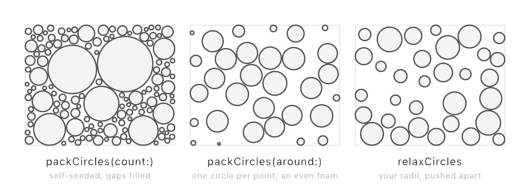

#### <sup>[Ollin](../../README.md) → [Documentation](../README.md) → [Generators](./README.md) → `Circle packing`</sup>

---

## Circle packing

Circle packing fills a region with circles that grow until they touch, and that never overlap. It is a classic generative-art motif. Two ways to produce a packing are built in, and both are **reproducible**, so a seeded run always lays the circles down the same way.

- **Grow-to-touch** (`packCircles`): each circle grows to the largest it can be without hitting a neighbor or the bounds. `packCircles(count:)` scatters its own seed points, then fills the gaps between the big circles with progressively smaller ones, which gives the dense, varied look. `packCircles(around:)` grows a circle at each point you hand it, and a [blue-noise](./BlueNoise.md) set makes an even foam.
- **Front relaxation** (`relaxCircles`): start from circles that overlap, then push every overlapping pair apart until none of them overlap. The radii stay fixed. Use it to settle a set you sized yourself.

<picture>
  <source media="(prefers-color-scheme: dark)" srcset="../Images/PackingMechanisms-dark.jpg">
  
</picture>

The output is `[Circle]`, so it feeds straight into [`drawCircles`](../Drawing/Drawing.md), the [shape booleans](../Drawing/Geometry.md), hatching, and SVG export.

<picture>
  <source media="(prefers-color-scheme: dark)" srcset="../../Guide/Images/15-ShapesAsMaterial/PackingLapse-dark.jpg">
  
</picture>

### Contents

- [packCircles (self-seeding)](#pack)
- [packCircles (from points)](#around)
- [relaxCircles](#relax)
- [Standalone (outside a sketch)](#standalone)

<a name="pack"></a>

#### packCircles (self-seeding)

```swift
packCircles(in bounds: Rectangle? = nil,
            count: Int,
            minRadius: Double,
            maxRadius: Double = .infinity,
            padding: Double = 0,
            attemptsPerCircle: Int = 30) -> [Circle]
```

This returns a dense packing of `bounds`, which is the whole canvas by default. It scatters up to `count` seed points. At each point it grows a circle to the largest radius that clears every circle already placed. So big circles land first, and smaller ones fill the gaps. `count` is a target rather than a guarantee, because packing gets harder as the region fills. A run stops once `count` circles are placed, or once it has thrown its dart budget (`count * attemptsPerCircle`) without finding room for more. A circle smaller than `minRadius` is never placed, `maxRadius` caps how large one may grow, and `padding` opens a gap between neighbors.

```swift
seed(11)
let packed = packCircles(count: 900, minRadius: 4 * scale, maxRadius: 110 * scale, padding: 3 * scale)
noStroke(); fill(.white)
drawCircles(packed)
```

The layout is a pure function of the seed, so compute it once and hold it in a stored property rather than packing every frame. Then animate something visual, such as a circle's color or a small wobble. That way the pack keeps moving and the circles never jump. See the `CirclePacking` example.

<a name="around"></a>

#### packCircles (from points)

```swift
packCircles(around sites: [Vector2],
            in bounds: Rectangle? = nil,
            minRadius: Double = 0,
            maxRadius: Double = .infinity,
            padding: Double = 0) -> [Circle]
```

This grows a circle at each of `sites` until it just touches its nearest neighbor, or the bounds. Two circles growing at the same rate meet exactly halfway. Each radius is therefore half the distance to the nearest other point, less half the `padding`. The call needs no random source, because it reads the radii straight off the points. Feed it a [blue-noise](./BlueNoise.md) set for an even, gap-free foam.

```swift
seed(7)
let sites = poissonDisk(radius: 40)
noStroke(); fill(.white)
drawCircles(packCircles(around: sites, padding: 2))
```

<a name="relax"></a>

#### relaxCircles

```swift
relaxCircles(_ circles: [Circle],
             in bounds: Rectangle? = nil,
             iterations: Int = 20,
             padding: Double = 0) -> [Circle]
```

This pushes overlapping circles apart until none of them overlap, and each radius stays fixed. Each pass moves every overlapping pair apart by half their overlap, then slides any circle that pokes past the bounds back inside. A few iterations settle most sets, and a heavily overlapping one needs more. For circles you sized yourself, it is the counterpart of Voronoi's [`lloyd`](../Drawing/Voronoi.md), so pick your radii and let relaxation resolve the collisions.

```swift
seed(3)
// Sites with your own radii, then separated:
let sized = poissonDisk(radius: 30).map { Circle(center: $0, radius: random(8, 26)) }
drawCircles(relaxCircles(sized, iterations: 40, padding: 2))
```

<a name="standalone"></a>

#### Standalone (outside a sketch)

The `Sketch` methods are sugar over free functions. `packCircles(count:)` takes any random source, so geometry code outside a sketch can pack reproducibly too. Hand it a seeded [`SplitMix64`](./Random.md). `packCircles(around:)` and `relaxCircles` are deterministic, so they take no random source.

```swift
var rng = SplitMix64(seed: 11)
let packed = packCircles(in: bounds, count: 400, minRadius: 3, maxRadius: 90, using: &rng)

let sites = poissonDisk(in: bounds, radius: 40, using: &rng)
let foam = packCircles(around: sites, in: bounds, padding: 2)
```

---

Related: [`Blue noise`](./BlueNoise.md) (the even seed set a foam packing grows from), [`Voronoi & Delaunay`](../Drawing/Voronoi.md) (the other way to tile a region from points), [`Geometry`](../Drawing/Geometry.md) (the `Circle` type and the shape booleans the output feeds).
