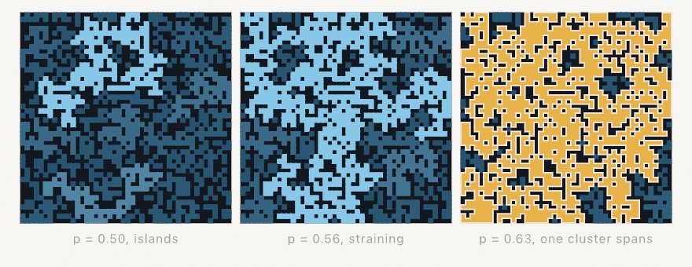

#### <sup>[Ollin](../../README.md) → [Documentation](../README.md) → [Generators](./README.md) → `Percolation`</sup>

---

## Percolation

**`Percolation`** fills a grid with open cells at a probability you choose, then reads the **clusters**: groups of open cells joined edge to edge. It is the standard model of a phase transition. Below the critical probability the open cells form scattered islands. Just past it, one giant cluster suddenly reaches across the whole grid. That threshold sits near 0.5927 on the square lattice, and sweeping `probability` through it is the show.

The fill draws from the seeded generator, so the same seed always builds the same grid. Everything comes back as geometry: cell rectangles to fill, and traced boundary loops that stroke, hatch, and export to SVG for a pen plotter.

<picture>
  <source media="(prefers-color-scheme: dark)" srcset="../../Guide/Images/04-Randomness/ChanceInCrowds-dark.jpg">
  
</picture>

### Contents

- [Percolation](#filling)
- [Reading the clusters](#clusters)
- [Outlines and cell rectangles](#geometry)
- [Practical notes](#notes)

<a name="filling"></a>

#### Percolation

```swift
Percolation(columns: Int, rows: Int, probability: Double,
            using: &rng)                                  // the seeded fill
Percolation(columns: Int, rows: Int, openCells: [Bool])   // a grid you filled yourself
percolation(columns: Int, rows: Int, probability: Double) // the sketch form, seeded by `seed(_:)`

Percolation.criticalProbability   // 0.592746, the square-lattice site threshold
```

The first form rolls each cell open with `probability`. The second takes any row-major boolean grid, so the cluster reading also works on a thresholded image, a noise field, or a pattern of your own. `Percolation.criticalProbability` is the measured threshold, there so a sketch can breathe around it without a magic number.

```swift
seed(9)
let grid = percolation(columns: 48, rows: 48, probability: 0.6)
noStroke()
fill(Color(hex: 0xE8B44A))
for cell in grid.cellRects(of: 0, in: bounds) { drawRect(cell) }
```

<a name="clusters"></a>

#### Reading the clusters

```swift
grid.clusterCount                       // how many clusters
grid.clusterSizes                       // cell counts, largest first
grid.cluster(_ index:)                  // one cluster's (column, row) cells
grid.isOpen(atColumn:row:)              // one cell's state
grid.clusterIndex(atColumn:row:)        // which cluster a cell belongs to
grid.spanningClusterIndex               // the top-to-bottom cluster, if any
grid.spans                              // whether one exists
```

Clusters come back largest first, so index `0` is always the biggest and a size-ranked coloring is a plain loop. Cells join through their four edge neighbors; corner contact does not connect. `spans` reads the classic question: does some cluster touch both the top and the bottom row?

<a name="geometry"></a>

#### Outlines and cell rectangles

```swift
grid.cellRects(of: index, in: rect)   // one small Rectangle per cell, to fill
grid.outlines(of: index, in: rect)    // closed boundary loops, to stroke or plot
```

`cellRects` places a cluster's cells into any rectangle, ready for `drawRect`. `outlines` traces the same cluster's boundary as closed `Contour` loops with exact corners and merged straight runs: the outer edge plus one loop for each enclosed hole. Where two lobes pinch at a single corner, the trace takes the tighter turn, so no loop ever crosses itself.

```swift
stroke(.white)
noFill()
for loop in grid.outlines(of: 0, in: bounds) { drawPolygon(loop.points) }
```

<a name="notes"></a>

#### Practical notes

- **Sweep the threshold slowly.** The whole drama lives within a few hundredths of `criticalProbability`. A slow sine around it shows islands growing, straining, and snapping into one span; see `Examples/Patterns/Percolation`.
- **Fix the field, move the threshold.** Roll one random value per cell once, then open each cell whose value sits under the current probability. The landscape holds still while the flood rises, which reads far better than rerolling every frame.
- **The threshold moves with the rules.** 0.5927 belongs to the square lattice with four neighbors. Your own `openCells` grids (an image, a noise field) have their own thresholds, and finding one by eye is half the fun.
- **The outlines are plotter work.** Each loop is one closed rectilinear polyline. The [SVG export](../Output/Export.md) writes them as line-work, and its `--hatch` pass fills them like any other closed shape.

---

Related: [`Cellular automata`](./CellularAutomata.md) (grids evolving by rule instead of chance), [`Tiling & layout`](../Drawing/Tiling.md) (the `Maze`, the other grid whose geometry comes back as merged line runs), and [`Noise`](./Noise.md) (a field to threshold into `openCells`).
