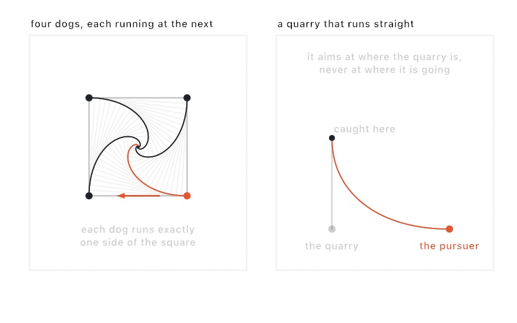

#### <sup>[Ollin](../../README.md) → [Documentation](../README.md) → [Generators](./README.md) → `Pursuit`</sup>

---

## Pursuit

Every runner heads straight at whoever it was told to run at, and the paths they leave behind are the drawing. Put a runner on each corner of a polygon, tell each one to chase the next, and start them together. Nobody travels in a straight line, because every target is moving too. The ring shrinks and turns at the same time, and the runners meet in the middle.

<picture>
  <source media="(prefers-color-scheme: dark)" srcset="../../Guide/Images/12-FlocksAndSwarms/PursuitDogs-dark.jpg">
  
</picture>

Nothing here is random, so the same start always runs the same chase. What comes out is ordinary geometry, ready for stroking, filling, the [shape booleans](../Drawing/Geometry.md), hatching, and SVG export.

### Contents

- [Building a chase](#build)
- [What a step does](#step)
- [Four facts that are exact](#laws)
- [A quarry that runs straight](#straight)
- [Tuning the chase](#tuning)
- [What comes out](#output)

<a name="build"></a>

#### Building a chase

`Pursuit` is a class you build once and step, either a few steps a frame to watch it draw itself, or all at once with `run()`.

```swift
final class Spirals: Sketch {
    let chase = Pursuit.ring(sides: 6, center: Vector2(540, 540), radius: 420)

    override func setup() {
        chase.recordEvery = 10   // keep the chase lines along the way
        chase.run()              // the whole chase, worked out once
    }

    override func draw() {
        background(Color(hex: 0x11131A))
        noFill()
        stroke(Color.white.withAlpha(0.15)); strokeWeight(1)
        for line in chase.web { drawPolyline(line.points) }
        stroke(Color(hex: 0xE0724A)); strokeWeight(3)
        for trail in chase.trails { drawPolyline(trail.points) }
    }
}
```

`ring(sides:center:radius:)` is the classic figure. `chasing:` says how many places around the ring the target sits. 1 is the classic one. Half of `sides` sends everybody straight at whoever is opposite, with no spiral at all.

For anything else, build the runners yourself. Each one names the index of the runner it follows, and a runner that follows nobody holds its heading and runs straight.

```swift
let chase = Pursuit(runners: [.holding(Vector2(0, 1), from: Vector2(300, 200), speed: 0.5),
                              .chasing(0, from: Vector2(700, 200))],
                    stepSize: 2)
```

<a name="step"></a>

#### What a step does

`step()` moves everybody once, and `step(_:)` takes several. One step is three things, in this order:

1. Every runner that follows another turns to face it. With no `maxTurn` set it turns on the spot, which is the classic curve.
2. Every runner moves `speed * stepSize` along its heading. **They all move at the same moment**, off the positions everyone held before the step. That is what keeps a ring a ring, and it is the whole difference between this figure and a lopsided one.
3. A runner within `catchDistance` of its target lands on it, stops, and reports `hasArrived`. A runner never runs past the one it caught, however long its stride.

`run(limit:)` steps until every chaser has arrived, or until the limit. `isFinished` says whether it got there.

<a name="laws"></a>

#### Four facts that are exact

The ring is worth knowing because so much about it can be worked out in advance, with `s` standing for `sin(chasing * pi / sides)`:

| | |
|---|---|
| The shape holds | the ring is a regular polygon at every step, only smaller and turned |
| The path | a logarithmic spiral: the angle between a runner's path and the line to the center never changes, and stays at `90 - chasing * 180 / sides` degrees |
| The distance | a runner starting `radius` from the center covers `radius / s` before it arrives. On a square that is exactly one side of the square |
| The shrink | one step takes the ring from `r` to `sqrt(r * r - 2 * d * r * s + d * d)`, where `d` is the stride |

The last one has a tail worth knowing when a chase looks like it has stalled. A runner covering a fixed distance per step overshoots the turn a little every time, so it can never come nearer the center than `d * cos(chasing * pi / sides)`. The gap between neighbors falls to one stride at the circle of radius `d / (2 * s)`, and there the chase stops going anywhere. `catchDistance` defaults to two strides, which ends it one ring earlier.

This is also why a drawn total lands a hair over the distance the law gives. A smaller `stepSize` draws a finer curve and a closer number.

<a name="straight"></a>

#### A quarry that runs straight

The other classic case is a fast runner chasing a quarry that crosses in front of it. Write the quarry as a runner that follows nobody:

```swift
let gap = 300.0, k = 0.5     // the quarry's speed, against the pursuer's 1
let chase = Pursuit(runners: [.holding(Vector2(0, 1), from: .zero, speed: k),
                              .chasing(0, from: Vector2(gap, 0))],
                    stepSize: 0.5)
chase.run()
```

From a square-on start the pursuer covers `gap / (1 - k * k)` and the quarry covers `gap * k / (1 - k * k)` before it is caught. At `k` of 1 or more it is never caught at all: the gap closes to half what it started as and stops there.

<a name="tuning"></a>

#### Tuning the chase

| Parameter | What it does |
|---|---|
| `stepSize` | how far a runner of speed 1 covers per step. Smaller steps draw a finer curve, take more steps, and land closer to the law |
| `catchDistance` | how close counts as arrived. Two strides by default. A runner's own stride is a floor under it, so it never runs past its target |
| `maxTurn` | the most a runner may turn in one step, in radians. `nil` lets it turn on the spot. A value makes a runner that swings wide and can overshoot, and 0 makes one that cannot turn at all |
| `recordEvery` | keep the chase lines into `web` every this many steps. 0 keeps none |
| `Runner.speed` | a multiple of `stepSize`, so runners can be faster and slower than each other |
| `Runner.chases` | the index of the runner it follows. `nil`, itself, or an index nobody holds all mean it runs straight |

<a name="output"></a>

#### What comes out

| | |
|---|---|
| `trails` | each runner's path so far, as an open `Contour`. The drawing |
| `web` | the chase lines kept along the way, one two-point `Contour` each, starting with the line-up you began with |
| `links` | the chase lines as they stand now. On a ring these are the sides of the polygon |
| `runners` | the runners themselves: `position`, `heading`, `trail`, `distanceTraveled`, `hasArrived` |

All of it is plain geometry. `trails` strokes directly, hatches, and cuts with the booleans. It also goes to a pen plotter, which draws a chase the way it was always drawn: one continuous line per runner.

### See also

- [`Steering`](./Steering.md) - seek, flee, arrive, and wander, the same idea as forces on an agent that has momentum
- [`Boids`](./Boids.md) - a whole flock, where each bird answers to its neighbors rather than to one target
- [`Meander`](./Meander.md) - another stateful stepper whose product is a line
- [`Curves`](../Drawing/Curves.md) - the classic curves you can write down in closed form

### Where this comes from

The chase curve was first studied by Pierre Bouguer in 1732, in a paper about one ship pursuing another. Edouard Lucas asked the ring question in 1877, and Henri Brocard answered it: the paths are logarithmic spirals, and they meet in one point. Written from the published results, credited in [`ATTRIBUTION.md`](../../ATTRIBUTION.md).

### Example

[`Examples/Patterns/Pursuit`](../../Examples/Patterns/Pursuit/Sketch.swift) draws the ring while it runs, with the kept chase lines under it and the distance measured against the law.
