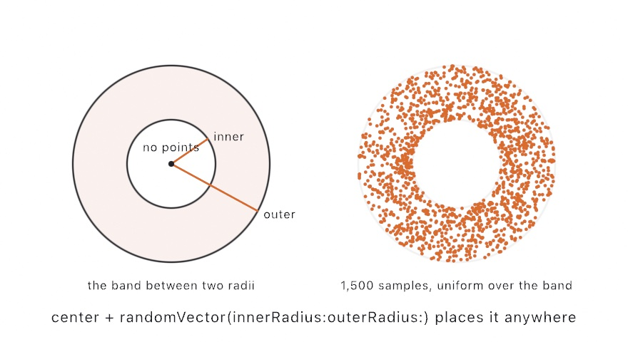

#### <sup>[Ollin](../../README.md) → [Documentation](../README.md) → [Generators](./README.md) → `Random`</sup>

---

## Random

`random` is seedable and lives on the sketch, so two sketches never share hidden global state. The seed is entropy-based by default, so an unseeded sketch differs each run. Set a seed when you want a reproducible image. The generator is Ollin's own (SplitMix64), so a seed reproduces Ollin's output rather than p5's. For smooth, coherent values instead, see [Noise](../Generators/Noise.md).

### Contents

- [random](#random)
- [randomGaussian](#randomGaussian)
- [randomVector](#randomVector)
- [ring](#ring)
- [randomChoice](#randomChoice)
- [shuffled](#shuffled)
- [randomSeed](#randomSeed)
- [seed](#seed)

### Generators

<a name="random"></a>

#### random

```swift
random() -> Double
random(_ max: Double) -> Double
random(_ min: Double, _ max: Double) -> Double
```

A uniform random `Double`, in `0..<1`, in `0..<max`, or between `min` and `max`. The two-bound form is order-independent, so it takes the bounds either way round.

```swift
let y = 400 + random(-100, 100)        // jitter around 400
if random() < 0.2 { /* runs about a fifth of the time */ }
```

A zero-width range short-circuits, so `random(a, a)` returns `a` *without consuming a roll*. That matters in a seeded sketch. A parameter or an animated value can scale a jitter amount down to exactly zero. In that case, write the jitter as a scaled unit roll, `random(-1, 1) * amount`, and not `random(-amount, amount)`. The unit roll always draws, so the seeded sequence stays stable as `amount` crosses zero. The piece's whole pattern of later rolls stays stable with it.

<a name="randomGaussian"></a>

#### randomGaussian

```swift
randomGaussian() -> Double
randomGaussian(mean: Double, deviation: Double) -> Double
```

A normally distributed random `Double`, computed with the Marsaglia polar method. The first form is standard normal, and the second takes a mean and a standard deviation. The scatter reads as more natural than the flat spread of `random`. About 68 percent of samples land within one deviation of the mean, and about 95 percent within two. See the `Gaussian` example.

<picture>
  <source media="(prefers-color-scheme: dark)" srcset="../../Guide/Images/04-Randomness/UniformVsGaussian-dark.jpg">
  
</picture>

```swift
let x = randomGaussian(mean: width / 2, deviation: 80)  // clustered near the middle
drawCircle(x, height / 2, 4)
```

<a name="randomVector"></a>

#### randomVector

```swift
randomVector(in rect: Rectangle) -> Vector2
```

A random point inside `rect`. Each coordinate is uniform within its own bounds.

```swift
let p = randomVector(in: Rectangle(x: 0, y: 0, width: width, height: height))
drawCircle(center: p, radius: 3)
```

<a name="ring"></a>

#### ring

```swift
ring(innerRadius: Double, outerRadius: Double) -> Vector2
```

A random point in the ring between the two radii. The ring is centered on the origin, so add a center to place it elsewhere. See the `Ring` example.

<picture>
  <source media="(prefers-color-scheme: dark)" srcset="../Images/RandomRing-dark.jpg">
  
</picture>

```swift
let center = Vector2(width / 2, height / 2)
let p = center + ring(innerRadius: 50, outerRadius: 100)
drawCircle(center: p, radius: 3)
```

### Choices

<a name="randomChoice"></a>

#### randomChoice

```swift
randomChoice<T>(_ choices: [T]) -> T
randomChoice<T>(_ choices: [T], weights: [Double]) -> T
```

A random element of `choices`. Without `weights` each element is equally likely, and with them the pick is biased. This is the everyday way to pick from a palette, with no indexing arithmetic to write. Pass one weight per choice. A weight must be non-negative and can be in any scale, so the weights need not sum to 1. A choice weighted 0 is never picked, and `choices` must not be empty. The picks are seeded like everything `random`, so `randomSeed` makes them reproducible.

<picture>
  <source media="(prefers-color-scheme: dark)" srcset="../../Guide/Images/04-Randomness/Choices-dark.jpg">
  
</picture>

```swift
fill(randomChoice(palette))                            // any of them
fill(randomChoice(palette, weights: [6, 3, 1]))        // a dominant, a support, a spice
let move = randomChoice(["up", "down", "hold"], weights: [1, 1, 4])
```

<a name="shuffled"></a>

#### shuffled

```swift
shuffled<T>(_ array: [T]) -> [T]
```

The elements of `array` in a random order. The order comes from the sketch's seeded generator, so a seeded shuffle reproduces run to run. An array's own `shuffled()` uses the system's generator instead, so it differs every run.

```swift
randomSeed(9)
let order = shuffled(palette)   // the same reordering every run
```

### Seeding

<a name="randomSeed"></a>

#### randomSeed

```swift
randomSeed(_ seed: Int)
```

Seed the generator behind `random*` so a run reproduces. The same seed gives the same sequence. To reseed `noise` as well, see [`seed`](#seed).

```swift
randomSeed(42)   // same scatter every run
```

<a name="seed"></a>

#### seed

```swift
seed(_ seed: Int)
```

Seed *both* `random` and `noise` from one value. That locks the whole sketch's randomness, so the sketch reproduces exactly. Use it when one seed should fully determine a piece. To reseed only one of the two, use `randomSeed` or [`noiseSeed`](../Generators/Noise.md#noiseSeed).

```swift
seed(7)   // random and noise both reproducible
```

`seed` also sets the sketch's `variation`, the seed the run grew from. Every sketch starts on one, rolled fresh unless you call `seed`, and the sketch reads it back as `variation`. Every export records it in its recipe. You can step through variations from the inspector's Variation card, or render at any seed with `--seed N`. See [Variations](../Core/Variations.md).

```swift
override func draw() {
    drawCaption("Variation \(variation)")
}
```
