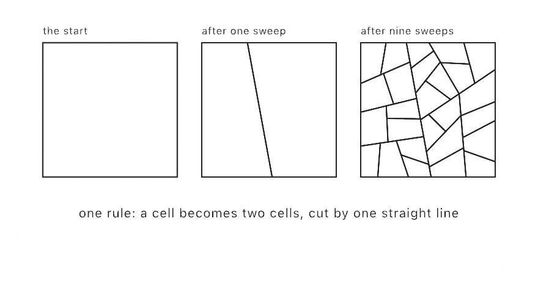

#### <sup>[Ollin](../../README.md) → [Documentation](../README.md) → [Generators](./README.md) → `ShapeGrammar`</sup>

---

## ShapeGrammar

A shape grammar is a start shape and a handful of rules. Each rule says what one labeled shape turns into. Apply the rules again and again, and the design grows out of them.

A rule reads as one sentence. Here is one of them in words: *a cell becomes two cells, cut apart by one straight line drawn between two of its edges*. Nothing in that sentence says which edges, or where on them. The rule therefore stands for every design it could make, rather than for one drawing. That is the whole idea. You write the rules, and the run draws the picture.

<picture>
  <source media="(prefers-color-scheme: dark)" srcset="../Images/ShapeGrammarLattice-dark.jpg">
  
</picture>

Every piece is a closed polygon with a label. The label decides which rule may rewrite it, and a piece whose label no rule names is finished. What comes out is ordinary geometry. You can stroke it, fill it, run the [shape booleans](../Drawing/Geometry.md) over it, hatch it, and export it as SVG. A seeded generator drives the run, so the same seed always draws the same design.

### Contents

- [Writing a grammar](#writing)
- [The rules](#rules)
- [How a run picks a rule](#picking)
- [Two facts that are exact](#laws)
- [Growing it a sweep at a time](#step)
- [What comes out](#output)
- [Grammars ready to use](#ready)

<a name="writing"></a>

#### Writing a grammar

A grammar is a start piece and a list of rules.

```swift
final class Lattice: Sketch {
    override func draw() {
        background(Color(hex: 0x121016))
        let frame = Rectangle(center: center, width: 880, height: 880)
        let grammar = ShapeGrammar(start: ShapeGrammar.Piece("cell", frame),
                                   rules: [.cut("cell", into: ("cell", "cell"),
                                                minArea: 7_000)])
        noFill(); stroke(.white); strokeWeight(2)
        for piece in grammar.run(generations: 9, seed: 7) {
            drawPolyline(piece.corners, closed: true)
        }
    }
}
```

`Piece` takes a `Rectangle`, a list of corners, or a `Contour`. The bare call `shapeGrammar(_:generations:)` on a sketch does the same thing, using the sketch's own seeded `random`, which means `seed(_:)` makes the design reproducible.

<a name="rules"></a>

#### The rules

| Rule | What it does |
|---|---|
| `.cut(_:into:balance:sides:avoidingCorners:tries:minArea:weight:)` | one straight line between two edges, leaving two parts of about equal area |
| `.split(_:along:at:into:minArea:weight:)` | straight cuts across the piece, at fractions of its upright box |
| `.inset(_:by:into:border:minArea:weight:)` | pulls the outline inward by the same distance all the way round |
| `.nested(_:scale:turn:into:keeping:minArea:weight:)` | puts a smaller, turned copy of the piece inside itself |
| `.stop(_:into:weight:)` | renames the piece and leaves its outline alone |
| `.custom(_:weight:minArea:_:)` | anything else, written as a closure |

`cut` is the move behind the ice-ray lattices. Those are the window frames whose bars look like cracks in river ice. Three of its parameters decide the character of a design:

- **`balance`** is how uneven a cut may leave the two parts, as a fraction of the piece's area. At 0 every cut halves the area, so the design reads as regular and machined. At 0.4 one part may take 70 percent, so the design goes loose and hand cut. The rule *solves* the cut for a target inside that band rather than searching for one, so the band always holds.
- **`sides`** is how many corners a part may have. What it really controls is worth knowing, and it is explained [below](#laws).
- **`tries`** is how many cuts the rule weighs up before it keeps the shortest one. That is what keeps the parts compact. A balanced cut down the length of a piece leaves two parts just as long, and the shortest line that reaches always goes across. At 1 the rule keeps the first cut that fits, so the parts grow long and thin.

`split` is the move behind a building front. `at: [0.3]` makes two parts, and `at: [0.25, 0.5, 0.75]` makes four. The labels in `into` are used in turn, and they start over when they run out, so two labels stripe a piece. `along:` takes `.x`, `.y`, `.longest`, or `.shortest`. Use `.longest` to keep subdivided parts from going thin.

`inset` pushes every edge along its own normal. The ring it leaves is therefore the same width all the way round. That is what makes it read as a bar rather than a shrunken copy. Give `border:` a label and the ring comes back too, as one piece per edge of the outline.

```swift
// Floors, then windows across each floor, then a pane inside each window.
let facade = ShapeGrammar(
    start: ShapeGrammar.Piece("wall", Rectangle(x: 0, y: 0, width: 600, height: 400)),
    rules: [.split("wall", along: .y, at: [0.25, 0.5, 0.75], into: ["floor"]),
            .split("floor", along: .x, at: [0.2, 0.4, 0.6, 0.8], into: ["pier", "window"]),
            .inset("window", by: 8, into: "glass", border: "frame")])
    .run(generations: 3, seed: 1)
```

<a name="picking"></a>

#### How a run picks a rule

A sweep offers every piece to the rules that name its label. Three things decide what happens:

- **`minArea`.** The rule leaves a piece smaller than this alone. It is what brings a run to a stop, and it is how the classic grammars say "until the pieces are the size you wanted".
- **`weight`.** Among the rules that share a label, the run picks one in proportion to weight. A rule of weight 3 is picked three times as often as a rule of weight 1.
- **Refusal.** A rule may hand back nothing, which passes the piece to the other rules on its label. `inset` refuses a piece with no room for the bar, and `cut` refuses a piece it cannot cut inside the limits it was given.

**A rule of weight 0 is only reached once every other rule on the label has refused**. That is how weight and refusal combine into a fallback. A lattice can ask for a wide bar first, and settle for a narrow one where there is no room.

```swift
rules: [.inset("cell", by: 8, into: "pane"),
        .inset("cell", by: 2, into: "pane", weight: 0)]   // only where 8 will not fit
```

A label no rule names is finished, and that is the ordinary way to end a design. Cut into `"cell"` while it is worth cutting, then let it stay a cell.

<a name="laws"></a>

#### Two facts that are exact

**A cut adds four corners.** The line meets two edges away from their ends. It therefore gives one new corner to each part at each end, and every corner the piece had lands in exactly one part. Whatever the piece was, the two parts carry `n + 4` corners between them.

That one piece of arithmetic is the whole rule table of the classic lattice grammar. It is why `sides` is the only thing you have to say. Hold the parts to `3...5` and this is what each piece can become:

| the piece | what it can become | because |
|---|---|---|
| a triangle | a triangle and a quadrilateral | `3 + 4 = 3 + 4` |
| a quadrilateral | a triangle and a pentagon, or two quadrilaterals | `3 + 5` and `4 + 4` |
| a pentagon | a quadrilateral and another pentagon | `4 + 5`, and nothing else fits |
| a hexagon | two pentagons, and only that | `5 + 5` is the one legal pair |
| seven corners or more | nothing at all | no legal pair exists, so the piece is finished whatever its size |

Nobody writes those rules down. They are what is left once you name the corner range. That is also why a lattice settles into three, four, and five sided cells rather than gaining more corners.

**Cutting, splitting, and insetting keep the whole area.** Each one partitions the piece, so the parts add back up to it exactly. A whole lattice still covers its frame, so you can fill the frame once and then knock the panes out of it.

The size limit gives a third exact fact. **No piece a run leaves is smaller than `minArea * (1 - balance) / 2`**. That is because a piece is only cut while it is at least `minArea`, and the smaller part keeps at least `(1 - balance) / 2` of that.

<a name="step"></a>

#### Growing it a sweep at a time

`run(generations:)` does the sweeps for you. To watch a design build instead, hold the pieces and the random source yourself.

```swift
private var cells: [ShapeGrammar.Piece] = []
private var source = SplitMix64(seed: 4)

override func setup() { cells = grammar.start }

override func draw() {
    if frameCount % 6 == 0 { cells = grammar.step(cells, using: &source) }
    // ... draw cells
}
```

A design is an array of pieces, so it feeds straight back in as the start of another grammar. That is the usual way to finish one. Cut with one grammar, then inset with a second.

<a name="output"></a>

#### What comes out

| On a `Piece` | |
|---|---|
| `label` | the word the rules match on |
| `corners` | the corners of the outline, in order |
| `contour` | the same outline as a closed `Contour` |
| `depth` | how many rules deep the piece is. The start pieces are at 0 |
| `area`, `centroid`, `bounds` | measured off the outline |

The built-in rules expect a convex piece and hand back convex pieces, so a run that starts convex stays convex. A `custom` rule may return any shape it likes.

<a name="ready"></a>

#### Grammars ready to use

| | |
|---|---|
| `ShapeGrammar.iceRay(in:minArea:balance:sides:avoidingCorners:)` | the lattice grammar: cut a frame in two again and again until the cells are the size you asked for |
| `ShapeGrammar.nestedSquares(in:minArea:scale:turn:)` | a square holding a smaller turned square, for as long as there is room. The default scale of `1 / sqrt(2)` and the default eighth turn put every corner of a copy on the middle of an edge of the square that holds it |

### See also

- [`LSystem`](./LSystem.md) - the other rewriting system, with rules over a string of symbols that a turtle draws, where these rewrite shapes in place
- [`WaveFunctionCollapse`](./WaveFunctionCollapse.md) - filling a grid by what fits its neighbors, rather than by replacing what is there
- [`Fractals`](./Fractals.md) - iterated function systems, where every rule is a similarity and there are no labels
- [`StraightSkeleton`](./StraightSkeleton.md) - mitered insets of a shape that need not be convex
- [`Tiling`](../Drawing/Tiling.md) - grids and tilings, for a design whose cells are decided in advance

### Where this comes from

George Stiny and James Gips introduced shape grammars in 1971, as a way of specifying paintings and sculpture by rule. The lattice grammar here follows Stiny's 1977 study of Chinese ice-ray window designs. That study is where the balanced cut between two edges and the size limit come from. Stiny wrote it from the catalogue Daniel Sheets Dye made of the lattices themselves. The split rules are the same idea put to work on buildings. Ollin's version is written from the published rules, and credited in [`ATTRIBUTION.md`](../../ATTRIBUTION.md).

### Example

[`Examples/Patterns/ShapeGrammar`](../../Examples/Patterns/ShapeGrammar/Sketch.swift) builds an ice-ray window frame a sweep at a time. A second grammar over the first one's cells cuts the bars.
