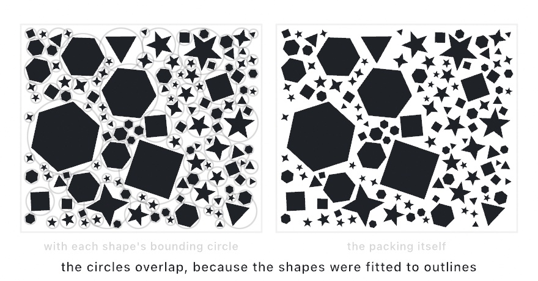

#### <sup>[Ollin](../../README.md) → [Documentation](../README.md) → [Generators](./README.md) → `Shape packing`</sup>

---

## Shape packing

Fill a region with arbitrary shapes that grow until they touch, the way [circle packing](./Packing.md) fills it with circles. `packShapes` grows each shape until it meets its neighbors' **outlines** (not just their bounding circles), so small shapes nestle right into the concave gaps a star's notches or a triangle's edges leave. Big shapes land first and progressively smaller ones fill the space between them, each a random pick from a bag, rotated and scaled to fit.

The output is `[Shape]`, so it feeds fills, strokes, the [shape booleans](../Drawing/Geometry.md), hatching, and SVG export. A run is a pure function of the [`seed`](./Random.md#seed).

<picture>
  <source media="(prefers-color-scheme: dark)" srcset="../../Guide/Images/15-ShapesAsMaterial/ShapePacking-dark.jpg">
  
</picture>

### Contents

- [packShapes](#pack)
- [Continuous packing (animated)](#continuous)
- [From a set of points](#around)
- [Building the shape bag](#bag)

<a name="pack"></a>

#### packShapes

```swift
packShapes(_ shapes: [Shape], in bounds: Rectangle? = nil,
           count: Int, minRadius: Double, maxRadius: Double = .infinity,
           padding: Double = 0, rotation: ClosedRange<Double> = 0 ... Double.tau,
           scale: Double = 1) -> [Shape]
```

Pack up to `count` shapes into `bounds` (the canvas by default). `minRadius` is the smallest shape to place (by bounding-circle radius) and `maxRadius` is a cap. `padding` opens a gap between shapes. `rotation` is the range in radians each shape is randomly turned within, so `0 ... 0` leaves them upright. `scale` is how much of its bounding circle a shape fills, with `1` touching and anything less leaving a margin.

```swift
seed(4)
let bag = [triangle, square, pentagon, star]
for shape in packShapes(bag, count: 500, minRadius: 6, maxRadius: 120, padding: 4, scale: 0.9) {
    fill(.white); drawShape(shape)
}
```

Compute the packing once and hold it (in a stored property), then animate something visual (each shape's color) so it moves without the shapes jumping.

<a name="continuous"></a>

#### Continuous packing (animated)

`packShapes` fills the region in one call. `ContinuousPacking` is the same engine held open. You `step()` it each frame so the packing *fills in over time*, and because big gaps fill first, each new shape is smaller than the last, densifying from a few large shapes to a scatter of tiny ones.

```swift
ContinuousPacking(shapes: [Shape] = [], in: Rectangle, seed: UInt64 = 0,
                  minRadius: Double, maxRadius: Double, padding: Double = 0,
                  rotation: ClosedRange<Double> = 0 ... Double.tau, scale: Double = 1,
                  attemptsPerStep: Int = 10)
```

Pair it with accumulation (`noClear()`). A placed shape never moves, so each frame draws only the *new* shapes (`packer.count` grows), and the per-frame cost stays flat however full it gets.

```swift
let packer = ContinuousPacking(shapes: bag, in: bounds, seed: 4,
                               minRadius: 3, maxRadius: 130, padding: 4)

override func setup() { noClear() }
override func draw() {
    let start = packer.count
    packer.step()                       // add a few this frame
    for i in start ..< packer.count {   // draw only the new ones
        fill(.white); drawShape(packer.shapes[i])
    }
}
```

Pass an empty bag to pack plain circles instead, then read `packer.circles`. See the `ShapePacking` example.

<a name="around"></a>

#### From a set of points

To place *one* shape at each of a set of points (a scatter rather than a dense fill), use the `around:` form. Each shape's bounding circle grows to touch the nearest other point, so a [blue-noise](./BlueNoise.md) set makes an even, non-overlapping scatter.

```swift
seed(7)
let sites = poissonDisk(radius: 60)
for shape in packShapes(bag, around: sites, padding: 4) { fill(.white); drawShape(shape) }
```

<a name="bag"></a>

#### Building the shape bag

Any `Shape` works, so the bag is yours: regular polygons, stars, glyphs from [`textToShapes`](../Drawing/Text.md), booleans of other shapes. A shape's position and size are set by the packing, so build each at any convenient size around the origin. Here is a regular polygon or star:

```swift
func polygon(_ sides: Int, star: Bool = false) -> Shape {
    let count = star ? sides * 2 : sides
    let points = (0..<count).map { i -> Vector2 in
        let a = Double(i) / Double(count) * 2 * .pi - .pi / 2
        let r = (star && i % 2 == 1) ? 0.46 : 1.0
        return Vector2(cos(a) * r, sin(a) * r)
    }
    return Shape(points, closed: true)
}

let bag = [polygon(3), polygon(4), polygon(6), polygon(5, star: true)]
```

---

Related: [`Circle packing`](./Packing.md) (the round case, and its parameters), [`Blue noise`](./BlueNoise.md) (the even point set the `around:` form scatters over), [`Geometry`](../Drawing/Geometry.md) (the `Shape` type and the booleans the output feeds).
