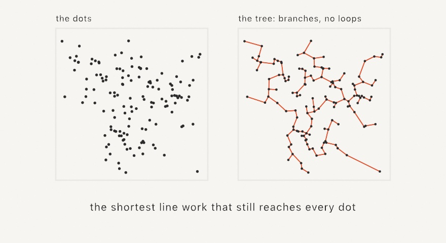

#### <sup>[Ollin](../../README.md) → [Documentation](../README.md) → [Generators](./README.md) → `Spanning tree`</sup>

---

## Spanning tree

**`spanningTree`** connects a set of points with the shortest total line work that still reaches every one of them. That is the minimum spanning tree, the branching sibling of the [single line](./SingleLine.md). [Stipple](./Stippling.md) a picture, span the dots, and the tree reads as the picture drawn in veins: trunks along the darks, capillaries feathering into the shading. Where the tour meanders, the tree branches, so the same dots come out organic rather than labyrinthine. The technique is the minimum-spanning-tree halftoning of Inoue and Urahama, from the same family as TSP art.

<picture>
  <source media="(prefers-color-scheme: dark)" srcset="../../Guide/Images/Docs/SpanningTreeVeins-dark.jpg">
  
</picture>

The result comes back as a handful of open `Contour` chains that together draw every tree edge exactly once. It therefore feeds `drawPolyline`, [hatching and SVG export](../Output/Export.md), and anything else a polyline feeds. Each chain is one pen-down stroke on a plotter.

### Contents

- [spanningTree (an image)](#image)
- [spanningTree (through points)](#points)
- [Practical notes](#notes)

<a name="image"></a>

#### spanningTree (an image)

```swift
spanningTree(of image: Image,
             points count: Int,
             in bounds: Rectangle? = nil,
             iterations: Int = 40,
             cutoff: Double = 0.85) -> [Contour]
```

The one-call form: stipple `image` with `count` dots, then join them by the minimum spanning tree. The image is stretched over `bounds`, which is the whole canvas by default. Pass a `Rectangle(fitting:in:)` of the image's size to keep its aspect. Driven by the seeded `random`, so [`seed`](./Random.md#seed) reproduces the drawing exactly.

```swift
let veins = spanningTree(of: picture, points: 4000, in: frame)
noFill()
stroke(.black)
for chain in veins { drawPolyline(chain.points) }
```

`cutoff` works exactly as in `singleLine(of:points:)`: pixels lighter than it place no dots, so light regions stay genuinely empty instead of collecting stray twigs.

<a name="points"></a>

#### spanningTree (through points)

```swift
spanningTree(through points: [Vector2]) -> [Contour]
```

The tree itself, over any points: a stipple, a [blue-noise scatter](./BlueNoise.md), attractor orbits, cluster centers. The tree is exact, built on the [Delaunay triangulation](../Drawing/Voronoi.md), which always contains it. The chain decomposition is minimal at one chain per pair of odd-degree vertices. A plotter therefore spends no more pen lifts than the branching demands.

```swift
let tree = spanningTree(through: dots)
for chain in tree { drawPolyline(chain.points) }
```

Deterministic given the points, and pure CPU: comfortable at tens of thousands of points.

<a name="notes"></a>

#### Practical notes

- **Span once, hold the chains.** The build is `setup()` work. Animate the reveal by drawing chains in their plotting order, not by rebuilding.
- **Tour or tree is a mood choice.** The same stipple renders both ways. `singleLine` gives the engraved, maze-like meander, and `spanningTree` gives the organic, vascular reading. The tree is also the shorter drawing, always.
- **Density is the vein structure.** The tree invents trunks where dots crowd, so tonal contrast in the source is what makes the branching legible. A soft gray image gives an even thicket.
- **Chains are yours to style.** Each `Contour` is an independent stroke: vary weight by chain length for trunk-and-twig weighting, or feed the long ones to `drawCurve` for a rounded reading.

---

Related: [`Single line`](./SingleLine.md) (the touring sibling), [`Stippling`](./Stippling.md) (the placement half), [`Voronoi & Delaunay`](../Drawing/Voronoi.md) (the triangulation underneath), [`Export`](../Output/Export.md) (SVG and the plotter path).
