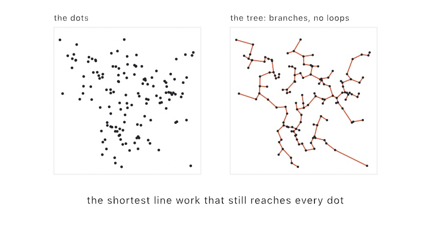

#### <sup>[Ollin](../../README.md) → [Documentation](../README.md) → [Generators](./README.md) → `Spanning tree`</sup>

---

## Spanning tree

**`spanningTree`** connects a set of points with the shortest total line work that still reaches every one of them. That shape is the minimum spanning tree, the branching sibling of the [single line](./SingleLine.md). When you [stipple](./Stippling.md) a picture and span the dots, the tree reads as the picture drawn in veins. Trunks follow the darks, and fine twigs feather into the shading. A tour meanders through the same dots, but the tree branches instead, so the result looks organic rather than maze-like. The technique is the minimum-spanning-tree halftoning of Inoue and Urahama, from the same family as TSP art.

<picture>
  <source media="(prefers-color-scheme: dark)" srcset="../Images/SpanningTreeVeins-dark.jpg">
  
</picture>

The result is a handful of open `Contour` chains, and together they draw every tree edge exactly once. You can pass them to `drawPolyline`, to [hatching and SVG export](../Output/Export.md), and to anything else that takes a polyline. On a plotter, each chain is one pen-down stroke.

### Contents

- [spanningTree (an image)](#image)
- [spanningTree (through points)](#points)
- [Practical notes](#notes)

<a name="image"></a>

#### spanningTree (an image)

```swift
spanningTree(of image: Image,
             points count: Int,
             in bounds: Rectangle? = nil,
             iterations: Int = 40,
             cutoff: Double = 0.85) -> [Contour]
```

This is the one-call form. It stipples `image` with `count` dots, then joins those dots with the minimum spanning tree. The image is stretched over `bounds`, which is the whole canvas by default. To keep the image's aspect, pass a `Rectangle(fitting:in:)` of the image's size. The dots come from the seeded `random`, so the same [`seed`](./Random.md#seed) reproduces the drawing exactly.

```swift
let veins = spanningTree(of: picture, points: 4000, in: frame)
noFill()
stroke(.black)
for chain in veins { drawPolyline(chain.points) }
```

`cutoff` works the same way as in `singleLine(of:points:)`. Pixels lighter than the cutoff place no dots, so light regions stay empty instead of collecting stray twigs.

<a name="points"></a>

#### spanningTree (through points)

```swift
spanningTree(through points: [Vector2]) -> [Contour]
```

This form builds the tree over any points you already have, such as a stipple, a [blue-noise scatter](./BlueNoise.md), attractor orbits, or cluster centers. The tree is exact, because it is built on the [Delaunay triangulation](../Drawing/Voronoi.md), which always contains it. The chain decomposition is minimal, at one chain per pair of odd-degree vertices. A plotter therefore spends no more pen lifts than the branching demands.

```swift
let tree = spanningTree(through: dots)
for chain in tree { drawPolyline(chain.points) }
```

The result is deterministic for a given set of points. The work is pure CPU, and it stays comfortable at tens of thousands of points.

<a name="notes"></a>

#### Practical notes

- **Span once, then keep the chains.** The build belongs in `setup()`. To animate the reveal, draw the chains in their plotting order rather than rebuilding the tree.
- **Tour or tree is a choice of look.** The same stipple renders both ways. `singleLine` gives an engraved, maze-like meander, and `spanningTree` gives an organic, vein-like one. The tree is always the shorter drawing.
- **Density shapes the veins.** The tree grows trunks where dots crowd, so tonal contrast in the source is what makes the branching legible. A soft gray image gives an even thicket.
- **The chains are yours to style.** Each `Contour` is an independent stroke. Vary the stroke weight by chain length to weight trunks against twigs, or pass the long chains to `drawCurve` for a rounded look.

---

Related: [`Single line`](./SingleLine.md) (the touring sibling), [`Stippling`](./Stippling.md) (where the dots come from), [`Voronoi & Delaunay`](../Drawing/Voronoi.md) (the triangulation underneath), [`Export`](../Output/Export.md) (SVG and the plotter path).
