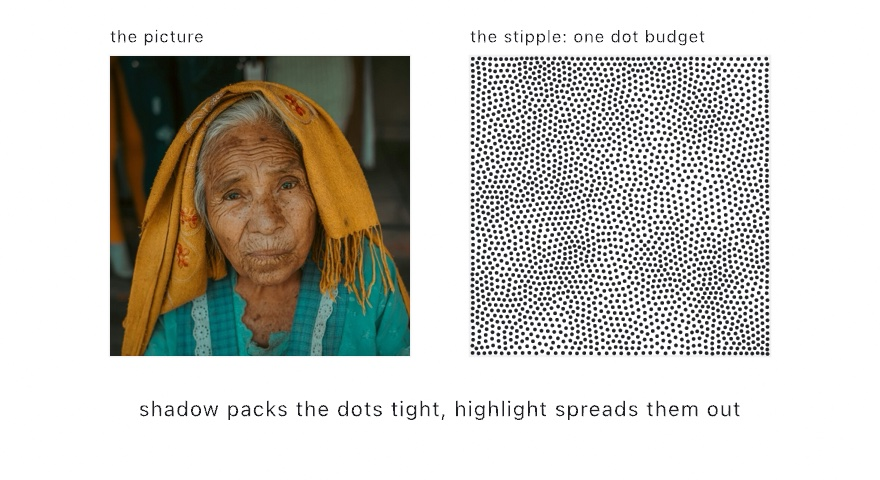

#### <sup>[Ollin](../../README.md) → [Documentation](../README.md) → [Generators](./README.md) → `Stippling`</sup>

---

## Stippling

**Weighted-Voronoi stippling** places a fixed number of dots so that their local density reproduces the tone of a picture. Dark areas pack the dots tight and bright areas spread them out, so from a small distance the scatter reads as the picture. That is the classic look of a hand-stippled illustration. The output is plain points, so it feeds dots, marks, [Voronoi cells](../Drawing/Voronoi.md), and the pen-plotter and [SVG](../Output/Export.md) paths.

<picture>
  <source media="(prefers-color-scheme: dark)" srcset="../Images/StippleTone-dark.jpg">
  
</picture>

The method behind it is a weighted centroidal Voronoi iteration. It seeds the dots by rejection-sampling the darkness, then it moves every dot to the darkness-weighted centroid of its cell, over and over. Each pass evens out the spacing, while the weighting keeps the dots on the tone. Close up the dots are as even as blue noise, and at full size they take the shape of the image.

### Contents

- [stipple (an image)](#image)
- [stipple (a density function)](#density)
- [Practical notes](#notes)
- [Standalone (outside a sketch)](#standalone)

<a name="image"></a>

#### stipple (an image)

```swift
stipple(_ image: Image,
        count: Int,
        in bounds: Rectangle? = nil,
        iterations: Int = 40) -> [Vector2]
```

This call stipples `image` with `count` dots inside `bounds`, which is the whole canvas by default. Darkness is read as 1 − linear luminance, scaled by alpha, so transparent pixels carry no ink. The image is stretched to fill `bounds`. To keep the image's own aspect ratio, pass the shared letterbox helper:

```swift
let dots = stipple(of: picture, count: 4000,
                   in: Rectangle(fitting: picture.size, in: canvasRectangle))
noStroke(); fill(.black)
for d in dots { drawCircle(center: d, radius: 2) }
```

The call is driven by the seeded `random`, so the same [`seed`](./Random.md#seed) reproduces the stipple exactly.

<a name="density"></a>

#### stipple (a density function)

```swift
stipple(count: Int,
        in bounds: Rectangle? = nil,
        iterations: Int = 40,
        density: (Vector2) -> Double) -> [Vector2]
```

The same engine runs over any field you write as a closure. The call samples that closure once up front, in canvas coordinates. A value of 0 keeps the dots out of a spot, and a higher value packs them tighter there. Noise, a distance falloff, or plain math all work.

```swift
let dots = stipple(count: 3000) { p in
    fbm(p.x * 0.004, p.y * 0.004)          // dots pool in the noise's peaks
}
```

<a name="notes"></a>

#### Practical notes

- **Compute once, then hold the points.** The iteration sweeps every pixel of a working grid `iterations` times. That is `setup()` work, not `draw()` work. Animate the size or the color of the dots, not their placement.
- **`iterations` sets how even the dots get.** The default of 40 has visually converged. A few passes instead keep more of the grain of the initial scatter.
- **Size the dots by darkness for extra tone.** The density carries the tone on its own. The classic stippling technique also scales each dot a little by the darkness under it. Sample the image at the dot to get that number.
- **No ink means no dots.** An all-white image, a fully transparent image, and an all-zero density each return an empty array. A texture-backed `Image` returns an empty array too, because it holds no CPU pixels. Call `snapshot()` on it first.
- **The result is deterministic.** The same input, count, and seed reproduce the same dots exactly. A stipple is therefore safe to use in a snapshot test and in a recipe.

<a name="standalone"></a>

#### Standalone (outside a sketch)

The free functions take the rectangle and the random number generator as explicit arguments:

```swift
var rng = SplitMix64(seed: 7)
let dots = stipple(of: picture, count: 4000, in: frame, using: &rng)
let field = stipple(count: 800, in: frame, using: &rng) { p in p.x / frame.width }
```

---

Related: [`Blue noise`](./BlueNoise.md) (even scatter with no image), [`Low-discrepancy sampling`](./LowDiscrepancy.md) (even scatter as a stream), [`Images`](../Drawing/Images.md) (the pixel access stippling reads through), [`Dithering`](../Drawing/Color.md#dithering) (tone from a fixed pixel grid instead of free dots).
