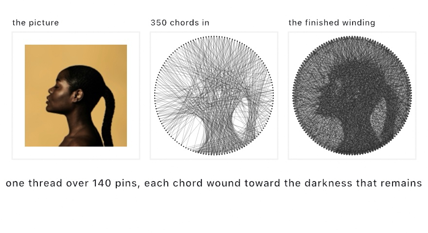

#### <sup>[Ollin](../../README.md) → [Documentation](../README.md) → [Generators](./README.md) → `String art`</sup>

---

## String art

**`StringArt`** winds one continuous thread between pins on a circular rim until the crossings reproduce a picture. Dark regions collect many crossings, light regions few, and a shaded image emerges from nothing but straight chords. The craft is the one Petros Vrellis's knitted portraits made famous (2016). Each chord here is the standard greedy step. From the pin the thread is on, score every allowed next pin by the darkness its chord still covers. Take the best, and pay that ink down so later chords look elsewhere. Implemented independently from the published descriptions.

The winding is fully deterministic: the same picture and settings always wind the same thread, no seed involved. The helper emits geometry only; you draw the chords, so the thread can be ink on paper, glowing light, or anything else a line can be.

<picture>
  <source media="(prefers-color-scheme: dark)" srcset="../../Guide/Images/09-Pictures/WoundFromThread-dark.jpg">
  
</picture>

### Contents

- [StringArt](#winding)
- [The chords and the thread](#chords)
- [Practical notes](#notes)

<a name="winding"></a>

#### StringArt

```swift
StringArt(of: Image, center: Vector2, radius: Double,
          pins: Int = 200, chords: Int = 4000, ink: Double = 0.055,
          minimumSpan: Int? = nil, inverted: Bool = false,
          resolution: Int = 300)
```

A stateful stepper you hold across frames. The circle of `pins` (pin `0` at the top, clockwise) reads the picture's largest centered square. Tone is the linear-light darkness `(1 - luminance) * alpha`, so transparency reads as paper. The winding stops at `chords`, or earlier once no allowed chord still covers enough darkness to be worth its ink.

```swift
let art = StringArt(of: picture, center: Vector2(540, 540), radius: 470)

override func setup() { noClear() }

override func draw() {
    if frameCount == 1 { background(.white) }
    stroke(Color.black.withAlpha(0.35))
    for chord in art.step(8) {
        drawLine(chord.from, chord.to)
    }
}
```

The canvas never clears, so each frame winds a few more chords onto the accumulation and the picture knits itself over the first seconds of the run.

- **`ink`** is how much darkness one pass of thread pays down (`0...1`). It is the winding-density dial: lower ink winds more, finer chords before a region reads as done. Pair it with the stroke alpha you draw at, so the solver's idea of one pass roughly matches what a drawn chord darkens.
- **`minimumSpan`** is the shortest chord allowed, in pins around the rim (a tenth of the pins by default), so the thread crosses the picture instead of hugging the rim.
- **`inverted`** winds the light instead of the dark, for a bright thread on a dark ground.
- **`resolution`** is the side of the internal grid the scoring runs on. The default suits canvas-sized work; raise it for fine detail at a cost in setup and per-chord time.

<a name="chords"></a>

#### The chords and the thread

```swift
art.step()           // wind one chord; nil once finished
art.step(_ count:)   // wind up to `count` more, collected

art.pins             // the rim, in canvas coordinates
art.sequence         // the pin visit order so far
art.thread           // the whole winding as one open Contour
art.chordCount       // chords wound so far
art.isFinished       // the cap is reached, or nothing left worth winding
```

Each `Chord` carries the pins it spans (`fromPin`, `toPin`) and their canvas positions (`from`, `to`), ready for `drawLine`. `thread` is the same winding as one open polyline through the pins. `sequence` is the pin order itself, which *is* the piece if you ever wind it by hand on a real rim.

<a name="notes"></a>

#### Practical notes

- **Bold tonal masses read best.** A strong silhouette or a deep shadow against open paper knits into a clear figure. A soft gradient across the whole frame reads as fuzz. Boost the contrast of the picture first if it is timid.
- **Accumulate, don't redraw.** The look is thousands of translucent chords piling up. `noClear()` plus a one-time `background` is the whole recipe; see `Examples/Images/StringArt`.
- **The thread is one line, and the plotter loves that.** Draw `art.thread` with `drawPolyline` in a clearing sketch. The [SVG export](../Output/Export.md) then writes the whole piece as a single continuous line.
- **`chords` is the thread-length dial.** A few hundred chords stay airy and diagrammatic. A few thousand read as continuous tone. The winding also stops on its own once nothing left is worth its ink, so the cap is a ceiling, not a target.
- **A texture-backed image has no CPU pixels.** Read a video frame through its `snapshot()` first, the same rule as the other picture renderings.

---

Related: [`Single line`](./SingleLine.md) and [`Spanning tree`](./SpanningTree.md) (the other one-picture-as-line-work generators), [`Halftone`](../Drawing/Halftone.md) (tone as dots instead of chords), and [`Export`](../Output/Export.md) (SVG and the plotter path).
